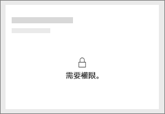
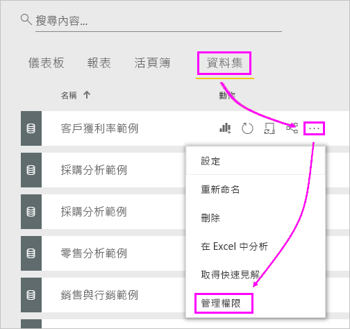
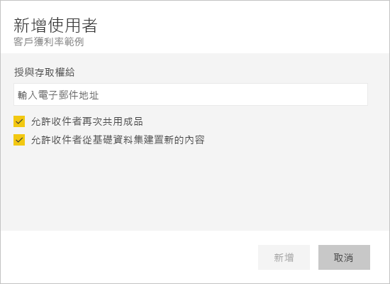

# 與同事和其他人共用您的 Power BI 儀表板和報表
「共用」是讓一些人存取您儀表板和報表的一種好方法。 Power BI 還提供[數種其他方式可進行共同作業及散發您的儀表板和報表](service-how-to-collaborate-distribute-dashboards-reports.md)。

![[我的最愛儀表板] 清單中的共用圖示](media/service-share-dashboards/power-bi-share-dash-report-favorites.png)

不論是與組織內部或外部共用內容，您都會需要 [Power BI Pro 授權](service-free-vs-pro.md)。 您的收件者也必須具有 Power BI Pro 授權，否則內容便必須位於 [Premium 容量](service-premium.md)中。 

您可以從 Power BI 服務中大部分的位置共用儀表板和報表，包括您的 [我的最愛]、[最近]、[與我共用]\(如果擁有者允許的話)、[我的工作區] 或其他工作區。 當您與他人共用儀表板或報表時，他們可以檢視該儀表板或報表並與之互動，但無法編輯它們。 除非套用[資料列層級安全性 (RLS)](service-admin-rls.md)，否則他們將能看到和您在儀表板或報表中可看見的相同資料。 如果您允許的話，您與其共用儀表板或報表的同事，也可以與他們的同事共用。 組織外部人員也可以檢視儀表板或報表並與之互動，但不能共用。 

您也可以[從任何 Power BI 行動裝置應用程式共用儀表板](mobile-share-dashboard-from-the-mobile-apps.md)。 您可以從 Power BI 服務和 Power BI 行動裝置應用程式共用儀表板，但無法從 Power BI Desktop 共用。

## 影片：共用儀表板
觀看 Amanda 與她公司內外的同事共用儀表板。 然後遵循影片下方的逐步指示親自試試看。

<iframe width="560" height="315" src="https://www.youtube.com/embed/0tUwn8DHo3s?list=PL1N57mwBHtN0JFoKSR0n-tBkUJHeMP2cP" frameborder="0" allowfullscreen></iframe>

## 共用儀表板或報表

1. 在儀表板或報表清單中，或是在開放的儀表板或報表中，選取 [共用] 。

1. 在頂端的方塊中，輸入個人、通訊群組或安全性群組的完整電子郵件地址。 您無法共用動態通訊清單。 
   
   您可以與其位址在您組織外的人員共用，但是您會看到一則警告。
   
    
 
3. 您可以視需要新增訊息。 這是選擇性的。
4. 若要讓同事將您的內容與他人共用，請選取 [允許收件者共用您的儀表板/報表]。
   
   允許其他人共用稱為「再次共用」。 如果您允許的話，他們就可以從 Power BI 服務和行動裝置應用程式再次共用，或將電子郵件邀請轉寄給組織中的其他人。 邀請有效期一個月。 組織外部人員無法再次共用。 身為內容擁有者，您可以關閉再次共用，或是個別撤銷再次共用的權限。 請參閱底下的[停止共用或停止其他人共用](service-share-dashboards.md#stop-sharing-or-stop-others-from-sharing)。

5. 選取 [共用]。
   
   ![選取 [共用] 按鈕](media/service-share-dashboards/power-bi-share-dialog-share.png)  
   
   Power BI 會將電子郵件邀請傳送給個人而非群組，其中會有此共用內容的連結。 您會看到「成功」通知。 
   
   當組織內的收件者按一下連結時，Power BI 會將儀表板或報表新增至其 [與我共用] 清單頁面。 他們可以選取您的名稱，就能查看您已與他們共用的所有內容。 
   
   ![[與我共用] 清單頁面](media/service-share-dashboards/power-bi-shared-with-me-dashboards-reports.png)
   
   當組織外的收件者按一下連結時，他們會看到儀表板或報表，但不是在平常的 Power BI 入口網站中。 如需詳細資料，請參閱以下的[與組織外部人員共用](service-share-dashboards.md#share-a-dashboard-with-people-outside-your-organization)。

## 有哪些人員可以存取您共用的儀表板或報表？
有時您需要查看您已共用內容的人員，以及這些人已共用內容的其他人員。

1. 在儀表板或報表清單中，或是儀表板或報表本身當中，選取 [共用] 。 
2. 在 [共用儀表板/報表] 對話方塊中，選取 [存取]。
   
    ![[共用儀表板] 對話方塊的 [存取] 索引標籤](media/service-share-dashboards/power-bi-share-dialog-access.png)
   
    組織外部人員列為 [Guest]。

## 停止共用或停止其他人共用
只有儀表板或報表擁有者可以開啟和關閉再次共用。

### 如果您尚未傳送共用邀請
* 在傳送邀請之前，清除邀請底部的 [允許收件者共用您的儀表板/報表] 核取方塊。

### 如果您已共用儀表板或報表
1. 在儀表板或報表清單中，或是儀表板或報表本身當中，選取 [共用] 。 
2. 在 [共用儀表板/報表] 對話方塊中，選取 [存取]。
   
    ![[共用儀表板] 對話方塊的 [存取] 索引標籤](media/service-share-dashboards/power-bi-share-dialog-access.png)
3. 選取 [讀取並再次共用] 旁的省略符號 (**...**)，然後選取：
   
   ![[讀取並再次共用] 的省略符號](media/service-share-dashboards/power-bi-change-access.png)
   
   * [讀取]，阻止該員與其他人共用。
   * [移除存取權]，使該人員完全看不到共用的內容。

4. 在 [移除存取權] 對話方塊中，決定是否要一併移除報表和資料集等相關內容的存取權。 如果在移除項目時出現警告圖示 ，建議您先移除相關的內容，因為這些內容將無法正確顯示。

## 與組織外部人員共用儀表板或報表
與組織外部人員共用時，他們會收到具有共用儀表板或報表連結的電子郵件，而且必須登入 Power BI 才能看到儀表板或報表。 如果沒有 Power BI Pro 授權，他們可以按一下連結來註冊以取得授權。

登入後，他們將不會在平常的 Power BI 入口網站中，而是在其瀏覽器視窗中看到沒有左瀏覽窗格的共用儀表板或報表。 他們必須將連結設為書籤，日後才能存取這個儀表板或報表。

他們無法編輯這個儀表板或報表中的任何內容。 他們可以在報表中與圖表互動，並變更篩選條件或交叉分析篩選器，但無法儲存變更。

只有您的直接收件者才能看到共用儀表板或報表。 例如，如果您傳送電子郵件給 Vicki@contoso.com，只有 Vicki 看得到儀表板。 其他人就算有連結也看不到這個儀表板，而 Vicki 必須使用相同的電子郵件地址才能存取該儀表板。 如果她使用任何其他電子郵件地址登入，亦無法存取儀表板。

如果內部部署的 Analysis Services 表格式模型實作角色或資料列層級安全性，則組織外部人員就完全看不到任何資料。

如果您從 Power BI 行動裝置應用程式傳送連結給組織外部的人員，當這些人按一下連結時，會在瀏覽器中開啟儀表板，而不是在 Power BI 行動裝置應用程式中開啟。

## 限制與考量
共用儀表板和報表時的重要事項︰

* 一般來說，您和您的同事會在儀表板或報表中看到相同的資料。 因此，如果您具有可看到較多資料的權限，您的同事將能在您的儀表板或報表中看到您所有的資料。 不過，如果已將[資料列層級安全性 (RLS)](service-admin-rls.md) 套用至儀表板或報表的基礎資料集，則系統會依據每個人的認證來決定其可以存取的資料。
* 共用您儀表板的每個人都可以看到此儀表板，並在[閱讀檢視](service-reading-view-and-editing-view.md)中與相關的報表互動。 他們無法建立報表，或在現有的報表中儲存變更。
* 沒有人可以看到或下載資料集。
* 每個人都可以手動[重新整理資料](refresh-data.md)。
* 如果電子郵件使用 Office 365，您可以輸入與通訊群組相關聯的電子郵件地址來與通訊群組的成員共用。
* 電子郵件網域與您相同的同事，以及網域不同、但登錄在相同租用戶中的同事，可以與其他人共用儀表板。 例如，假設網域 contoso.com 和 contoso2.com 都登錄在相同的租用戶中。 如果您的電子郵件地址是 konrads@contoso.com，則 ravali@contoso.com 和 gustav@contoso2.com 只要經過您授權共用，就可以共用。
* 如果您的同事已能存取特定的儀表板或報表，您只需要在儀表板或報表中複製 URL，就能將它作為該儀表板或報表的直接連結傳送給該同事。 例如：`https://powerbi.com/dashboards/g12466b5-a452-4e55-8634-xxxxxxxxxxxx`
* 同樣地，如果您的同事已能存取特定的儀表板，您可以[傳送基礎報表的直接連結](service-share-reports.md)。 

## 針對共用問題進行疑難排解

### 我的儀表板收件者看到磚中出現鎖定圖示或「需要權限」的訊息

與您共用的人員在嘗試檢視報告時，可以看到儀表板中鎖定的圖格或「需要權限」訊息。

若是如此，您需要授與他們基礎資料集的權限。 其做法如下：

1. 前往內容清單中的 [資料集] 索引標籤。

1. 選取資料集 > [管理權限] 旁的省略符號 (**...**)。

    

3. 選取 [新增使用者]。

    ![選取 [新增使用者]](media/service-share-dashboards/power-bi-share-dataset-add-user.png)

1. 輸入個人、通訊群組或安全性群組的完整電子郵件地址。 您無法共用動態通訊清單。

    

5. 選取 [加入] 。

### 我無法共用儀表板或報表

若要共用儀表板或報表，您必須具備再次共用基礎內容 (任何相關報表和資料集) 的權限。 如果您看到無法共用的訊息，可請報表作者提供再次共用這些報表和資料集的權限。

## 後續步驟
* 有任何意見嗎？ 請移駕 [Power BI 社群網站](https://community.powerbi.com/)提供您的建議。
* [應該如何共同作業和共用儀表板和報表？](service-how-to-collaborate-distribute-dashboards-reports.md)
* [共用已篩選的 Power BI 報表](service-share-reports.md)
* 有問題嗎？ [試試 Power BI 社群](http://community.powerbi.com/)。

