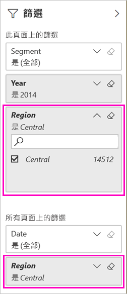

# 兩種共用已篩選的 Power BI 報表的方式
「共用」  是讓一些人存取您儀表板和報表的一種好方法。 如果要共用報表的篩選版本呢？ 可能是只顯示特定城市或特定銷售人員或特定年份等資料的報表。 嘗試篩選報表並加以共用，或建立自訂 URL。 當收件者第一次開啟報表時，會篩選報表。 收件者可以修改 URL，以移除篩選條件。 

Power BI 還提供[可進行共同作業及散發您報表的其他方式](service-how-to-collaborate-distribute-dashboards-reports.md)。 若要共用，您和您的收件者必須具有 [Power BI Pro 授權](service-features-license-type.md)，或內容必須位於[進階容量](service-premium-what-is.md)中。 

## 有兩種方式可以篩選報表

針對這兩種篩選技術，我們都是使用行銷與銷售範例範本應用程式。 想要試用嗎？ 您也可以[安裝行銷與銷售範例範本應用程式](https://appsource.microsoft.com/product/power-bi/microsoft-retail-analysis-sample.salesandmarketingsample?tab=Overview) \(英文\)。

### 設定篩選

在 [[編輯] 檢視](consumer/end-user-reading-view.md)中開啟報表並套用篩選。

在此範例中，我們要篩選行銷與銷售範例範本應用程式的 [YTD Category] \(YTD 類別\) 頁面，只顯示 [Region] \(區域\)  等於 [Central] \(中部\)  的值。 
 

請儲存報表。

### 在 URL 中建立篩選

當您將篩選加入至報表頁面 URL 的結尾時，其行為會稍有不同。 篩選過的頁面看起來會相同。 不過，Power BI 會將篩選加入整份報表，並從 [篩選] 窗格中移除其他值。  

在報表頁面 URL 的結尾處新增下列內容︰
   
    ?filter=*tablename*/*fieldname* eq *value*
   
此欄位必須是 number、datetime 或 string 類型。 *tablename* 或 *fieldname* 值不能包含空格。
   
在我們的範例中，資料表的名稱是 [Geo] \(地區\)  ，欄位的名稱是 [Region] \(區域\)  ，而我們想要篩選的值是 [Central] \(中部\)  ：
   
    ?filter=Geo/Region eq 'Central'

瀏覽器會新增特殊字元來代表斜線、空格和單引號，因此最後會得到類似以下的內容：
   
    app.powerbi.com/groups/xxxx/reports/xxxx/ReportSection4d00c3887644123e310e?filter=Geo~2FRegion%20eq%20'Central'

請儲存報表。

如需詳細資訊，請參閱[在 URL 中使用查詢字串參數來篩選報表](service-url-filters.md)。

## 共用篩選過的報表

1. 當您[共用報表](service-share-dashboards.md)時，請清除 [將電子郵件通知傳送給收件者]  核取方塊。

    

4. 傳送含有您先前所建立篩選的連結。

## 後續步驟
* [在 Power BI 中共用成品的方式](service-how-to-collaborate-distribute-dashboards-reports.md)
* [共用儀表板](service-share-dashboards.md)
* 有其他問題嗎？ [試試 Power BI 社群](http://community.powerbi.com/)。
* 有任何意見嗎？ 請移駕 [Power BI 社群網站](https://community.powerbi.com/)提供您的建議。

