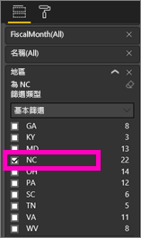
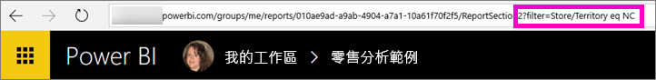
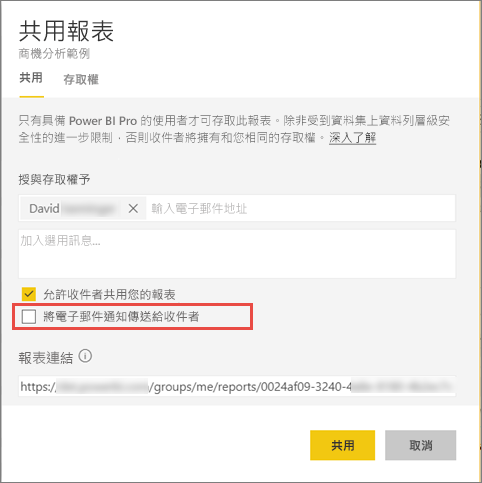

# 與同事共用已篩選的 Power BI 報表
「共用」是讓一些人存取您儀表板和報表的一種好方法。 Power BI 還提供[數種其他方式可進行共同作業及散發您的報表](service-how-to-collaborate-distribute-dashboards-reports.md)。

若要共用，您和您的收件者必須具有 [Power BI Pro 授權](service-free-vs-pro.md)，或內容必須位於[進階容量](service-premium.md)中。 有任何建議嗎？ Power BI 小組向來重視您的意見反應，請前往 [Power BI 社群網站](https://community.powerbi.com/)。

您可以從 Power BI 服務中的許多位置，與位於相同電子郵件網域的同事共用報表：您的 [我的最愛]、[最近]、[與我共用] \(如果擁有者允許的話\)、[我的工作區] 或其他工作區。 當您與他人共用報表時，他們可以檢視此報表並與之互動，但是無法編輯此報表。 除非套用[資料列層級安全性 (RLS)](service-admin-rls.md)，否則他們會看到您在報表中看到的相同資料。 

## 篩選並共用報表
如果要共用報表的篩選版本呢？ 可能是只顯示特定城市或特定銷售人員或特定年份等資料的報表。 您可以建立自訂 URL 來完成這項工作。

1. 在 [[編輯檢視]](service-reading-view-and-editing-view.md) 中開啟報告，套用篩選條件，然後儲存報告。
   
   在本例中，我們要篩選[零售分析範例](sample-tutorial-connect-to-the-samples.md)，只顯示 **Territory** 等於 **NC** 的值。
   
   
2. 在報表頁面 URL 的結尾處新增下列內容︰
   
   ?filter=<資料表名稱>/<檔案名稱> eq <值>
   
    欄位必須是**字串**類型，而且 <表格名稱> 或 <欄位名稱> 都不可以包含空格。
   
   在本例中，資料表的名稱是 **Store**、欄位名稱是 **Territory**，要篩選的值是 **NC**：
   
    ?filter=Store/Territory eq 'NC'
   
   
   
   瀏覽器會新增特殊字元來代表斜線、空格和單引號，因此最後會是︰
   
   app.powerbi.com/groups/me/reports/010ae9ad-a9ab-4904-a7a1-xxxxxxxxxxxx/ReportSection2?filter=Store%252FTerritory%20eq%20%27NC%27

3. [共用報表](service-share-dashboards.md)，但清除 [傳送電子郵件通知給收件者] 核取方塊。 

    

4. 傳送含有您先前所建立篩選的連結。

## 後續步驟
* 有任何意見嗎？ 請移駕 [Power BI 社群網站](https://community.powerbi.com/)提供您的建議。
* [應該如何共同作業和共用儀表板和報表？](service-how-to-collaborate-distribute-dashboards-reports.md)
* [共用儀表板](service-share-dashboards.md)
* 有其他問題嗎？ [試試 Power BI 社群](http://community.powerbi.com/)。

