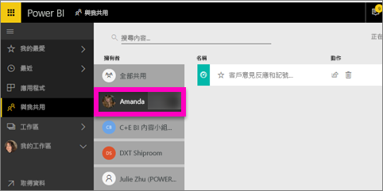

# 顯示已與我共用的 Power BI 儀表板
## 與我共用

同事與您共用儀表板時，儀表板的標題會新增至 [與我共用] 清單。 此儀表板只能從 [與我共用] 取得，但無法從工作區或 [應用程式] 取得。

觀看 Amanda 說明 [與我共用] 內容清單，並示範如何瀏覽和篩選清單。 然後遵循影片下方的逐步指示親自試試看。 為了讓您檢視與您共用的儀表板，您需要有 Power BI Pro 授權。 如需詳細資訊，請參閱[什麼是 Power BI Premium？](service-premium.md)。

<iframe width="560" height="315" src="https://www.youtube.com/embed/G26dr2PsEpk" frameborder="0" allowfullscreen></iframe>

根據擁有者授與您的權限，您將有許多選項可以與儀表板和基礎報表互動。 這些包括可以建立儀表板的複本、以[閱讀檢視](service-interact-with-a-report-in-reading-view.md)開啟報表，以及重新與其他同事共用。

## 可從 [與我共用] 畫面使用的動作
* 選取星狀圖示，以[將儀表板設為最愛](service-dashboard-favorite.md)。
* [移除儀表板](service-delete.md)  
* 部分儀表板可以重新予以共用 
* 此外，如果您的儀表板清單太長，請[使用搜尋欄位和排序找出您需要的內容](service-navigation-search-filter-sort.md)。
  
  > [!NOTE]
  > 如需 EGRC 分類的資訊，請選取分類按鈕，或[瀏覽儀表板資料分類](service-data-classification.md)。
  > 
  > 
* 選取儀表板名稱來開啟儀表板，並進行探索。 開啟共用儀表板之後，即可使用問與答來提問有關基礎資料的問題，或選取磚，以在閱讀檢視中開啟報表並與之互動。

## 依擁有者篩選共用儀表板
可以依內容擁有者進一步篩選 [與我共用] 畫面中的內容。 例如，如果我選取 [Amanda]，則只會看到 Amanda 已與我共用的儀表板。

## 後續步驟
[Power BI - 基本概念](service-basic-concepts.md)  
[Power BI Premium - 這是什麼？](service-premium.md)  

有其他問題嗎？ [嘗試在 Power BI 社群提問](http://community.powerbi.com/)

