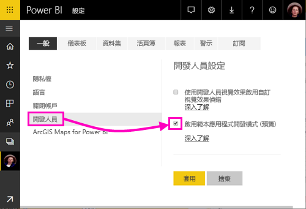
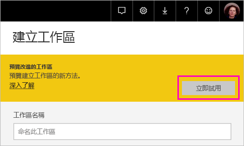
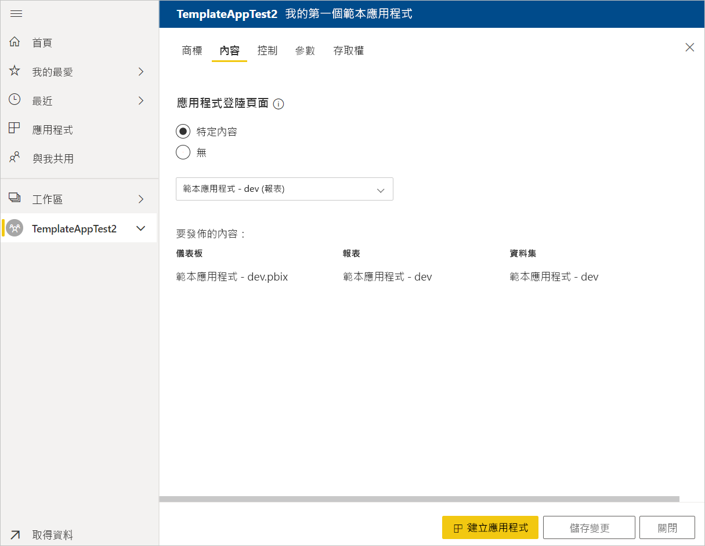
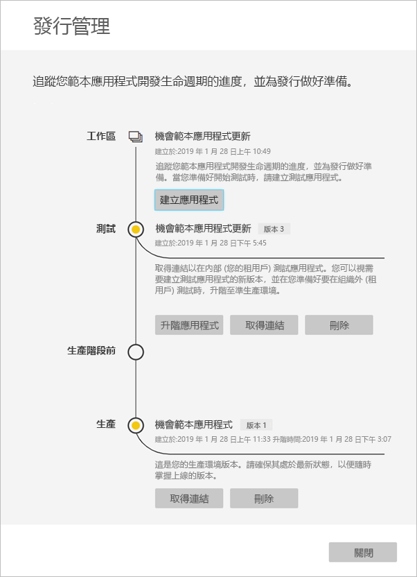

# 在 Power BI 中建立範本應用程式 (預覽)

新的 Power BI「範本應用程式」  讓 Power BI 合作夥伴撰寫少量程式碼或不用撰寫程式碼，即可建置 Power BI 應用程式，再將應用程式部署至所有 Power BI 客戶。  本文包含建立 Power BI 範本應用程式的逐步指示。

如果您可以建立 Power BI 報表和儀表板，您可能會變成*範本應用程式產生器*和會建置並封裝到分析內容*應用程式*。 您可能會將您的應用程式部署到透過任何可用的平台，例如 AppSource，或使用您自己的 web 服務中其他 Power BI 租用戶。 為產生器中，您必須讓您建立發佈的受保護的分析封裝。

Power BI 租用戶系統管理員可管理並控制其組織中可以建立及安裝範本應用程式的人員。 已獲授權的使用者可以安裝應用程式的範本，然後修改它並將它散發給組織中的 Power BI 取用者。

## 先決條件

以下為建立範本應用程式的需求：  

- [Power BI Pro 授權](service-self-service-signup-for-power-bi.md)
- [安裝 Power BI Desktop](desktop-get-the-desktop.md) (選用)
- 熟悉[的 Power BI 的基本概念](service-basic-concepts.md)
- 建立範本應用程式的權限。 如需詳細資料，請參閱 Power BI [管理入口網站、範本應用程式設定](service-admin-portal.md#template-apps-settings-preview)。

## 啟用應用程式開發人員模式

若要建立可以散發給其他 Power BI 租用戶的範本應用程式，您需要處於應用程式開發人員模式。 否則，您建立的應用程式只能供您自己組織的 Power BI 使用者使用。

1. 在瀏覽器中開啟 Power BI 服務。
2. 前往 [設定]   > [一般]   > [開發人員]   > [啟用範本應用程式開發模式]  。

    

    如果您未看到該選項，請連絡 Power BI 系統管理員，要求其授與您管理入口網站中的[範本應用程式開發權限](service-admin-portal.md#template-apps-settings-preview)。

3. 選取 [ **套用**]。

## 建立範本應用程式工作區

若要建立可以散發給其他 Power BI 租用戶的範本應用程式，您需要在其中一個新的應用程式工作區中予以建立。

1. 在 Power BI 服務中，選取 [工作區]   > [建立應用程式工作區]  。

    

2. 在 [建立應用程式工作區]  的 [預覽改進的工作區]  中，選取 [立即試用]  。

    

3. 輸入您應用程式工作區的名稱、描述 (選用) 及標誌影像 (選用)。

4. 選取 [開發範本應用程式]  。

    

5. 選取 [儲存]  。
>[!NOTE]
>您需要從您的 Power BI 系統管理員，以提升範本的應用程式的權限。

## 在範本應用程式中建立內容

如同使用一般的 Power BI 應用程式工作區，下一步要在工作區中建立內容。  在這個範本應用程式預覽版本中，每個項目最多只支援一個：一個資料集、一份報表和一個儀表板。

- 在應用程式工作區中[建立 Power BI 內容](power-bi-creator-landing.md)。

如果您使用 Power Query 中的參數，請確認它們具有正確定義的類型 (例如 Text)。 不支援 Any 及 Binary 類型。

[在 Power BI 中撰寫範本應用程式的提示 (預覽)](service-template-apps-tips.md)有建議，您可在建立範本應用程式的報表及儀表板時加以考慮。

## 建立測試範本應用程式

既然您的工作區中已有內容，就可開始將它封裝進範本應用程式了。 第一步為建立測試範本應用程式，您只能從您租用戶上的組織內存取。

1. 在範本應用程式工作區中，選取 [建立應用程式]  。

    

    在這裡，您填寫其他建置選項範本應用程式中，五個類別目錄：

    **Branding**

    
    - 應用程式名稱
    - 描述
    - 支援網站 （連結會顯示在應用程式資訊 底下之後重新發佈範本應用程式，為組織的應用程式）
    - 應用程式標誌 （45 萬個檔案的大小限制、 1:1 外觀比例、.png.jpg.jpeg 格式）
    - 應用程式的佈景主題色彩

    **Content**

    **應用程式登陸頁面：** 定義報表或儀表板是您的應用程式的登陸頁面，請使用會讓您正確認為的登陸頁面：

    

    **Control**

    設定您的應用程式的使用者必須使用您的應用程式內容的限制。 您可以使用這個控制項來保護您的應用程式中的財產。

    

    >[!NOTE]
    >一律封鎖的使用者安裝應用程式匯出成.pbix 格式。

    **參數**

    您可以使用這個類別來連接到資料來源時，管理參數的行為。 深入了解[建立查詢參數](https://powerbi.microsoft.com/blog/deep-dive-into-query-parameters-and-power-bi-templates/)。

    
    - **值**： 預設參數值。
    - **所需**： 使用此選項可要求輸入使用者特定參數的安裝程式。
    - **鎖定**:鎖定會防止安裝程式更新為參數。
    - **靜態**:啟用應用程式包含*只*範例資料。 當您選取**靜態**，安裝精靈並不要求使用者連接到資料來源。

    **存取**在測試階段中，決定您組織中的哪些其他可以安裝並測試您的應用程式。 別擔心，您一律可以回到這裡並稍後變更這些設定 （設定不會影響分散式的範本應用程式的存取權）。

2. 選取 [建立應用程式]  。

    您會看到測試應用程式已就緒的訊息，還有供您複製並分享給應用程式測試者的連結。

    

    您也已經完成發行管理程序的第一步，將於以下說明該程序。

## 管理範本應用程式發行

在公開發行這個範本應用程式前，建議您確認其已準備就緒。 Power BI 已建立 [發行管理] 窗格，供您遵循並檢查完整的應用程式發行路徑。 您也可以觸發階段之間的轉換。 常見的階段有：

- 產生測試應用程式：僅供在您組織內測試。
- 將測試套件升至生產階段前：在您的組織外測試。
- 將生產階段前套件升至生產階段：生產階段版本。
- 刪除所有套件，或從先前的階段重新開始。

當您發行階段之間移動，URL 不會變更。 升級不會影響 URL 本身。

讓我們瀏覽階段：

1. 在範本應用程式工作區中，選取 [發行管理]  。

    

2. 選取 [建立應用程式]  。

    如果您已在上述**建立測試範本應用程式**中建立測試應用程式，則 [測試]  旁邊會填好黃點，您不需要再選取這裡的 [建立應用程式]  。 如果您「真的」選取了，就會回到範本應用程式建立程序。

3. 選取 [取得連結]  。

    

4. 若要測試應用程式安裝體驗，請複製通知視窗中的連結，並貼到新的瀏覽器視窗。

    從這裡開始，您遵循的程序與客戶要遵循的程序相同。 如需查看他們的版本，請參閱[在您的組織中安裝及散發範本應用程式](service-template-apps-install-distribute.md)。

5. 在對話方塊中，選取 [安裝]  。

    安裝成功後，您會看到新應用程式已就緒的通知。

6. 選取 [前往應用程式]  。
7. 在 [開始使用新的應用程式]  中，您會看到與客戶所見相同的應用程式。

    
8. 選取 [探索應用程式]  來以範例資料驗證測試應用程式。
9. 若要進行任何變更，請返回原始工作區中的應用程式。 並將測試應用程式更新到您滿意為止。
10. 當您準備好升級您的應用程式，以針對您租用戶以外進一步測試進入生產階段前時，請返回**Release Management**窗格，然後選取**升級應用程式**。 

    

    >[!NOTE]
    > 當應用程式升級時變得公開可用組織外部。

11. 選取 [升階]  來確認您的選擇。
12. 複製這個新的 URL 來分享至租用戶外部，以進行測試。 此連結也是您開始建立散發在 AppSource 上的應用程式的程序送出[新 Cloud Partner 入口網站的供應項目](https://docs.microsoft.com/azure/marketplace/cloud-partner-portal/power-bi/cpp-publish-offer)。 提交只能進入生產階段前 Cloud Partner 入口網站的連結。 只有應用程式已通過核准，且您會收到通知，它會在 AppSource 中發行之後，您就可以升級到 Power BI 中的生產環境的這個封裝。
13. 當您的應用程式已準備好進入生產階段或透過 AppSource 分享時，請返回 [發行管理]  窗格，並選取 [生產階段前]  旁邊的 [升階應用程式]  。
14. 選取 [升階]  來確認您的選擇。

    現在您的應用程式已經進入生產階段，並準備好散發。

    

若要讓全球上千位 Power BI 使用者都能使用您的應用程式，建議您將應用程式提交至 AppSource。 如需詳細資料，請參閱 [Power BI 應用程式供應項目](https://docs.microsoft.com/azure/marketplace/cloud-partner-portal/power-bi/cpp-power-bi-offer)。

## 更新應用程式

既然您的應用程式已經進入生產階段，您可以在測試階段內重新開始，而不中斷生產階段內的應用程式。

1. 在 [發行管理]  窗格中，選取 [建立應用程式]  。
2. 返回再執行應用程式建立程序。
3. 在您設定好 **Branding**、**Content**、**Control** 及 **Access** 後，再次選取 [建立應用程式]  。
4. 選取 [關閉]  並回到 [發行管理]  。

   您會看到您現在有兩個版本：生產階段中的版本，加上測試階段中的新版本。

    

5. 當您準備好升級您的應用程式，以針對您租用戶以外進一步測試進入生產階段前時，請回到 [版本管理] 窗格，然後選取**升級應用程式**旁**測試**。
6. 您的連結已熱烘烘、 送出一次至 Cloud Partner 入口網站所遵循的步驟[Power BI 應用程式供應項目更新](https://docs.microsoft.com/azure/marketplace/cloud-partner-portal/power-bi/cpp-update-existing-offer)。

>[!NOTE]
>您的應用程式核准 Cloud Partner 入口網站和您在發佈時，才可以，請升級您的應用程式至實際執行階段。

## 後續步驟

請參閱[在您的組織中安裝、自訂及散發範本應用程式](service-template-apps-install-distribute.md)，了解客戶如何與範本應用程式互動。

如需散發應用程式的詳細資料，請參閱 [Power BI 應用程式供應項目](https://docs.microsoft.com/azure/marketplace/cloud-partner-portal/power-bi/cpp-power-bi-offer)。
