# 在 Power BI 中建立範本應用程式

新的 Power BI「範本應用程式」  讓 Power BI 合作夥伴撰寫少量程式碼或不用撰寫程式碼，即可建置 Power BI 應用程式，再將應用程式部署至所有 Power BI 客戶。  本文包含建立 Power BI 範本應用程式的逐步指示。

如果您可以建立 Power BI 報表及儀表板，即可成為「範本應用程式建置者」  ，將分析內容建置並封裝在「應用程式」  中。 您可以透過任何可用的平台 (例如 AppSource)，或在自己的 Web 服務中使用應用程式，將應用程式部署至其他 Power BI 租用戶。 身為建置者，您可以建立受保護的分析套件以供散發。

Power BI 租用戶系統管理員可管理並控制其組織中可以建立及安裝範本應用程式的人員。 獲授權使用者可以安裝您的範本應用程式，加以修改並散發給其組織中的 Power BI 使用者。

## 先決條件

以下為建立範本應用程式的需求：  

- [Power BI Pro 授權](service-self-service-signup-for-power-bi.md)
- [安裝 Power BI Desktop](desktop-get-the-desktop.md) (選用)
- 熟悉 [Power BI 的基本概念](service-basic-concepts.md)
- 公開共用範本應用程式的權限。 如需詳細資料，請參閱 Power BI [管理入口網站、範本應用程式設定](service-admin-portal.md#template-apps-settings)。

## 建立範本應用程式工作區

若要建立可以散發給其他 Power BI 租用戶的範本應用程式，您需要在其中一個新的應用程式工作區中予以建立。

1. 在 Power BI 服務中，選取 [工作區]   > [建立應用程式工作區]  。

    

2. 在 [建立應用程式工作區]  中，選取 [升級至新的]  。

    

3. 輸入您應用程式工作區的名稱、描述 (選用) 及標誌影像 (選用)。

4. 展開 [進階]  區段，然後選取 [開發範本應用程式]  。

    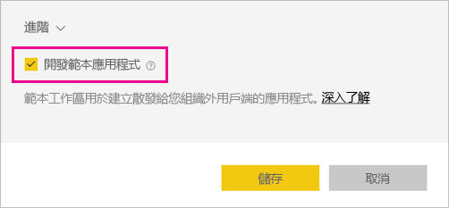

5. 選取 [儲存]  。
>[!NOTE]
>您需要獲得 Power BI 系統管理員的權限，才能升階範本應用程式。

## 在範本應用程式中建立內容

如同使用一般的 Power BI 應用程式工作區，下一步要在工作區中建立內容。  

- 在應用程式工作區中[建立 Power BI 內容](power-bi-creator-landing.md)。

如果您使用 Power Query 中的參數，請確認它們具有正確定義的類型 (例如 Text)。 不支援 Any 及 Binary 類型。

[在 Power BI 中撰寫範本應用程式的提示](service-template-apps-tips.md)有建議，您可在建立範本應用程式的報表及儀表板時加以考慮。

## 建立測試範本應用程式

既然您的工作區中已有內容，就可開始將它封裝進範本應用程式了。 第一步為建立測試範本應用程式，您只能從您租用戶上的組織內存取。

1. 在範本應用程式工作區中，選取 [建立應用程式]  。

    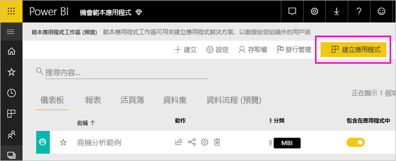

    您可在這裡填入範本應用程式的其他建置選項，其分為五種：

    **Branding**

    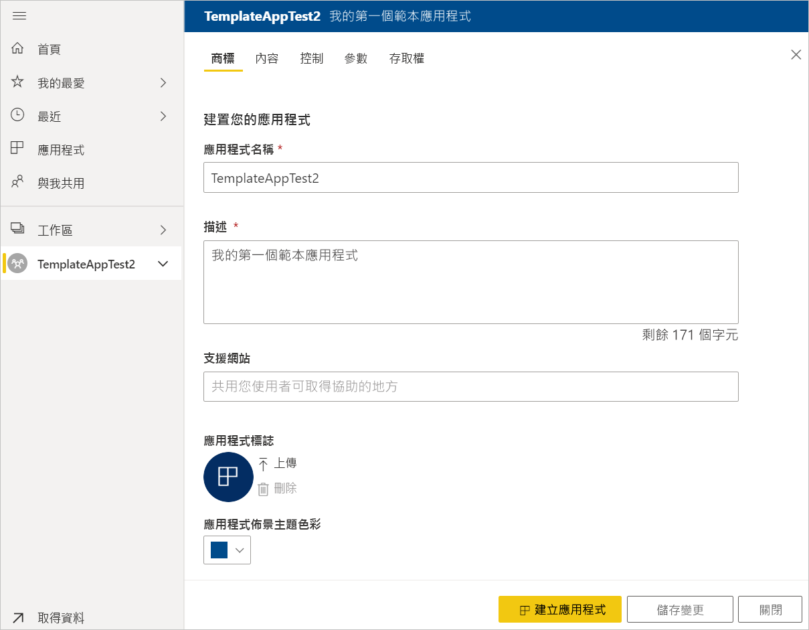
    - 應用程式名稱
    - 描述
    - 支援網站 (將範本應用程式重新散發為組織的應用程式之後，連結會顯示在應用程式資訊下方)
    - 應用程式標誌 (45K 檔案大小限制、1:1 外觀比例、.png .jpg .jpeg 格式)
    - 應用程式佈景主題色彩

    **瀏覽**

    啟動 [新的瀏覽產生器]  ，您可以在其中定義應用程式的左側瀏覽窗格 (請參閱本文中的＜[設計瀏覽體驗](service-create-distribute-apps.md#design-the-navigation-experience)＞以取得詳細資料)。

   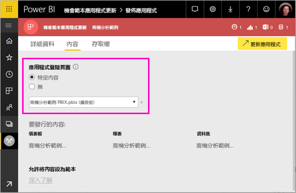
    
    **應用程式登陸頁面：** 如果您決定退出瀏覽產生器，您可以選擇選取應用程式登陸頁面。 定義要作為應用程式登陸頁面的報表或儀表板。 使用可提供正確印象的登陸頁面。

    **Control**

    設定應用程式使用者在應用程式內容使用上的一些限制。 您可以使用這項控制來保護應用程式中的智慧財產權。

    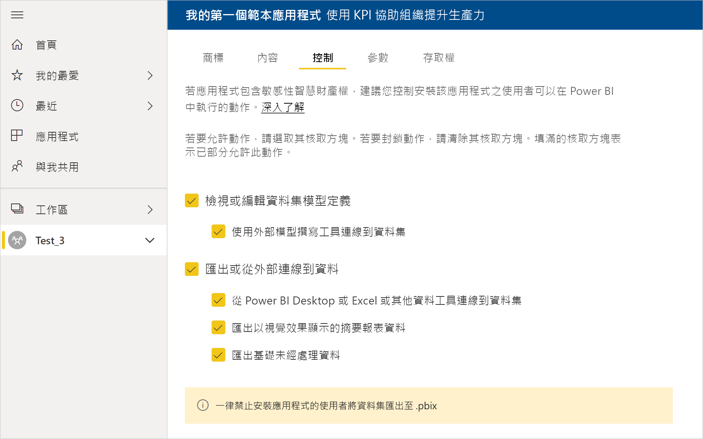

    >[!NOTE]
    >針對安裝應用程式的使用者，一律封鎖匯出至 .pbix 格式的功能。

    **參數**

    連接到資料來源時，您可以使用這個類別來管理參數的行為。 深入了解[建立查詢參數](https://powerbi.microsoft.com/blog/deep-dive-into-query-parameters-and-power-bi-templates/)。

    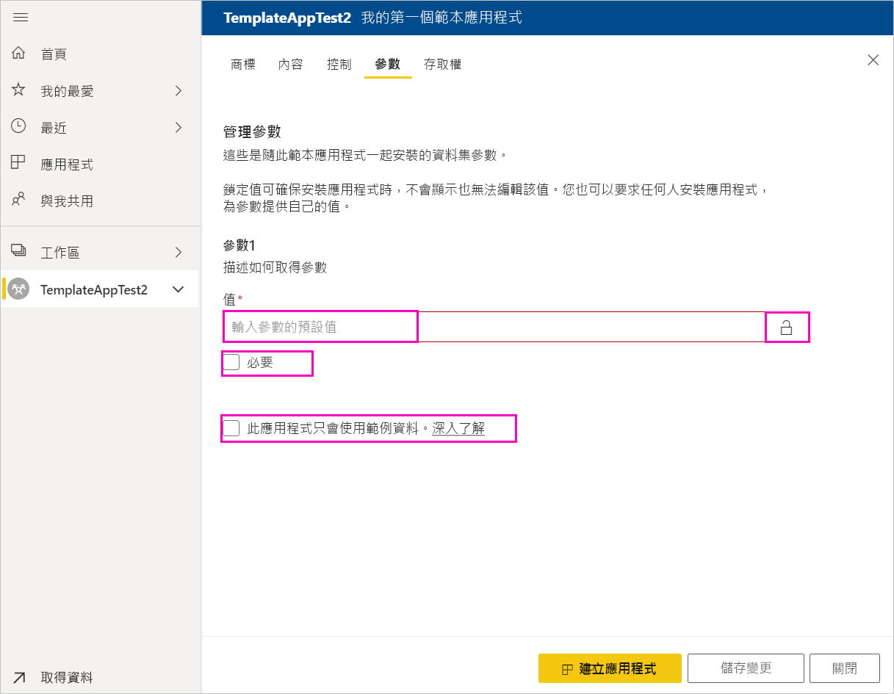
    - **值**：預設參數值。
    - **必要**：使用此項目要求安裝程式輸入使用者特定參數。
    - **鎖定**：鎖定功能可防止安裝程式更新參數。

    **存取**：在測試階段中，決定您組織內哪些其他人員可以安裝並測試應用程式。 別擔心，您隨時可以返回，並於稍後變更這些設定 ([設定] 不會影響已散發範本應用程式的存取)。

2. 選取 [建立應用程式]  。

    您會看到測試應用程式已就緒的訊息，還有供您複製並分享給應用程式測試者的連結。

    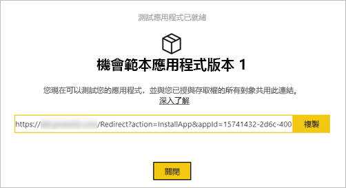

    您也已經完成發行管理程序的第一步，將於以下說明該程序。

## 管理範本應用程式發行

在公開發行這個範本應用程式前，建議您確認其已準備就緒。 Power BI 已建立 [發行管理] 窗格，供您遵循並檢查完整的應用程式發行路徑。 您也可以觸發階段之間的轉換。 常見的階段有：

- 產生測試應用程式：僅供在您組織內測試。
- 將測試套件升至生產階段前：在您的組織外測試。
- 將生產階段前套件升至生產階段：生產階段版本。
- 刪除所有套件，或從先前的階段重新開始。

當您在發行階段之間移動時，URL 不會變更。 升階不會影響 URL 本身。

讓我們逐步了解各階段：

1. 在範本應用程式工作區中，選取 [發行管理]  。

    

2. 選取 [建立應用程式]  。

    如果您已在上述**建立測試範本應用程式**中建立測試應用程式，則 [測試]  旁邊會填好黃點，您不需要再選取這裡的 [建立應用程式]  。 如果您「真的」選取了，就會回到範本應用程式建立程序。

3. 選取 [取得連結]  。

    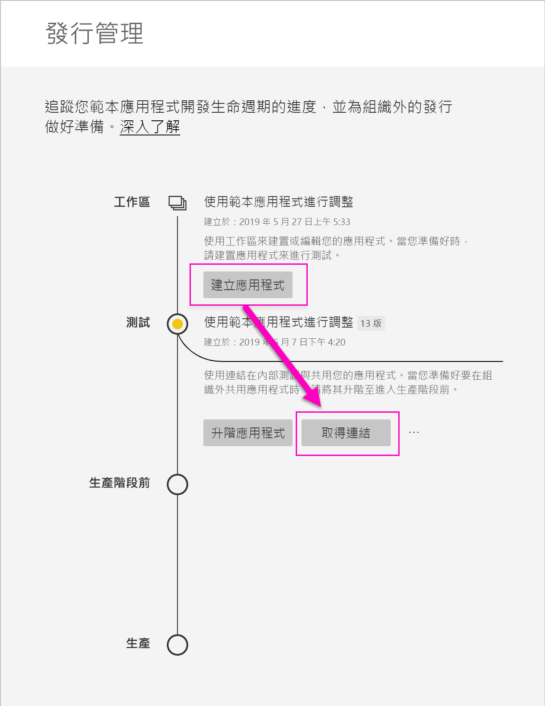

4. 若要測試應用程式安裝體驗，請複製通知視窗中的連結，並貼到新的瀏覽器視窗。

    從這裡開始，您遵循的程序與客戶要遵循的程序相同。 如需查看他們的版本，請參閱[在您的組織中安裝及散發範本應用程式](service-template-apps-install-distribute.md)。

5. 在對話方塊中，選取 [安裝]  。

    安裝成功後，您會看到新應用程式已就緒的通知。

6. 選取 [前往應用程式]  。
7. 在 [開始使用新的應用程式]  中，您會看到與客戶所見相同的應用程式。

    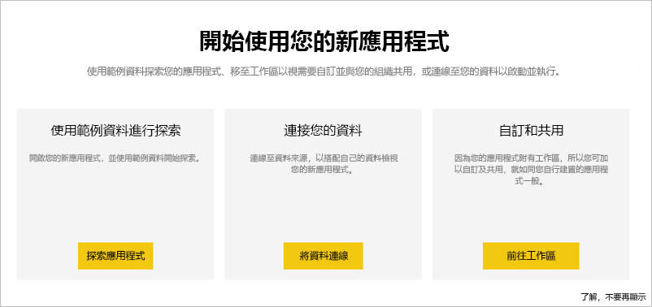
8. 選取 [探索應用程式]  來以範例資料驗證測試應用程式。
9. 若要進行任何變更，請返回原始工作區中的應用程式。 並將測試應用程式更新到您滿意為止。
10. 當您準備好要將應用程式升階至生產階段前，以進一步在租用戶外部測試時，請返回 [發行管理]  窗格，並選取 [升階應用程式]  。 

    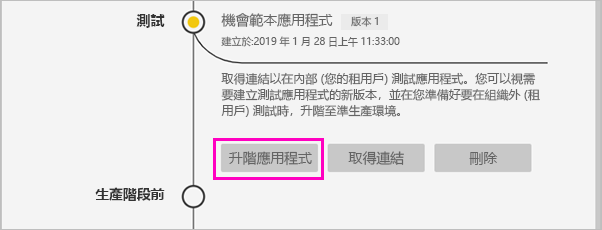
    >[!NOTE]
    > 當應用程式升階時即可在組織外部公開取得。

    如果您未看到該選項，請連絡 Power BI 系統管理員，要求其授與您管理入口網站中的[範本應用程式開發權限](service-admin-portal.md#template-apps-settings)。
11. 選取 [升階]  來確認您的選擇。
12. 複製這個新的 URL 來分享至租用戶外部，以進行測試。 當您建立[新的 Cloud Partner 入口網站供應項目](https://docs.microsoft.com/azure/marketplace/cloud-partner-portal/power-bi/cpp-publish-offer)，以在 AppSource 上開始應用程式的散發程序時，也要提交這個連結。 請僅將生產階段前的連結提交至 Cloud Partner 入口網站。 只有在應用程式通過核准，您也收到其在 AppSource 中發佈的通知之後，您才可以將此套件升階到 Power BI 中的生產環境。
13. 當您的應用程式已準備好進入生產階段或透過 AppSource 分享時，請返回 [發行管理]  窗格，並選取 [生產階段前]  旁邊的 [升階應用程式]  。
14. 選取 [升階]  來確認您的選擇。

    現在您的應用程式已經進入生產階段，並準備好散發。

    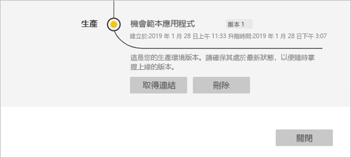

若要讓全球上千位 Power BI 使用者都能使用您的應用程式，建議您將應用程式提交至 AppSource。 如需詳細資料，請參閱 [Power BI 應用程式供應項目](https://docs.microsoft.com/azure/marketplace/cloud-partner-portal/power-bi/cpp-power-bi-offer)。

## 後續步驟

請參閱[在您的組織中安裝、自訂及散發範本應用程式](service-template-apps-install-distribute.md)，了解客戶如何與範本應用程式互動。

如需散發應用程式的詳細資料，請參閱 [Power BI 應用程式供應項目](https://docs.microsoft.com/azure/marketplace/cloud-partner-portal/power-bi/cpp-power-bi-offer)。
