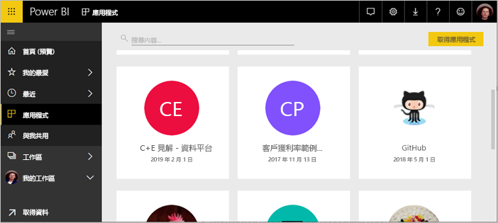
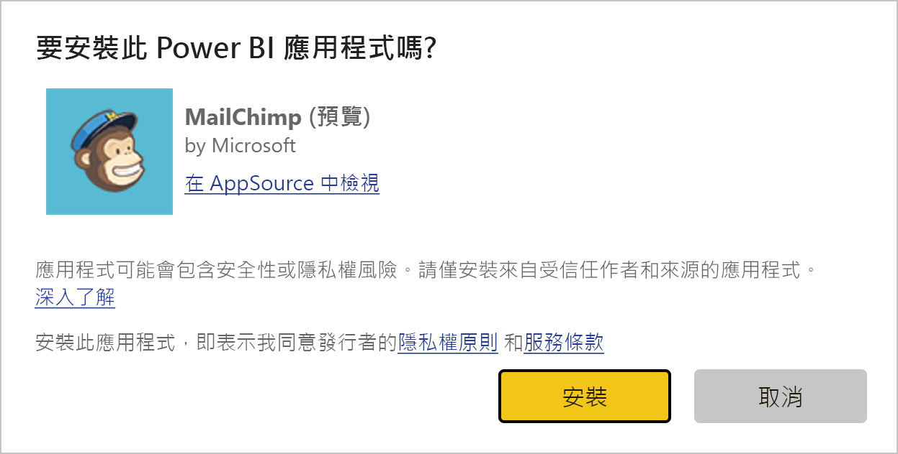
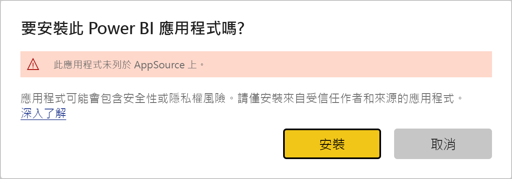
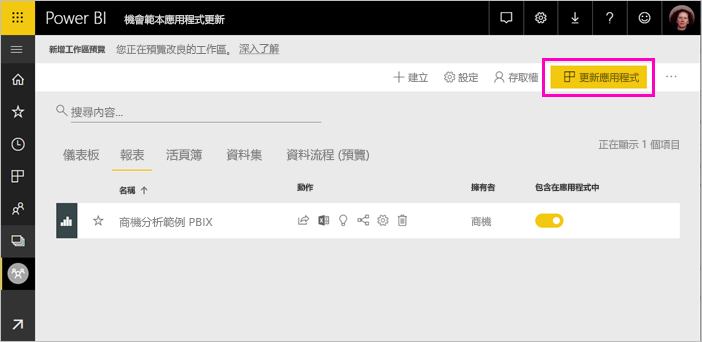
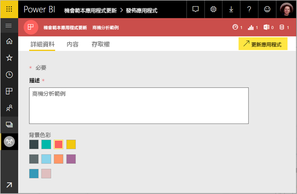
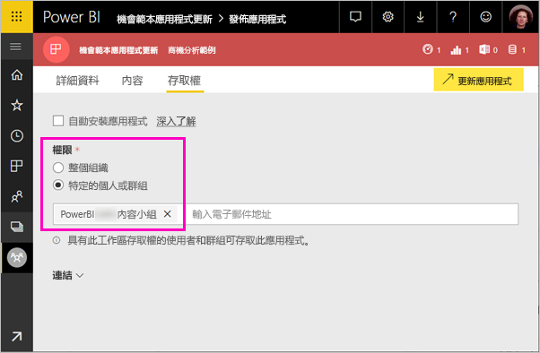
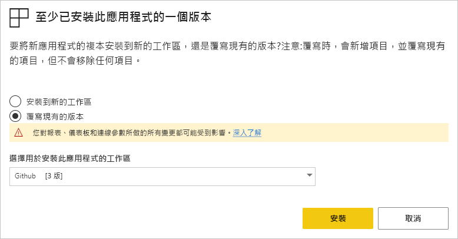

# 在您的組織中散發範本應用程式 - Power BI

您是 Power BI 分析員嗎？ 如果是，本文說明如何安裝「範本應用程式」  ，以連線到執行業務所用的多個服務，例如 Salesforce、Microsoft Dynamics 和 Google Analytics。 您可以修改儀表板和報表來滿足組織需求，然後以「應用程式」  的形式散發給同事。 

如果您有興趣建立範本應用程式並自行散發，請參閱 [Create a template app in Power BI](service-template-apps-create.md) (在 Power BI 中建立範本應用程式)。 Power BI 合作夥伴只要撰寫少量程式碼或不需撰寫程式碼，即可建置 Power BI 應用程式，並將應用程式部署至 Power BI 客戶。 

## 先決條件  

以下是安裝、自訂和散發範本應用程式的需求： 

- [Power BI 專業授權](service-self-service-signup-for-power-bi.md)
- 熟悉 [Power BI 的基本概念](service-basic-concepts.md)
- 來自範本應用程式提供者或 AppSource 的有效安裝連結。 
- 安裝範本應用程式的權限。 

## 安裝範本應用程式

您可能會收到範本應用程式的連結。 若否，您可在 AppSource 搜尋自己想要的範本應用程式。 不論如何，只要安裝了範本應用程式，您就能加以修改並在組織內散發。

### 從瀏覽器搜尋 AppSource

在瀏覽器中選取此連結，來開啟已篩選至 Power BI 應用程式的 AppSource：

- https://appsource.microsoft.com/marketplace/apps?product=power-bi

### 從 Power BI 服務搜尋 AppSource

1. 在 Power BI 服務的左側瀏覽窗格中選取 [應用程式]   > [取得應用程式]  。

    

2. 在 AppSource 中選取 [應用程式]  。

    

3. 瀏覽或搜尋應用程式，然後選取 [立即取得]  。

4. 在對話方塊中，選取 [安裝]  。

     如果您有 Power BI Pro 授權，即會安裝應用程式及其相關聯的工作區。 您在相關工作區內自訂應用程式。

    安裝成功後，您會看到新應用程式已就緒的通知。
4. 選取 [前往應用程式]  。
5. 在 [Get started with your new app]  \(開始使用您的新應用程式\) 中選取三個選項的其中一個：

    

    - **Explore app** (探索應用程式)：基本範例資料探索。 從這裡著手來了解應用程式的外觀和感覺。 
    - **Connect Data** (將資料連線)：將資料來源從範例資料變更為您自己的資料來源。 您可以重新定義資料集參數和資料來源認證。 請參閱範本應用程式提示主題中的 [Known limitations](service-template-apps-tips.md#known-limitations) (已知限制)。 
    - **Go to workspace** (前往工作區) (最進階的選項)：您可以進行應用程式建置者允許的所有變更。

    您也可以跳過此對話方塊，並透過左側瀏覽窗格中的 [工作區]  直接存取相關工作區。
    >[!NOTE]
    >安裝範本應用程式會同時安裝「組織應用程式」  和「工作區」  。 深入了解如何[在 Power BI 中散發應用程式](service-create-distribute-apps.md)。
 
6. 建議您先連線至自己的資料，再將其與同事共用。 此外也建議您修改報表或儀表板，以使其適用於您的組織。 您也可以在這個時候新增其他報表或儀表板。

   若您選取未列於 AppSource 上之應用程式的安裝連結，您將會看到驗證對話方塊要求您確認您的選擇。

   

   >[!NOTE]
   >若要安裝未列於 AppSource 上的範本應用程式，您必須向您的系統管理員要求權限。 如需詳細資料，請參閱 Power BI [管理入口網站、範本應用程式設定](service-admin-portal.md#template-apps-settings)。

## 自訂及發佈應用程式

當您為組織更新應用程式後，就能準備加以發佈。 這些步驟就和發佈任何其他應用程式一樣。

1. 當您完成自訂後，請於工作區清單檢視的右上角選取 [更新應用程式]  。  

    

2. 您可在 [詳細資料]  中修改描述和背景色彩。

   

3. 在 [瀏覽]  中，您可以針對應用程式使用新的瀏覽產生器，或選取登陸頁面的儀表板或報表。 請參閱[設計應用程式的瀏覽體驗](service-create-distribute-apps.md#design-the-navigation-experience)以取得詳細資料。

   

4. 在 [存取權]  中，您可將存取權授與選取的使用者或整個組織。  

   

5. 選取 [更新應用程式]  。 

6. 成功發佈應用程式後，您可以複製連結並和您授與存取權的對象共用。 如果您與他們共用，他們就能在 AppSource 的 [我的組織]  索引標籤看到該應用程式。

## 更新範本應用程式

範本應用程式建立者可以透過 AppSource 或直接連結來發行其範本應用程式的新版本。 當他們發行新版本時，您可以在使用相同或較新版本重新安裝應用程式時更新範本應用程式。

  >[!NOTE]
  >安裝新版本會覆寫您對報表和儀表板所做的任何變更。 若要保留已更新的報表和儀表板，您可以在安裝之前使用不同的名稱或位置將其儲存。

- **覆寫現有的版本：** 使用範本應用程式的更新版本來覆寫現有工作區。

   

- **安裝到新的工作區：** 安裝您需要重新設定的新版本工作區和應用程式

### 覆寫行為

* 覆寫會更新「工作區」  內的報表、儀表板和資料集，而不是應用程式。 覆寫不會變更應用程式的瀏覽、設定和權限。
* 更新工作區之後，您需要「更新應用程式」  ，以將變更從工作區套用到組織應用程式。
* 覆寫會保留已設定的參數和驗證。 更新之後，隨即開始自動資料集重新整理。 在這段期間，組織應用程式、報表和儀表板會顯示「範例資料」  體驗。
  
* 覆寫一律會顯示範例資料，直到重新整理完成為止。 如果範本應用程式作者對資料集或參數進行變更，則工作區和應用程式的使用者會繼續看到「範例資料」  體驗。
* 覆寫一律不會刪除已新增至工作區的「新」  報表或儀表板。 它會使用原始作者的變更來覆寫原始報表和儀表板。

>[!IMPORTANT]
>請記得在覆寫之後[更新應用程式](#customize-and-publish-the-app)，以將變更套用至組織應用程式使用者的報表和儀表板。

## 後續步驟

[與同事在 Power BI 中建立工作區](service-create-workspaces.md)
