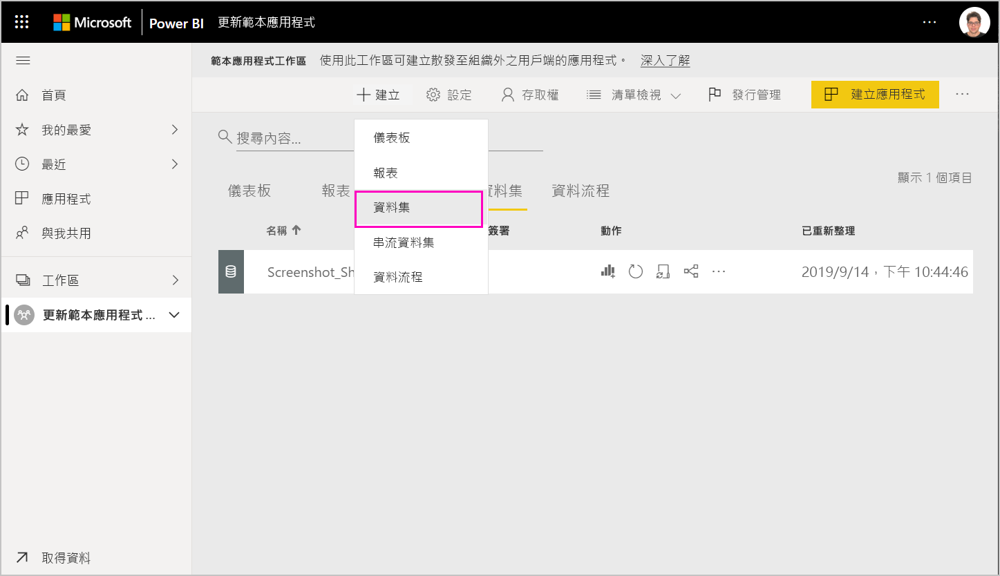
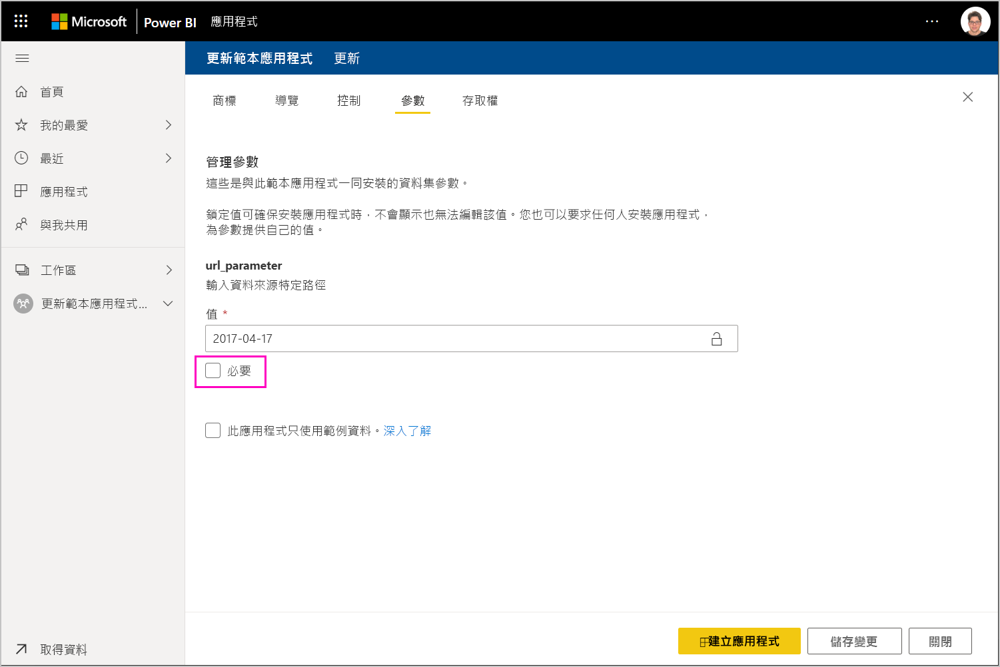

# 更新、刪除及擷取範本應用程式

既然您的應用程式已經進入生產階段，您可以在測試階段內重新開始，而不中斷生產階段內的應用程式。
## 更新應用程式

如果您已在 Power BI Desktop 中進行變更，請從步驟 (1) 開始。 如果您未在 Power BI Desktop 中進行變更，請從步驟 (4) 開始。

1. 上傳更新的資料集，並覆寫現有的資料集。 **請務必使用完全相同的資料集名稱**。 使用不同名稱將會為正在更新應用程式的使用者建立新的資料集。

1. 從您的電腦匯入 pbix 檔案。

1. 確認覆寫。

1. 在 [發行管理]  窗格中，選取 [建立應用程式]  。
1. 返回再執行應用程式建立程序。
1. 在您設定好 [商標]  、[內容]  、[控制項]  及 [存取權]  後，再次選取 [建立應用程式]  。
1. 選取 [關閉]  並回到 [發行管理]  。

   您會看到您現在有兩個版本：生產階段中的版本，加上測試階段中的新版本。

    

1. 當您準備好要將應用程式升階至生產階段前，以進一步於租用戶外部測試時，請返回 [發行管理] 窗格，並選取 [測試]  旁邊的 [升階應用程式]  。

   您現在擁有生產階段的版本，以及生產階段前的版本。

   

   您的連結現已正式運作。 **請注意，生產階段前的 [升階應用程式] 按鈕會呈現灰色**。這是為了避免在 Cloud Partner 入口網站驗證並核准新的應用程式版本之前，不小心覆寫目前應用程式版本的即時生產連結。

1. 請遵循 [Power BI 應用程式供應項目更新](https://docs.microsoft.com/azure/marketplace/cloud-partner-portal/power-bi/cpp-update-existing-offer)的步驟，將您的連結再次提交至 Cloud Partner 入口網站 (CPP)。 在 Cloud Partner 入口網站中，您必須再次 [發佈]  供應項目並加以驗證及核准。

   當您的供應項目獲得核准時，[升階應用程式] 按鈕將會再次啟用。 
1. 將應用程式升階至生產階段。
   
### 更新行為

1. 更新應用程式可讓範本應用程式的安裝程式在已安裝工作區中[更新範本應用程式](service-template-apps-install-distribute.md#update-a-template-app)，而不會遺失連線設定。
1. 請參閱安裝程式的[覆寫行為](service-template-apps-install-distribute.md#overwrite-behavior)，以了解資料集中變更如何影響已安裝的範本應用程式。
1. 更新 (覆寫) 範本應用程式時，它會先還原為範例資料，且會自動與使用者設定 (參數與驗證) 重新連線。 在重新整理完成之前，報表、儀表板和組織應用程式會呈現範例資料橫幅。
1. 如果您已將新查詢參數新增至需要使用者輸入的更新資料集，則必須勾選 [必要]  核取方塊。 這會在更新應用程式之後，使用連接字串提示安裝程式。
 

## 擷取工作區
有了擷取功能，現在要回復到舊版範本應用程式比以往更為容易。 下列步驟將會從各種不同的發行階段，擷取特定應用程式版本到新的工作區：

1. 在 [發行管理] 窗格中，按 [(...)]  (更多)，然後按 [擷取]  。

     
2. 在對話方塊中，輸入所擷取工作區的名稱。 將會新增新的工作區。

新的工作區版本設定會重設，您可以繼續從新擷取的工作區開發和散發範本應用程式。

## 刪除範本應用程式版本
範本工作區是使用中分散式範本應用程式的來源。 為了保護範本應用程式使用者，若未先移除工作區中建立的所有應用程式版本，便無法刪除工作區。
刪除應用程式版本時，也會刪除無法再運作的應用程式 URL。

1. 在 [發行管理] 窗格中，按下選取省略符號 [(...)]  ，然後按 [刪除]  。
 
 

>[!NOTE]
>請勿刪除客戶或 **AppSource** 正在使用的應用程式版本，否則它們將無法再運作。

## 後續步驟

請參閱[在您的組織中安裝、自訂及散發範本應用程式](service-template-apps-install-distribute.md)，了解客戶如何與範本應用程式互動。

如需散發應用程式的詳細資料，請參閱 [Power BI 應用程式供應項目](https://docs.microsoft.com/azure/marketplace/cloud-partner-portal/power-bi/cpp-power-bi-offer)。
