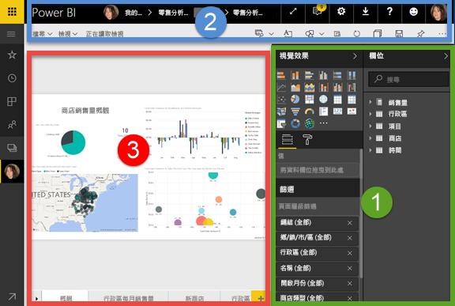
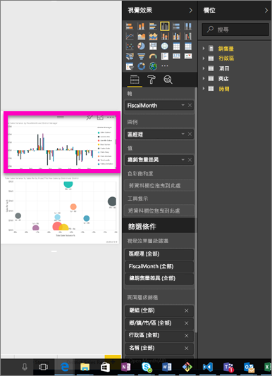
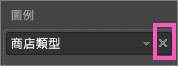
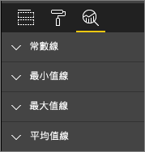

# 報表編輯器...導覽
## 在 Power BI 服務和 Power BI Desktop 中編輯報表
Power BI 服務中的報表編輯器與 Power BI Desktop 中的報表編輯器非常類似。 下列影片將說明 Power BI Desktop 中的報表編輯器，而本文則說明 Power BI 服務中的報表編輯器。 

## 報表「建立者」和報表「取用者」的差異
建立和編輯報表的功能只限報表擁有者使用 (也稱為「建立者」)。 如果您「取用」與您共用的報表，則仍然只能在 Power BI 服務的[閱讀檢視](service-reading-view-and-editing-view.md)中開啟報表並與之互動，但不具有所有提供給報表建立者健全且完整的功能。  

若要深入了解報表閱讀檢視，請參閱 [Power BI 服務中的閱讀檢視和編輯檢視](service-reading-view-and-editing-view.md)。 

<iframe width="560" height="315" src="https://www.youtube.com/embed/IkJda4O7oGs" frameborder="0" allowfullscreen></iframe>

在 Power BI 服務中，「報表編輯器」只能在[編輯檢視](service-reading-view-and-editing-view.md)中使用。 若要以編輯檢視開啟報表，您必須是報表擁有者或建立者。

Power BI 報表編輯器是由 3 個區段所組成︰  

1. [欄位]、[視覺效果] 和 [篩選] 窗格
2. 上方導覽列    
3. 報表畫布     

## 1.報表編輯器窗格

第一次開啟報表時，會顯示 3 個窗格︰[視覺效果]、[篩選] 和 [欄位]。 [視覺效果] 和 [篩選] 窗格位在左邊，控制視覺效果成像：類型、色彩、篩選和格式化。  [欄位] 窗格位在右邊，管理視覺效果中所使用的基礎資料。 

報表編輯器中顯示的內容會隨著報表畫布的選項而變化。  例如，當您選取個別的視覺效果， 

|  |  |
| --- | --- |
|  |<ul><li>[視覺效果] 窗格上方會指出使用中的視覺效果類型，在此範例中是群組直條圖。  </li> <li>[視覺效果] 窗格下方 (必須向下捲動) 會顯示視覺效果正在使用的欄位。 這個圖表使用 FiscalMonth、DistrictManager 和總銷售額變異數。   </li><li>[篩選] 窗格 (必須向下捲動) 會顯示任何已套用的篩選條件。   </li><li>[欄位] 窗格會列出可用的資料表，如果您展開資料表的名稱時，還能看到構成該資料表的欄位。 黃色字型可讓您了解該資料表至少有一個欄位用在視覺效果中。  </li><li> 若要顯示格式化窗格，請針對選取的視覺效果，選取油漆滾筒圖示。  </li><li> 若要顯示 [分析] 窗格，請選取放大鏡圖示。</ul> |

## [視覺效果] 窗格 (由上至下)
![[視覺效果] 窗格頂端](media/service-the-report-editor-take-a-tour/selectviz.png)

以下是您選取視覺效果類型的位置。 小型圖片稱為「範本」。 在上圖中，選取 [群組橫條圖]。 如果您未先選取視覺效果類型，而是選取欄位來開始建置視覺效果，Power BI 將會為您選擇視覺效果類型。 您可以保留 Power BI 的選取項目，或選取不同的範本來變更類型。 視需要切換多次，以找到最能代表您資料的視覺效果類型。

### 管理視覺效果中所使用的欄位。
![[視覺效果] 窗格中間](media/service-the-report-editor-take-a-tour/power-bi-field-list.png)

這個窗格中顯示的貯體 (有時稱為「井」)，會隨選取的視覺效果類型而異。  例如，如果您選取的是橫條圖，您看到的貯體就會有：值、軸和圖例。 當您選取欄位或將它拖曳至畫布時，Power BI 就會將該欄位加入到其中一個貯體。  您也可以將 [欄位] 清單中的欄位直接拖曳至貯體。  某些貯體限於特定的資料類型。  例如，[值]  不接受非數值欄位。 因此，如果將 [員工姓名]  欄位拖曳到 [值]  貯體，Power BI 會將其變更為 [員工姓名計數] 。

### 移除欄位
若要移除視覺效果中的欄位，請選取欄位名稱右側的 **X**。

如需詳細資訊，請參閱[在 Power BI 報表中加入視覺效果](visuals/power-bi-report-add-visualizations-i.md)

### 格式化視覺效果
選取油漆滾筒圖示來顯示 [格式] 窗格。 可用的選項取決於選取的視覺效果類型。

![[格式化] 窗格](media/service-the-report-editor-take-a-tour/power-bi-formatting.png)

格式化可能性幾乎無限。  若要深入了解，請自行探索，或瀏覽這些文章︰

* [自訂視覺效果標題、背景和圖例](visuals/power-bi-visualization-customize-title-background-and-legend.md)
* [彩色格式](visuals/service-getting-started-with-color-formatting-and-axis-properties.md)
* [自訂 X 軸和 Y 軸屬性](visuals/power-bi-visualization-customize-x-axis-and-y-axis.md)

### 將分析新增至視覺效果
選取放大鏡圖示，以顯示 [分析] 窗格。 可用的選項取決於選取的視覺效果類型。

    
有了 Power BI 服務的 [分析] 窗格，您就可以將動態參考線新增至視覺效果，為重要的趨勢或深入資訊提供焦點。 如需深入了解，請參閱 [Power BI 服務中的分析窗格](service-analytics-pane.md)或 [Power BI Desktop 中的分析窗格](desktop-analytics-pane.md)。

- - -
## [篩選] 窗格
使用 [篩選] 窗格在頁面、報表、鑽研和視覺效果層級來檢視、設定和修改報表的持續篩選。 是的，您可以選取視覺效果項目或使用如交叉分析篩選器之類的工具，在報表頁面和視覺效果上執行隨選篩選，但使用 [篩選] 窗格會將篩選的狀態與報表一起儲存。 

[篩選] 窗格還有另一項強大的功能：***使用某個欄位進行篩選，而該欄位並未用於報表的任一視覺效果中***。 讓我詳細說明。 當您建立報表頁面時，Power BI 會自動將您用於視覺效果中的所有欄位新增到 [篩選] 窗格的 [視覺效果層級] 篩選區域。  但是，如果您要使用目前並未用於視覺效果中的欄位來設定視覺效果、頁面、鑽研或報表篩選，只需將該欄位拖曳至其中一個篩選值區即可。   

![[篩選] 窗格](media/service-the-report-editor-take-a-tour/power-bi-formatting-pane.png)

如需詳細資訊，請參閱[在報表中加入篩選](power-bi-report-add-filter.md).

- - -
## [欄位] 窗格
[欄位] 窗格會顯示資料中的資料表和欄位，並可供您用來建立視覺效果。

|  |  |
| --- | --- |
| ![[欄位] 窗格](media/service-the-report-editor-take-a-tour/reportfields.png) |<ul><li>將欄位拖曳到頁面以開始新的視覺效果。  您也可以將欄位拖曳至現有視覺效果，以將欄位新增至該視覺效果。  </li> <li>當您在欄位旁邊新增核取記號時，Power BI 會將該欄位新增至使用中 (或新的) 視覺效果。 它也會決定要放入該欄位的貯體。  例如，欄位應該作為圖例、軸還是值？ Power BI 可進行最佳猜測，而且您可以視需要將欄位從該貯體移至另一個貯體。   </li><li>無論何種方式，每個選取的欄位都會加入報表編輯器的 [視覺效果] 窗格中。</li></ul> |

**注意**：如果您使用 Power BI Desktop，也可以選擇顯示/隱藏欄位、新增計算等等。

### 欄位圖示代表什麼意思？
* **∑ 彙總**：彙總是數值，例如加總或平均。 彙總隨資料匯入 (在以報表為基礎的資料模型中定義)。
  如需詳細資訊，請參閱 [Power BI 報表中的彙總](service-aggregates.md).
*  **導出量值 (也稱為導出欄位)**  
   每個導出欄位都有自己的硬式編碼公式。 您無法變更計算，例如，如果是總和，就只能加總。 如需詳細資訊，請參閱[了解量值](desktop-measures.md)。
*  **唯一欄位**  
   具有這個圖示的欄位都是從 Excel 匯入並設定為顯示所有值，即使有重複項目亦然。 例如，您的資料裡可能有兩筆姓名為 'John Smith' 的記錄，但每一筆都視為唯一，不會將其加總。  
* ** 地理欄位**  
   位置欄位可用於建立地圖視覺效果。 
* ** 階層**  
   選取箭號以顯示組成階層的欄位。 

- - -
## 2.上方導覽列
上方導覽列提供許多動作，且不斷加入新的動作。 如需特定動作的相關資訊，請使用 Power BI 文件目錄或 [搜尋] 方塊。

## 3.報表畫布
報表畫布就是顯示您工作的位置。 當您使用 [欄位]、[篩選] 和 [視覺效果] 窗格來建立視覺效果時，它們就會建置並顯示在報表畫布上。 畫布底部的每個索引標籤都代表報表中的頁面。 選取索引標籤，以開啟該頁面。 

## 後續步驟：
[建立報表](service-report-create-new.md)

深入了解 [Power BI 服務](service-reports.md)、[Power BI Desktop](desktop-report-view.md) 和 [Power BI 行動版](consumer/mobile/mobile-apps-view-phone-report.md)中的報表。

[Power BI - 基本概念](service-basic-concepts.md)

有其他問題嗎？ [試試 Power BI 社群](http://community.powerbi.com/)

