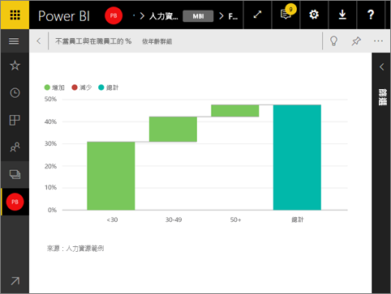

# 以全螢幕模式顯示儀表板磚
這些磚必須先處於[焦點模式](service-focus-mode.md)，才能以全螢幕模式顯示。

## 什麼是全螢幕模式？
顯示您的[儀表板、報表](service-fullscreen-mode.md)和磚，而不受功能表和瀏覽按鈕的干擾。  您可隨時取得企業的完整檢視且一目了然。 這有時稱為電視模式。

全螢幕模式的部分用法如下：

* 在會議或研討會中呈現您的磚
* 在辦公室的專用大螢幕或投影機上顯示您的磚
* 在小型螢幕上查看您的磚
* 以鎖定模式檢閱您的磚 -- 您可以透過觸控螢幕或用滑鼠點選磚，而不需要開啟基礎報表

## 開啟 (及關閉) 全螢幕模式
1. [彈出磚並以焦點模式顯示](service-focus-mode.md)。
   
    
   
    磚會填滿畫布；因此，您可以看到更多詳細資料。 當儀表板磚處於焦點模式時，您可以檢視和修改在建立此視覺效果時所套用的篩選。
   
    
2. 從頂端的功能表列選取此圖示     以全螢幕模式顯示磚。
3. 在全螢幕模式中，磚會填滿整個畫面並顯示，而不受功能表和導覽按鈕的干擾。  您可隨時取得磚的完整檢視且一目了然。 這有時稱為電視模式。
   
   
4. 當您移動滑鼠時，功能表會出現。 在您結束全螢幕模式前，功能表會停留在右下角。 如果消失，只要移動您的游標或點選螢幕即可。
   
    
   
   * 使用 [上一頁] 按鈕導覽至瀏覽器中的上一頁。 如果上一頁是 Power BI 服務頁面，它會以全螢幕模式顯示。  全螢幕模式會持續到您關閉全螢幕為止。
   * 若要從全螢幕模式列印磚，請選取列印圖示。
     
   * 若要結束全螢幕模式，請選取**關閉全螢幕**圖示 。

## 後續步驟
[Power BI 中的儀表板](service-dashboards.md)

[儀表板和報表的全螢幕模式](service-fullscreen-mode.md)

[Power BI 中的焦點模式](service-focus-mode.md)

有其他問題嗎？ [試試 Power BI 社群](http://community.powerbi.com/)

