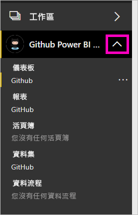

# 教學課程：使用 Power BI 連線到 GitHub 存放庫
在本教學課程中，您使用 Power BI 連線接至 GitHub 服務中的實際資料，而且 Power BI 會自動建立儀表板和報表。 您會連線到 Power BI 內容的公用存放庫 (也稱為「存放庫」  )，並查看如下問題的解答：有多少人參與 Power BI 的公用內容？ 誰參與最多？ 哪個星期幾的參與最多？ 以及其他問題。 

在本教學課程中，您完成下列步驟：

> [!div class="checklist"]
> * 在尚未有 GitHub 帳戶時，註冊一個帳戶 
> * 登入 Power BI 帳戶，或在尚未有 Power BI 帳戶時，註冊一個帳戶
> * 開啟 Power BI 服務
> * 尋找 GitHub 應用程式
> * 輸入 Power BI 公用 GitHub 存放庫的資訊
> * 使用 GitHub 資料檢視儀表板和報表
> * 刪除應用程式以清除資源

如果您尚未註冊 Power BI，請先進行[免費註冊](https://app.powerbi.com/signupredirect?pbi_source=web)再開始。

## 必要條件

若要完成本教學課程，您需要 GitHub 帳戶 (如果還沒有的話)。 

- 註冊 [GitHub 帳戶](https://docs.microsoft.com/contribute/get-started-setup-github)。

## 如何連接
1. 登入 Power BI 服務 (`https://app.powerbi.com`)。 
2. 在導覽窗格中，選取 [應用程式]  ，然後選取 [取得應用程式]  。
   
    

3. 選取 [應用程式]  ，在搜尋方塊中鍵入 **GitHub** > [立即取得]  。
   
    

4. 在 [要安裝此 Power BI 應用程式嗎?]  中，選取 [安裝]  。
5. 在 [您的新應用程式已準備就緒]  中，選取 [前往應用程式]  。
6. 在 [開始使用您的新應用程式]  中，選取 [連線]  。

    

7. 輸入該儲存機制的儲存機制名稱和儲存機制擁有者。 此存放庫的 URL 是 https://github.com/MicrosoftDocs/powerbi-docs ，因此 [存放庫擁有者]  是 **MicrosoftDocs**，而 [存放庫]  是 **powerbi-docs**。 
   
    

5. 輸入您所建立的 GitHub 認證。 如果您已在瀏覽器中登入 GitHub，則 Power BI 可能會略過此步驟。 

6. 針對 [驗證方法]  ，保持選取 [oAuth2]  \> [登入]  。

7. 遵循 GitHub 驗證畫面進行。 將 Power BI 權限授與 GitHub 資料。
   
   Power BI 現在可以與 GitHub 連線，並連線至資料。  資料會每天重新整理一次。

8. Power BI 匯入資料之後，您即可看到新 GitHub 工作區的內容。 
9. 在導覽窗格中，選取工作區名稱旁的箭號。 您會看到工作區包含一個儀表板和一份報表。 

    

10. 選取儀表板名稱旁邊的 [更多選項]  (...) > [重新命名]  > 鍵入 **GitHub 儀表板**。
 
     

8. 選取全域導覽圖示來最小化導覽窗格，讓您有更多空間。

    

10. 選取您的 GitHub 儀表板。
    
    GitHub 儀表板包含即時資料，因此您看到的值可能會有所不同。

    

    

## 詢問問題

1. 將您的游標放在 [詢問一個與資料相關的問題]  中。 Power BI 提供**使用者入門問題**。 

1. 選取 [有多少位使用者]  。
 
    

13. 在 **how many** (有多少位) 和 **users are there** (使用者) 之間，鍵入 **pull requests per** (提取要求 (每位))。 

     Power BI 會建立橫條圖，顯示每一位使用者的提取要求數。

    

13. 選取圖釘來將它釘選到您的儀表板，然後**離開問與答**。

## 檢視 GitHub 報表 

1. 在 GitHub 儀表板中，選取直條圖 [提取要求數 (依月分)]  來開啟相關報表。

    

2. 在 [使用者的總提取要求數]  圖表中，選取使用者名稱。 在此範例中，我們可以看到他們大多數的時數都集中在二月。

    

3. 選取 [穿孔卡片]  索引標籤來檢視報表中的下一個頁面。 
 
    

    顯然每週星期二下午 3 點是最常進行「認可」  的時間，許多人會在這個時間簽入他們的工作。

## 清除資源

既然您已經完成本教學課程，就可以刪除 GitHub 應用程式。 

1. 在導覽窗格中，選取 [應用程式]  。
2. 將滑鼠游標停留在 GitHub 磚，然後選取 [刪除]  垃圾桶。

    

## 後續步驟

在本教學課程中，您已連線至 GitHub 公用存放庫並取得 Power BI 已在儀表板和報表中格式化的資料。 您已經探索儀表板和報表來回答有關資料的一些問題。 您現在可以深入了解連線至其他服務，例如 Salesforce、Microsoft Dynamics 和 Google Analytics。 
 
> [!div class="nextstepaction"]
> [連線至使用的線上服務](service-connect-to-services.md)

