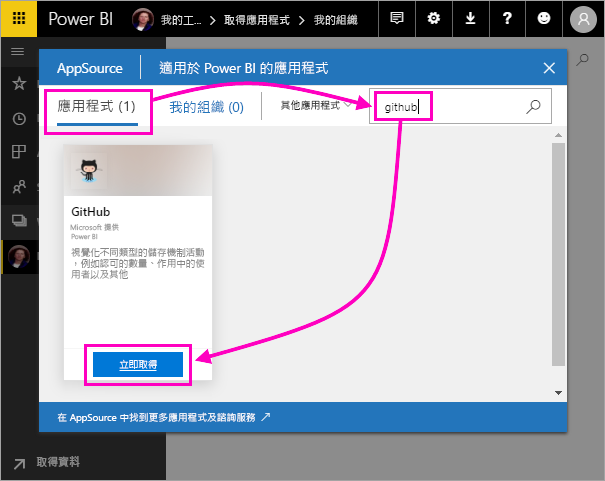
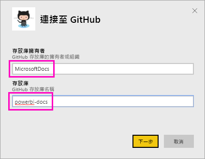
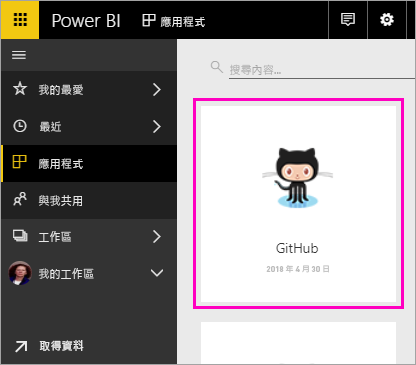
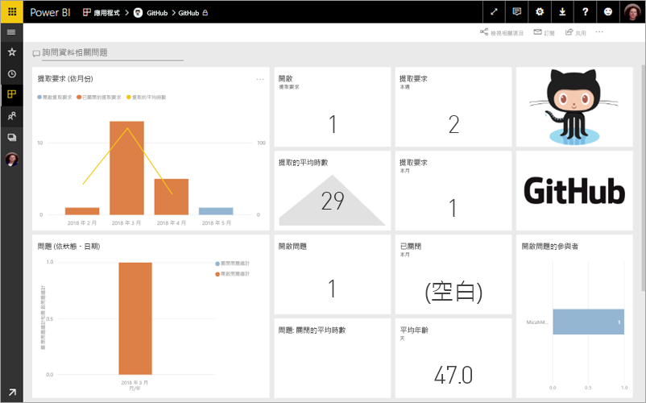
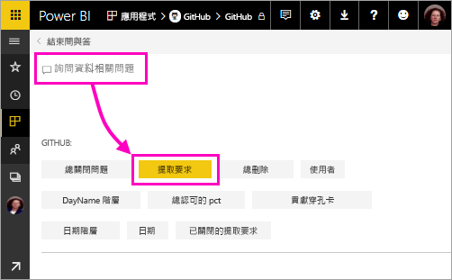
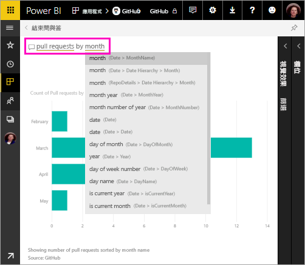
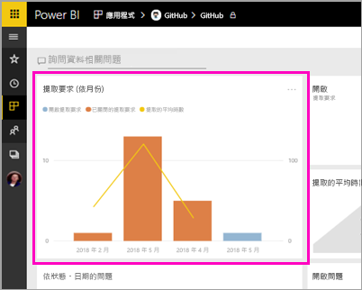
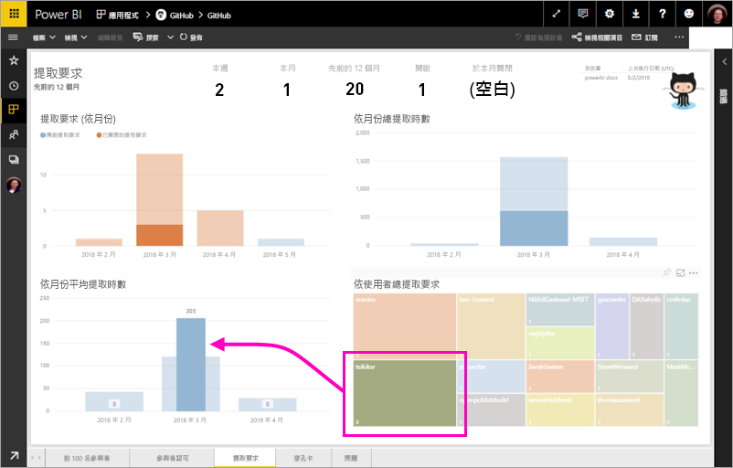
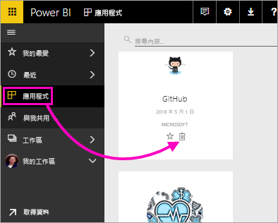

# 教學課程：使用 Power BI 連線至 GitHub 範例
在本教學課程中，您使用 Power BI 連線接至 GitHub 服務中的實際資料，而且 Power BI 會自動建立儀表板和報表。 您連線至 Power BI 內容公用存放庫 (也稱為「存放庫」)，並查看資訊：有多少人參與 Power BI 公用內容？ 誰參與最多？ 哪個星期幾的參與最多？ 以及其他問題的答案。 

在本教學課程中，您完成下列步驟：

> [!div class="checklist"]
> * 在尚未有 GitHub 帳戶時，註冊一個帳戶 
> * 登入 Power BI 帳戶，或在尚未有 Power BI 帳戶時，註冊一個帳戶
> * 開啟 Power BI 服務
> * 尋找 GitHub 應用程式
> * 輸入 Power BI 公用 GitHub 存放庫的資訊
> * 使用 GitHub 資料檢視儀表板和報表
> * 刪除應用程式以清除資源

如果您尚未註冊 Power BI，請先進行[免費註冊](https://app.powerbi.com/signupredirect?pbi_source=web)再開始。

## 先決條件

若要完成本教學課程，您需要 GitHub 帳戶 (如果還沒有的話)。 

- 註冊 [GitHub 帳戶](https://docs.microsoft.com/contribute/get-started-setup-github)

## 如何連接
1. 登入 Power BI 服務 (http://powerbi.com)。 
2. 在左側瀏覽窗格中，選取 [應用程式]，然後選取 [取得應用程式]。
   
    

3. 選取 [應用程式]，並在搜尋方塊中鍵入 **github** > [立即取得]。
   
    

4. 輸入該儲存機制的儲存機制名稱和儲存機制擁有者。 此存放庫的 URL 是 https://github.com/MicrosoftDocs/powerbi-docs，因此 [存放庫擁有者] 是 **MicrosoftDocs**，而 [存放庫] 是 **powerbi-docs**。 
   
    

5. 輸入您所建立的 GitHub 認證。 如果您已在瀏覽器中登入 GitHub，則 Power BI 可能會略過此步驟。 

6. 針對 [驗證方法] 選取 [oAuth2] \> [登入]。

7. 請遵循 GitHub 驗證畫面進行。 將 Power BI 權限授與 GitHub 資料。
   
   Power BI 現在可以與 GitHub 連線，並連線至資料。  資料會每天重新整理一次。

8. 在 Power BI 匯入資料之後，即會看到新的 GitHub 磚。 
 
    

8. 選取全域導覽圖示來最小化左側瀏覽，讓您有更多空間。

    

10. 從步驟 8 中，選取 [GitHub] 磚。 
    
    GitHub 儀表板隨即開啟。 這是即時資料，因此您看到的值可能會不同。

    

    

## 詢問問題

11. 將游標放在 [詢問一個與資料相關的問題]，然後選取 [提取要求]。 

    

12. 鍵入 [依月份]。
 
    

     Power BI 建立橫條圖，以顯示每個月的提取要求數目。

13. 選取 [結束問與答]。

## 檢視 GitHub 報表 

1. 在 GitHub 儀表板中，選取組合直條圖和折線圖 [提取要求 (依月份)] 開啟相關的報表。

    

2. 在 [Total pull requests by user] \(使用者的總提取要求\) 圖表中選取使用者名稱，並如此範例中所示看到它們的平均小時超過 3 月的總平均值。

    

3. 選取 [穿孔卡片] 索引標籤來檢視報表中的下一個頁面。 
 
    

    顯然，在使用者簽入其工作時，星期二下午 3 點是「認可」的最常見時間和星期幾。

## 清除資源

既然您已經完成本教學課程，就可以刪除 GitHub 應用程式。 

1. 在左側導覽列中，選取 [應用程式]。
2. 將滑鼠游標停留在 GitHub 磚，然後選取 [刪除] 垃圾桶。

    

## 後續步驟

在本教學課程中，您已連線至 GitHub 公用存放庫並取得 Power BI 已在儀表板和報表中格式化的資料。 您已經探索儀表板和報表來回答有關資料的一些問題。 您現在可以深入了解連線至其他服務，例如 Salesforce、Microsoft Dynamics 和 Google Analytics。 
 
> [!div class="nextstepaction"]
> [連線至使用的線上服務](./service-connect-to-services.md)

