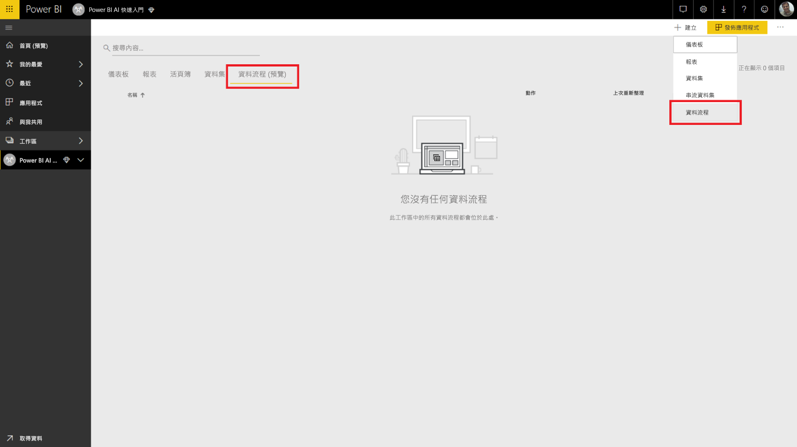
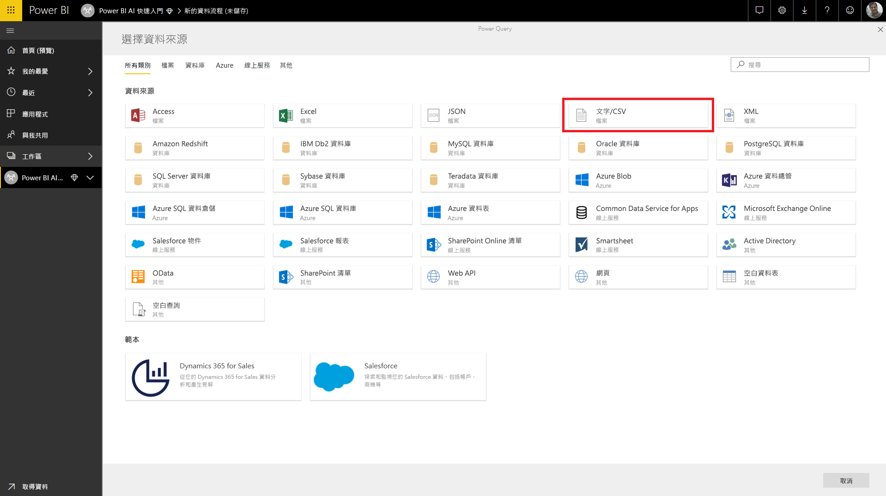
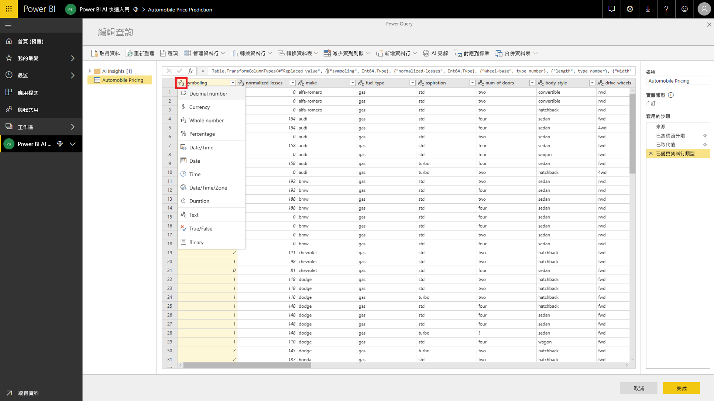
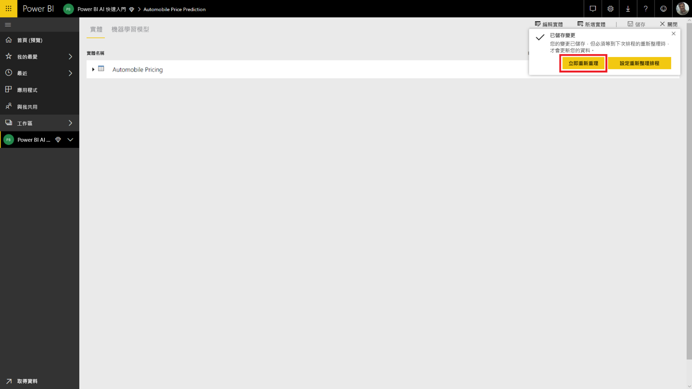
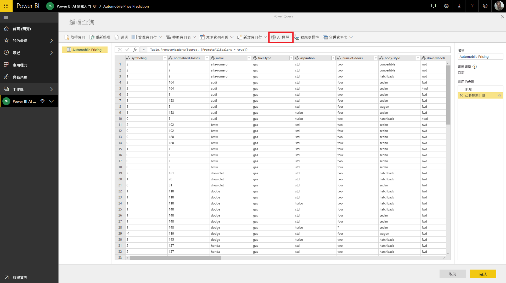
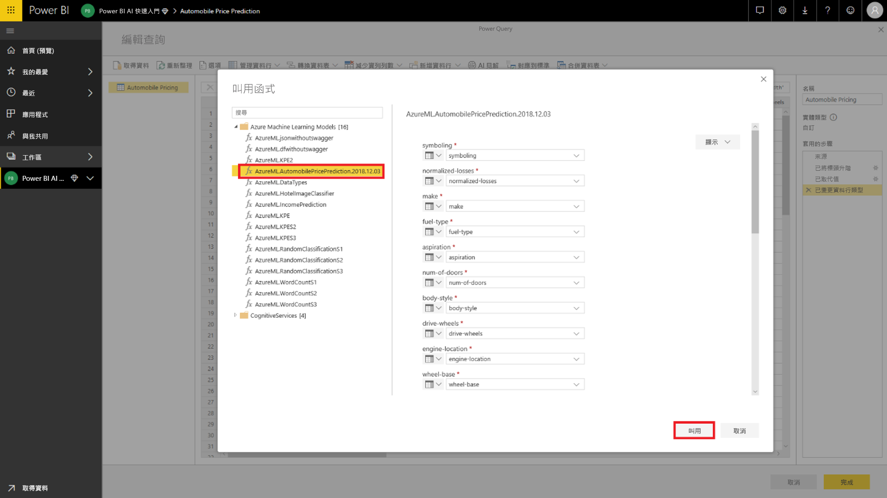
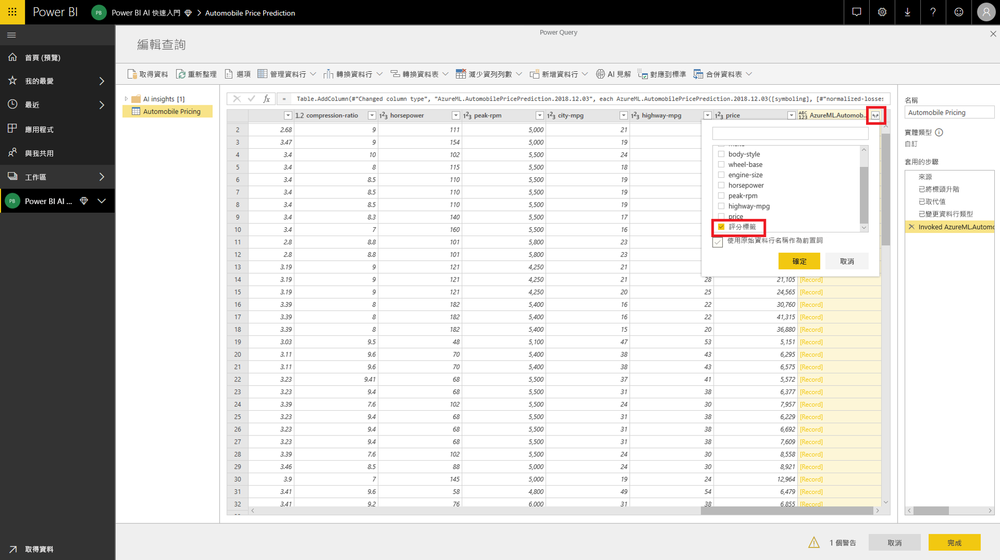

# 教學課程：在 Power BI 中叫用 Machine Learning Studio 模型 (預覽)

在此教學課程中，我們會逐步解說將 **Azure Machine Learning Studio** 的見解併入 Power BI 模型的經驗。 此教學課程包含將 Power BI 使用者存取權授與 Azure ML 模型、建立資料流程，以及將見解從 Azure ML 模型套用至資料流程的指導方針。 如果您還沒有模型，它也會參考建立 Azure ML 模型的快速入門指南。

此教學課程將會指導您逐步執行下列步驟：

> [!div class="checklist"]
> * 建立及發佈 Azure Machine Learning 模型
> * 將存取權授與 Power BI 使用者以使用模型
> * 建立資料流程
> * 將見解從 Azure ML 模型套用至資料流程

## 建立及發佈 Azure ML 模型

請依照[逐步解說步驟 1：建立 Machine Learning Studio 工作區](https://docs.microsoft.com/azure/machine-learning/studio/walkthrough-1-create-ml-workspace)的指示，建立 **Machine Learning** 工作區。

您可以使用下列步驟搭配您已經具備的任何 Azure ML 模型或資料集。 如果您沒有已發佈的模型，可以參考[在 Azure Machine Learning Studio 中建立您的第一個資料科學實驗](https://docs.microsoft.com/azure/machine-learning/studio/create-experiment)，在數分鐘內建立模型，這會為設定 Azure ML 模型汽車價格預測。

請依照[部署 Azure Machine Learning Studio Web 服務](https://docs.microsoft.com/azure/machine-learning/studio/publish-a-machine-learning-web-service)，將 Azure ML 模型發佈為 Web 服務。

## 授與 Power BI 使用者存取權

若要從 Power BI 存取 Azure ML 模型，您必須對 Azure 訂用帳戶和資源群組擁有**讀取**存取權，並對適用於 Machine LearningStudio 模型的 Azure Machine Learning Studio Web 服務擁有**讀取**存取權。  若是 Azure Machine Learning 服務模型，您需要對 Machine Learning 服務工作區擁有**讀取**存取權。

下列步驟假設您是發佈模型的 Azure 訂用帳戶和資源群組的共同系統管理員。

登入 [Azure 入口網站](https://portal.azure.com)，然後瀏覽至 [訂用帳戶] 頁面，您可以使用左導覽功能表中的 [所有服務] 清單找到該頁面。

選取您用於發行模型的 Azure 訂用帳戶，然後選取 [存取控制 (IAM)]。 接著，依序選取 [新增角色指派] 和 [讀者] 角色，然後選取 Power BI 使用者。 完成時，請選取 [儲存]。 下圖顯示這些選取項目。

接著，重複上述步驟，以針對部署 Azure ML 模型所在的特定 Machine Learning Web 服務，將 [參與者] 角色存取權授與 Power BI 使用者。

## 建立資料流程

### 取得建立資料流程的資料

使用您在上一個步驟中對 Azure ML 模型授與存取權的使用者認證，登入 Power BI 服務。

此步驟假設您具有您想要使用 CSV 格式的 Azure ML 模型評分的資料。  如果您使用**汽車定價實驗**在 Machine Learning Studio 中建立模型，下列連結中將共用其資料集：

* [Azure Learning Studio 範例模型](https://raw.githubusercontent.com/santoshc1/PowerBI‑AI‑samples/master/Tutorial\_MLStudio\_model\_integration/Automobile%20price%20data%20\_Raw\_.csv)

### 建立資料流程

若要在資料流程中建立實體，登入 Power BI 服務，並瀏覽至您已啟用 AI 預覽版的專用容量上的工作區。

如果您還沒有工作區，可以在左側功能表中選取 [工作區] 來建立一個工作區，然後在下方的面板中選取 [建立應用程式工作區]。  如此會開啟一個面板來輸入工作區詳細資料。 輸入工作區名稱，然後選取 [儲存]。

建立工作區之後，您可以選取 [歡迎] 畫面右下方的 [略過]。

選取 [資料流程 (預覽)] 索引標籤，再選取工作區右上方的 [建立] 按鈕，在右邊的，然後選取 [資料流程]。

選取 [新增實體]，如此會在瀏覽器中啟動 **Power Query 編輯器**。

選取 [文字/CSV 檔案] 作為資料來源。

在下一個畫面中，系統會提示您連接到資料來源。 貼上您用來建立 Azure ML 模型的資料連結。 如果您使用_汽車定價_資料，可以將下列連結貼入 [檔案路徑或 URL] 方塊，然後按 [下一步]。

`https://raw.githubusercontent.com/santoshc1/PowerBI‑AI‑samples/master/Tutorial\_MLStudio\_model\_integration/Automobile%20price%20data%20\_Raw\_.csv`

Power Query 編輯器會從 CSV 檔案中顯示資料的預覽。 從命令功能區選取 [轉換資料表]，然後選取 [使用第一個資料列作為標頭]。  這會將 [已升階標頭] 查詢步驟新增到右側的 [套用的步驟] 窗格。 您也可以使用右側的窗格，將查詢重新命名為更容易記得的名稱，例如 _Automobile Pricing_。

我們的來源資料集將未知的值設定為 '?'。  若要清除這種情況，我們可以將 '?' 取代為 '0'，以避免稍後為求簡化而發生的錯誤。  若要這樣做，按一下資料行標頭的名稱，選取 *normalized-losses*、*bore*、*stroke*、*compression-ratio*、*horsepower*、*peak-rpm* 和 *price* 資料行，然後按一下 [轉換資料行]，並選取 [取代值]。  將 '?' 取代為 '0'。

文字/CSV 來源資料表中的所有資料行都會被視為文字資料行。  接著，我們需要將數值資料行變更為正確的資料類型。  方法是，在 Power Query 中按一下資料行標頭中的資料類型符號。  將資料行變更為以下類型：

- **整數**：symboling、normalized-losses、curb-weight、engine-size、horsepower、peak-rpm、city-mpg、highway-mpg、price
- **十進位數字**：wheel-base、length、width、height、bore、stroke、compression-ratio

選取 [完成] 以關閉 Power Query 編輯器。 這將會顯示含有我們所加入的_汽車定價_資料的實體清單。 選取右上角的 [儲存]、為資料流程提供名稱，然後選取 [儲存]。

### 重新整理資料流程

儲存資料流程就會顯示已儲存資料流程的通知。 選取 [立即重新整理]，將資料從來源擷取至資料流程中。

選取右上角的 [關閉]，然後等待資料流程重新整理完成。

您也可以使用 [動作] 命令，重新整理資料流程。 資料流程會在重新整理完成時顯示時間戳記。

## 從 Azure ML 模型套用見解

若要存取_汽車價格預測_的 Azure ML 模型，您可以編輯我們想要加入預測價格的_汽車定價_實體。

選取 [編輯] 圖示可為資料流程中的實體開啟 Power Query 編輯器。

選取功能區中的 [AI 見解] 按鈕，然後從左側瀏覽功能表選取 [Azure Machine Learning 模型] 資料夾。

您已獲授與存取權的 Azure ML 模型會列為首碼為 *AzureML* 的 Power Query 函式。  當您按一下對應至 _AutomobilePricePrediction_ 模型的函式時，此模型的 Web 服務參數會列為函式參數。

若要叫用 Azure ML 模型，您可以從下拉式清單中指定任何所選實體的資料行作為輸入。 您也可以將資料行圖示切換至 [輸入] 對話方塊的左側，以指定要當作輸入使用的常數值。 當某個資料行名稱符合其中一個函式參數名稱時，會自動建議該資料行作為輸入。  如果資料行名稱不符，您可以從下拉式清單中選取它。

若是_汽車定價預測_模型，輸入參數為：

- make
- body-style
- wheel-base
- engine-size
- horsepower
- peak-rpm
- highway-mpg

在我們的案例中，我們的資料表符合用於定型模型的原始資料集，因此所有參數都已經選取正確的資料行。

選取 [叫用] 來檢視 Azure ML 模型的輸出作為實體資料表中新資料行的預覽。 您也將看到模型叫用作為查詢套用的步驟。

模型的輸出會顯示為輸出資料行中的記錄。 您可以展開資料行，在不同的資料行中產生個別的輸出參數。 在我們的案例中，我們只對其中包含汽車預測價格的_評分標籤_感興趣。  因此，我們取消選取其餘部分，然後選取 [確定]。

產生的*評分標籤*資料行有來自 Azure ML 模型的價格預測。

一旦您儲存資料流程之後，當您針對實體資料表中任何新的或更新的資料列重新整理資料流程時，將會自動叫用 Azure ML 模型。

## 清除資源

如果您不再需要您使用此文章建立的 Azure 資源，請將其刪除以避免產生任何費用。  如果您不再需要您所建立的資料流程，您也可以加以刪除。

## 後續步驟

在此教學課程中，您使用 Azure Machine Learning Studio，利用簡單的資料集，透過下列步驟建立了簡單的實驗：

- 建立及發佈 Azure Machine Learning 模型
- 將存取權授與 Power BI 使用者以使用模型
- 建立資料流程
- 將見解從 Azure ML 模型套用至資料流程

如需有關 Power BI 與 Azure Machine Learning 整合的詳細資訊，請參閱 [Power BI 與 Azure Machine Learning 的整合 (預覽)](service-machine-learning-integration.md)。
