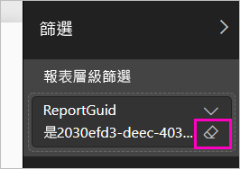

# 監視 Power BI 儀表板和報表的使用計量

如果您建立儀表板和報表，使用計量可協助您了解其影響。 當您執行儀表板使用計量或報表使用計量時，您可以探索那些儀表板和報表在整個組織內的使用方式、使用者及用途。  

使用計量報表是唯讀的。 不過，您可以複製使用計量報表。 複製能建立標準的 Power BI 報表，並可供您編輯。 您也可以根據基礎資料集在 Power BI Desktop 中建置自己的報表，它包含工作區中所有儀表板或所有報表的使用計量。 一開始，複製的報表只會顯示選取儀表板或報表的計量。 您可以移除預設篩選並存取基礎資料集，以及所選取工作區的所有使用計量。 如果您的系統管理員允許的話，您可能還能看見特定使用者的名字。

> [!NOTE]
> 使用計量會追蹤內嵌在 SharePoint Online 的報表使用情況。 不過，使用計量不會追蹤透過「使用者擁有認證」和「應用程式擁有認證」流程所內嵌的儀表板和報表。 使用計量也不會追蹤透過[發佈至 Web](service-publish-to-web.md) 所內嵌的報表使用情況。

## 使用計量為何很重要

了解您內容的使用方法，可協助您展示您的影響力及優先處理方向。 使用計量可能顯示組織的大型部門每天都使用您的某份報表，也可能會顯示您建立的儀表板完全無人檢視。 這種類型的意見反應對指引工作投入方向毫無價值。

您只能在 Power BI 服務中執行使用計量報表。 不過，如果您儲存使用計量報表或將其釘選到儀表板，您可以在行動裝置上開啟該報表並與其互動。

## 必要條件

- 您需要有 Power BI Pro 授權才能執行及存取使用計量資料。 不過，使用計量功能會擷取所有使用者的使用資訊，不論他們所被指派的授權為何。
- 若要存取特定儀表板或報表的使用計量，您必須擁有該儀表板或報表的編輯存取權。
- 您的 Power BI 系統管理員必須已啟用內容建立者的使用計量。 您的 Power BI 系統管理員可能也已啟用在使用計量中收集個別使用者的資料。 請參閱如何[在管理入口網站中啟用這些選項](service-admin-portal.md#control-usage-metrics)。 

## 檢視使用計量報表

1. 在包含儀表板或報表的工作區中啟動。
2. 從工作區內容清單或從儀表板或報表中，選取**使用計量**圖示。

    ![[儀表板] 索引標籤](media/service-usage-metrics/power-bi-run-usage-metrics-report.png)

    ![選取 [使用計量]](media/service-usage-metrics/power-bi-run-usage-metrics-report2.png)
3. 當您第一次執行此作業時，Power BI 會建立使用計量報表，讓您了解它準備好的時機。

    
4. 若要查看結果，請選取 [檢視使用計量]  。

    使用計量將會是您部署及維護 Power BI 儀表板和報表的強大幫手。 想知道報表的哪些頁面最有用，哪些頁面應該逐漸淘汰嗎？ 請依 [報表頁面]  分割來了解。想知道您是否應該為儀表板建立行動配置嗎？ 依 [平台]  分割以發現有多少使用者正在透過行動置應用程式或網頁瀏覽器存取您的內容。

5. (選擇性) 將滑鼠暫留在視覺效果上，然後選取釘選圖示，以將視覺效果新增至儀表板。 或者，從頂端的功能表列選取 [[動態釘選] 頁面]  來將整個頁面新增至儀表板。 從儀表板，您可以更輕鬆地監視使用計量，或與他人共用。

    > [!NOTE]
    > 如果您從使用計量報表將磚釘選到儀表板，便無法將該儀表板新增至應用程式。

### 儀表板使用計量報表

### 報表使用計量報表

## 關於使用計量報表

當您選取 [使用計量]  或是位於儀表板或報表旁邊的圖示  時，Power BI 會產生預先建立的報表，顯示過去 90 天的使用計量內容。  這份報表和您已經熟悉的 Power BI 報表很相似。 您可以根據使用者接收存取的方式進行配量，不論他們是透過 Web 應用程式或行動裝置應用程式等進行存取。隨著您的儀表板和報表的進展，使用計量報表也會進展，每天都會更新資料。  

使用計量報表不會出現在 [最近]  、[工作區]  、[我的最愛]  或其他內容清單中。 它們無法被新增至應用程式。 如果您從使用計量報表將磚釘選到儀表板，便無法將該儀表板新增至應用程式。

若要深入鑽研報表資料，或是針對基礎資料集建置自己的報表，您有兩個選項： 

- 在 Power BI 服務中建立報表複本。 請參閱本文稍後的[儲存使用計量報表的複本](#save-a-copy-of-the-usage-metrics-report)以取得詳細資料。
- 從 Power BI Desktop 連線至資料集。 針對每個工作區，資料集的名稱都是「報表使用計量模型」。 請參閱[對發佈的資料集建立連線](desktop-report-lifecycle-datasets.md#establish-a-power-bi-service-live-connection-to-the-published-dataset)以取得詳細資料。

    

## 報告哪些計量？

| Metric | 儀表板 | 報表 | 描述 |
| --- | --- | --- | --- |
| 散發方法交叉分析篩選器 |是 |是 |使用者存取內容的方式。 有 3 種可能的方法︰使用者可以成為[工作區](consumer/end-user-experience.md)成員、[藉由共用內容](service-share-dashboards.md)，或藉由安裝內容套件/應用程式，以存取儀表板或報表。  請注意，透過應用程式檢視會視為「內容套件」。 |
| 平台交叉分析篩選器 |是 |是 |曾透過 Power BI 服務 (powerbi.com) 或行動裝置存取儀表板或報表嗎？ 行動裝置包括我們所有的 iOS、Android 和 Windows 應用程式。 |
| 報表頁面交叉分析篩選器 |不可以 |是 |如果報表有 1 個以上的頁面，請依檢視的頁面分割報表。 如果您看到 [空白] 清單選項，表示最近新增了報表頁面 (新頁面的實際名稱會在 24 小時內出現在交叉分析篩選器清單中)，及/或已刪除報表頁面。 [空白] 包含這類情況。 |
| 每日檢視 |可以 |是 |每日檢視的總數 - 只要使用者載入報表頁面或儀表板即視為檢視。 |
| 每日的唯一檢視者 |是 |是 |檢視儀表板或報表的「不同」  使用者數目 (根據 AAD 使用者帳戶)。 |
| 每位使用者的檢視 |是 |是 |過去 90 天內的檢視次數，依個別使用者細分。 |
| 每日的共用 |是 |不可以 |儀表板與其他使用者或群組共用的次數。 |
| 檢視總數 |是 |是 |過去 90 天的檢視數目。 |
| 檢視者總數 |是 |是 |過去 90 天的唯一檢視者數目。 |
| 共用總數 |是 |不可以 |儀表板或報表在過去 90 天內的共用次數。 |
| 組織內總數 |是 |是 |整個組織中在過去 90 天內至少檢視過一次的所有儀表板或報表計數。  用以計算排名。 |
| 排名：檢視總數 |是 |是 |組織中所有儀表板或報表的檢視總數超過過去 90 天，決定該儀表板或報表的排名。 |
| 排名：共用總數 |是 |不可以 |超過過去 90 天之組織中所有儀表板的共用總數，決定該儀表板或報表的排名。 |

## 儲存使用計量報表的複本

使用 [另存新檔]  來將使用計量報表轉換為一般的 Power BI 報表，以供您針對特定需求加以自訂。 您也可以使用 Power BI Desktop 來根據基礎資料集建置自訂使用計量報表。 請參閱[對發佈的資料集建立連線](desktop-report-lifecycle-datasets.md#establish-a-power-bi-service-live-connection-to-the-published-dataset)以取得詳細資料。

更棒的是，基礎資料集包含工作區中所有儀表板或報表的使用量詳細資料。 這能開啟更多可能性。 例如，您可以建立能根據使用量來比較工作區中所有儀表板的報表。 您也可以將分散在 Power BI 應用程式中的所有內容使用量彙總，為該應用程式建立使用計量儀表板。  請參閱本文稍後部分來了解如何移除篩選和[查看工作區的所有使用計量](#see-all-workspace-usage-metrics)。

### 建立使用量報表的複本

當您建立唯讀且預先建置之使用量報表的複本時，Power BI 會建立該報表的可編輯複本。 乍看之下，它們是完全相同的。 不過，您現在可以在 [編輯] 檢視中開啟該報表；新增視覺效果、篩選和頁面；修改或刪除現有的視覺效果等。 Power BI 會將新報表儲存在目前的工作區中。

1. 從預先建立的使用計量報表，選取 [檔案] > [另存新檔]  。 Power BI 會建立可編輯的 Power BI 報表，並將它儲存在目前的工作區中。

    
2. 在 [編輯] 檢視中開啟報表，並[同和任何其他 Power BI 報表互動一樣與該報表互動](service-interact-with-a-report-in-editing-view.md)。 例如，新增新的頁面和建置新的視覺效果、新增篩選、格式化字型和色彩等等。

    ![在 [編輯] 檢視中開啟報表](media/service-usage-metrics/power-vi-editing-view.png)
3. 新的報表會儲存在目前工作區中的 [報表]  索引標籤中，而且也會新增至 [最近]  內容清單。

    ![[報表] 索引標籤](media/service-usage-metrics/power-bi-new-report.png)

## 查看「所有」  工作區使用計量

若要查看工作區中所有儀表板或所有報表的計量，您必須移除篩選。 根據預設，系統會篩選報表，僅顯示您用來建立它之儀表板或報表的計量。

1. 選取 [編輯報表]  以在 [編輯] 檢視中開啟新的可編輯報表。

    ![選取 [編輯報表]](media/service-usage-metrics/power-bi-editing-view.png)
2. 在 [篩選] 窗格中，找到 [報表層級篩選]  貯體，然後選取 [ReportGuid]  旁邊的橡皮擦圖示來移除該篩選。

    

    您的報表現在會顯示整個工作區的計量。

## 適用於使用計量的 Power BI 管理控制項

使用計量報表是 Power BI 或 Office 365 系統管理員可以開啟或關閉的功能。 系統管理員可以更精細地控制有哪些使用者可以存取使用計量；它們針對組織中的所有使用者預設為 [開啟]  。

> [!NOTE]
> 只有 Power BI 租用戶的系統管理員可以看見管理入口網站並編輯設定。 

根據預設，會針對使用計量啟用個別使用者資料，而且會將內容取用者帳戶資訊包含在計量報表中。 如果系統管理員不想要針對部分或所有使用者公開此資訊，他們可以針對特定安全性群組或整個組織停用該功能。 帳戶資訊接著會在報表中顯示為「未命名」  。

針對整個組織停用使用計量時，系統管理員可以使用 [刪除所有現有的使用計量內容]  選項，來刪除利用使用計量報表所建置的所有現有報表和儀表板磚。 此選項會移除組織中可能已使用它之所有使用者的使用計量資料之所有存取權。 刪除現有使用計量內容是無法復原的。

請參閱管理入口網站文章中的[控制使用計量](service-admin-portal.md#control-usage-metrics)來取得這些設定的詳細資料。 

## 在國家/地區雲端中的使用計量

Power BI 分別在不同的國家/地區雲端提供。 這些雲端提供和 Power BI 全域版本同等級的安全性、隱私權、合規性和透明度，結合了適用於當地法規獨特模型的服務傳遞、資料存放區、存取和控制。 基於這個針對當地法規而設計的獨特模型，使用計量並無法在國家/地區雲端中使用。 如需詳細資訊，請參閱[國家/地區雲端](https://powerbi.microsoft.com/clouds/)。

## 考量與限制

### 稽核記錄與使用計量之間的差異

請務必了解比較使用計量和稽核記錄時可能產生的差異和其原因。 「稽核記錄」  收集自 Power BI 服務的資料，而「使用計量」  則收集自用戶端。 稽核記錄中的彙總計數不一定會和使用計量相符，原因如下：

* 由於網路連線不一致、廣告封鎖程式或其他可能中斷從用戶端傳送事件的問題，使用計量有時候可能會將活動少算。
* 如本文稍早所述，特定類型的檢視未包含在使用計量中。
* 在用戶端重新整理但並不需將要求傳送回 Power BI 服務的情況下，使用計量可能有時會高估活動數目。

### 其他考量

您至少需要在自己的工作區中，或從該工作區內檢視一次內容。 若未能至少從工作區本身檢視一次內容，資料就不會與使用計量報表中的應用程式檢視相互關聯。 若要解除封鎖對此報告的資料處理，請至少從工作區檢視一次內容。

## 常見問題集

除了使用計量與稽核記錄間的潛在差異之外，下列有關使用計量的問題和回答，可能對使用者和系統管理員有幫助：

**問：**  我無法對某個儀表板或報表執行使用計量。

**答：**  您只能看到您所擁有或有編輯權限之內容的使用計量。

**問：**  使用計量是否會從內嵌的儀表板和報表擷取檢視？

**答：**  使用計量目前不支援擷取內嵌儀表板、報表及[發佈至 Web](service-publish-to-web.md) 流程的使用量。 在這些情況下，我們建議使用現有的 Web 分析平台來追蹤主控應用程式或入口網站的使用方式。

**問：**  我完全無法對任何內容執行使用計量。

**答 1：**  系統管理員可為其組織關閉此功能。  請連絡您的系統管理員以查看是否為這種情形。

**答 2：**  使用計量是 Power BI Pro 功能。

**問：**  資料似乎不是最新的。 例如，散發方法未顯示、報表頁面遺失等等。

**答：**  資料最多可能需要 24 小時才會更新。

**問：**  工作區中有四個報表，但使用計量報表只顯示三個。

**答：**  使用計量報表只包含過去 90 天內存取過的報表 (或儀表板)。  如果有報表 (或儀表板) 未顯示，它未被使用的時間可能已經超過 90 天。

## 後續步驟

[在系統管理入口網站中管理 Power BI](service-admin-portal.md)

有其他問題嗎？ [試試 Power BI 社群](https://community.powerbi.com/)
