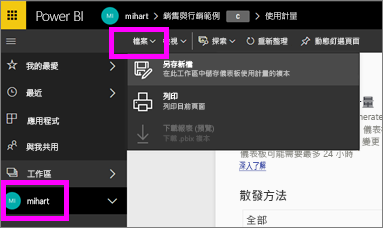
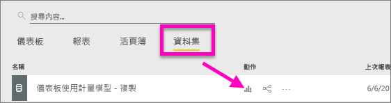
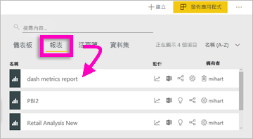
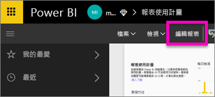
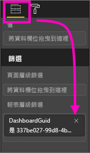
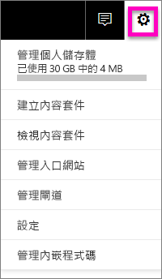
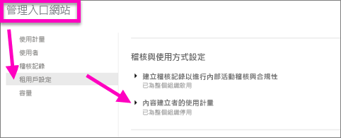
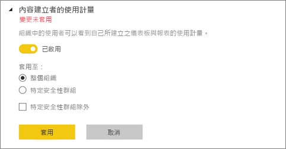

# 儀表板和報表的使用計量
如果您建立儀表板和報表，使用計量可協助您了解其影響。 當您執行儀表板使用計量或報表使用計量時，您可以探索這些儀表板和報表在整個組織內的使用方式、使用內容、使用者及用途。  

> [!NOTE]
> 使用計量會追蹤內嵌在 SharePoint Online 的報表使用情況。 它們也會透過「使用者擁有認證」和「應用程式擁有認證」兩個工作流程來追蹤儀表板和報表的內嵌。 使用計量不會追蹤透過[發行至 Web](service-publish-to-web.md) 內嵌的報表使用情況。

這些使用計量報表是唯讀的。 不過，您可以使用 [另存新檔] 來個人化使用計量報表。 這會建立全新的資料集，並將唯讀報表轉換成可供編輯的全功能 Power BI 報表。 個人化報表可以包含所選儀表板或報表的計量，此外藉由移除預設篩選，您現在可以存取所選工作區中所有儀表板的使用計量。

## 使用計量為何對我至關重要？
了解您內容的使用方法，可協助您展示您的影響力及優先處理方向。 使用計量可能顯示組織的大型部門每天都使用您的某份報表，也可能會顯示您建立的儀表板完全無人檢視。 這種類型的意見反應對指引工作投入方向毫無價值。

您只能在 Power BI 服務中執行使用計量報表。  不過，如果您儲存使用計量報表或將其釘選到儀表板，您將能夠在行動裝置上開啟該報表並與其互動。

### 先決條件
- 使用計量功能會擷取所有使用者 (包括免費和 Pro) 的使用量資訊。 不過，需要有 Pro 授權才能執行及存取使用計量資料。
- 提供所選工作區中儀表板或報表的使用計量。 若要存取特定儀表板或報表的使用計量，您必須：    
    • 具有該儀表板或報表的編輯權限   
    • 具有 Pro 授權

## 關於使用計量報表

當您選取 [使用計量] 或圖示  時，Power BI 會產生預先建立的報表，顯示過去 90 天的使用計量內容。  報表看起來類似您熟悉的 Power BI 報表，但它的設計為參考性而非互動性。 不論終端使用者是透過 Web 應用程式或行動裝置應用程式等進行存取，您將能夠依據其收到存取權的方式進行分割。隨著您的儀表板和報表的進展，使用計量報表也會進展，每天都會更新資料。  

使用計量報表不會出現在 [最近]、[工作區]、[我的最愛] 或其他內容清單中。 這些報表無法新增至應用程式。 如果您將使用計量報表中的磚釘選到儀表板，該儀表板即無法新增至應用程式或內容套件。

若要挖掘更深入的報表資料，或根據資料集建立您自己的報表，請使用 [另存新檔] (請參閱[將使用計量報表儲存為全功能的 Power BI 報表](#save-the-usage-metrics-report-as-a-full-featured-power-bi-report))。

## 開啟儀表板或報表的使用計量報表
1. 在包含儀表板或報表的工作區中啟動。
2. 從工作區內容清單或從儀表板或報表中，選取使用計量圖示。
   
    
   
    
3. 當您第一次執行此作業時，Power BI 會建立使用計量報表，讓您了解它準備好的時機。
   
        
4. 若要開啟結果，請選取 [檢視使用計量]。
   
    使用計量將會是您部署及維護 Power BI 儀表板和報表的強大幫手。 想知道報表的哪些頁面最有用，哪些頁面應該逐漸淘汰嗎？ 請依 [報表頁面] 分割來了解。想知道您是否應該為儀表板建立行動配置嗎？ 依 [平台] 分割以發現有多少使用者正在透過行動置應用程式或網頁瀏覽器存取您的內容。

5. (選擇性) 將滑鼠暫留在視覺效果上，然後選取釘選圖示，以將視覺效果新增至儀表板。 或者，從頂端的功能表列選取 [動態釘選頁面] 將整個頁面新增至儀表板。 從儀表板，您可以更輕鬆地監視使用計量，或與他人共用。
   
   > **注意**：如果您將使用計量報表中的磚釘選到儀表板，該儀表板即無法新增至應用程式或內容套件。
   > 
   > 

  

## 報告哪些計量？
| 計量 | 儀表板 | 報表 | 描述 |
| --- | --- | --- | --- |
| 散發方法交叉分析篩選器 |可以 |可以 |使用者存取內容的方式。 有 3 種可能的方法︰使用者可以成為[應用程式工作區](service-the-new-power-bi-experience.md)的成員、讓內容[與他們共用](service-share-dashboards.md)，或安裝內容套件/應用程式，來存取儀表板或報表。  請注意，透過應用程式檢視會視為「內容套件」。 |
| 平台交叉分析篩選器 |可以 |可以 |曾透過 Power BI 服務 (powerbi.com) 或行動裝置存取儀表板或報表嗎？ 行動裝置包括我們所有的 iOS、Android 和 Windows 應用程式。 |
| 報表頁面交叉分析篩選器 |不可以 |可以 |如果報表有 1 個以上的頁面，請依檢視的頁面分割報表。 如果您看到 [空白] 清單選項，表示最近新增了報表頁面 (新頁面的實際名稱會在 24 小時內出現在交叉分析篩選器清單中)，及/或已刪除報表頁面。 [空白] 包含這類情況。 |
| 每日檢視 |可以 |可以 |每日檢視的總數 - 只要使用者載入報表頁面或儀表板即視為檢視。 |
| 每日的唯一檢視者 |可以 |可以 |檢視儀表板或報表的「不同」使用者數目 (根據 AAD 使用者帳戶)。 |
| 每位使用者的檢視 |可以 |可以 |過去 90 天內的檢視次數，依個別使用者細分。 |
| 每日的共用 |可以 |不可以 |儀表板與其他使用者或群組共用的次數。 |
| 檢視總數 |可以 |可以 |過去 90 天的檢視數目。 |
| 檢視者總數 |可以 |可以 |過去 90 天的唯一檢視者數目。 |
| 共用總數 |可以 |不可以 |儀表板或報表在過去 90 天內的共用次數。 |
| 組織內總數 |可以 |是 |整個組織中在過去 90 天內至少檢視過一次的所有儀表板或報表計數。  用以計算排名。 |
| 排名：檢視總數 |可以 |可以 |組織中所有儀表板或報表的檢視總數超過過去 90 天，決定該儀表板或報表的排名。 |
| 排名：共用總數 |可以 |不可以 |超過過去 90 天之組織中所有儀表板的共用總數，決定該儀表板或報表的排名。 |

### 儀表板使用計量報表

### 報表使用計量報表

## 將使用計量報表儲存為全功能的 Power BI 報表 (個人化)

使用 [另存新檔] 將使用計量報表轉換成可以自訂和共用的全功能 Power BI 報表。 一旦您建立個人化複本，您將取得基礎資料集的完整存取權，如此可讓您自訂使用計量報表，以符合您的特定需求。 您甚至可以使用 Power BI Desktop，透過[即時連線到 Power BI 服務功能](https://powerbi.microsoft.com/blog/connecting-to-datasets-in-the-power-bi-service-from-desktop)，來建立自訂使用計量報表。

更棒的是，基礎資料集包含工作區中所有儀表板或報表的使用量詳細資料。 這會開啟更多可能性。 例如，您可以建立根據使用量來比較工作區中所有儀表板的報表。 您也可以將分散在 Power BI 應用程式中的所有內容使用量進行彙總，為該應用程式建立使用計量儀表板。  請參閱下面的[移除頁面層級篩選](#remove-the-filter-to-see-all-the-usage-metrics-data-in-the-workspace)。

### 使用 [另存新檔] 時，會建立什麼項目？
當 Power BI 建立全功能報表時，也會建立**由目前工作區所包含之過去 90 天內存取之所有儀表板或所有報表組成的**新資料集。 例如，假設您具有名為「銷售量」的工作區，其中包含三個儀表板和兩個報表，而且您建立了「東北」儀表板的使用計量報表。 然後您使用 [另存新檔] 將其個人化並轉換成全功能報表。 新報表的資料集不僅包含「名為「東北」之儀表板」的使用計量，也包含「銷售量」工作區中所有三個儀表板的使用計量。 根據預設，此報表會顯示「東北」儀表板的資料，您需要[移除篩選](#remove-the-filter-to-see-all-the-usage-metrics-data-in-the-workspace) (按一下) 才能顯示所有三個儀表板的資料。

### 使用 [另存新檔] 建立使用量報表的複本
當您使用 [另存新檔]\(個人化) 建立複本時，Power BI 會將預先建立的唯讀報表轉換成全功能報表。  乍看之下完全相同。 不過，您現在可以在 [編輯檢視] 中開啟報表；新增視覺效果、篩選和頁面；修改或刪除現有的視覺效果；以及執行其他更多工作。 Power BI 會將全新的報表和資料集儲存在目前的工作區中。 在下列範例中，目前的工作區是 **mihart**。

1. 從預先建立的使用計量報表，選取 [檔案] > [另存新檔]。 Power BI 將使用計量報表轉換為全功能的 Power BI 報表。 這稱為「個人化」使用計量報表。 個人化的使用報表和資料集儲存在目前的工作區 (名為 **mihart*)。
   
    
2. 在 [編輯] 檢視中開啟報表，並[同和任何其他 Power BI 報表互動一樣與該報表互動](service-interact-with-a-report-in-editing-view.md)。 例如，新增新的頁面和建置新的視覺效果、新增篩選、格式化字型和色彩等等。
   
    
3. 或者，從新的資料集開始，並從頭開始建立報表。
   
    
4. 新的報表儲存在目前的工作區 (mihart)，而且也會新增至 [最近] 內容清單。
   
    

### 移除篩選以查看工作區中的「所有」使用計量資料
若要查看工作區中所有儀表板或所有報表的計量，您必須移除篩選。 根據預設，個人化報表會經過篩選，只顯示儀表板或用來建立該儀表板之報表的計量。

例如，您可以使用名為「歐洲銷售量」的儀表板來建立這個新的個人化報表，只顯示「歐洲銷售量」儀表板的使用量資料。 若要移除篩選，並啟用該工作區中所有儀表板的資料：

1. 在 [編輯檢視] 中開啟個人化報表。
   
    
2. 在 [篩選] 窗格中，找到 [報表層級篩選] 貯體，然後選取 [x] 以移除篩選。
   
    
   
    您的個人化報表現在會顯示整個工作區的計量。

## 使用計量的管理控制項 (適用於 Power BI 系統管理員)
使用計量報表是 Power BI 或 Office 365 系統管理員可以開啟或關閉的功能。 系統管理員可以更精細地控制哪些使用者可以存取使用計量；針對組織中的所有使用者，它們預設為「開啟」。

1. 選取 Power BI 服務右上角的齒輪圖示，然後選擇 [管理入口網站]，開啟管理入口網站。
   
    
2. 從管理入口網站中，選取 [租用戶設定] 並選擇 [內容創作者的使用計量]。
   
    
3. 啟用 (或停用) 使用計量，然後選取 [套用]。
   
    

停用其整個組織的使用計量時，系統管理員可以使用 [刪除所有現有的使用計量內容] 選項，刪除利用使用計量報表和資料集所建置的所有現有報表和儀表板磚。 此選項會移除組織中可能已使用它之所有使用者的使用計量資料之所有存取權。 請小心，因為刪除現有使用計量內容是無法復原的。

## 考量與限制
問︰我無法對儀表板或報表執行使用計量    
答︰您只能看到您擁有或有編輯權限的使用計量內容。

問：使用計量會從內嵌的儀表板和報表擷取檢視嗎？     
答：使用計量目前不支援擷取內嵌儀表板和報表的使用量，包括[使用者擁有資料](developer/integrate-report.md)流程、[應用程式擁有資料](developer/embed-sample-for-customers.md)流程和[發佈至 Web](service-publish-to-web.md) 流程。 在這些情況下，我們建議使用現有的 Web 分析平台來追蹤主控應用程式或入口網站的使用方式。

問︰我完全無法對任何內容執行使用計量。    
答 1︰系統管理員可以關閉組織的此項功能。  請連絡您的系統管理員，查看是否為這種情形。    
答 2︰使用計量是 Power BI Pro 的功能。

問︰資料好像不是最新的。 例如，散發方法未顯示、報表頁面遺失等等。   
答︰資料更新最多需要 24 小時。

問：工作區中有四個報表，但使用計量報表只顯示三個。    
答：使用計量報告只包含過去 90 天內存取的報表 (或儀表板)。  如果有報表 (或儀表板) 未顯示，可能已使用超過 90 天。

## 後續步驟
[將儀表板設為最愛](service-dashboard-favorite.md)

有其他問題嗎？ [試試 Power BI 社群](http://community.powerbi.com/)

