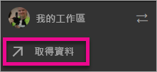
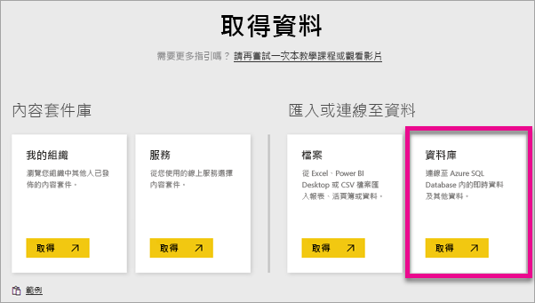
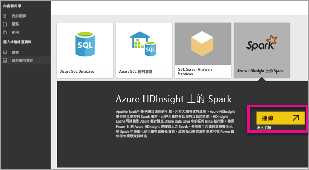
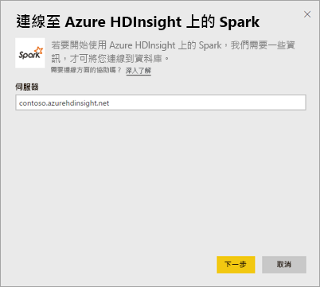
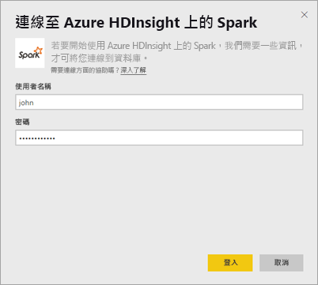
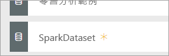
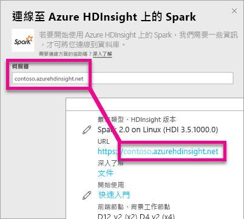
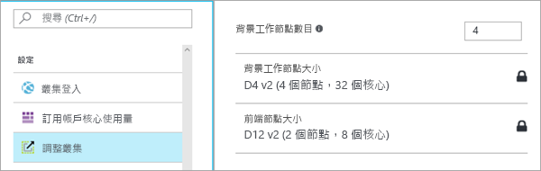

# 具有 DirectQuery 之 HDInsight 上的 Spark

具有 DirectQuery 之 Azure HDInsight 上的 Spark，可讓您根據 Spark 叢集中已有的資料和度量建立動態報表。 藉由 DirectQuery，當您瀏覽報表檢視中的資料時，會將查詢傳送回您的 Azure HDInsight Spark 叢集。 這種做法推薦給熟悉所連接實體的使用者。

> [!WARNING]
> 建置於 Spark 式資料集的儀表板磚已停用自動的磚重新整理。 您可以選取 [重新整理儀表板磚] 手動重新整理。 報表不會受到影響，應保持最新狀態。 

您可以使用下列步驟，用 Power BI 服務內的 DirectQuery 連線到 Azure HDInsight 上的 Spark 資料來源。

> [!Important]
> 我們已改善與 Spark 的連線。  若要獲得連線至 Spark 資料來源的最佳體驗，請使用 Power BI Desktop。  在您建置模型和報表之後，即可將它發佈至 Power BI 服務。  現在已取代 Power BI 服務中 Spark 的直接連接器。

1. 選取左側瀏覽窗格底部的 [取得資料]  。

     
2. 選取 **Databases & More** (資料庫及更多).

     
3. 選取 [HDInsight 上的 Spark]  連接器，然後選擇 [連接] 。

     
4. 輸入您想要連接的 [伺服器]  名稱，以及 [使用者名稱]  和 [密碼] 。 伺服器的格式一律為 \<叢集名稱\>.azurehdinsight.net，請參閱下方有關尋找這些值的詳細資料。

     

     
5. 連線之後，您就會看到名稱為 "SparkDataset" 的新資料集。 您也可以透過建立的預留位置磚來存取資料集。

     
6. 向下鑽研資料集，您就可以瀏覽資料庫中的所有資料表和資料行。 選取資料行會將查詢傳送到來源，同時動態建立視覺效果。 這些視覺效果可儲存在新的報表，並釘選回您的儀表板。

## 尋找 HDInsight 上的 Spark 參數

伺服器的格式一律為 \<叢集名稱\>.azurehdinsight.net，而且可以在 Azure 入口網站中找到。

您在 Azure 入口網站中也可以找到使用者名稱和密碼。

## 限制

隨著我們持續改善這些體驗，這些限制和備註可能會變更。 其他文件位於[在 Azure HDInsight 上搭配使用 BI 工具和 Apache Spark](/azure/hdinsight/spark/apache-spark-use-bi-tools/)

* Power BI 服務僅支援設定 Spark 2.0 及 HDInsight 3.5。
* 每個動作 (例如選取資料行或加入篩選) 都會將查詢傳回資料集，所以在選取非常大的欄位前，請先考慮選擇適當的視覺效果類型。
* 問與答不能用於 DirectQuery 資料集。
* 不會自動挑選結構描述變更。
* Power BI 在資料集內的**所有資料表**支援 16,000 個資料行。 Power BI 也包含每資料表資料行的內部資料列數目。 這表示，如果您的資料集內有 100 個資料表，可用的資料行數目就是 15,900。 依據您從 Spark 資料來源中使用的資料量，您可能會遇到這些限制。

## 疑難排解

如果您對叢集執行查詢時遇到問題，請確認應用程式仍在執行中，並視需要重新啟動。

您也可以在 [設定] > [調整叢集] 下，於 Azure 入口網站內配置其他資源：

## 後續步驟

[開始使用：在 HDInsight Linux 上建立 Apache Spark 叢集並使用 Spark SQL 執行互動式查詢](/azure/hdinsight/spark/apache-spark-jupyter-spark-sql/)  
[Power BI 是什麼？](power-bi-overview.md)  
[取得 Power BI 的資料](service-get-data.md)
[在內部閘道上使用 Kerberos 進行 SSO](service-gateway-sso-kerberos.md)

有其他問題嗎？ [試試 Power BI 社群](http://community.powerbi.com/)