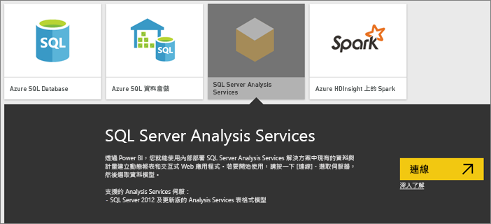

# Power BI 中的 SQL Server Analysis Services 即時資料
Power BI 有兩種方式可以連接到即時 SQL Server Analysis Services 伺服器。 您可以在 [取得資料] 中連接至 SQL Server Analysis Services 伺服器，或者連接到 [Power BI Desktop 檔案](service-desktop-files.md)或 [Excel 活頁簿](service-excel-workbook-files.md) (該活頁簿已連接至 Analysis Services 伺服器)。 作為最佳做法，Microsoft 強烈建議使用 Power BI Desktop，因為該工具組豐富，並且可以在本機維護 Power BI Desktop 檔案的備份複本。

 >[!IMPORTANT]
 >* 若要連線到即時 Analysis Services 伺服器，必須由系統管理員安裝及設定內部部署資料閘道。 如需詳細資訊，請參閱[內部部署資料閘道](service-gateway-onprem.md)。
 >* 使用閘道時，您的資料會保持內部部署。  根據此資料建立的報表會儲存在 Power BI 服務中。 
 >* Analysis Services 即時連接的[自然語言查詢問與答](consumer/end-user-q-and-a-direct-query.md)目前僅為預覽版。

## 從 [取得資料] 連接到模型
1. 在 [我的工作區] 中，選取 [取得資料]。 您也可以變更為群組工作區 (如果有的話)。
   
   
2. 選取 **Databases & More** (資料庫及更多).
   
   
3. 按一下 [SQL Server Analysis Services] >  [連接]。 
   
   
4. 選取伺服器。 如果您看不到此處列有任何伺服器，則表示未設定閘道和資料來源，或是您的帳戶未列於閘道中之資料來源的 [使用者] 索引標籤中。 請洽詢系統管理員。
5. 選取您要連接的模型。 可以是表格式或多維度。

連接到模型之後，它會顯示在 Power BI 站台的 [我的工作區/資料集] 。 如果您切換到群組工作區，則會在該群組內出現資料集。

## 儀表板圖格
報表的視覺效果如果釘選到儀表板，釘選的磚會每 10 分鐘自動重新整理一次。 如果更新內部部署 Analysis Services 伺服器中的資料，磚會在 10 分鐘後自動更新。

## 常見問題

* 無法載入模型結構描述的錯誤 - 此錯誤會在連線到 SSAS 的使用者無權存取 SSAS 資料庫、Cube 及模型時發生。

## 後續步驟
[內部部署資料閘道](service-gateway-onprem.md)  
[管理 Analysis Services 資料來源](service-gateway-enterprise-manage-ssas.md)  
[為內部部署資料閘道進行疑難排解](service-gateway-onprem-tshoot.md)  
有其他問題嗎？ [試試 Power BI 社群](http://community.powerbi.com/)