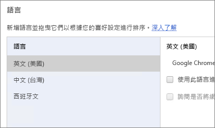
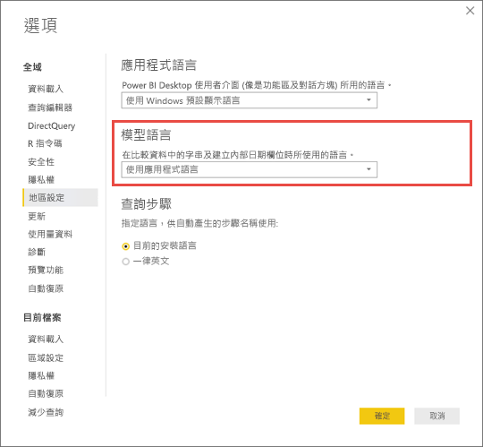

# Power BI 支援的語言和國家 (地區)

本文提供 Power BI 服務、Power BI Desktop 和 Power BI 文件的支援語言和國家/地區清單。

## 可使用 Power BI 的國家與地區
如需可使用 Power BI 的國家與地區清單，請參閱[國際供應清單](https://products.office.com/business/international-availability)。 

## Power BI 服務的語言
(瀏覽器的) Power BI 服務有下列 42 種語言版本：

* 阿拉伯文
* 巴斯克文 - Basque
* 保加利亞文 - Български
* 卡達隆尼亞 - català
* 簡體中文 - 简体中文
* 繁體中文 - 繁體中文
* 克羅埃西亞文 - hrvatski
* 捷克文 - čeština
* 丹麥文 - dansk
* 荷蘭文 - Nederlands
* 英文 - English
* 愛沙尼亞文 - eesti
* 芬蘭文 - suomi
* 法文 - français
* 加里斯亞文 - galego
* 德文 - Deutsch
* 希臘文 - Ελληνικά
* 希伯來文
* 印度文 - हिंदी
* 匈牙利文 - magyar
* 印尼文 - Bahasa Indonesia
* 義大利文 - italiano
* 日文 - 日本語
* 哈薩克文 - Қазақ
* 韓文 - 한국어
* 拉脫維亞文 - latviešu
* 立陶宛文 - lietuvių
* 馬來文 - Bahasa Melayu
* 挪威文 (巴克摩) - norsk (bokmål)
* 波蘭文 - Polski
* 葡萄牙文 (巴西) - Português
* 葡萄牙文 (葡萄牙) - português
* 羅馬尼亞文 - română
* 俄文 - Русский
* 塞爾維亞文 (斯拉夫) - српски
* 塞爾維亞文 (拉丁) - srpski
* 斯洛伐克文 - slovenčina
* 斯洛維尼亞文 - slovenski
* 西班牙文 - español
* 瑞典文 - svenska
* 泰文 - ไทย
* 土耳其文 - Türkçe
* 烏克蘭文 - українська
* 越南文 - Tiếng Việt

### 翻譯的項目
功能表、按鈕、訊息和體驗的其他項目會翻譯成您的語言，讓您能更容易瀏覽並與 Power BI 互動。

某些功能目前僅提供英文版本：

* Power BI 在您連接到 Microsoft Dynamics CRM、Google Analytics、Salesforce 等服務時，所為您建立的儀表板和報表。 (您仍然可以用自己的語言建立儀表板和報表。)
* 使用問答集瀏覽您的資料。

我們正致力於將額外功能帶入其他語言，敬請期待。 

### 選擇 Power BI 服務的語言
1. 在 Power BI 服務中，選取**設定**圖示 > [設定]。
2. 在 **一般** 索引標籤 > **語言**。
3. 選取您的語言 > **套用**。

### 選擇瀏覽器的語言
Power BI 會根據您電腦上的語言喜好設定偵測您的語言。 存取及變更這些喜好設定的方式可能會根據您的作業系統和瀏覽器而有所不同。 以下是從 Internet Explorer 和 Google Chrome 存取這些喜好設定的方式。

#### Internet Explorer (11 版)
1. 按一下瀏覽器視窗右上角的 [工具] 按鈕：
   
   ![Internet Explorer [工具] 按鈕](media/supported-languages-countries-regions/languages1.png)
2. 按一下 [網際網路選項] 。
3. 在 [網際網路選項] 對話方塊，[一般] 索引標籤的 [外觀] 下，按一下 [語言]  按鈕。

#### Google Chrome (42 版)
1. 按一下瀏覽器視窗右上角的 [功能表] 按鈕：
   
   
2. 按一下 [設定] 。
3. 按一下 [顯示進階設定] 。
4. 在 [語言] 下按一下 [語言和輸入設定]  按鈕。
5. 按一下 **新增**，選取語言，然後按一下 **確定**。
   
   
   
   新的語言位在此清單結尾處。 
6. 請將新的語言拖放到此清單頂端，然後按一下 **Display Google Chrome in this language** (以這個語言顯示 Google Chrome)。
   
   
   
   您可能需要關閉瀏覽器再重新開啟，才能看到變更。

## 選擇 Power BI Desktop 的語言或地區設定
有兩種方式可以取得 Power BI Desktop：下載或從 Windows 市集安裝。

* 當您[從 Windows 市集安裝 Power BI Desktop](#choose-a-language-for-power-bi-desktop-installed-from-the-windows-store) 時，它會安裝所有語言，並顯示與 Windows 預設語言對應的語言。
* [下載 Power BI Desktop](#choose-a-language-when-you-download-power-bi-desktop) 時，則是在下載時選擇語言。 
* 您也可以針對特定報表，[在匯入資料時選擇要使用的地區設定](#choose-the-locale-to-be-used-when-importing-data-into-power-bi-desktop)。 

### 選擇從 Windows 市集安裝的 Power BI desktop 語言
1. 從 Windows 市集[安裝 Power BI Desktop](http://aka.ms/pbidesktopstore)。
2. 若要變更語言，請在您的電腦上搜尋 **Windows 設定**。 
3. 選取 [時間與語言]。
   
     ![Windows [設定] 對話方塊](media/supported-languages-countries-regions/power-bi-service-windows-settings.png)
4. 選取 [地區與語言]、選取語言，然後選取 [設為預設值]。
   
     ![Windows [語言設定] 對話方塊](media/supported-languages-countries-regions/power-bi-service-language-settings.png)
   
     下次啟動 Power BI Desktop 時，它會使用您設為預設值的語言。 

### 下載 Power BI Desktop 時選擇語言
您選擇的 Power BI Desktop 語言會影響報表數字和日期的顯示格式。 

* [下載 Power BI Desktop](https://powerbi.microsoft.com/desktop) 時選取語言。 

若要變更 Power BI Desktop 的語言，請回到下載頁面，下載其他的語言版本。

### 選擇用於將資料匯入 Power BI Desktop 的地區設定
無論是下載 Power BI Desktop 或從 Windows 市集安裝，您都可以針對特定報表選擇所用版本地區設定以外的其他地區設定。 這會變更從資料來源匯入資料時解譯資料的方式，例如 "3/4/2017" 是解譯為 4 月 3 日還是 3 月 4 日。 

1. 在 Power BI Desktop 中，移至 [檔案] > [選項及設定] > [選項]。
2. 在 [目前檔案] 底下，選取 [地區設定]。
3. 在 [地區設定] 方塊中，選取其他地區設定。 
   
   ![Power BI Desktop [選項] 對話方塊](media/supported-languages-countries-regions/pbi_supptdlangs_locale.png)
4. 選取 [確定] 。

### 在 Power BI Desktop 中選擇模型語言

除了設定 Power BI Desktop 應用程式的語言，您也可以設定模型語言。 模型語言主要影響兩件事：

- 如何比較及排序字串。 例如，因為土耳其文有兩個字母 i (取決於您的資料庫定序)，兩者在排序時會產生不同的順序。 
- Power BI Desktop 從日期欄位建立隱藏的日期資料表時所使用的語言。 例如，欄位名稱為 Month/Monat/Mois 等等。

以下說明如何設定模型語言。

1. 在 Power BI Desktop 中，移至 [檔案] > [選項及設定] > [選項]。
2. 在 [全球] 底下，選取 [地區設定]。
3. 在 [模型語言] 方塊中，選取不同的語言。 

    

## 說明文件的語言
說明已當地語系化為這 10 種語言︰ 

* 簡體中文 - 简体中文
* 繁體中文 - 繁體中文
* 法文 - français
* 德文 - Deutsch
* 義大利文 - italiano
* 日文 - 日本語
* 韓文 - 한국어
* 葡萄牙文 (巴西) - Português
* 俄文 - Русский
* 西班牙文 - español

## 後續步驟
* 您在使用其中一個 Power BI 行動裝置應用程式嗎？ 如需詳細資料，請參閱 [Power BI 行動裝置應用程式中支援的語言](mobile-apps-supported-languages.md)。
* 有問題嗎？ 請嘗試詢問 [Power BI 社群](http://community.powerbi.com/)。
* 仍有問題嗎？ 請前往 [Power BI 支援頁面](https://powerbi.microsoft.com/support/)。

