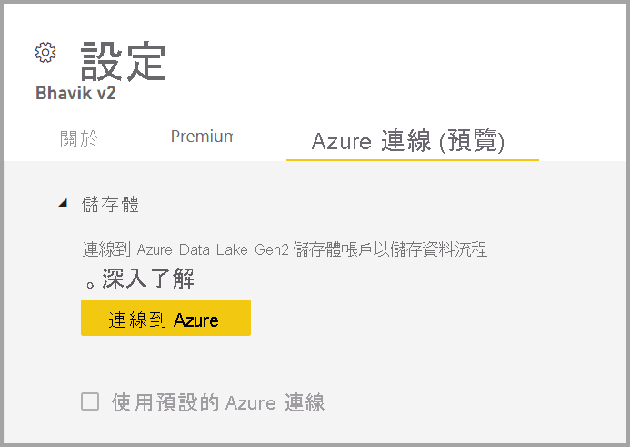
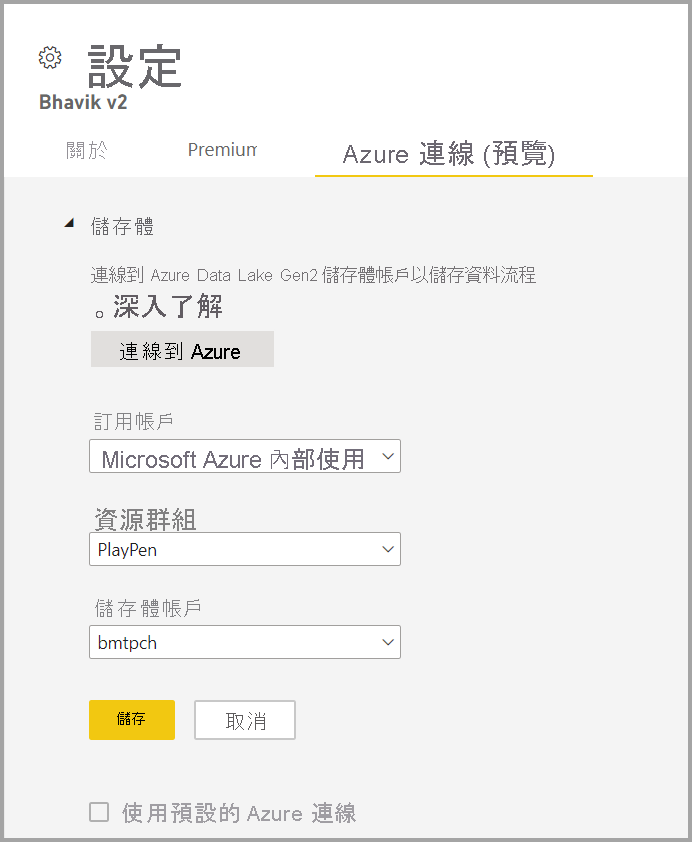

# 將資料流程儲存體設定為使用 Azure Data Lake Gen 2 

根據預設，搭配 Power BI 使用的資料儲存在 Power BI 提供的內部儲存體中。 透過整合資料流程與 Azure Data Lake Storage Gen2 (ADLS Gen2)，您可在組織的 Azure Data Lake Storage Gen2 帳戶中儲存資料流程。

有兩種方式可設定要使用的 ADLS Gen2 存放區：您可使用指派了租用戶的 ADLS Gen 2 帳戶，或在工作區層級帶入自己的 ADLS Gen 2 存放區。 

## 必要條件

若要帶入自己的 ADLS Gen 2 帳戶，則必須在儲存體帳戶、資源群組或訂用帳戶層具備擁有者權限。 若您是系統管理員，則仍然必須為自己指派擁有者權限。 

此外，ADLS Gen 2 帳戶必須部署在與 Power BI 租用戶相同的區域中。 若資源的位置所在區域不同，則會發生錯誤。

最後，您可從管理入口網站連線到任何 ADLS Gen 2，但如果您直接連線到工作區，則必須先確保工作區中沒有任何資料流程，才能進行連線。

## 在工作區連線到 Azure Data Lake Gen 2
巡覽到沒有資料流程的工作區。 選取 [工作區設定] 至稱為 [Azure 連線] 的新索引標籤。 選取 [Azure 連線] 索引標籤，然後選取 [儲存體] 區段。

 
若租用戶已設定 ADLS Gen 2，即會出現 [使用預設 Azure 連線] 選項。 您有兩個選項：選取稱為 [使用預設 Azure 連線] 的方塊來使用設定了 ADLS Gen 2 的租用戶，或選取 [連線到 Azure] 來指向新的 Azure 儲存體帳戶。 

當選取 [連線到 Azure] 時，Power BI 即會擷取您具備存取權的 Azure 訂用帳戶清單。 填入下拉式清單，並選取有效的 Azure 訂用帳戶、資源群組，以及啟用了階層式命名空間選項的儲存體帳戶 (即 ADLS Gen2 旗標)。

 
選取之後，請選取 [儲存]，您現在即已成功將工作區附加到 ADLS Gen2 帳戶。 Power BI 會自動使用必要權限來設定儲存體帳戶，並設定將寫入資料的 Power BI 檔案系統。 此時，此工作區內每個資料流程的資料都將會直接寫入此檔案系統，並可搭配其他 Azure 使用，為您所有的組織或部門資料建立單一來源。

## 從工作區或租用戶中斷連結 Azure Data Lake Gen 2

若要在工作區層級移除連線，您必須先確保工作區中的所有資料流程皆已刪除。 移除所有資料流程後，請選取工作區設定中的 [中斷連線]。 這同樣適用於租用戶，但您必須先確保所有工作區也都已經從租用戶的儲存體帳戶中斷連線，才能在租用戶層級中斷連線。

## 停用 Azure Data Lake Gen 2

在**管理入口網站**中的 [資料流程] 下方，您可停用使用者存取此功能，也可以不允許工作區系統管理員帶入自己的 Azure 儲存體。

## 後續步驟
下列文章提供資料流程和 Power BI 的詳細資訊：

* [資料流程和自助資料準備簡介](dataflows-introduction-self-service.md)
* [建立資料流程](dataflows-create.md)
* [設定及取用資料流程](dataflows-configure-consume.md)
* [資料流程的進階功能](dataflows-premium-features.md)
* [使用資料流程的 AI](dataflows-machine-learning-integration.md)
* [資料流程限制與考量](dataflows-features-limitations.md)