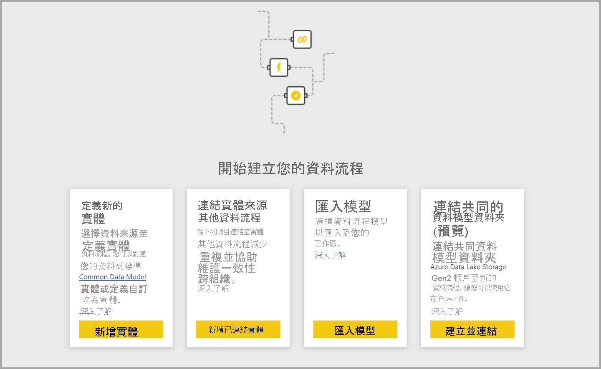
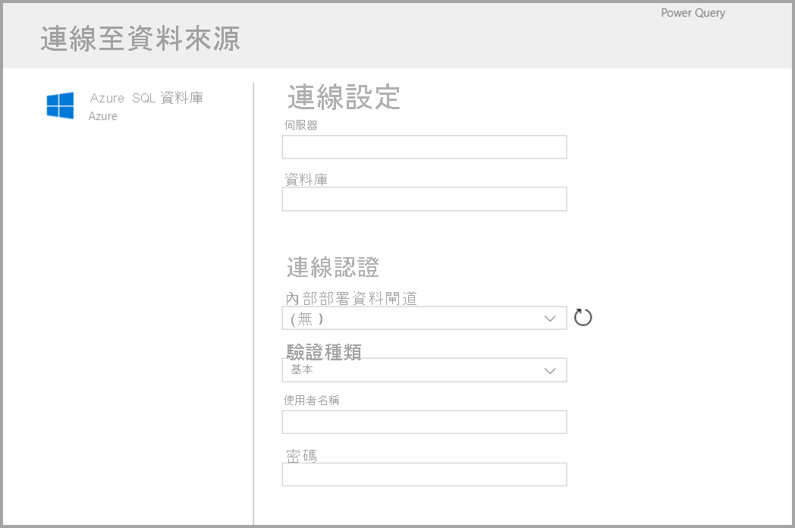
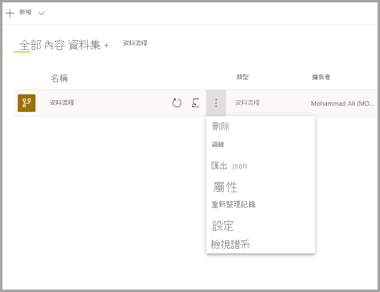

# 建立資料流程
**資料流程**是在 Power BI 服務中工作區內建立及管理的「實體」(類似於資料表的實體) 集合。 **實體/資料表**是一組用來儲存資料的欄位，類似於資料庫中的資料表。 您可直接從建立資料流程所在的工作區，在資料流程中新增及編輯實體/資料表，以及管理資料重新整理排程。

若要建立資料流程，請在瀏覽器中啟動 Power BI 服務，然後從左側導覽窗格選取一個**工作區** (Power BI 服務的 *my-workspace* 中無法使用資料流程)，如下列畫面所示。 您也可以建立新的工作區，以在其中建立新的資料流程。

有多種方式可供建立或在新的資料流程上進行建置：

* [使用定義新實體來建立資料流程](#create-a-dataflow-using-define-new-entities)
* [使用連結的實體來建立資料流程](#create-a-dataflow-using-linked-entities)
* [使用計算實體來建立資料流程](#create-a-dataflow-using-a-computed-entity)
* [使用匯入/匯出來建立資料流程](#create-a-dataflow-using-importexport)

下列各節會詳細探索每一種建立資料流程的方式。

## 使用定義新實體來建立資料流程

使用 [建立新實體] 選項可供定義新的實體/資料表，並連線到新的資料來源。

選取資料來源時，系統會提示您提供連線設定，包括用來連線至資料來源的帳戶，如下圖所示。

連線之後，您可以選取要用於實體的資料。 當選擇資料和來源時，Power BI 會重新連線到資料來源，並以您在稍後設定程序中選取的頻率，持續重新整理資料程序中的資料。

一旦選取要在實體中使用的資料，您就可以使用資料流程編輯器，將資料塑形或轉換成您的資料流程所需的使用格式。 

## 使用連結的實體來建立資料流程

使用連結的實體建立資料流程，可讓您以唯讀方式參考另一個資料流程中定義的現有實體。 下列清單描述您可能會選擇此方法的一些原因：

* 若要跨多個資料流程重複使用實體 (例如日期實體或靜態查閱資料表)，則建議建立實體一次，然後在其他資料流程中參考該實體。

* 您要避免建立多個資料來源的重新整理，則建議使用連結的實體來儲存資料並作為快取。 這麼做會允許每個後續取用者利用該實體以減少基礎資料來源的負載。

* 您需要執行兩個實體間的合併。

> [!NOTE]
> 連結的實體僅適用於 Power BI Premium。

## 使用計算實體建立資料流程

使用計算實體建立資料流程可讓您參考連結的實體，並透過唯寫方式在連結的實體上執行作業。 結果是新的實體，其為資料流程的一部分。 若要將連結的實體轉換成計算實體，則可從合併作業建立新的查詢，或若要編輯或轉換實體，請建立參考或複製實體。

### 如何建立計算實體

一旦您具有含實體清單的資料流程之後，就可在那些實體上執行計算。
在 Power BI 服務的資料流程製作工具中，選取 [編輯實體]****，然後以滑鼠右鍵按一下您想要用來作為計算實體基礎且要在其上執行計算的實體。 在操作功能表中，選擇 [參考]****。
如果是有資格作為計算實體的實體，就必須勾選 [啟用負載]**** 選項，如下圖所示。 以滑鼠右鍵按一下實體，以顯示此操作功能表。

藉由選取 [啟用負載]****，您會建立新實體，而其來源為參考實體。 此圖示會變更，並顯示**計算**圖示，如下圖所示。

您在這個新建實體上所執行任何轉換都會針對已經位於 Power BI 資料流程儲存體的資料執行。 這表示查詢將不會針對從中匯入資料的外部資料來源 (例如，從中提取資料的 SQL 資料庫) 來執行，而是針對位於資料流程儲存體的資料來執行。

**範例使用案例** - 使用計算實體可執行何種轉換？ 您通常在 Power BI 或 M 編輯器中使用轉換使用者介面來指定的所有轉換，在執行儲存體內部計算時全部都會受到支援。

請考慮下列範例：您有一個 *Account* 實體，其中包含來自您 Dynamics 365 訂用帳戶且適用於所有客戶的未經處理資料。 您也會有來自服務中心的 *ServiceCalls* 未經處理資料，其中含有來自客服電話的資料，這些資料是在該年度的每一天從不同帳戶執行的。

假設您想要使用來自 *ServiceCalls* 的資料來擴充 *Account* 實體。
首先，您必須彙總來自 *ServiceCalls* 的資料，以計算去年度針對每個帳戶所完成的客服電話數目。

接下來，您想要合併 *Account* 實體與 *ServiceCallsAggregated* 實體，以計算擴充的 *Account* 資料表。

然後您會看到結果，如下圖中的 *EnrichedAccount* 所示。

就是這麼簡單，轉換會針對位於您 Power BI Premium 訂用帳戶之資料流程中的資料來執行，而不會針對來源資料執行。

> [!NOTE]
> 計算實體是僅限 Premium 的功能

## 使用 CDM 資料夾建立資料流程

從 CDM 資料夾建立資料流程可讓您透過 Common Data Model (CDM) 格式，參考已由另一個應用程式撰寫的實體。 您會收到提示，其要求提供儲存在 ADLS Gen 2 中 CDM 格式檔案的完整路徑。

 

從 CDM 資料夾建立資料流程有幾項需求，如下列清單所述：

* ADLS Gen 2 帳戶必須已設定適當的權限，PBI 才能存取檔案

* 嘗試建立資料流程的使用者必須要能夠存取 ADLS Gen 2 帳戶

* 從 CDM 資料夾建立資料流程的功能，「僅」於新的工作區體驗中提供

* URL 必須是 JSON 檔案的直接檔案路徑，並使用 ADLS Gen 2 端點；不支援使用 blob.core

## 使用匯入/匯出來建立資料流程

使用匯入/匯出建立資料流程，即可從檔案匯入資料流程。 若要以離線方式儲存資料流程，或將資料流程從一個工作區移動到另外一個，這種方式便相當實用。 

若要匯出資料流程，請選取所建立的資料流程，並選取 [更多] 功能表項目 (省略符號) 來展開選項，然後選取 **export.json**。 您會收到提示，其要求開始下載以 CDM 格式呈現的資料流程。

若要匯入資料流程，請選取匯入方塊並上傳檔案。 Power BI 會建立資料流程，並允許以現狀儲存資料流程，或執行其他轉換。

## 後續步驟

一旦您建立資料流程之後，就可以使用 Power BI Desktop 和 Power BI 服務，來建立以您在 Power BI 資料流程中所置入資料為基礎，因此可深入探索商業活動的資料集、報表、儀表板及應用程式。 下列文章將更詳細討論資料流程的常見使用案例：

* [資料流程和自助資料準備簡介](dataflows-introduction-self-service.md)
* [設定及取用資料流程](dataflows-configure-consume.md)
* [將資料流程儲存體設定為使用 Azure Data Lake Gen 2](dataflows-azure-data-lake-storage-integration.md)
* [資料流程的進階功能](dataflows-premium-features.md)
* [使用資料流程的 AI](dataflows-machine-learning-integration.md)
* [資料流程限制與考量](dataflows-features-limitations.md)