# 使用資料流程的 AI

在本文中，我們會討論搭配資料流程使用人工智慧 (AI) 的方式。 本文中描述的領域如下：

* 認知服務
* 自動化 Machine Learning
* Azure 機器學習的整合

## Power BI 中的認知服務

您可使用 Power BI 中的認知服務，套用 [Azure 認知服務](https://azure.microsoft.com/services/cognitive-services/)中的不同演算法，在資料流程的自助資料準備中豐富資料。

目前支援的服務包括[情感分析](https://docs.microsoft.com/azure/cognitive-services/text-analytics/how-tos/text-analytics-how-to-sentiment-analysis)、[關鍵片語擷取](https://docs.microsoft.com/azure/cognitive-services/text-analytics/how-tos/text-analytics-how-to-keyword-extraction)、[語言偵測](https://docs.microsoft.com/azure/cognitive-services/text-analytics/how-tos/text-analytics-how-to-language-detection)和[影像標記](https://docs.microsoft.com/azure/cognitive-services/computer-vision/concept-tagging-images)。 轉換會在 Power BI 服務中執行，且不需要訂閱 Azure 認知服務。 此功能需要 Power BI Premium。

### **啟用 AI 功能**

進階容量節點 EM2、A2 或 P1 和更新版本支援認知服務。 容量的個別 AI 工作負載用來執行認知服務。 公開預覽期間 (2019 年 6 月前) 預設會停用此工作負載。 在 Power BI 中使用認知服務之前，必須在管理入口網站的容量設定中啟用 AI 工作負載。 您可以在工作負載區段中開啟 AI 工作負載，並定義您希望此工作負載使用的最大記憶體數量。 建議的記憶體限制為 20%。 超出此限制會讓查詢變慢。

### **在 Power BI 中開始使用認知服務**

認知服務轉換是[資料流程適用的自助資料準備](https://powerbi.microsoft.com/blog/introducing-power-bi-data-prep-wtih-dataflows/)的一部分。 若要使用認知服務豐富您的資料，請從編輯資料流程開始。

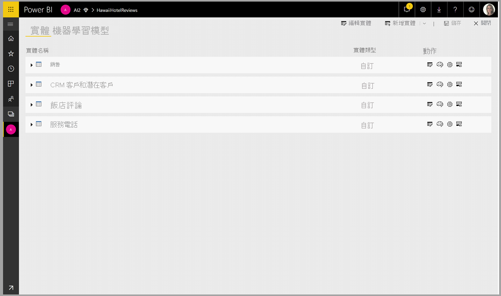

選取 Power Query 編輯器上方功能區中的 [AI 見解]**** 按鈕。

在快顯視窗中，選取您想要使用的函式以及您想要轉換的資料。 在此範例中，我要評分含有檢閱文字的資料行情感。

**Cultureinfo** 是選擇性的輸入，可指定文字的語言。 此欄位應為 ISO 代碼。 您可以使用資料行作為 Cultureinfo 的輸入，或靜態欄位。 在此範例中，整個資料行的語言指定為英文 (en)。 如果您將此欄位留空，Power BI 會先自動偵測語言，然後再套用函式。 接著，選取 [叫用]****。

叫用函式之後，結果會以新的資料行加入至資料表中。 轉換也會加入為查詢中套用的步驟。

如果此函式傳回多個輸出欄位，叫用函式會以多個輸出欄位的記錄加入新的資料行。

使用展開選項，將一個或兩個值當作資料行，加入至您的資料中。

### **可用的函式**

本節描述 Power BI 的認知服務中可用的函式。

#### **偵測語言**

語言偵測函式會評估文字輸入，並針對每個欄位，傳回語言名稱和 ISO 識別碼。 此函式用於收集未知語言之任意文字的資料行。 此函式預期以文字格式的資料作為輸入。

文字分析最多可辨識 120 種語言。 如需詳細資訊，請參閱[支援的語言](https://docs.microsoft.com/azure/cognitive-services/text-analytics/text-analytics-supported-languages)。

#### **擷取關鍵片語**

**關鍵片語擷取**函式會評估非結構化的文字，並針對每個文字欄位，傳回關鍵片語的清單。 此函式需要文字欄位作為輸入，並接受選擇性的輸入作為 **Cultureinfo** (請參閱此文章稍早的**開始使用**一節)。

關鍵片語擷取在您為其提供更大的文字區塊來處理時，其效果最佳。 這與情感分析相反，後者在較小的文字區塊效果更佳。 若要從這兩項作業獲得最佳結果，請考慮據此重新建構輸入。

#### **情感評分**

**情感評分**函式會評估文字輸入，並為每個文件傳回情感分數，範圍從 0 (負面) 到 1 (正面)。 此函式用於偵測在社交媒體、客戶評論和討論區論壇方面的正面和負面情感。

文字分析會使用機器學習服務的分類演算法來產生 0 到 1 之間的情感分數。 分數接近 1 時，表示正面情感，分數接近 0 時，則表示負面情感。 此模型是使用具有情感關聯的大量文字內文預先定型的。 目前無法提供您自己的定型資料。 此模型會在文字分析期間使用技術的組合，包括文字處理、part-of-speech 分析、文字放置，以及文字關聯。 如需有關演算法的詳細資訊，請參閱[文字分析簡介](/archive/blogs/machinelearning/machine-learning-and-text-analytics)。

情感分析是針對整個輸入欄位進行的，而不是擷取文字中特定實體的情感。 在實務上，當文件包含一個或兩個句子，而不是大型文字區塊時，精確度評分有提高的趨勢。 在客觀性評估階段，此模型會判斷整體的輸入欄位是客觀的還是包含情感的。 大部分客觀的輸入欄位不會進展到情感偵測階段，進而導致分數為 .50，而不會進行進一步的處理。 對於在管線中繼續的輸入欄位，下一個階段會產生高於或低於 .50 的分數，端視輸入欄位中偵測到的情感程度而定。

目前，情感分析支援英文、德文、西班牙文和法文。 其他語言目前為預覽版。 如需詳細資訊，請參閱[支援的語言](https://docs.microsoft.com/azure/cognitive-services/text-analytics/text-analytics-supported-languages)。

#### **標記映像**

**標記映像**函式會根據超過 2,000 個可辨識的物體、生物、景象及動作，傳回標記。 當標記模稜兩可或不是常識時，輸出會提供「提示」，以釐清標記在已知設定前後關聯中的意涵。 標記不是按照分類組織的，而且不存在任何繼承階層。 內容標記的集合會形成影像「描述」的基礎，讓此描述顯示為完整句子中已格式化而可供閱讀的語言。

上傳影像或指定影像 URL 之後，電腦視覺演算法會根據物體、生物和影像中識別的動作，輸出標記。 標記不限於主體 (例如在前景的人)，但也包含環境 (室內或戶外)、傢俱、工具、植物、動物、配件、小工具等等。

此函式需要影像 URL 或 abase 64 欄位作為輸入。 目前，影像標記支援英文、西班牙文、日文、葡萄牙文及簡體中文。 如需詳細資訊，請參閱[支援的語言](https://docs.microsoft.com/rest/api/cognitiveservices/computervision/tagimage/tagimage#uri-parameters)。

## Power BI 中的自動化機器學習

適用於資料流程的自動化機器學習 (AutoML) 可讓商務分析師直接在 Power BI 中定型、驗證和叫用機器學習 (ML) 模型。 它包含建立新 ML 模型的簡單體驗，讓分析師可以使用其資料流程來指定用於定型模型的輸入資料。 此服務會自動擷取最相關的功能、選取適當的演算法，並調整和驗證 ML 模型。 在模型定型之後，Power BI 會自動產生一份含驗證結果的效能報表。 接著，您即可針對資料流程內的任何新資料或更新資料來叫用模型。

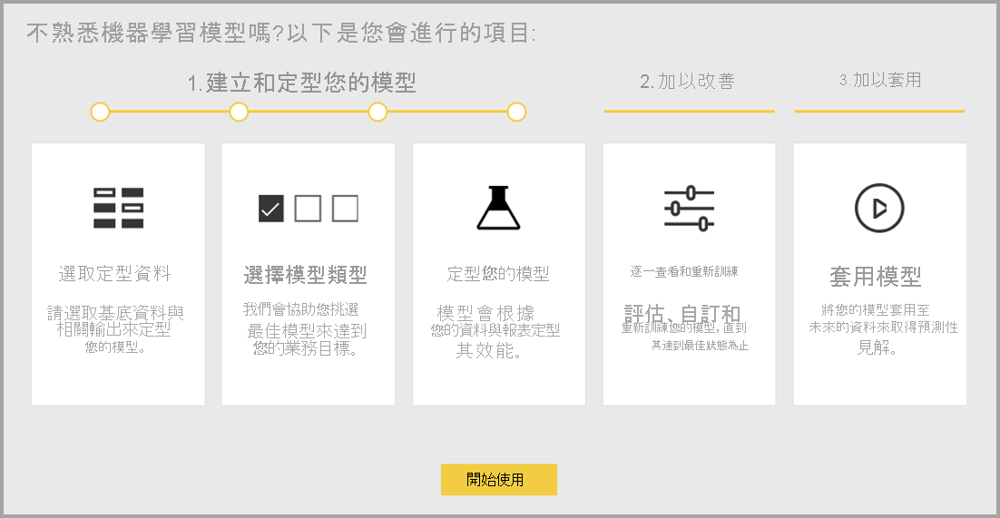

自動化機器學習僅適用於 Power BI Premium 和 Power BI Embedded 容量上裝載的資料流程。

### 使用 AutoML

資料流程提供適用於巨量資料的自助資料準備。 AutoML 已整合至資料流程中，並可讓您直接在 Power BI 內利用資料準備工作來建置機器學習模型。

Power BI 中的 AutoML 可讓資料分析師單純使用 Power BI 的技能，透過簡化體驗來使用資料流程建立機器學習模型。 Power BI 會將建立 ML 模型所需的大部分資料科學自動化。 其透過邊界來確保產生的模型具有良好品質，並讓您了解 ML 模型建立所用的程序。

AutoML 支援建立資料流程的**二元預測**、**分類**和**迴歸**模型。 上述是監督式機器學習技術的類型，這表示其會從過去觀察的已知結果中學習，以預測其他觀察的結果。 您會使用一組含已知結果**標示**的記錄，作為定型 AutoML 模型的輸入資料集。

Power BI 中的 AutoML 會整合 [Azure Machine Learning](https://docs.microsoft.com/azure/machine-learning/service/overview-what-is-azure-ml) 的[自動化 ML](https://docs.microsoft.com/azure/machine-learning/service/concept-automated-ml)，以建立您的 ML 模型。 不過，您不需要 Azure 訂用帳戶，就能在 Power BI 中使用 AutoML。 ML 模型的定型和裝載程序完全由 Power BI 服務來管理。

在 ML 模型定型之後，AutoML 會自動產生 Power BI 報表，說明您 ML 模型可能的效能情況。 AutoML 會醒目提示您輸入中影響模型所傳回預測的關鍵影響因數，以強調可解釋性。 這份報表也會包含模型的關鍵計量。

在產生的報表中，其他頁面會顯示模型的統計摘要和定型詳細資料。 如果使用者想要查看模型效能的標準資料科學量值，則可以參閱統計摘要。 定型詳細資料會摘要所有執行的反覆運算，並使用相關聯的模型參數，以建立您的模型。 它也會描述如何使用每項輸入來建立 ML 模型。

接著，您可以對 ML 模型套用資料以進行評分。 重新整理資料流程時，系統即會以 ML 模型的預測來更新資料。 Power BI 也會個別說明 ML 模型所產生的每個特定預測。

### 建立機器學習模型

本節描述如何建立 AutoML 模型。

#### 建立 ML 模型的資料準備

若要在 Power BI 中建立機器學習模型，您必須先建立資料 (包含歷史結果資訊) 的資料流程，以用於定型 ML 模型。 針對您嘗試預測的結果，您也應該為任何可能是強式預測的業務計量新增計算結果欄。 如需設定資料流程的詳細資料，請參閱[設定及取用資料流程](dataflows-configure-consume.md)。

AutoML 具備用來定型機器學習模型的特定資料需求。 下列各節會根據各自的模型類型來描述這些需求。

#### 設定 ML 模型輸入

若要建立 AutoML 模型，請選取資料流程實體 [動作]  資料行中的 ML 圖示，然後選取 [新增機器學習模型]  。

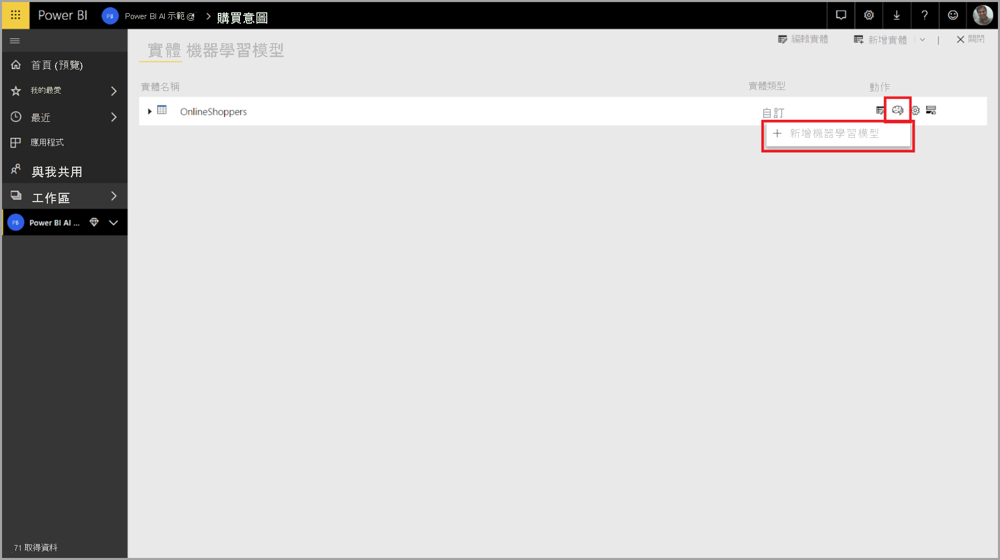

我們已推出簡化的體驗，其中所包含精靈會引導您完成建立 ML 模型的程序。 此精靈包含下列簡單的步驟。

**1.選取含歷史資料的實體，以及您想要預測的結果欄位**

結果欄位會識別用來定型 ML 模型的標籤屬性，如下圖所示。

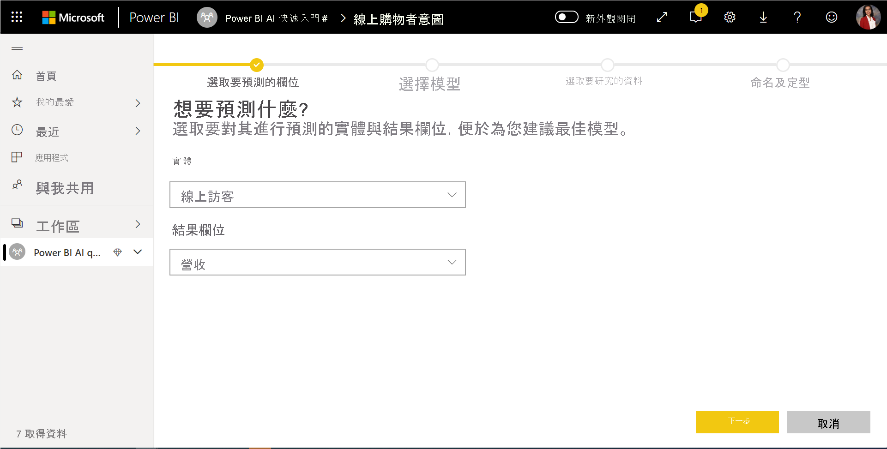

**2.選擇模型類型**

當您指定結果欄位時，AutoML 會分析標籤資料，以建議最可能定型的 ML 模型類型。 您可以按一下 [選取不同的模型] 來選擇不同模型類型，如下所示。

> [!NOTE]
> 某些模型類型可能不支援您選取的資料，因此已停用。 在上述範例中，由於選取文字資料行作為結果欄位，因此已停用迴歸。

**3.選取您想要讓模型作為預測性訊號的輸入**

AutoML 會分析所選實體樣本，以建議可用來定型 ML 模型的輸入。 未選取的欄位旁邊會提供說明。 如果特定欄位具有太多相異值或只有一個值，或與輸出欄位的關聯性很低或很高，則不建議這樣做。

您不應該使用任何相依於結果欄位 (或標籤欄位) 的輸入來定型 ML 模型，因為這會影響其效能。 這類欄位會標示為「與輸出欄位的關聯性疑似很高」。 將這些欄位引進定型資料會導致標籤外洩，雖然模型在驗證或測試資料上的執行效能良好，但用於生產環境進行評分時的效能則相對低落。 當定型模型效能好得難以置信時，AutoML 模型中可能有標籤外洩的隱憂。

此功能建議是根據某個資料樣本而來，因此您應該檢閱所使用的輸入。 您可以選擇將選取範圍變更為只包含您希望模型研究的欄位。 您也可以選取實體名稱旁邊的核取方塊來選取所有欄位。

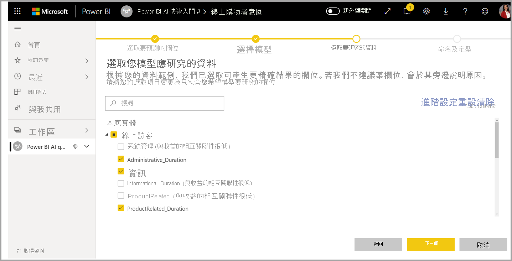

**4.命名您的模型並儲存設定**

在最後一個步驟中，您可以命名模型並選取 [儲存並定型] 來開始定型 ML 模型。 您可以選擇減少定型時間來更快看到結果，或增加花在定型的時間來取得最佳模型。

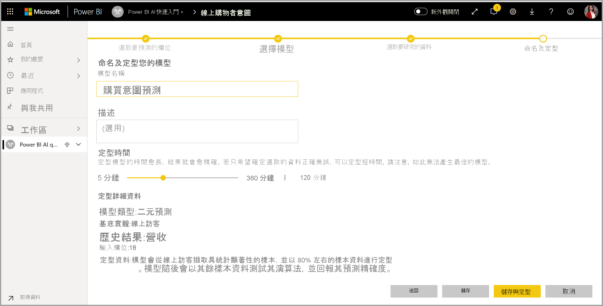

#### ML 模型定型

AutoML 模型的定型是資料流程重新整理的一部分。 AutoML 會先準備您的資料以進行定型。
AutoML 會將您提供的歷史資料分割成定型和測試資料集。 測試資料集是一種鑑效組，可用來驗證模型訓練後的效能。 這些項目會在資料流程中以**訓練和測試**實體呈現。 AutoML 會使用交叉驗證來進行模型驗證。

接下來，系統會分析每個輸入欄位並套用插補，以將任何遺漏值取代為替代值。 AutoML 會使用幾種不同的插補策略， 針對視為數值功能的輸入屬性，會使用資料行值的平均進行插補。 針對視為類別目錄功能的輸入屬性，AutoML 會使用資料行值的模式進行插補。 用於插補之值平均和模式是 AutoML 架構針對次取樣的定型資料集計算而來。

然後會視需要對資料套用取樣和正規化。 針對分類模型，AutoML 會透過分層取樣來執行輸入資料，並平衡類別以確保所有資料列計數都相等。

AutoML 會根據每個所選輸入欄位的資料類型及其統計屬性，對欄位套用數種轉換。 AutoML 會使用這些轉換來擷取功能，以用來訓練您的 ML 模型。

AutoML 模型的訓練程序包含高達 50 個反覆運算，其中具有不同的模型化演算法和超參數設定，以找出效能最佳的模型。 如果 AutoML 注意到所觀察的效能沒有任何改善，則定型可能以較少的反覆運算提早結束。 其中每個模型的效能都是透過鑑效組的測試資料集驗證來進行評估。 在此訓練步驟中，AutoML 會建立數個管線來訓練和驗證這些反覆運算。 評估模型效能的程序可能需要一些時間 (從數分鐘到幾小時，最高可達精靈中設定的定型時間)，視您的資料集大小和可用專用容量資源而定。

在某些情況下，最終產生的模型可能會使用集成學習，以使用多個模型來提供更佳的預測效能。

#### AutoML 模型的可解釋性

模型定型之後，AutoML 會分析輸入功能和模型輸出之間的關聯性。 其會針對每個輸入功能的鑑效組測試資料集，評估模型輸出的變化大小。 這就是所謂的「功能重要性」  。 當定型完成後重新整理時，即會發生此情況。 因此，重新整理時間可能會比精靈中設定的定型時間還長。

#### AutoML 模型報表

AutoML 會產生 Power BI 報表，以摘要出驗證期間的模型效能與全域功能重要性。 當資料流程重新整理成功之後，即可從 [機器學習模型] 索引標籤存取此報表。 此報表摘要說明對 ML 模型套用鑑效組測試資料，並將預測與已知結果值進行比較的結果。

您可以檢閱模型報表來了解其效能。 您也可以驗證模型之關鍵影響因素是否符合已知結果的商業見解。

報表中用來描述模型效能的圖表和量值是依據模型類型而定。 下列各節將描述這些效能圖表和量值。

報表中其他頁面可能會從資料科學角度來描述模型的相關統計量值。 例如，**二元預測**報表包含模型的增益圖和 ROC 曲線。

這些報表也會包含 [定型詳細資料]  頁面，其中含有模型定型方式的描述，以及描述每個反覆運算執行下模型效能的圖表。

此頁面上另一個區段描述偵測到的輸入欄位類型，以及用於填入遺漏值的插補方法。 它也包括最終模型所使用的參數。

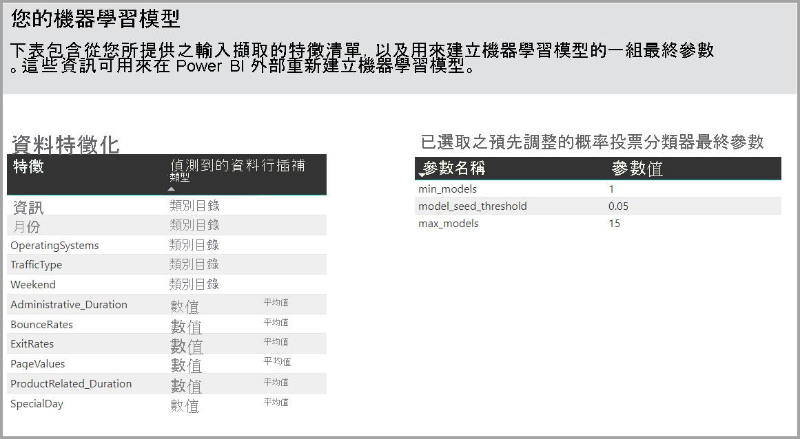

如果產生的模型使用集成學習，則 [定型詳細資料]  頁面也會包含一個圖表，其中顯示集成中每個組成模型的權數，以及其參數。

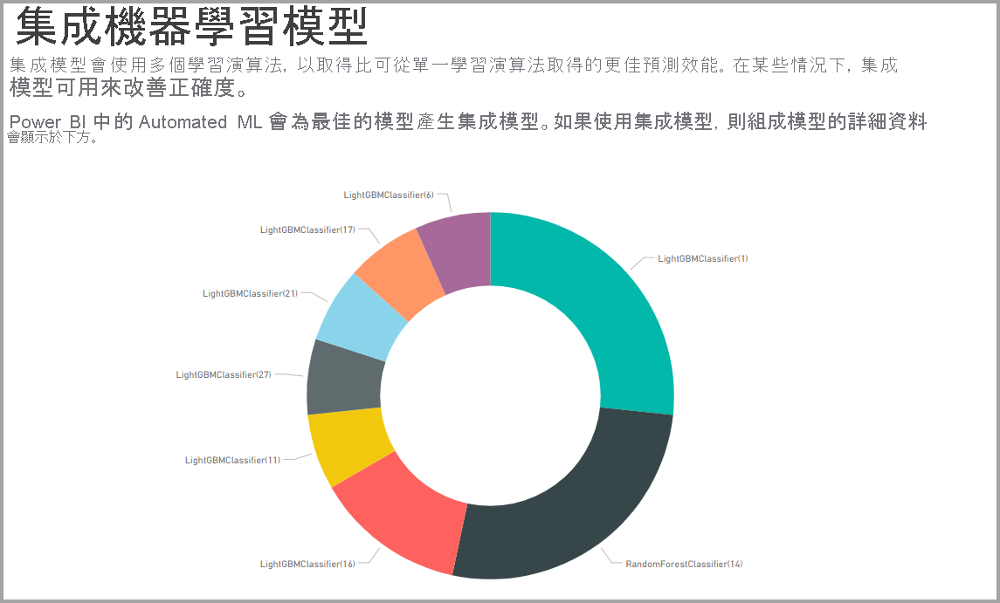

### 套用 AutoML 模型

如果您對所建立的 ML 模型效能感到滿意，可以在重新整理資料流程時，對其套用新資料或更新的資料。 您可以從模型報表執行這項操作，方法是選取右上角的 [套用]  按鈕，或 [機器學習模型] 索引標籤中動作下的 [套用 ML 模型] 按鈕。

若要套用 ML 模型，您必須指定要對其套用的實體名稱，以及要針對模型輸出新增至此實體的資料行前置詞。 資料行名稱的預設前置詞是模型名稱。 _Apply_ 函式可能包含模型類型特定的其他參數。

套用 ML 模型會建立兩個新的資料流程實體，其中包含輸出實體中所評分每個資料列的預測和個別說明。 例如，如果您將 _PurchaseIntent_ 模型套用至 _OnlineShoppers_ 實體，則輸出將會產生 **OnlineShoppers enriched PurchaseIntent** 和 **OnlineShoppers enriched PurchaseIntent explanations** 實體。 針對擴充實體中的每個資料列，**Explanations** 會根據輸入功能細分成擴充說明實體中的多個資料列。 **ExplanationIndex** 有助於將擴充說明實體中資料列對應至擴充實體中資料列。

您也可以使用 PQO 函式瀏覽器中的 AI 見解，將任何 Power BI AutoML 模型套用至相同工作區中任何資料流程的實體。 如此一來，您就可以在相同工作區中使用其他人所建立的模型，而不一定要是擁有模型的資料流程擁有者。 Power Query 會探索工作區中的所有 Power BI ML 模型，並將其公開為動態 Power Query 函式。 您可以透過從 Power Query 編輯器中的功能區存取函式，或透過直接叫用 M 函式，來叫用那些函式。目前只有 Power BI 資料流程與 Power BI 服務中的 Power Query Online 支援此功能。 請注意，這與使用 AutoML 精靈在資料流程中套用 ML 模型非常不同。 沒有使用此方法建立的說明實體，除非您是資料流程的擁有者，否則無法存取模型定型報表或重新定型模型。 如果已編輯來源模型 (新增或移除輸入欄位)，或已刪除模型或來源資料流程，則此相依資料流程將會中斷。

套用模型之後，AutoML 一律會在每次重新整理資料流程時，將您的預測保持在最新狀態。

若要在 Power BI 報表中使用 ML 模型的見解和預測，您可以使用**資料流程**連接器從 Power BI Desktop 連接到輸出實體。

### 二元預測模型

二元預測模型的正式名稱為**二元分類模型**，可用來將資料集分類成兩個群組。 這些模型是用來預測可能具有二元結果的事件。 例如，銷售商機是否轉換、帳戶是否會變換、發票是否能準時支付、交易是否為詐騙等。

二元預測模型的輸出是機率分數，可識別將達成目標結果的可能性。

#### 定型二元預測模型

先決條件：

- 每個結果類別都需要至少 20 列的歷史資料

建立二元預測模型的程序步驟與其他 AutoML 模型相同，如上方＜設定 ML 模型輸入＞**** 一節中所述。 唯一的差異在於 [選擇模型] 步驟，您可以在其中選取最感興趣的目標結果值。 您也可以為結果提供易記標籤；這些結果會用於自動產生報表，其會摘要模型驗證的結果。

#### 二元預測模型報表

二元預測模型會產生一個機率輸出，其為可達成目標結果的記錄。 這份報表包含機率臨界值的交叉分析篩選器，它會影響高於和低於機率臨界值的分數解讀方式。

報表會以「確判為真」、「誤判為真」、「確判為否」和「誤判為否」__ 的角度來描述模型的效能。 「確判為真」和「確判為否」可針對結果資料中的兩種類別正確預測結果。 「誤判為真」是指預設具有目標結果但實際沒有的記錄。 相反地，「誤判為否」是指具有目標結果但預測沒有的記錄。

量值 (例如精確度和召回率) 可描述預測結果的機率臨界值效果。 您可以使用機率臨界值交叉分析篩選器選取臨界值，以在精確度和召回率之間達到平衡的折衷。

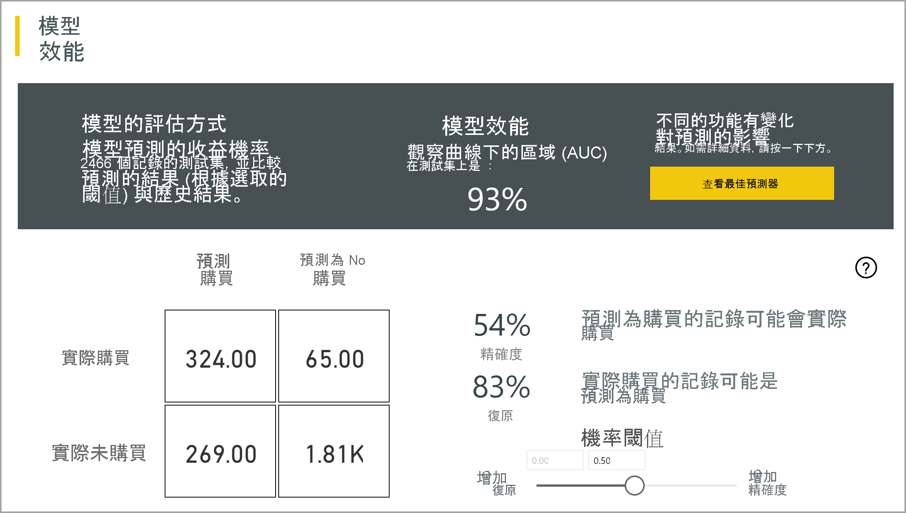

此報表也會包含成本效益分析工具，可協助識別應該設為目標的母體子集，以產生最高的收益。 成本效益分析會根據目標之預估單位成本與達成目標結果的單位效益，嘗試將收益最大化。 您可以使用此工具以根據圖表中的最大點數來選擇機率閾值，將收益最大化。 您也可以使用圖表來計算所選機率閾值的收益或成本。

模型報表的 [正確性報表]**** 頁面包括模型的「累計增益」__ 圖表和 ROC 曲線。 這些是模型效能的統計量值。 報表包含所示圖表的描述。

#### 套用二元預測模型

若要套用二元預測模型，您必須指定實體，其中包含您想要對其套用 ML 模型預測的資料。 其他參數包括輸出資料行名稱前置詞與機率臨界值，以用來分類預測結果。

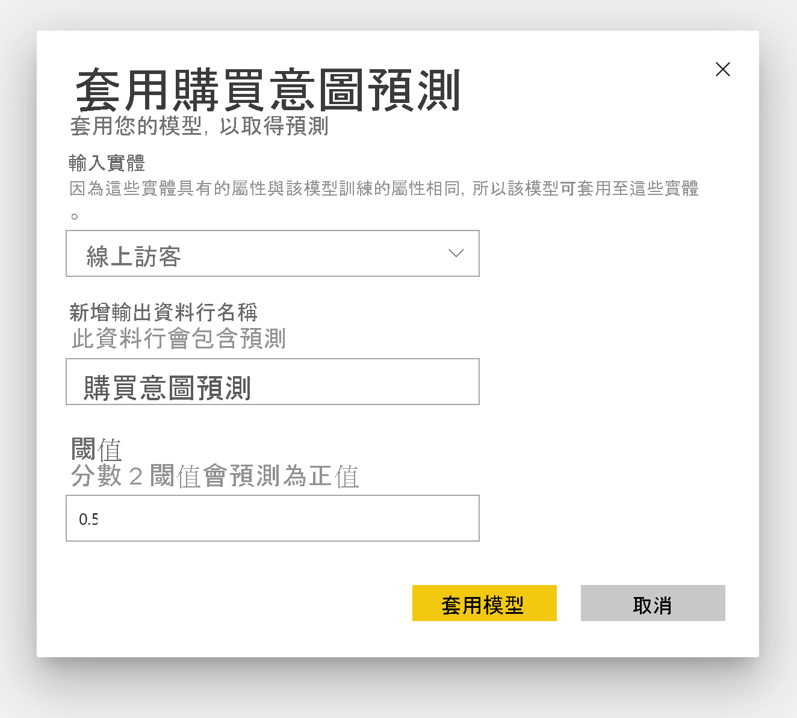

當您套用二元預測模型時，系統會將四個輸出資料行新增至擴充的輸出實體：**Outcome**、**PredictionScore**、**PredictionExplanation** 和 **ExplanationIndex**。 實體中的資料行名稱會使用套用模型時所指定前置詞。

**PredictionScore** 是機率百分比，可識別將達成目標結果的可能性。

**Outcome** 資料行包含預測的結果標籤。 系統會將機率超過閾值的記錄預測為可能達成目標結果，並標示為 True。 低於閾值的記錄則預測為不太可能達成結果，並標示為 False。

**PredictionExplanation** 資料行包含說明，以及輸入功能對 **PredictionScore** 的特定影響。

### 分類模型

分類模型可用來將資料集分類為多個群組或類別。 這些模型是用來預測可能具有多個可能結果之一的事件。 例如，客戶是否可能有非常高、高、中或低的存留期值；預設的風險是高、中、低或非常低等。

分類模型的輸出是機率分數，可識別記錄將達到特定類別之準則的可能性。

#### 訓練分類模型

輸入實體 (包含分類模型的定型資料) 必須以字串或整數欄位作為結果欄位，以識別過去已知的結果。

先決條件：

- 每個結果類別都需要至少 20 列的歷史資料

建立分類模型的程序步驟與其他 AutoML 模型相同，如上方＜設定 ML 模型輸入＞**** 一節中所述。

#### 分類模型報表

分類模型報表的產生方式是對 ML 模型套用鑑效組測試資料，並將記錄的預測類別與實際已知類別進行比較。

模型報表包含一個圖表，其中包含每個已知類別的正確和不正確分類記錄明細。

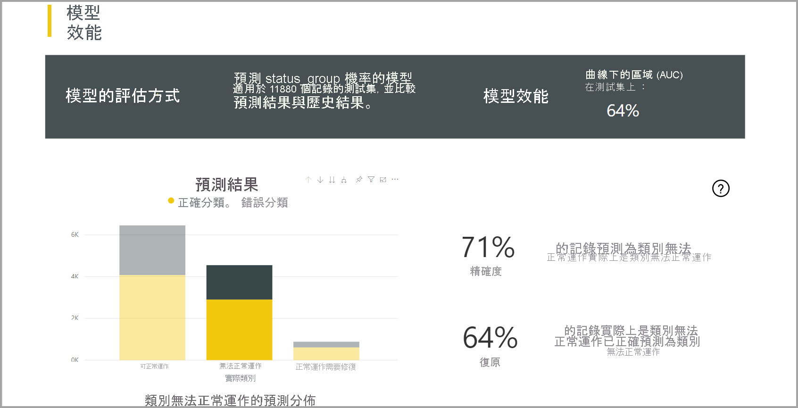

類別特定之深入向下鑽研可讓您分析已知類別的預測分佈情況。 這會顯示其他類別，其中包含可能會將該已知類別分錯類別的記錄。

報表中的模型說明也包含每個類別的最上層預測指標。

分類模型報表也包含 [定型詳細資料] 頁面 (類似於其他模型類型的頁面)，如本文稍早的＜AutoML 模型報表＞**** 一節中所述。

#### 套用分類模型

若要套用分類 ML 模型，您必須使用輸入資料和輸出資料行名稱前置詞來指定實體。

當您套用分類模型時，系統會將五個輸出資料行新增至擴充的輸出實體：**ClassificationScore**、**ClassificationResult**、**ClassificationExplanation**、**ClassProbabilities** 和 **ExplanationIndex**。 實體中的資料行名稱會使用套用模型時所指定前置詞。

**ClassProbabilities** 資料行包含每個可能類別的記錄機率分數清單。

**ClassificationScore** 是機率百分比，可識別記錄將達成指定類別準則的可能性。

**ClassificationResult** 資料行包含最可能的記錄預測類別。

**ClassificationExplanation** 資料行包含說明，以及輸入功能對 **ClassificationScore** 的特定影響。

### 迴歸模型

迴歸模型可用來預測數值。 例如：可能從銷售交易實現的收益、帳戶的存留期值、可能收取的應收發票金額、可能的發票支付日期等。

迴歸模型的輸出是預測值。

#### 定型迴歸模型

輸入實體 (包含迴歸模型的定型資料) 必須以數值欄位作為結果欄位，以識別已知的結果值。

先決條件：

- 每個回歸模型都需要最少 100 個資料列的歷史資料

建立迴歸模型的程序步驟與其他 AutoML 模型相同，如上方＜設定 ML 模型輸入＞**** 一節中所述。

#### 迴歸模型報表

如同其他 AutoML 模型報表一樣，迴歸報表是以對模型套用鑑效組測試資料的結果為基礎。

模型報表包含比較預測值與實際值的圖表。 在此圖表中，對角線的距離會指出預測誤差。

剩餘誤差圖表會顯示鑑效組測試資料集中不同值的平均誤差百分比分佈情況。 水平軸代表群組實際值的平均值，而泡泡大小則顯示該範圍內值的頻率或計數。 垂直軸是平均剩餘誤差。

迴歸模型報表也包含 [定型詳細資料] 頁面 (類似於其他模型類型的頁面)，如上方＜AutoML 模型報表＞**** 一節中所述。

#### 套用迴歸模型

若要套用迴歸 ML 模型，您必須使用輸入資料和輸出資料行名稱前置詞來指定實體。

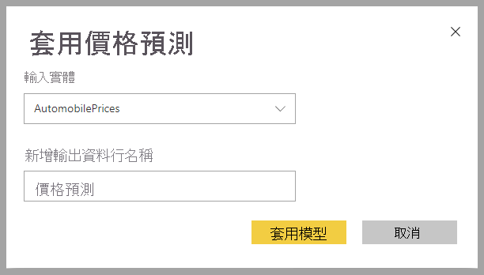

當您套用迴歸模型時，系統會將三個輸出資料行新增至擴充的輸出實體：**RegressionResult**、**RegressionExplanation** 和 **ExplanationIndex**。 實體中的資料行名稱會使用套用模型時所指定前置詞。

**RegressionExplanation** 資料行包含的記錄預測值是以輸入欄位為依據。 **RegressionExplanation** 資料行包含說明，以及輸入功能對 **RegressionResult** 的特定影響。

## Power BI 中的 Azure Machine Learning 整合

許多組織使用 **Machine Learning** 模型來取得關於其業務的更好的見解與預測。 在您的報告與儀表板和其他分析中，能夠從這些模型視覺化及叫用見解的能力有助於傳播這些見解給最需要它的企業使用者。  Power BI 現在可讓您輕鬆使用直覺的點按手勢整合來自 Azure Machine Learning 上所裝載模型的見解。

若要使用此功能，資料科學家可以使用 Azure 入口網站將對 Azure ML 模型的存取權授與 BI 分析師。  接著，在每個工作階段開頭，Power Query 會探索使用者有權存取的所有 Azure ML 模型並將它們公開為動態 Power Query 函式。  使用者接著可以透過從 Power Query 編輯器中的功能區存取函式，或透過直接叫用 M 函式，來叫用那些函式。 Power BI 也會在針對一組資料列叫用 Azure ML 模型時自動分存取要求分批，以獲得更好的效能。

目前只有 Power BI 資料流程與 Power BI 服務中的線上 Power Query 支援此功能。

若要深入了解資料流程，請參閱[資料流程及自助資料準備簡介](dataflows-introduction-self-service.md)。

若要深入了解 Azure Machine Learning，請參閱：

- 概觀：[什麼是 Azure Machine Learning 服務？](https://docs.microsoft.com/azure/machine-learning/service/overview-what-is-azure-ml)
- Azure Machine Learning 的快速入門與教學課程：[Azure Machine Learning 文件](https://docs.microsoft.com/azure/machine-learning/)

> [!NOTE]
> 需要 Power BI Premium 訂閱，才能使用 Azure Machine Learning 整合。

### 將對 Azure ML 模型的存取權授與 Power BI 使用者

若要從 Power BI 存取 Azure ML 模型，使用者必須有對 Azure 訂用帳戶的**讀取**存取權。  此外：

- 針對 Machine Learning Studio (傳統) 模型，需要對 Machine Learning Studio (傳統) Web 服務的**讀取**存取權
- 針對 Machine Learning 模型，需要對 Machine Learning 工作區的**讀取**存取權

此文章中的步驟說明如何將對 Azure ML 上裝載之模型的存取權授與 Power BI 使用者，以便他們能以 Power Query 函式形式存取此模型。  如需進一步的詳細資料，請參閱[使用 RBAC 與 Azure 入口網站管理存取權](https://docs.microsoft.com/azure/role-based-access-control/role-assignments-portal)。

1. 登入 [Azure 入口網站](https://portal.azure.com)。

2. 移至 [訂用帳戶] 頁面。 您可以透過 Azure 入口網站導覽窗格功能表中的 [所有服務] 清單找到 [訂用帳戶] 頁面。

    

3. 選取您的訂用帳戶。

    [ 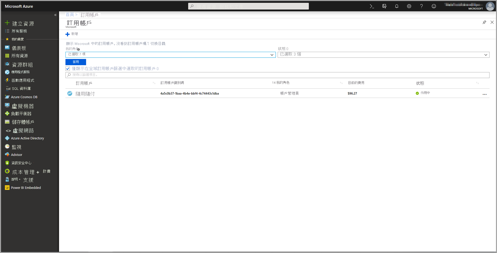 ](media/service-machine-learning-integration/machine-learning-integration-02.png#lightbox)

4. 選取 [存取控制 (IAM)]，然後選取 [新增] 按鈕。

    

5. 選取 [讀者] 做為 [角色]。 選取您希望為其授與對 Azure ML 模型之存取權的 Power BI 使用者。

    [ ![選取 [讀者] 作為角色](media/service-machine-learning-integration/machine-learning-integration-04.png) ](media/service-machine-learning-integration/machine-learning-integration-04.png#lightbox)

6. 選取 [儲存]。

7. 重複步驟三到六以將**讀者**存取權授與特定 Machine Learning Studio (傳統) Web 服務或裝載模型的 Machine Learning 工作區使用者。

### 針對 Machine Learning 模型的結構描述探索

資料科學家主要使用 Python 開發甚至是部署其 Machine Learning 的機器學習模型。  不同於 Machine Learning Studio (傳統) 是協助自動化為模型建立結構描述檔案的工作，在 Machine Learning 的案例中，資料科學家必須明確使用 Python 產生結構描述檔案。

此結構描述檔案必須包含在 Machine Learning 模型的部署 Web 服務中。 若要自動產生 Web 服務的結構描述，您必須為部署模型在項目指令碼中提供輸入/輸出的範例。 請參閱[使用 Azure Machine Learning 部署模型中的選擇性自動產生 Swagger 架構](https://docs.microsoft.com/azure/machine-learning/how-to-deploy-and-where#optional-define-model-web-service-schema)服務文件上的子節。 連結包含產生結構描述陳述式的範例項目指令碼。 

具體而言，項目指令碼中的 *\@input_schema* 與 *\@output_schema* 函式會參考 *input_sample* 與 *output_sample* 中的輸入和輸出範例格式，並在部署期間使用這些範例來產生 Web 服務的 OpenAPI (Swagger) 規格。

這些透過更新項目指令碼來產生結構描述的指示也必須套用到使用 Azure Machine Learning SDK 時，透過自動化機器學習服務實驗建立的模型。

> [!NOTE]
> 使用 Azure Machine Learning 視覺化介面建立的模型目前不支援產生結構描述，但會在後續的版本中支援。 

### 在 Power BI 中叫用 Azure ML 模型

您可以直接從您資料流程中的 Power Query 編輯器叫用任何您已獲授與存取權的 Azure ML 模型。 若要存取 Azure ML 模型，請針對您要從您的 Azure ML 模型豐富見解的實體選取 [編輯] 按鈕，如下列影像所示。

選取 [編輯] 按鈕以針對您資料流程中的實體開啟 Power Query 編輯器。

選取功能區中的 [AI 見解] 按鈕，然後從導覽窗格功能表選取 [Azure Machine Learning 模型] 資料夾。 您擁有存取權的所有 Azure ML 模型會在這裡列為 Power Query 函式。 此外，Azure ML 模型的輸入參數會自動對應為對應之 Power Query 函式的參數。

若要叫用 Azure ML 模型，您可以從下拉式清單中指定任何所選實體的資料行作為輸入。 您也可以將資料行圖示切換至 [輸入] 對話方塊的左側，以指定要當作輸入使用的常數值。

[ 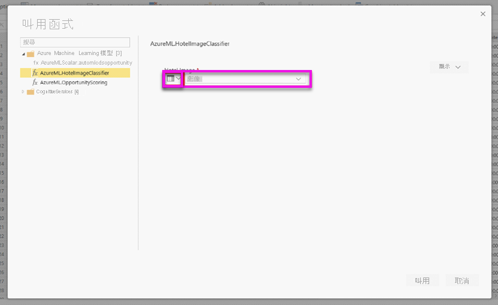 ](media/service-machine-learning-integration/machine-learning-integration-07.png#lightbox)

選取 [叫用] 來檢視 Azure ML 模型的輸出作為實體資料表中新資料行的預覽。 您也將看到模型叫用作為查詢套用的步驟。

若模型傳回多個輸出參數，它們會分組為輸出資料行中的記錄。 您可以展開資料行，在不同的資料行中產生個別的輸出參數。

一旦您儲存資料流程之後，當您針對實體資料表中任何新的或更新的資料列重新整理資料流程時，將會自動叫用模型。

## 後續步驟

本文提供 Power BI 服務的資料流程自動化機器學習概觀。 下列文章可能也很實用。

- [教學課程：在 Power BI 中建置機器學習模型](../../connect-data/service-tutorial-build-machine-learning-model.md)
- [教學課程：在 Power BI 中使用認知服務](../../connect-data/service-tutorial-use-cognitive-services.md)
- [教學課程：在 Power BI 中叫用 Machine Learning Studio (傳統) 模型 (預覽)](../../connect-data/service-tutorial-invoke-machine-learning-model.md)

下列文章提供資料流程和 Power BI 的詳細資訊：

* [資料流程和自助資料準備簡介](dataflows-introduction-self-service.md)
* [建立資料流程](dataflows-create.md)
* [設定及取用資料流程](dataflows-configure-consume.md)
* [將資料流程儲存體設定為使用 Azure Data Lake Gen 2](dataflows-azure-data-lake-storage-integration.md)
* [資料流程的進階功能](dataflows-premium-features.md)
* [資料流程限制與考量](dataflows-features-limitations.md) 