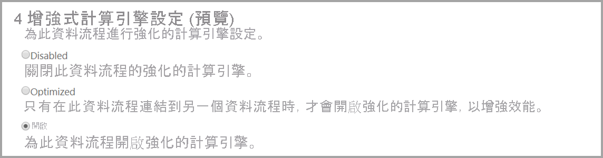
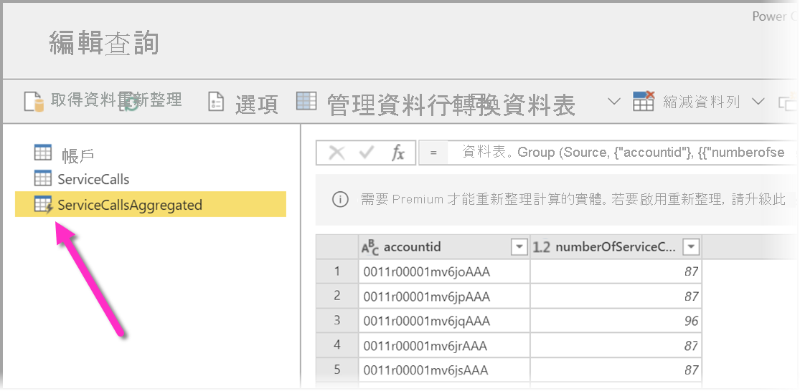
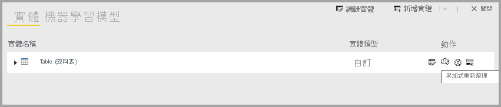

# 資料流程的進階功能

資料流程支援 Power BI Pro 和 Power BI Premium 使用者。 有些功能僅提供 Power BI Premium 訂閱使用。 本文描述並詳述僅限 Premium 的功能及其用途。 

下列功能僅提供 Power BI Premium 使用：

* 增強型計算引擎
* 直接查詢
* 計算實體
* 連結實體
* 累加式重新整理

下列各節詳細描述這些功能。

## 增強型計算引擎

Power BI 中增強型計算引擎可讓 Power BI Premium 訂閱者使用其容量來最佳化資料流程的使用。 使用增強型計算引擎可提供下列優點：

* 大幅減少長時間執行的 ETL 步驟在計算實體上所需重新整理時間，例如執行「聯結」、「相異」、「篩選」和「分組方式」
* 針對實體執行 DirectQuery 查詢

接下來會描述啟用增強型計算引擎，以及常見問題的解答。

### 使用增強型計算引擎

增強型計算引擎可從 Power BI 服務內 [容量設定] 頁面的 [資料流程] 區段中啟用。 增強型計算引擎預設為 [關閉]。 若要啟用增強型計算引擎，請將切換按鈕切換到 [開啟]，如下圖所示，並儲存設定。 

> [!IMPORTANT]
> 增強型計算引擎僅適用於 A3 及更大的 Power BI 容量。

開啟增強型計算引擎之後，請返回**資料流程**，您應該會在任何針對資料流程 (從相同容量的現有連結實體建立) 執行複雜作業 (例如「聯結」或「分組方式」作業) 的計算實體中觀察到效能改善。 

若要充分利用計算引擎，請透過下列方式將 ETL 階段分割成兩個不同的資料流程：

* **資料流程 1** - 此資料流程只應從資料來源內嵌所有必要內容，並將其放入資料流程 2。
* **資料流程 2** - 在此第二個資料流程中執行所有 ETL 作業，但請確定您參考的是資料流程 1，其應位於相同的容量。 此外，請務必先執行可摺疊的作業 (篩選、分組方式、相異、聯結)，再執行任何其他作業，以確保使用計算引擎。

### 常見問題與答案

**問：** 我已啟用增強型計算引擎，但重新整理的速度較慢。 為什麼？

**答：** 如果您啟用了增強型計算引擎，有兩種可能的情況會導致重新整理時間較慢：

 * 啟用增強型計算引擎時，需要一些記憶體才能正常運作。 因此，可用來執行重新整理的記憶體會減少，因此增加了資料流程重新整理排入佇列的可能性，進而減少可同時重新整理的資料流程數。 若要解決這種情況，請在啟用增強型計算時，增加指派給資料流程的記憶體，以確保可用於同時重新整理資料流程的記憶體保持不變。

 * 可能導致遇到較為緩慢重新整理的另一個原因是計算引擎只能針對現有實體運作。 若資料流程參考了並非資料流程的資料來源，您便無法觀察到改善。 效能不會提高，因為在某些巨量資料案例中，由於資料必須傳遞至增強型計算引擎，因此資料來源的初始讀取會變慢。  

**問：** 我看不到增強型計算引擎的切換按鈕。 為什麼？

**答：** 增強型計算引擎會分階段發行到全球各地。 我們預期在 2020 年底前為所有區域提供支援。

**問：** 適用於計算引擎的支援資料類型有哪些？

**答：** 增強型計算引擎和資料流程目前支援下列資料類型。 如果您的資料流程未使用下列其中一種資料類型，重新整理期間就會發生錯誤：

* 日期/時間
* 十進位數字
* 文字
* 整數
* 日期/時間/時區
* True/False
* 日期
* 時間

## 在 Power BI 中使用資料流程的 DirectQuery 功能 (預覽)

您可使用 DirectQuery 直接連線到資料流程，並因此直接連線到資料流程，而無須匯入其資料。 

搭配資料流程使用 DirectQuery 可為 Power BI 和資料流程處理序帶來下列增強功能：

* **避免個別的重新整理排程** - DirectQuery 會直接連線到資料流程，移除建立匯入資料集的需求。 因此，搭配資料流程使用 DirectQuery 表示您不再需要針對資料流程和資料集具備個別的重新整理流程來確保資料同步。

* **篩選資料** - 在資料流程內部使用篩選資料檢視時，DirectQuery 相當實用。 若想要篩選資料，並因此在資料流程內使用較小部分的資料，您可使用 DirectQuery (以及計算引擎) 來篩選資料流程資料及使用所需的篩選子集。

### 針對資料流程使用 DirectQuery

搭配資料流程使用 DirectQuery 是一項預覽功能，從 Power BI Desktop 2020 年五月版本開始提供使用。 

搭配資料流程使用 DirectQuery 也有先決條件：

* 資料流程必須位於啟用 Power BI Premium 的工作區內
* 必須開啟**計算引擎**

### 針對資料流程啟用 DirectQuery

為了確保資料流程可供 DirectQuery 存取使用，增強型計算引擎必須處於最佳化狀態。 若要針對資料流程啟用 DirectQuery，請將新的 [增強型計算引擎設定] 選項設為 [開啟]。 下圖顯示設定已適當選取。

在套用設定後，請重新整理資料流程，以讓最佳化生效。

### DirectQuery 的考量與限制

DirectQuery 和資料流程有些已知限制：

* 在此功能的預覽期間，有些客戶可能會在搭配資料流程使用 DirectQuery 時遇到逾時或效能問題。 我們正在這段預覽期間積極解決這些問題。

* 目前不支援具有匯入和 DirectQuery 資料來源的複合/混合模式。

* 大型資料流程在觀賞視覺效果時，可能會遇到逾時問題。 遇到逾時問題的大型資料流程應使用 [匯入] 模式。

* 在資料來源設定底下，如果您要使用 DirectQuery，資料流程連接器會顯示無效認證。 這不會影響行為，且資料集會正常運作。 

## 計算實體

您可以在搭配 Power BI Premium 訂用帳戶使用**資料流程**時，執行**儲存體內部計算**。 這讓您能夠在現有的資料流程上執行計算，並傳回可讓您專注於報表建立與分析的結果。

若要執行儲存體內部計算，您必須先建立資料流程，然後將資料帶入該 Power BI 資料流程儲存體。 一旦您具有包含資料的資料流程之後，就能建立計算實體，這些是執行儲存體內部計算的實體。

### 計算實體的考量與限制

* 使用在組織 Azure Data Lake Storage Gen2 帳戶中建立的資料流程時，連結實體和計算實體只會在實體位於相同儲存體帳戶中時才能正常運作。 

最佳做法是在針對內部部署及雲端資料聯結的資料進行計算時，為每個來源 (一個適用於內部部署，另一個則適用於雲端) 各建立一個新的資料流程，然後建立第三個資料流程來合併/計算這兩個資料來源。

## 連結實體

您可在與 Power BI Premium 訂閱搭配使用時參考現有的資料流程，其讓您可針對這些實體使用計算實體執行計算，或建立可供在多個資料流程中重複使用的「單一事實來源」資料表。

## 累加式重新整理

資料流程可設為累加式重新整理，避免在每次重新整理時提取所有資料。 若要執行這項操作，請選取資料流程，然後選取累加式重新整理圖示。

設定累加式重新整理會將參數新增至資料流程，以指定日期範圍。 如需如何設定累加式重新整理的詳細資訊，請參閱[累加式重新整理](https://docs.microsoft.com/power-query/dataflows/incremental-refresh) (英文) 一文。

### 何時不設定累加式重新整理的考量

請不要在下列情況將資料流程設為累加式重新整理：

* 若連結的實體參考資料流程，則連結的實體即不應使用累加式重新整理。 資料流程不支援查詢折疊 (即使實體已啟用 Direct Query 也一樣)。 
* 參考資料流程的資料集不應使用累加式重新整理。 對資料流程進行的重新整理一般執行效能良好。 若重新整理所花費的時間超出預期，請考慮使用計算引擎和/或 DirectQuery 模式。

## 後續步驟
下列文章提供資料流程和 Power BI 的詳細資訊：

* [資料流程和自助資料準備簡介](dataflows-introduction-self-service.md)
* [建立資料流程](dataflows-create.md)
* [設定及取用資料流程](dataflows-configure-consume.md)
* [將資料流程儲存體設定為使用 Azure Data Lake Gen 2](dataflows-azure-data-lake-storage-integration.md)
* [使用資料流程的 AI](dataflows-machine-learning-integration.md)
* [資料流程限制與考量](dataflows-features-limitations.md)