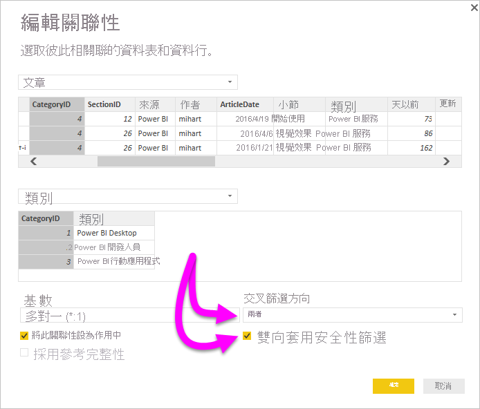

# 在 Power BI Desktop 中啟用 DirectQuery 的雙向交叉篩選

報表建立者和資料模型建立人員在篩選資料表以建立適當的資料檢視時，會面臨決定如何將篩選套用至報表的挑戰。 先前，資料表篩選內容會保留在關聯性的一端，而不會在另一端。 這種安排通常需要複雜的 DAX 公式，才能獲得想要的結果。

透過雙向交叉篩選，報表建立者和資料模型建立人員現在可以在使用相關資料表時，對套用篩選的方式擁有更佳掌控。 雙向交叉篩選可讓這些人員在資料表關聯性的「兩端」  套用篩選。 您可以藉由將篩選內容傳播至資料表關聯性另一端的第二個關聯資料表來套用篩選。

## 啟用 DirectQuery 的雙向交叉篩選

您可以在 [編輯關聯性]  對話方塊中啟用交叉篩選。 若要啟用關聯性的交叉篩選，您必須設定下列選項：

* 將 [交叉篩選方向]  設定為 [雙向]  。
* 選取 [雙向套用安全性篩選]  。

  

> [!NOTE]
> 在 Power BI Desktop 中建立交叉篩選 DAX 公式時，請使用 *UserPrincipalName*。 此欄位通常與使用者的登入資訊相同，例如 <em>joe@contoso.com</em>，而不是 *UserName*。 因此，您可能需要建立將 *UserName* 或 *EmployeeID* 對應至 *UserPrincipalName* 的相關資料表。

如需詳細資訊，以及雙向交叉篩選如何運作的範例，請參閱 [Power BI Desktop 的雙向交叉篩選白皮書](https://download.microsoft.com/download/2/7/8/2782DF95-3E0D-40CD-BFC8-749A2882E109/Bidirectional%20cross-filtering%20in%20Analysis%20Services%202016%20and%20Power%20BI.docx)。

