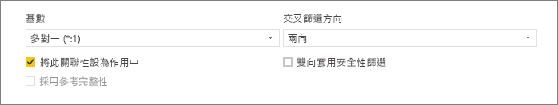
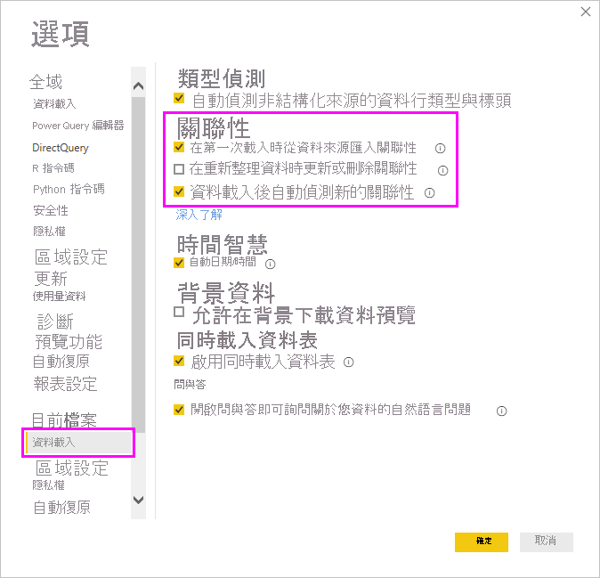
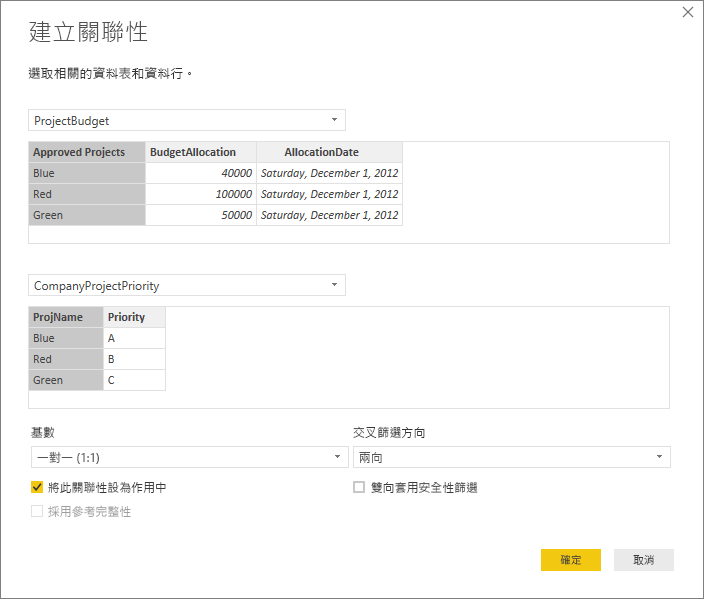
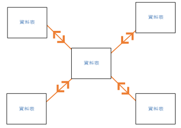
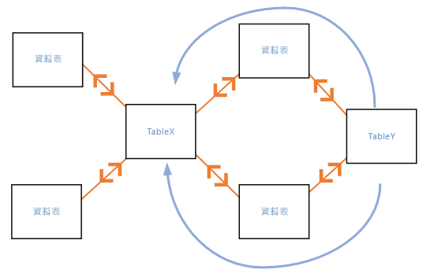

# 在 Power BI Desktop 中建立和管理關聯性
當匯入多個資料表時，您可能想要使用所有資料表中的資料來進行一些分析。 這些資料表之間必須有關聯性才能正確地計算結果，並在報表中顯示正確資訊。 Power BI Desktop 可讓您輕鬆地建立這些關聯性。 事實上，在大多數情況下，您不必執行任何動作，[自動偵測] 功能會為您完成這項作業。 不過，有時候，您可能必須自行建立關聯性，或需要對關聯性進行變更。 不論是哪種情況，請務必了解 Power BI Desktop 中的關聯性，以及如何建立和編輯關聯性。

## 在載入期間自動偵測
若您同時查詢兩個或多個資料表，在載入資料時，Power BI Desktop 會嘗試為您尋找及建立關聯性。 系統會自動設定 [基數]  、[交叉篩選方向]  和 [將此關聯性設為作用中]  關聯性選項。 Power BI Desktop 會查看您要查詢資料表中的資料行名稱，以判斷是否有任何可能的關聯性。 如果有，則會自動建立這些關聯性。 如果 Power BI Desktop 不太確定是否有相符項目，則不會建立關聯性。 不過，您仍然可以使用 [管理關聯性]  對話方塊來手動建立或編輯關聯性。

## 使用自動偵測建立關聯性
在 [首頁]  索引標籤上，選取 [管理關聯性]  \> [自動偵測]  。

## 以手動方式建立關聯性
1. 在 [首頁]  索引標籤上，選取 [管理關聯性]  \> [新增]  。

2. 在 [建立關聯性]  對話方塊中，選取第一個資料表下拉式清單中的資料表。 選取您要用於關聯性的資料行。

3. 在第二個資料表下拉式清單中，選取您要用於關聯性的其他資料表。 選取您要使用的其他資料行，然後選取 [確定]  。

   

根據預設，Power BI Desktop 會自動為您的新關聯性設定 [基數]  (方向)、[交叉篩選方向]  和 [將此關聯性設為作用中]  選項。 不過，您可以視需要變更這些設定。 如需詳細資訊，請參閱[了解其他選項](#understanding-additional-options)。

如果針對關聯性所選取的資料表都沒有唯一值，則您會看到下列錯誤：「其中一個資料行必須具有唯一值」  。 關聯性中的至少一個資料表「必須」  具有不同且唯一的索引鍵值清單，這是對於所有關聯式資料庫技術而言常見的需求。 

如果您遇到錯誤，有幾種方式可以修正這個問題：

* 使用 [移除重複項目]  來建立具有唯一值的資料行。 這個方法的缺點是，移除重複的資料列時您可能會遺失資訊；索引鍵 (資料列) 會重複通常都有好理由。
* 將由相異索引鍵值清單所組成的中繼資料表新增至模型，然後模型會連結到關聯性中的兩個原始資料行。

如需詳細資訊，請參閱這篇[部落格文章](https://blogs.technet.microsoft.com/cansql/2016/12/19/relationships-in-power-bi-fixing-one-of-the-columns-must-have-unique-values-error-message/)。

## 編輯關聯性
1. 在 [首頁]  索引標籤上，選取 [管理關聯性]  。

2. 在 [管理關聯性]  對話方塊中，選取關聯性，然後選取 [編輯]  。

## 設定其他選項
您可在建立或編輯關聯性時設定其他選項。 根據預設，Power BI Desktop 會根據其最佳猜測自動設定其他選項，而每個關聯性的最佳猜測，可能會根據資料行中的資料有所不同。

### 基數
[基數]  選項可具有下列其中一項設定：

**多對一 (\*:1)** ：多對一關聯性是最常見的預設關聯性類型。 這表示一個資料表中資料行可以有特定值的多個執行個體，而其他相關資料表 (通常稱為查閱資料表) 只能有特定值的一個執行個體。

**一對一 (1:1)** ：在一對一關聯性中，一個資料表中資料行只能有特定值的一個執行個體，而其他相關資料表只能有特定值的一個執行個體。

**一對多 (1:*)** ：在一對多關聯性中，一個資料表中資料行只能有特定值的一個執行個體，而其他相關資料表可以有特定值的多個執行個體。

**多對多 (\*:\*)** ：使用複合模型時，您可以在資料表間建立多對多關聯性，其會移除資料表中唯一值的需求。 此方法也會移除先前的因應措施，像是只為建立關聯性而導入新的資料表。 如需詳細資訊，請參閱[多對多基數關聯性](https://docs.microsoft.com/power-bi/desktop-many-to-many-relationships)。 

如需何時變更基數的詳細資訊，請參閱[了解其他選項](#understanding-additional-options)。

### 交叉篩選方向
[交叉篩選方向]  選項可具有下列其中一項設定：

**雙向**：這表示用於篩選時，兩個資料表會視為一個資料表。 [雙向]  設定適用於周圍有一些查閱資料表的單一資料表。 例如，以下是具有部門查閱資料表的銷售實際值資料表。 此設定通常稱為星型結構描述設定 (一個具有多個查閱資料表的中央資料表)。 不過，如果您有兩個或多個資料表也有查閱資料表 (並共用一些資料表)，則不會想要使用 [雙向]  設定。 延續上一個範例，在這種情況下，您也會有一個預算銷售資料表，來記錄每個部門的目標預算。 而部門資料表會同時連接到銷售與預算資料表。 請避免針對這種設定使用 [雙向]  設定。

**單向**：最常見的預設方向，這表示已連接資料表中的篩選選項會套用至彙總值所在資料表。 如果您匯入 Excel 2013 或更早版本的 Power Pivot 資料模型，所有關聯性都會是單向。 

如需何時變更交叉篩選方向的詳細資訊，請參閱[了解其他選項](#understanding-additional-options)。

### 將此關聯性設為作用中
核取時，這個關聯性會成為作用中的預設關聯性。 如果兩個資料表之間有多個關聯性，作用中的關聯性可讓 Power BI Desktop 自動建立包含兩個資料表的視覺效果。

如需何時將特定關聯性設為作用中的詳細資訊，請參閱[了解其他選項](#understanding-additional-options)。

## 了解關聯性
當透過關聯性將兩個資料表連接在一起之後，您可以使用這兩個資料表中的資料，就像是單一資料表一樣；您不需要擔心關聯性細節，也不需要先將這些資料表扁平化成單一資料表再進行匯入。 在許多情況下，Power BI Desktop 可自動為您建立關聯性。 不過，如果 Power BI Desktop 不太確定兩個資料表之間是否應該有關聯性，則不會自動建立關聯性。 在此情況下，您必須自行建立。 

以下將進行一些快速教學課程，讓您更了解關聯性在 Power BI Desktop 中的運作方式。

>[!TIP]
>您可以自行完成這個課程： 
>
> 1. 將下面的 [專案時數]  資料表複製到 Excel 工作表 (標題除外)，選取所有資料格，然後選取 [插入]  \> [資料表]  。 
> 2. 在 [建立資料表]  對話方塊中，選取 [確定]  。 
> 3. 選取任何資料表資料格，選取 [資料表設計]  \> [資料表名稱]  ，然後輸入「專案時數」  。 
> 4. 針對 [公司專案]  資料表執行相同的動作。 
> 5. 使用 Power BI Desktop 中的 [取得資料]  來匯入資料。 選取這兩個資料表作為資料來源，然後選取 [載入]  。

第一個資料表 [專案時數]  是工作票證記錄，其記錄特定人員在特定專案上工作的時數。 

**專案時數**

| **票證** | **提交者** | **時數** | **專案** | **提交日期** |
| ---:|:--- | ---:|:--- | ---:|
| 1001 |Brewer, Alan |22 |藍色 |1/1/2013 |
| 1002 |Brewer, Alan |26 |紅色 |2/1/2013 |
| 1003 |Ito, Shu |34 |黃色 |12/4/2012 |
| 1004 |Brewer, Alan |13 |橙色 |1/2/2012 |
| 1005 |Bowen, Eli |29 |紫色 |10/1/2013 |
| 1006 |Bento, Nuno |35 |綠色 |2/1/2013 |
| 1007 |Hamilton, David |10 |黃色 |10/1/2013 |
| 1008 |Han, Mu |28 |橙色 |1/2/2012 |
| 1009 |Ito, Shu |22 |紫色 |2/1/2013 |
| 1010 |Bowen, Eli |28 |綠色 |10/1/2013 |
| 1011 |Bowen, Eli |9 |藍色 |10/15/2013 |

第二個資料表 [公司專案]  是指派優先順序A、 B 或 C 的專案清單。 

**公司專案**

| **專案名稱** | **優先順序** |
| --- | --- |
| 藍色 |A |
| 紅色 |B |
| 綠色 |C |
| 黃色 |C |
| 紫色 |B |
| 橙色 |C |

請注意，每個資料表都有一個專案資料行。 每個項目的命名方式均略有不同，但其值使各項目看似相同。 這很重要，稍後將會回頭說明。

將兩個資料表匯入模型之後，讓我們來建立報表。 我們所想要取得第一個項目是依專案優先順序提交的時數，因此我們從 [欄位]  窗格選取 [優先順序]  和 [時數]  。

![從 [欄位] 窗格選取 [優先順序] 和 [時數]](media/desktop-create-and-manage-relationships/candmrel_reportfiltersnorel.png)

如果看一下報表畫布中的資料表，您會看到每個專案的時數為 256，這也是總計。 此數字顯然不正確。 為什麼？ 這是因為如果兩個資料表之間沒有關聯性，則無法計算其中一個資料表中的值 ([專案]  資料表中的 [時數]  )，以另一個資料表中值 ([公司專案]  資料表中 [優先順序]  ) 交叉篩選後的總和。

接下來，讓我們來建立這兩個資料表之間的關聯性。

還記得我們在這兩個資料表中看到具有專案名稱且其值類似的資料行嗎？ 我們將使用這兩個資料行來建立資料表之間的關聯性。

為什麼選擇這兩個資料行？ 如果看一下 [專案時數]  資料表中的 [專案]  資料行，我們會看到 [藍色]、[紅色]、[黃色]、[橙色] 等值。 事實上，我們看到多個資料列具有相同值。 我們實際上會對 [專案]  套用許多色彩值。

如果看一下 [公司專案]  資料表中的 [專案名稱]  資料行，我們只會看到專案名稱的唯一色彩值。 這個資料表中的每個色彩值都是唯一的，這很重要，因為如此便可建立兩個資料表之間的關聯性。 在這種情況下，這是多對一關聯性。 在多對一關聯性中，其中一個資料表中的至少一個資料行必須包含唯一值。 有些關聯性還有一些其他選項，我們將在稍後討論。 現在，讓我們來建立這兩個資料表中 [專案] 資料行之間的關聯性。

### 建立新的關聯性
1. 從 [首頁]  索引標籤選取 [管理關聯性]  。
2. 在 [管理關聯性]  中，選取 [新增]  以開啟 [建立關聯性]  對話方塊，讓我們可以從中選取資料表、資料行，以及關聯性所需的其他所有設定。
3. 在第一個下拉式清單中，選取 [專案時數]  作為第一個資料表，然後選取 [專案]  資料行。 這端是關聯性的「多」  端。
4. 在第二個下拉式清單中，已預先選取 [公司專案]  作為第二個資料表。 選取 [專案名稱]  資料行。 這端是關聯性的「一」  端。 
5. 接受關聯性選項的預設值，然後選取 [確定]  。

   ![[建立關聯性] 對話方塊](media/desktop-create-and-manage-relationships/candmrel_create_compproj.png)

6. 在 [管理關聯性]  對話方塊中，選取 [關閉]  。

實際上，這種建立關聯性的做法比較困難。 您可以直接選取 [管理關聯性]  對話方塊中的 [自動偵測]  。 事實上，如果兩個資料行有相同的名稱，則在載入資料時，[自動偵測] 就會自動為您建立關聯性。 但這樣做哪裡還有挑戰？

現在，讓我們再看一下報表畫布中的資料表。

看起來比較好，不是嗎？

當我們依 [優先順序]  加總時數時，Power BI Desktop 會尋找 [公司專案]  查閱資料表中唯一色彩值的每個執行個體，並尋找 [專案時數]  資料表中這些值的每個執行個體，然後計算每個唯一值的總和。

就是這麼簡單。 事實上，只要有了 [自動偵測]，您甚至可能不必進行這麼多動作。

## 了解其他選項
透過 [自動偵測] 或以手動方式建立關聯性後，Power BI Desktop 會根據您資料表中的資料，自動設定其他選項。 這些額外的關聯性選項位於 [建立關聯性]  和 [編輯關聯性]  對話方塊的下方。

 

Power BI 通常會自動設定這些選項，且您不需要進行調整；不過，在幾種情況下，您可能會想要自行設定這些選項。

## 自動關聯性更新

您可以管理 Power BI 在您報表和模型中，處理及自動調整關聯性的方式。 若要指定 Power BI 如何處理關聯性選項，請從 Power BI Desktop 選取 [檔案]   > [選項及設定]   > [選項]  ，然後在左窗格中選取 [資料載入]  。 [關聯性]  選項隨即顯示。

   

您可以選取和啟用三個選項： 

- **在第一次載入時從資料來源匯入關聯性**：預設會選取此選項。 選取時，Power BI 會檢查您資料來源中定義的關聯性，例如您資料倉儲中的外部索引鍵/主索引鍵關聯性。 如果存在這類關聯性，即會在您一開始載入資料時鏡像到 Power BI 資料模型。 此選項可讓您快速開始使用您的模型，而不需要自行尋找或定義那些關聯性。

- **在重新整理資料時更新或刪除關聯性**：預設不會選取此選項。 如果選取此選項，則 Power BI 會在重新整理您的資料集時，檢查資料來源關聯性中是否有變更。 若那些關聯性發生變更或遭到移除，Power BI 會將那些變更鏡映到其自身的資料模型，更新或刪除他們以使其相符。

   > [!WARNING]
   > 如果您正在使用依賴已定義關聯性的資料列層級安全性，則不建議選取此選項。 如果移除 RLS 設定所依賴的關聯性，則您的模型安全性可能會降低。 

- **資料載入後自動偵測新的關聯性**：[在載入期間自動偵測](#autodetect-during-load)中將描述此選項。 

## 資料的未來更新需要不同的基數
一般而言，Power BI Desktop 可自動為關聯性決定最佳基數。 如果您知道資料在未來會變更，因此需要覆寫自動設定，則可以使用 [基數]  控制項進行變更。 以下是需要選取不同基數的範例。

[公司專案優先順序]  資料表列出所有公司專案及其優先順序。 [專案預算]  資料表顯示已核准預算的一組專案。

**公司專案優先順序**

| **專案名稱** | **優先順序** |
| --- | --- |
| 藍色 |A |
| 紅色 |B |
| 綠色 |C |
| 黃色 |C |
| 紫色 |B |
| 橙色 |C |

**專案預算**

| **核准的專案** | **BudgetAllocation** | **AllocationDate** |
|:--- | ---:| ---:|
| 藍色 |40,000 |12/1/2012 |
| 紅色 |100,000 |12/1/2012 |
| 綠色 |50,000 |12/1/2012 |

如果在 [專案預算]  資料表的 [已核准的專案]  資料行與 [公司專案優先順序]  資料表的 [專案名稱]  資料行之間建立關聯性，則 Power BI 會將 [基數]  自動設定為 [一對一 (1:1)]  ，並將 [交叉篩選方向]  自動設定為 [雙向]  。 

 

Power BI 進行這些設定的原因是因為，對 Power BI Desktop 而言，這兩個資料表的最佳組合會如下所示：

| **專案名稱** | **優先順序** | **BudgetAllocation** | **AllocationDate** |
|:--- | --- | ---:| ---:|
| 藍色 |A |40,000 |12/1/2012 |
| 紅色 |B |100,000 |12/1/2012 |
| 綠色 |C |50,000 |12/1/2012 |
| 黃色 |C |  |  |
| 紫色 |B |  |  |
| 橙色 |C |  |  |

由於合併資料表的 [專案名稱]  資料行沒有重複的值，因此兩個資料表之間有一對一關聯性。 因為每個值只會出現一次，所以 [專案名稱]  資料行是唯一的；因此，您可以直接合併兩個資料表中的資料列，而不會有任何重複項目。

但假設您知道資料將會在下次重新整理時變更。 重新整理後的 [專案預算]  資料表版本現在會有代表 [藍色] 和 [紅色] 專案的額外資料列：

**專案預算**

| **核准的專案** | **BudgetAllocation** | **AllocationDate** |
| --- | ---:| ---:|
| 藍色 |40,000 |12/1/2012 |
| 紅色 |100,000 |12/1/2012 |
| 綠色 |50,000 |12/1/2012 |
| 藍色 |80,000 |6/1/2013 |
| 紅色 |90,000 |6/1/2013 |

 這些額外資料列表示這兩個資料表的最佳組合現在會如下所示： 

| **專案名稱** | **優先順序** | **BudgetAllocation** | **AllocationDate** |
| --- | --- | ---:| ---:|
| 藍色 |A |40,000 |12/1/2012 |
| 紅色 |B |100,000 |12/1/2012 |
| 綠色 |C |50,000 |12/1/2012 |
| 黃色 |C |  |  |
| 紫色 |B |  |  |
| 橙色 |C |  |  |
| 藍色 |A |80000 |6/1/2013 |
| 紅色 |B |90000 |6/1/2013 |

在這個新的合併資料表中，[專案名稱]  資料行有重複的值。 重新整理資料表之後，兩個原始資料表將不會有一對一關聯性。 在這種情況下，由於我們知道這些未來更新會導致 [專案名稱]  資料行有重複項目，因此想要將 [基數]  設定為 [多對一 (\*:1)]  ，其中「多」  端位於 [專案預算]  ，而「一」  端位於 [公司專案優先順序]  。

## 調整一組複雜資料表及關聯性的交叉篩選方向
大多數關聯性的交叉篩選方向會設定為 [雙向]  。 不過，在某些較罕見的情況下，您可能需要將此選項設定為非預設值，例如從舊版 Power Pivot 匯入模型時，每個關聯性會設定為單向。 

[雙向]  設定可讓 Power BI Desktop 將已連接的資料表整個視為單一資料表。 不過，在某些情況下，Power BI Desktop 無法將關聯性的交叉篩選方向設定為 [雙向]  ，且也會保留一組明確的預設值以供報告使用。 如果關聯性的交叉篩選方向未設定為 [雙向]  ，通常是因為這會造成模稜兩可的情況。 如果預設交叉篩選設定不適合您，請嘗試將其設定為特定資料表或 [雙向]  。

單向交叉篩選適用於許多情況。 事實上，如果您已從 Excel 2013 或更早版本的 Power Pivot 匯入模型，所有關聯性都會設定為單向。 單向表示已連接的資料表中的篩選選項會套用至執行彙總工作的所在資料表。 有時候，了解交叉篩選可能有點困難，因此以下舉例說明。

透過單向交叉篩選，如果您建立彙總專案時數的報表，則可以選擇依 [公司專案]  資料表及其 [優先順序]  資料行或 [公司員工]  資料表及其 [城市]  資料行來進行彙總 (或篩選)。 不過，如果您想要計算每個專案的員工數目 (較不常見的問題)，這並不適用。 您會得到一個其值完全相同的資料行。 在下列範例中，兩個關聯性的交叉篩選方向設定為單向：朝向 [專案時數]  資料表。 在 [值]  部分，[專案]  欄位設定為 [計數]  ：

 

篩選規格會從 **CompanyProject** 流向至 **ProjectHours** (如下圖所示)，但不會往上流向至 **CompanyEmployee**。 

 

不過，如果您將交叉篩選方向設定為 [雙向]  ，則可運作。 [雙向]  設定可讓篩選規格向上流至 [公司員工]  。

 

當交叉篩選方向設定為 [雙向]  時，報表現在看起來正確無誤：

 ![交叉篩選方向設定為 [雙向]](media/desktop-create-and-manage-relationships/candmrel_repcrossfilterbi.png)

雙向交叉篩選適用於資料表關聯性模式，例如上述模式。 此結構描述最常稱為星型結構描述，如下所示：

 

交叉篩選方向不適用於資料庫中經常出現的較泛型模式，如下圖所示：

 

如果您有類似如下具有迴圈的資料表模式，則交叉篩選可能會建立一組模稜兩可的關聯性。 例如，如果您加總資料表 X 中的欄位，然後選擇依資料表 Y 中的欄位進行篩選，則不確定篩選會經由頂端資料表，還是底部資料表。 一個這種模式常見範例是資料表 X 為具有實際值資料的銷售資料表，而資料表 Y 則包含預算資料。 而中間的資料表則是這兩個資料表所使用查閱資料表，例如部門或區域。 

如同作用中/非作用中的關聯性，如果會在報表中造成模稜兩可的情況，則 Power BI Desktop 不允許將關聯性設定為 [雙向]  。 您有幾種不同的方法可處理這種情況。 以下是最常見的兩種方法：

* 刪除關聯性或將關聯性標示為非作用中，可減輕模稜兩可的情況。 然後，您可以將關聯性的交叉篩選設定為 [雙向]  。
* 將資料表帶入兩次 (第二次使用不同的名稱) 以刪除迴圈。 這樣做會使關聯性的模式類似星型結構描述。 在星型結構描述中，所有關聯性都可以設定為 [雙向]  。

## 作用中的關聯性不正確
當 Power BI Desktop 自動建立關聯性時，有時會遇到兩個資料表之間有多個關聯性的情況。 當發生這種情況時，只有其中一個關聯性會設為作用中。 作用中的關聯性會作為預設關聯性，以便您從兩個不同的資料表選擇欄位時，Power BI Desktop 可為您自動建立視覺效果。 不過，在某些情況下，自動選取的關聯性可能不正確。 請使用 [管理關聯性]  對話方塊，將關聯性設定為作用中或非作用中，或在 [編輯關聯性]  對話方塊中，設定作用中的關聯性。 

為了確保有預設關聯性，Power BI Desktop 在指定時間，僅允許兩個資料表之間有一個作用中的關聯性。 因此，您必須先將目前的關聯性設定為非作用中，再設定作用中的關聯性。

以下舉例說明。 第一個資料表是 [專案票證]  ，而第二個資料表是 [員工角色]  。

**專案票證**

| **票證** | **開啟者** | **提交者** | **時數** | **專案** | **提交日期** |
| ---:|:--- |:--- | ---:|:--- | ---:|
| 1001 |Perham, Tom |Brewer, Alan |22 |藍色 |1/1/2013 |
| 1002 |Roman, Daniel |Brewer, Alan |26 |紅色 |2/1/2013 |
| 1003 |Roth, Daniel |Ito, Shu |34 |黃色 |12/4/2012 |
| 1004 |Perham, Tom |Brewer, Alan |13 |橙色 |1/2/2012 |
| 1005 |Roman, Daniel |Bowen, Eli |29 |紫色 |10/1/2013 |
| 1006 |Roth, Daniel |Bento, Nuno |35 |綠色 |2/1/2013 |
| 1007 |Roth, Daniel |Hamilton, David |10 |黃色 |10/1/2013 |
| 1008 |Perham, Tom |Han, Mu |28 |橙色 |1/2/2012 |
| 1009 |Roman, Daniel |Ito, Shu |22 |紫色 |2/1/2013 |
| 1010 |Roth, Daniel |Bowen, Eli |28 |綠色 |10/1/2013 |
| 1011 |Perham, Tom |Bowen, Eli |9 |藍色 |10/15/2013 |

**員工角色**

| **員工** | **角色** |
| --- | --- |
| Bento, Nuno |專案經理 |
| Bowen, Eli |專案負責人 |
| Brewer, Alan |專案經理 |
| Hamilton, David |專案負責人 |
| Han, Mu |專案負責人 |
| Ito, Shu |專案負責人 |
| Perham, Tom |專案發起人 |
| Roman, Daniel |專案發起人 |
| Roth, Daniel |專案發起人 |

此處實際上有兩個關聯性：
- [員工角色]  資料表的 [員工]  與 [專案票證]  資料表的 [提交者]  之間。
- [專案票證]  資料表的 [開啟者]  與 [員工角色]  資料表的 [員工]  之間。

 

如果我們將這兩個關聯性新增至模型 (先新增 [開啟者]  )，則 [管理關聯性]  對話方塊會顯示 [開啟者]  為作用中：

 ![[管理關聯性] 對話方塊中的 [開啟者] 為作用中](media/desktop-create-and-manage-relationships/candmrel_managerelactive.png)

現在，如果我們在報表畫布資料表視覺效果中建立使用 [員工角色]  中 [角色]  和 [員工]  欄位及 [專案票證]  中 [時數]  欄位的報表，我們只會看到專案發起人，因為他們是開啟專案票證的唯一人員。

 ![已選取 [員工]、[角色] 和 [時數] 欄位](media/desktop-create-and-manage-relationships/candmrel_repcrossfilteractive.png)

我們可以變更作用中的關聯性，改為取得 [提交者]  而不是 [開啟者]  。 在 [管理關聯性]  中，取消核取 [專案票證 (開啟者)]  與 [員工角色 (員工)]  的關聯性，然後核取 [員工角色 (員工)]  與 [專案票證 (提交者)]  的關聯性。

![在 [管理關聯性] 對話方塊中變更作用中的關聯性](media/desktop-create-and-manage-relationships/candmrel_managerelactivesubmittedby.png)

## 在關聯性檢視中查看所有關聯性
您的模型有時會有多個資料表，而且資料表之間的關聯性很複雜。 Power BI Desktop 中 [關聯性]  檢視以簡單易懂且可自訂的圖表來顯示您模型中的所有關聯性、其方向和基數。 

若要深入了解，請參閱[使用 Power BI Desktop 中的關聯性檢視](desktop-relationship-view.md)。

