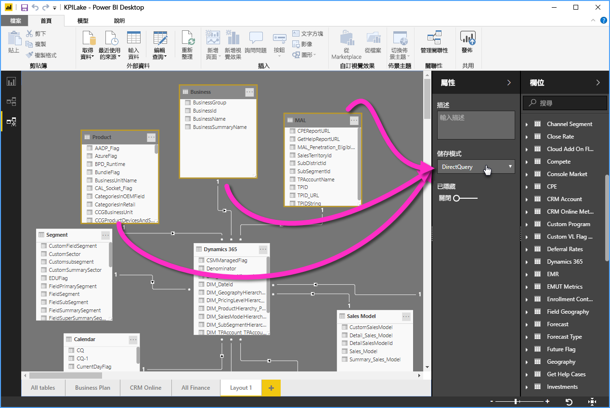

# 在 Power BI Desktop 中使用模型化檢視

透過使用 **Power BI Desktop** 中的**模型檢視**，您可以檢視並處理包含許多資料表的複雜資料集。

## 使用模型檢視

若要存取模型檢視，請選取位於 **Power BI Desktop** 左側的 [模型檢視] 圖示，如下列影像所示。

![Power BI Desktop 中的 [模型檢視] 圖示](media/desktop-modeling-view/modeling-view_02.png)

## 建立個別圖表

透過使用模型檢視，您可以針對模型建立僅包含模型中一部分資料表的圖表。 這可以協助更清楚地顯示您想要處理的資料表，並簡化處理複雜資料集的工作。 若要建立僅包含一部分資料表的新圖表，請按一下位於 Power BI Desktop 視窗底部之 [所有資料表] **+ 索引標籤旁邊的**  符號。

您可以從 [欄位]  清單將資料表拖曳至圖表介面。 以滑鼠右鍵按一下資料表，然後從顯示的功能表中選取 [新增相關資料表]  。

![以滑鼠右鍵按一下資料表並選取 [新增相關資料表]](media/desktop-modeling-view/modeling-view_04.png)

當您這麼做時，與原始資料表相關的資料表將會顯示在新的圖表中。 下圖顯示選取 [新增相關資料表]  功能表選項後，相關資料表的顯示方式。

## 設定通用屬性

您可以在 [模型檢視] 中同時選取多個物件，方法是按住 **CTRL** 鍵並按一下多個資料表。 當您選取多個資料表時，系統會在 [模型檢視] 中醒目提示它們。 在醒目提示多個資料表的情況下，在 [屬性]  窗格中所套用的變更將會套用到所有已選取的資料表。

例如，您可以變更圖表檢視中多個資料表的[儲存模式](desktop-storage-mode.md)，方法是按住 **CTRL** 鍵，選取資料表，然後在 [屬性]  窗格中變更儲存模式設定。

## 後續步驟

下列文章會詳細說明資料模型與 DirectQuery。

* [Power BI Desktop 中的彙總 (預覽)](desktop-aggregations.md)
* [Power BI Desktop 中的複合模型](desktop-composite-models.md)
* [Power BI Desktop 中的儲存模式 (預覽)](desktop-storage-mode.md)
* [Power BI Desktop 中的多對多關聯性](desktop-many-to-many-relationships.md)

DirectQuery 文章：

* [使用 Power BI 中的 DirectQuery](../connect-data/desktop-directquery-about.md)
* [Power BI 中 DirectQuery 支援的資料來源](../connect-data/power-bi-data-sources.md)
