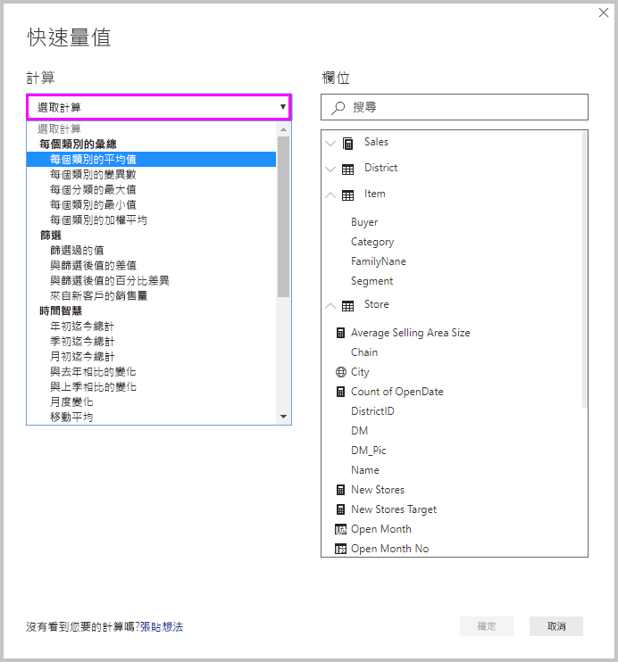
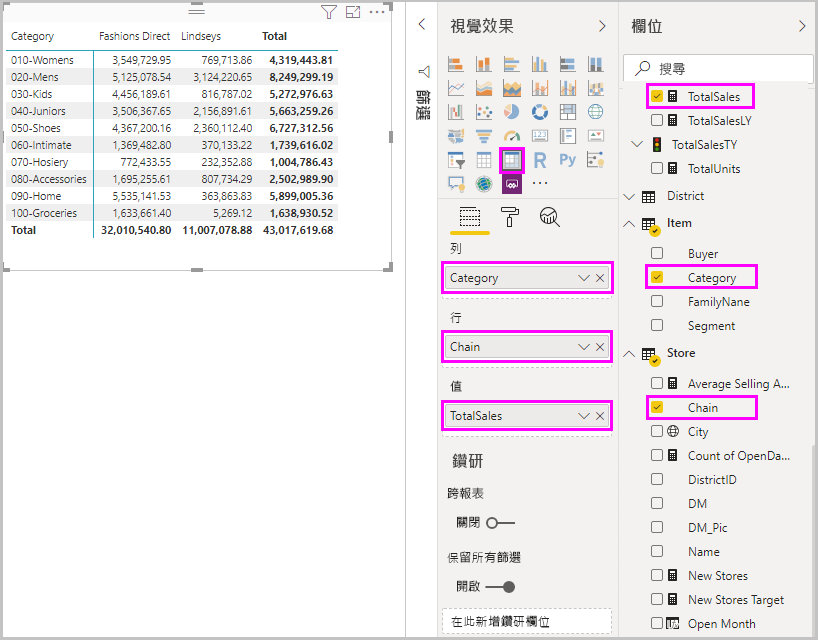
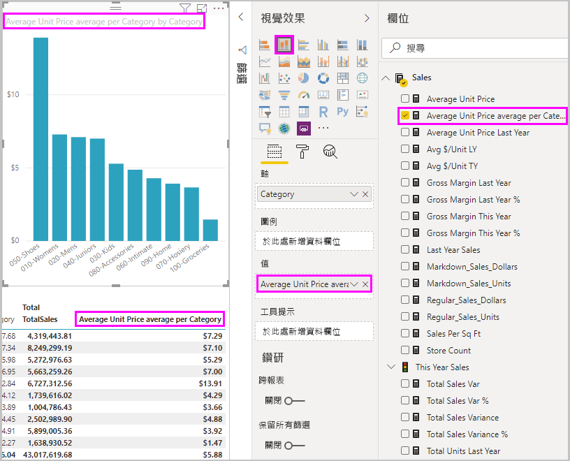
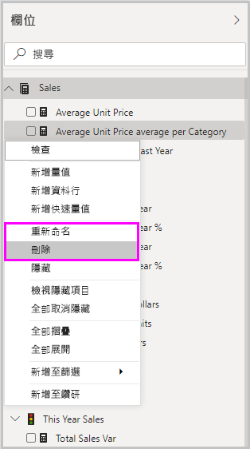

# 使用快速量值以執行常用的計算
您可以使用「快速量值」  來快速輕鬆執行常用及功能強大的計算。 快速量值會在幕後執行一組資料分析運算式 (DAX) 命令，然後顯示結果供您在報表中使用。 您不需要撰寫 DAX，這會根據您在對話方塊中提供的輸入來幫您完成。 計算有多種可用的分類，也有多種方式可以修改各項計算，以符合您的需求。 或許最棒的是，您可以查看快速量值所執行的 DAX，以啟發或拓展 DAX 知識。

## 建立快速量值

若要在 Power BI Desktop 建立快速量值，請以右鍵按一下或選取 [欄位]  窗格中任何項目旁邊的省略符號 ( **...** )，然後從出現的功能表選取 [新增快速量值]  。 

![選取 [新增快速量值]](media/desktop-quick-measures/quick-measures_01.png)

您也可以針對現有的視覺效果，用滑鼠右鍵按一下或選取 [值]  中任何值旁的下拉式箭號，然後從功能表選取 [新增快速量值]  。 

當選取 [新增快速量值]  時，[快速量值]  視窗隨即出現，可其讓您選取想要的計算，以及用來執行計算的欄位。 

選取 [選取計算]  欄位，以查看可用快速量值的長清單。 

五種快速量值計算類型及其計算如下：

* **依類別來彙總**
  * 每個類別的平均值
  * 每個類別的變異數
  * 每個類別的最大值
  * 每個分類的最小值
  * 每個分類的加權平均
* **篩選條件**
  * 篩選過的值
  * 與篩選後值的差值
  * 與篩選後值的百分比差異
  * 來自新客戶的銷售量
* **時間智慧**
  * 年初迄今總計
  * 季初迄今總計
  * 月初迄今總計
  * 與去年相比的變化
  * 與上季相比的變化
  * 月度變化
  * 移動平均
* **總計**
  * 累積總計
  * 分類總計 (套用篩選)
  * 分類總計 (未套用篩選)
* **數學運算**
  * 加法
  * 減
  * 乘
  * 除
  * 差異百分比
  * 相互關聯係數
* **文字**
  * 星級評等
  * 值的串連清單

若要提交您想要查看的新快速量值、基礎 DAX 公式或其他快速量值的考量想法，請參閱本文的結尾。

> [!NOTE]
> 使用 SQL Server Analysis Services (SSAS) 即時連線時，一些快速量值可供使用。 Power BI Desktop 只會顯示所連線 SSAS 版本支援的快速量值。 如果您連線到 SSAS 即時資料來源，但看不到清單中的某些快速量值，這是因為所連線 SSAS 版本不支援用來實作那些快速量值的 DAX 命令。

在選取要用於快速量值的計算和欄位之後，請選取 [確定]  。 新的快速量值會出現在 [欄位]  窗格中，且基礎 DAX 公式會出現在公式列中。 

## 快速量值範例
讓我們來看一個快速量值的實際運作方式。

下列矩陣視覺效果顯示不同產品的銷售資料表。 這是包含各分類目錄銷售總計的基本資料表。

選取矩陣視覺效果後，選取 [值]  中 [TotalSales]  旁邊的下拉式箭頭，然後選取 [新增快速量值]  。 

在 [快速量值]  視窗的 [計算]  下，選取 [每個類別的平均值]  。 

將 [欄位]  窗格中的 [平均單價]  拖曳到 [基底值]  欄位中。 將 [類別]  留在 [類別]  欄位中，然後選取 [確定]  。 

當選取 [確定]  時，會發生幾件有趣的事情。

![視覺效果、公式列和 [欄位] 清單中的新快速量值](media/desktop-quick-measures/quick-measures_07.png)

1. 矩陣視覺效果有一個新的資料行，其中會顯示計算出來的 [每個類別的平均單價]  。
   
2. 新快速量值的 DAX 公式會出現在公式列中。 如需 DAX 公式的詳細資訊，請參閱[下一節](#learn-dax-by-using-quick-measures)。
   
3. 新的快速量值會在 [欄位]  窗格中顯示為已選取且醒目顯示。 

新的快速量值適用於報表中任何視覺效果，而不只是您建立時針對的視覺效果。 下圖顯示使用 [新增快速量值] 欄位建立的快速直條圖視覺效果。

## 使用快速量值了解 DAX
快速量值的絕佳優點是可以顯示實作量值的 DAX 公式。 在 [欄位]  窗格中選取快速量值時，[公式列]  隨即出現，其顯示 Power BI 所建立用來實作量值的 DAX 公式。

公式列不只會顯示量值背後的公式，更重要的是，也會讓您了解如何建立快速量值下的 DAX 公式。

想像您需要進行年度計算，但不確定如何建立 DAX 公式，或您不知道從哪裡著手。 與其在桌前懊惱，不如使用 [年度變化]  計算來建立快速量值，並查看其在視覺效果中的顯示方式，以及 DAX 公式的運作方式。 然後您可以直接對 DAX 公式進行變更，或建立符合需求和預期的類似量值。 這就像是有一位老師，只要按幾下滑鼠就能立即回應您的假設問題。 

如果不喜歡，您可以隨時從模型中刪除快速量值。 只需要以滑鼠右鍵按一下或選取量值旁的 [...]  ，然後選取 [刪除]  。 您也可以從功能表選取 [重新命名]  ，將快速量值重新命名為任何想要的名稱。 

## 限制與考量
有幾點限制和考量要留意。

- 您可以透過報表中任何視覺效果來使用新增至 [欄位]  窗格中的快速量值。
- 您可以隨時查看與快速量值建立關聯的 DAX，方法是選取 [欄位]  清單中的量值，然後查看公式列中的公式。
- 只有當您可以修改模型時，才能使用快速量值。 當您使用一些即時連線時，情況並不是如此。 如先前所述，SSAS 表格式即時連線會受到支援。
- 使用 DirectQuery 模式時，無法建立時間智慧快速量值。 轉譯成傳送到您資料來源的 T-SQL 陳述式時，這些快速量值中使用的 DAX 函式會影響效能。

> [!IMPORTANT]
> 快速量值的 DAX 陳述式只使用逗號作為引數分隔符號。 如果 Power BI Desktop 版本的語言是以逗號作為小數分隔符號，快速量值就無法正常運作。

### 時間智慧與快速量值
您可以使用自己的自訂日期資料表來搭配時間智慧快速量值。 如果您要使用外部表格式模型，請確定在建置模型時，資料表中的主要日期資料行已標示為日期資料表，如 [Specify Mark as Date Table for use with time-intelligence](https://docs.microsoft.com/sql/analysis-services/tabular-models/specify-mark-as-date-table-for-use-with-time-intelligence-ssas-tabular) (指定標記為日期資料表以搭配時間智慧使用) 中所述。 如果要匯入自己的日期資料表，則請務必將它標記為日期資料表，如[在 Power BI Desktop 中設定和使用日期資料表](desktop-date-tables.md)中所述。

### 其他資訊及範例
對於快速量值有任何尚未提供的想法嗎？ 太棒了！ 請參閱 [Power BI Ideas](https://go.microsoft.com/fwlink/?linkid=842906) (Power BI 構想) 頁面，並提交您的想法和 DAX 公式，以取得您想要在 Power BI Desktop 中看到的快速量值。 我們會考慮在未來的版本中新增到快速量值清單。

