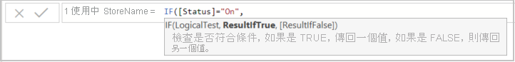
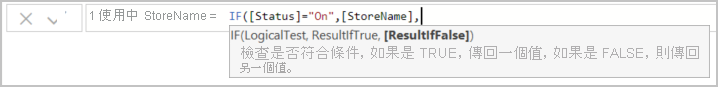
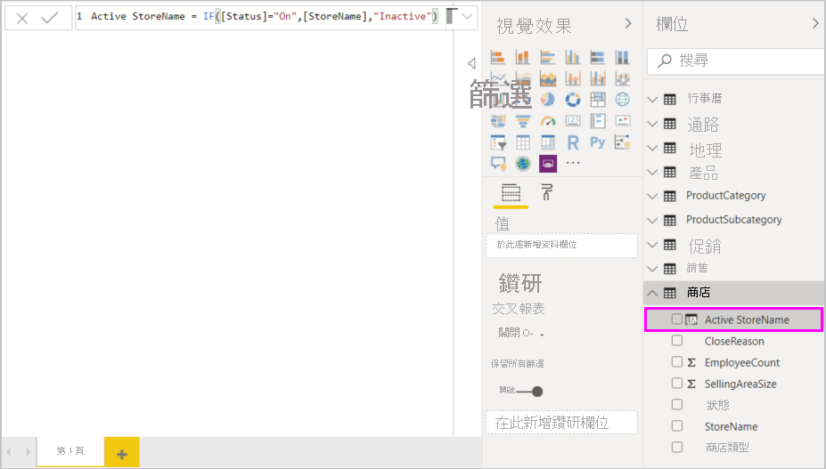

# 教學課程：在 Power BI Desktop 中建立您自己的導出資料行

有時，您分析中的資料並未包含需要取得結果的特定欄位。 這就是「計算結果欄」  派上用場的地方。 計算結果欄會使用「資料分析運算式」(DAX) 公式來定義資料行的值，從將來自一些不同資料行的文字值組合在一起，到從其他值計算出一個數值，都包含在內。 例如，假設您的資料具有 [城市]  和 [州別]  欄位，但您想要一個包含兩者的單一 [位置]  欄位，例如「佛羅里達州邁阿密」。 這正是計算結果欄的目的。

計算結果欄與[量值](desktop-tutorial-create-measures.md)的相似之處在於兩者都是以 DAX 公式為基礎，相異之處則是兩者的使用方式不同。 您通常會在視覺效果的 [值]  區域中使用量值，以根據其他欄位計算結果。 您會在視覺效果的資料列、軸、圖例及群組區域中，使用計算結果欄作為新的**欄位**。

本教學課程將引導您了解計算結果欄，以及在 Power BI Desktop 中的報表視覺效果中建立和使用一些計算結果欄。

## 必要條件

- 本教學課程適用於已經熟悉使用 Power BI Desktop，用來建立更進階模型的 Power BI 使用者。 您應該已經熟悉如何使用 [取得資料] 和 Power Query 編輯器來匯入資料、使用多個相關資料表，以及將欄位新增至報表畫布。 如果您剛開始使用 Power BI Desktop，請務必參閱[開始使用 Power BI Desktop](../fundamentals/desktop-getting-started.md)。
  
- 本教學課程使用[適用於 Power BI Desktop 的 Contoso 銷售範例](https://download.microsoft.com/download/4/6/A/46AB5E74-50F6-4761-8EDB-5AE077FD603C/Contoso%20Sales%20Sample%20for%20Power%20BI%20Desktop.zip)，這是[在 Power BI Desktop 中建立您自己的量值](desktop-tutorial-create-measures.md)教學課程中所使用的相同範例。 這份來自虛構公司 Contoso, Inc. 的銷售資料是從資料庫匯入的，因此您無法連線到資料來源或在「Power Query 編輯器」中檢視它。 請在您自己的電腦上下載檔案並將檔案解壓縮，然後在 Power BI Desktop 中開啟它。

## 使用來自相關資料表的值來建立計算結果欄

在您的「銷售報表」中，您想要將產品類別和子類別顯示成單一值，例如「行動電話 – 配件」、「行動電話 – 智慧型手機和 PDA」等。 [欄位]  清單中並沒有提供該資料的欄位，但有 [ProductCategory]  欄位和 [ProductSubcategory]  欄位，分別在自己的資料表中。 您可以建立一個計算結果欄，以結合來自這兩個資料行的值。 DAX 公式可以利用您已經建立之模型的完整功能，包括現有不同資料表之間的關聯性。

 ![[欄位] 清單中的資料行](media/desktop-tutorial-create-calculated-columns/create1.png)

1. 若要在 **ProductSubcategory** 資料表中建立新的資料行，請以滑鼠右鍵按一下或選取 [欄位]  窗格中 **ProductSubcategory** 旁的省略符號 **...** ，然後從功能表中選取 [新增資料行]  。

   

   當您選取 [新增資料行]  時，**公式列**會出現在報表畫布頂端，可供您為資料行命名及輸入 DAX 公式。

   

2. 新的計算結果欄名稱預設為**資料行**。 如果您未將其重新命名，則額外的新資料行將會命名為**資料行 2**、**資料行 3**，依此類推。 您會想要讓資料行更容易識別，因此當公式列中已經醒目提示**資料行**名稱時，請鍵入 **ProductFullCategory** 將其重新命名，然後鍵入一個等號 ( **=** )。

3. 您想要讓新資料行中的值以 **ProductCategory** 欄位中名稱作為開頭。 由於這個資料行在不同但相關的資料表中，因此您可以使用 [RELATED](https://msdn.microsoft.com/library/ee634202.aspx) 函數來幫助您取得它。

   在等號後面，輸入 **r**。 下拉式建議清單會顯示所有開頭為字母 R 的 DAX 函數。選取每個函數便會顯示其效果的描述。 在您輸入時，建議清單會調整成越來越接近您所需的函數。 選取 **RELATED**，然後按 **Enter**鍵。

   ![選擇 [RELATED]](media/desktop-tutorial-create-calculated-columns/create4.png)

   左括弧隨即出現，並伴隨另一個可以傳遞給 RELATED 函式的相關資料行建議清單，其中有關於所預期參數的描述和詳細資料。

   ![選擇 [ProductCategory]](media/desktop-tutorial-create-calculated-columns/create5.png)

4. 您想要來自 [ProductCategory]  資料表的 [ProductCategory]  資料行。 請選取 [ProductCategory[ProductCategory]]  、按 **Enter** 鍵，然後輸入右括弧。

    > [!TIP]
    > 語法錯誤的原因通常是遺失或錯置右括弧，不過有時 Power BI Desktop 會為您加上該括弧。

5. 您想要使用虛線和空格來分隔新值中的 **ProductCategory** 和 **ProductSubcategory**，因此請在第一個運算式的右括弧之後，鍵入空格、 **&** 符號、雙引號 ( **"** )、空格、虛線 ( **-** )、另一個空格、另一個雙引號，以及另一個 & 符號。 您的公式現在看起來應該像這樣：

    `ProductFullCategory = RELATED(ProductCategory[ProductCategory]) & " - " &`

    > [!TIP]
    > 如果您需要更多空間，請選取公式列右側的向下 V 形箭號，以展開公式編輯器。 在編輯器中，按 **Alt + Enter** 鍵來下移一行，然後按 **Tab** 鍵來移動項目。

6. 輸入一個左括弧 ( **[** )，然後選取 [ProductSubcategory]  資料行以完成公式。 

    ![選擇 [ProductSubcategory]](media/desktop-tutorial-create-calculated-columns/create6.png)

    您不需要使用另一個 RELATED 函式來呼叫第二個運算式中的 **ProductSubcategory** 資料表，因為您正於此資料表中建立計算結果欄。 您可以輸入包含資料表名稱前置詞 (完整名稱) 或不含資料表名稱前置詞 (非限定) 的 **[ProductSubcategory]** 。

7. 按 **Enter** 鍵或選取公式列中的核取記號來完成公式。 公式會進行驗證，且 **ProductFullCategory** 資料行名稱會出現在 [欄位]  窗格的 **ProductSubcategory** 資料表中。

   

    >[!NOTE]
    >在 Power BI Desktop 的 [欄位]  窗格中，計算結果欄會有特殊的圖示，顯示其包含公式。 在 Power BI 服務 (Power BI 網站) 中，由於無法變更公式，因此計算結果欄並沒有圖示。

## 在報表中使用新的資料行

現在您可以使用新的 **ProductFullCategory** 資料行，以依 **ProductFullCategory** 查看 **SalesAmount**。

1. 選取 **ProductFullCategory** 資料行或將其從 **ProductSubcategory** 資料表中拖曳至報表畫布，以建立一個顯示所有 **ProductFullCategory** 名稱的資料表。

   

2. 選取 **SalesAmount** 欄位或將其從 **Sales** 資料表中拖曳至資料表，以顯示每個 **ProductFullCategory** 的 **SalesAmount**。

   

## 建立使用 IF 函數的計算結果欄

「Contoso 銷售範例」包含營運中和非營運中商店的銷售資料。 您想要藉由建立 **Active StoreName** 欄位，確保在報表中將營運中門市銷售額與非營運中門市銷售額清楚分隔。 在新的 **Active StoreName** 計算結果欄中，每個營運中門市會以門市全名顯示，而非營運中門市銷售額則會一起分組到一個稱為 **Inactive** 的明細項目中。

幸好，**Stores** 資料表有名為 **Status** 的資料行，如果門市為營運中，其值會是 "On"；如果門市為非營運中，則其值為 "Off"，我們可以使用這些值來為新的 **Active StoreName** 資料行建立值。 DAX 公式將會使用邏輯 [IF](https://msdn.microsoft.com/library/ee634824.aspx) 函式來測試每個門市的**狀態**，然後根據結果傳回特定的值。 如果門市的**狀態**是 "On"，公式就會傳回門市的名稱。 如果是 "Off"，公式就會將其 **Active StoreName** 指派為 "Inactive"。

1. 在 **Stores** 資料表中建立新的計算結果欄，並在公式列中將其命名為 **Active StoreName**。

2. 在 **=** 符號之後，開始輸入 **IF**。 建議清單將會顯示您可以加入的項目。 選取 [IF]  。

    ![選取 [IF]](media/desktop-tutorial-create-calculated-columns/if1.png)

3. **IF** 的第一個引數是一個了解門市**狀態**是否為 "On" 的邏輯測試。 鍵入左括弧 **[** 以列出 **Stores** 資料表中的資料行，然後選取 **[Status]** 。

    ![選取 [Status]](media/desktop-tutorial-create-calculated-columns/if2.png)

4. 在 [Status]  後緊接著輸入 **="On"** ，然後輸入逗號 ( **,** ) 以結束引數。 工具提示會建議您現在需要新增當結果為 TRUE 時要傳回的值。

    

5. 如果商店的狀態是 "On"，您想要顯示該商店的名稱。 輸入左括號 ( **[** ) 並選取 [StoreName]  資料行，然後輸入另一個逗號。 工具提示現在會指出您需要新增當結果為 FALSE 時要傳回的值。

    

6. 您希望該值是 "Inactive"，因此請鍵入 **"Inactive"** ，然後按 **Enter** 或選取公式列中的核取記號來完成公式。 公式會進行驗證，然後新資料行名稱會出現在 [欄位]  窗格的 **Stores** 資料表中。

    

7. 您可以在視覺效果中使用新的 **Active StoreName** 資料行，就像任何其他欄位一樣。 若要依 **Active StoreName** 顯示 **SalesAmount**，請選取 **Active StoreName** 欄位或將其拖曳至報表畫布，然後選取 **SalesAmount** 欄位或將其拖曳至資料表。 在此資料表中，營運中商店會依名稱個別顯示，但非營運中商店則會一起成組歸類到結尾的 **Inactive** 中。

    

## 您學到的內容

計算結果欄可以充實您的資料，並提供更簡單明瞭的見解。 您已了解如何在 [欄位]  窗格和公式列中建立計算結果欄、使用建議清單和工具提示來協助建構公式、使用適當的引數來呼叫 DAX 函式 (例如 RELATED 和 IF)，以及在報表視覺效果中使用計算結果欄。

## 後續步驟

如果您想要深入剖析 DAX 公式，並使用更進階的公式來建立計算結果欄，請參閱 [Power BI Desktop 的 DAX 基本概念](desktop-quickstart-learn-dax-basics.md)。 本文著重在 DAX 中的基本概念，例如語法、函數，並且更徹底了解內容。

請務必將[資料分析運算式(DAX) 參考](https://msdn.microsoft.com/library/gg413422.aspx)加入我的最愛中。 您可以在此找到 DAX 語法、運算子和超過 200 種 DAX 函式的詳細資訊。
