# 教學課程：在 Power BI Desktop 中建立您自己的量值
您可以在 Power BI Desktop 中使用量值來建立一些最強大的資料分析方案。 當您與報表互動時，量值會在您的資料上執行計算，藉此提供協助。 本教學課程將引導您了解量值，並在 Power BI Desktop 中建立自己的基本量值。

## 必要條件

- 本教學課程適用於已經熟悉使用 Power BI Desktop，用來建立更進階模型的 Power BI 使用者。 您應該已經很熟悉如何使用 [取得資料] 和查詢編輯器來匯入資料、使用多個相關資料表，以及將欄位新增到報表畫布。 如果您剛開始使用 Power BI Desktop，請務必參閱[開始使用 Power BI Desktop](../fundamentals/desktop-getting-started.md)。
  
- 本教學課程使用 [Contoso Sales Sample for Power BI Desktop](https://download.microsoft.com/download/4/6/A/46AB5E74-50F6-4761-8EDB-5AE077FD603C/Contoso%20Sales%20Sample%20for%20Power%20BI%20Desktop.zip) (適用於 Power BI Desktop 的 Contoso 銷售範例) 檔案，其中包含虛構公司 Contoso 的線上銷售資料。 因為此資料是從資料庫匯入，所以無法連線到該資料來源或在 [查詢編輯器] 中進行檢視。 從電腦下載並解壓縮檔案。

## 自動量值

當 Power BI Desktop 建立量值時，其通常會自動為您建立。 若要查看 Power BI Desktop 如何建立量值，請遵循下列步驟：

1. 在 Power BI Desktop 中，選取 [檔案]   > [開啟舊檔]  、瀏覽至 *Contoso Sales Sample for Power BI Desktop.pbix* 檔案，然後選取 [開啟]  。

2. 在 [欄位]  窗格中，展開 [Sales]  資料表。 然後，選取 [SalesAmount]  欄位旁的核取方塊，或將 [SalesAmount]  拖曳至報表畫布上。

    新的直條圖視覺效果隨即出現，並顯示 **Sales** 資料表 **SalesAmount** 資料行中所有值的總和。

    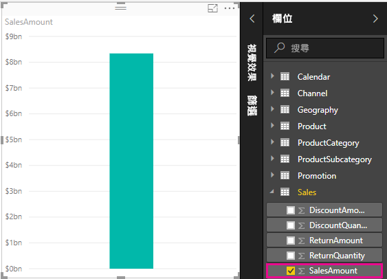

[欄位]  窗格中的任何欄位 (資料行)，如果有 sigma 圖示  則為數值，其值可加以彙總。 Power BI Desktop 在偵測到數值資料類型時會自動建立並計算量值來彙總資料，而不會顯示具有許多值 (對於 **SalesAmount** 而言是兩百萬筆資料列) 的資料表。 總和是數值資料類型的預設彙總，但您可以輕鬆地套用不同的彙總，例如平均或計數。 了解彙總是了解量值的基礎，因為每個量值都會執行某種類型的彙總。 

若要變更圖表彙總，請遵循下列步驟：

1. 在報表畫布中選取 [SalesAmount]  視覺效果。  

1. 在 [視覺效果]  窗格的 [值]  區域中，選取 [SalesAmount]  右邊的向下箭號。 

1. 從顯示的功能表選取 [平均]  。 

    視覺效果會變更為 [SalesAmount]  欄位中所有銷售值的平均。

    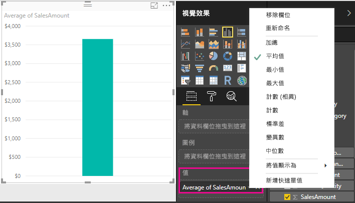

您可以視想要的結果來變更彙總類型。 不過，並非所有類型的彙總都適用於每個數值資料類型。 例如，針對 [SalesAmount]  欄位，加總和平均很有用，最小值和最大值也有其意義。 但是計數對於 [SalesAmount]  欄位而言並沒有多大意義，原因在於雖然其值為數值，但其實是貨幣。

從量值計算得來的值會隨著您與報表的互動而變更。 例如，如果將 [RegionCountryName]  欄位從 [Geography]  資料表拖曳至現有的 [SalesAmount]  圖表，則會變更為顯示每個國家/地區的平均銷售金額。

當量值的結果因為與報表互動而變更時，即會影響到量值的「內容」  。 每次您與報表視覺效果互動時，即會變更量值計算並顯示其結果的內容。

## 建立和使用自己的量值

在大部分情況下，Power BI Desktop 會根據您選擇的欄位和彙總類型來自動計算並傳回值。 但在部分情況下，建議您建立自己的量值，以執行更複雜且獨特的計算。 有了 Power BI Desktop，您就可以使用資料分析運算式 (DAX) 公式語言來建立自己的量值。 

DAX 公式使用許多與 Excel 公式相同的函數、運算子和語法。 不過，當您與報表互動時，DAX 函數主要用來處理關聯式資料，以及執行更加動態的計算。 有超過 200 種 DAX 函數可執行各種計算，從像是總和與平均的簡單彙總，到更複雜的統計和篩選函數皆有。 有許多資源可以協助您深入了解 DAX。 當完成本教學課程之後，請參閱 [Power BI Desktop 的 DAX 基本概念](desktop-quickstart-learn-dax-basics.md)。

當建立自己的量值時，此量值稱為「模型」  量值，且會新增至所選取資料表的 [欄位]  清單。 模型量值的部分優點是，您可以使用任何想要的名稱來為其命名，使其更容易識別；您可以將其用作其他 DAX 運算式中的引數；且您可以使其快速地執行複雜的計算。

### 快速量值

從 Power BI Desktop 的 2018 年 2 月版本開始，許多常用計算都可用來作為「快速量值」  ，其會根據您在視窗中的輸入來撰寫 DAX 公式。 這些快速且功能強大的計算也很適合用於學習 DAX 或植入您自己的自訂量值。 

使用下列其中一種方法來建立快速量值： 
 - 從 [欄位]  窗格中的資料表，以滑鼠右鍵按一下或選取 [更多選項]  ( **...** )，然後從清單選取 [新增快速量值]  。

 - 在 Power BI Desktop 功能區 [常用]  索引標籤的 [計算]  下，選取 [新增快速量值]  。

如需建立及使用快速量值的詳細資訊，請參閱[使用快速量值](desktop-quick-measures.md)。

### 建立量值

假設您想要藉由從總銷售金額減去折扣和退貨來分析淨銷售額。 針對存在於視覺效果中的內容，您需要會從 SalesAmount 總和減去 DiscountAmount 和 ReturnAmount 總和的量值。 [欄位]  清單中沒有任何適用於淨銷售額的欄位，但是您可以使用建置組塊來建立自己的量值，以計算淨銷售額。 

若要建立量值，請遵循下列步驟：

1. 在 [欄位]  窗格中，以滑鼠右鍵按一下 [Sales]  資料表，或將滑鼠暫留在該資料表並選取 [更多選項]  ( **...** )。 

1. 從顯示的功能表，選取 [新增量值]  。 

    此動作會將您的新量值儲存在 [Sales]  資料表中，以方便尋找。
    
    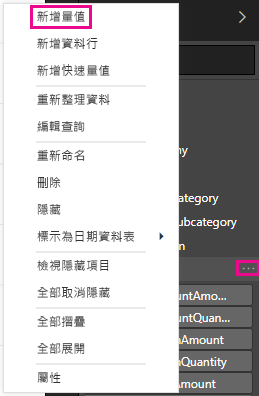
    
    也可以在 Power BI Desktop 功能區 [常用]  索引標籤上選取 [計算]  區組中的 [新增量值]  ，以建立新的量值。
    
    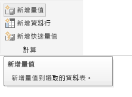
    
    >[!TIP]
    >從功能區建立量值時，您可以在任何資料中表建立，但如果在計畫使用的地方建立，則會較方便尋找。 在本案例中，請先選取 [Sales]  資料表讓它成為使用中，然後選取 [新增量值]  。 
    
    公式列會出現在報表畫布上方，您可以在其中重新命名量值，並輸入 DAX 公式。
    
    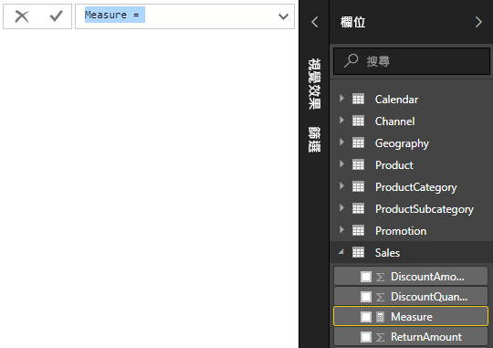
    
1. 根據預設，每個新的量值會命名為 *Measure*。 如果不重新命名量值，則其他的新量值會命名為 *Measure 2*、*Measure 3*，依此類推。 因為想要讓這個量值更可識別，所以請醒目顯示公式列中的 *Measure*，然後將它變更為 *Net Sales*。
    
1. 開始輸入公式。 在等號之後，開始輸入 *Sum*。 鍵入時即會隨即出現下拉式建議清單，其中顯示以您鍵入字母為開頭的所有 DAX 函式。 視需要向下捲動，以便從清單選取 [SUM]  ，然後按 **Enter**。
    
    
    
    左括弧隨即出現，並出現下拉式建議清單，其中包含可傳遞至 SUM 函式的可用資料行。
    
    
    
1. 運算式一律會出現在左右括弧之間。 針對此範例，運算式會包含要傳遞至 SUM 函式的單一引數：**SalesAmount** 資料行。 開始鍵入 *SalesAmount*，直到 **Sales(SalesAmount)** 是清單中剩下的唯一值為止。 

    前面加上資料表名稱的資料行名稱，即為資料行的完整名稱。 完整的資料行名稱可讓公式更容易閱讀。
    
    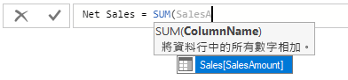
    
1. 從清單選取 [Sales[SalesAmount]]  ，然後輸入右括弧。
    
    > [!TIP]
    > 語法錯誤通常因遺失或錯置右括弧所導致。
    
    
    
1. 在公式內減去其他兩個資料行：

    a. 在第一個運算式的右括弧之後，依序輸入一個空格、一個減號運算子及另一個空格。 

    b. 輸入另一個 SUM 函式，並開始鍵入 *DiscountAmount*，直到您可以選擇 [Sales[DiscountAmount]]  資料行作為引數為止。 加上右括號。 

    c. 依序輸入一個空格、一個減號運算子、空格、另一個含有 **Sales[ReturnAmount]** 作為引數的 SUM 函式，以及右括號。
    
    
    
1. 按下 **Enter** 鍵或選取公式列中的 [認可]  (核取記號圖示)，以完成並驗證公式。 

    經驗證 [Net Sales]  量值現在已準備好在 [欄位]  窗格中的 [Sales]  資料表使用。
    
    
    
1. 如果您沒有空間可輸入公式，或想要使其位於個別行上，請選取公式列右側的向下箭號，以提供更多空間。 

    向下箭號會變成向上箭號，且會出現一個大型方塊。

    

1. 按 **Alt** + **Enter** 來分隔數行，或按 **Tab** 鍵來新增定位點間距，藉此分隔公式的各部分。

   

### 在報表中使用您的量值
將新的 [Net Sales]  量值新增至報表畫布，並依據新增至報表的任何其他欄位來計算淨銷售額。 

依國家/地區查閱淨銷售額：

1. 從 **Sales** 資料表選取 **Net Sales** 量值，或將它拖曳至報表畫布。
    
1. 從 [Geography]  資料表選取 [RegionCountryName]  欄位，或將它拖曳至 [Net Sales]  圖表。
    
    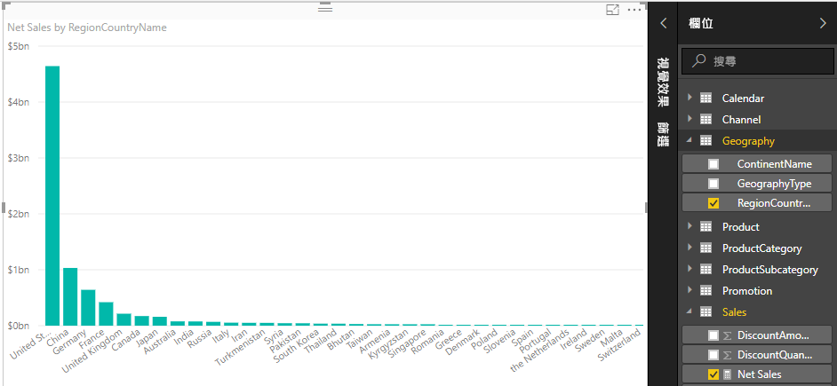
    
1. 若要依國家/地區查看淨銷售額與總銷售額之間的差額，請選取 [SalesAmount]  欄位，或將它拖曳至圖表。 

    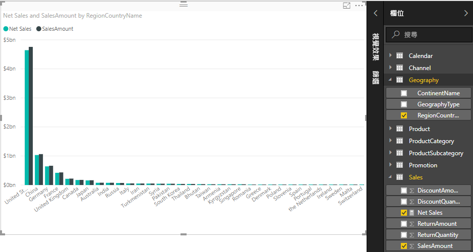

    圖表現在會使用兩個量值：Power BI 自動加總的 [SalesAmount]  ，以及您手動建立的 [Net Sales]  量值。 每個量值都會在另一個欄位 [RegionCountryName]  的內容中加以計算。
    
### 搭配交叉分析篩選器使用量值

新增交叉分析篩選器以便進一步依行事曆年度篩選淨銷售額和銷售金額：
    
1. 選取圖表旁邊的空白區域。 在 [視覺效果]  窗格中，選取 [資料表]  視覺效果。 

    這個動作會在報表畫布上建立空白的資料表視覺效果。
    
    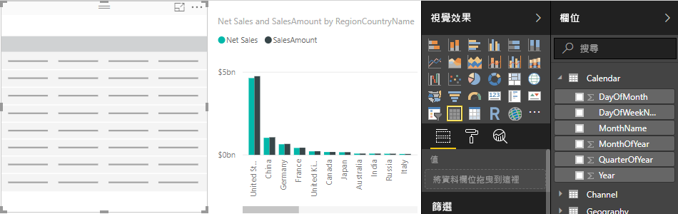
    
1. 將 [Year]  欄位從 [Calendar]  資料表拖曳到新的空白資料表視覺效果。 
    
    因為 [Year]  是數值欄位，所以 Power BI Desktop 會加總其值。 此總和不適用於彙總；我們會在下一個步驟中解決此情況。

    
    
3. 在 [視覺效果]  窗格的 [值]  方塊中，選取 [Year]  旁的向下箭號，然後從清單選取 [不摘要]  。 資料表現在會列出個別年度。
    
    ![選取 [不摘要]](media/desktop-tutorial-create-measures/meastut_netsales_year_donotsummarize.png)
    
4.  在 [視覺效果]  窗格中選取**交叉分析篩選器**圖示，將資料表轉換成交叉分析篩選器。 如果視覺效果顯示滑桿而不是清單，請從滑桿的向下箭號選取 [清單]  。

    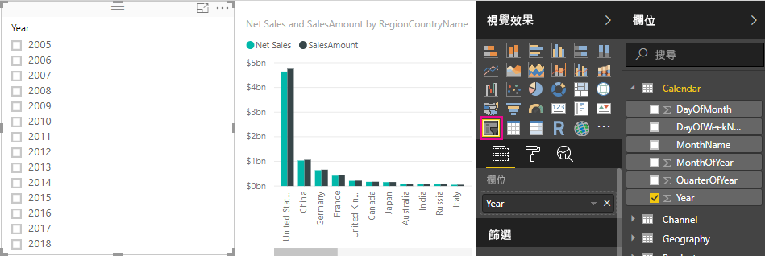
    
5.  選取 [Year]  交叉分析篩選器中的任何值，據以篩選 [依國家/地區名稱顯示的淨銷售額與銷售金額]  圖表。 [Net Sales]  和 [SalesAmount]  量值會重新計算，並在所選取 [Year]  欄位的內容中顯示結果。 
    
    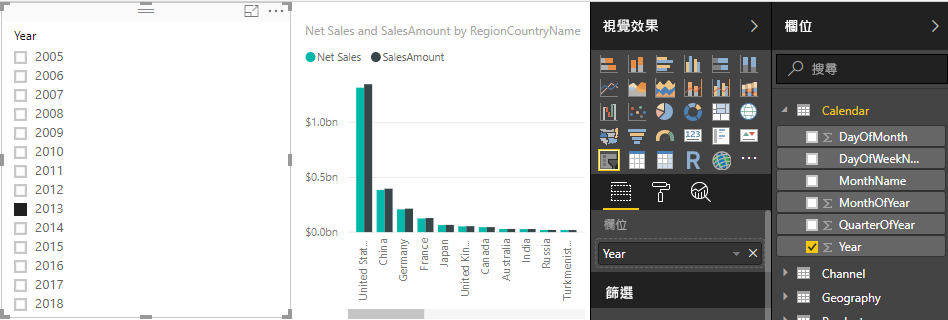

### 在另一個量值中使用您的量值

假設您想要找出哪些產品每單位銷售的淨銷售額最高。 您需要將淨銷售額除以銷售單位數量的量值。 建立新的量值，其會將 [Net Sales]  量值結果除以 [Sales[SalesQuantity]]  的總和。

1.  在 [欄位]  窗格的 [Sales]  資料表中，建立名為 [Net Sales per Unit]  的新量值。
    
1. 在公式列中，開始輸入 *Net Sales*。 建議清單將會顯示您可以新增的項目。 選取 **Net Sales**。
    
    
    
1. 只要輸入左括號 ( **[** )，您也能參考量值。 建議清單只會顯示要新增至公式的量值。
    
    
    
1. 依序輸入一個空格、除法運算子 (/)、另一個空格、SUM 函式，然後鍵入 *Quantity*。 建議清單會顯示名稱中具有 *Quantity* 的所有資料行。 選取 [Sales[SalesQuantity]]  、鍵入右括弧，然後按 **ENTER** 或選取 [認可]  (核取記號圖示) 來驗證公式。 

    產生的公式應會顯示為：
    
    `Net Sales per Unit = [Net Sales] / SUM(Sales[SalesQuantity])`
    
1. 從 [Sales]  資料表選取 [Net Sales per Unit]  量值，或將其拖曳至報表畫布中的空白區域。 

    圖表會顯示已售出所有產品中每個單位的淨銷售額。 此圖表資訊價值不高；我們會在下一個步驟中解決此情況。
    
    
    
1. 如需不同外觀，請將圖表視覺效果類型變更為 **樹狀圖**。
    
    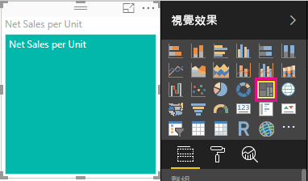
    
1. 選取 [產品類別]  欄位，或將它拖曳至樹狀圖或 [視覺效果]  窗格的 [群組]  欄位。 現在您擁有一些良好資訊！
    
    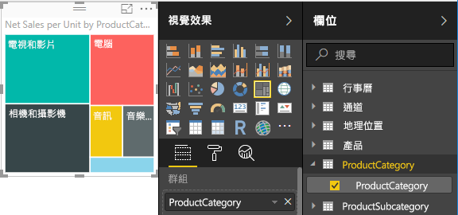
    
7. 嘗試移除 [ProductCategory]  欄位，並改為將 [ProductName]  欄位拖曳至圖表。 
    
    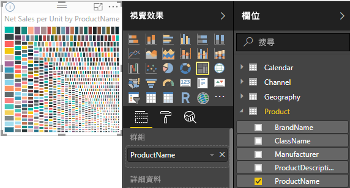
    
   好，現在我們只是熱身而已，但您必須承認，這很酷！ 使用其他方式進行實驗來篩選視覺效果並加以格式化。

## 您學到的內容
量值讓您有動力，能夠從資料中取得所需的見解。 您已經學會如何使用公式列建立量值、為它們指定任何最有意義的名稱，以及使用 DAX 建議清單來尋找和選取右邊的公式元素。 您也已經了解內容，其中量值的計算結果會根據其他欄位或公式中的其他運算式進行變更。

## 後續步驟
- 若要深入了解 Power BI Desktop 快速量值 (可為您提供多個常用的量值計算)，請參閱[使用快速量值，輕鬆執行常用及功能強大的計算](desktop-quick-measures.md)。
  
- 如果您想要深入剖析 DAX 公式並建立某些更進階的量值，請參閱 [Power BI Desktop 的 DAX 基本概念](desktop-quickstart-learn-dax-basics.md)。 本文著重在 DAX 中的基本概念，例如語法、函數，並且更徹底了解內容。
  
- 請務必將[資料分析運算式(DAX) 參考](https://docs.microsoft.com/dax/index)加入我的最愛中。 您可以在此參考中找到 DAX 語法、運算子和超過 200 種 DAX 函式的詳細資訊。
