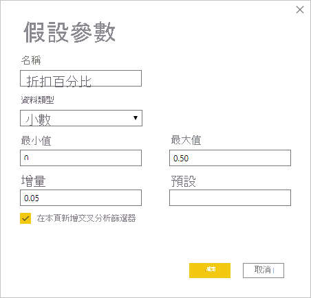
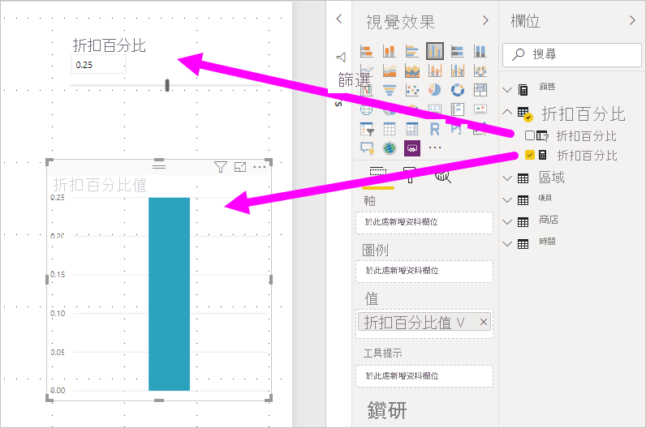
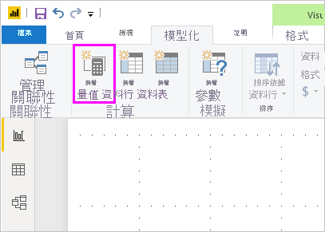
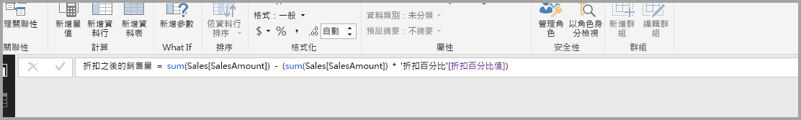
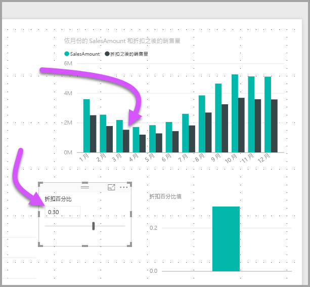

# 在 Power BI Desktop 中建立及使用模擬參數來視覺化變數

從 2018 年 8 月發行的 *Power BI Desktop* 開始，您可以為報表建立「模擬」  變數，將變數當作交叉分析篩選器與其互動，進而視覺化及量化報表中的不同索引鍵值。

![[新增參數] 選項](media/desktop-what-if/what-if_01.png)

請在 Power BI Desktop 的 [模型]  索引標籤上建立「模擬」  參數。 當您選取該參數時，會出現可以設定參數的對話方塊。

## 建立模擬參數

若要建立模擬參數，請從 Power BI Desktop 的 [模型]  索引標籤選取 [新增參數]  。 在下圖中，我們建立了稱為「折扣百分比」  的參數，並將其資料類型設定為 [小數]  。 [最小值]  為零。 [最大值]  為 0.50 (50%)。 我們也將 [增量]  設定為 0.05 (5%)。 這是與報表互動時會調整的參數量。

> [!NOTE]
> 針對小數，請務必在值前面加上零，例如 0.50 (而不是只有 .50)。 否則不會驗證數字，且無法選取 [確定]  按鈕。
> 
> 

為了方便起見，[在本頁新增交叉分析篩選器]  核取方塊會將含有模擬參數的交叉分析篩選器自動放到目前報表頁面上。

建立模擬參數除了建立參數本身之外，也會建立一個量值，可供您用來視覺化模擬參數的目前值。

請注意，一旦您建立了模擬參數，參數和量值都會成為模型的一部分。 因此，這些參數和量值可在報表中使用，也可以在其他報表頁面上使用。 同時，由於這些參數和量值是模型的一部分，因此您可以從報表頁面刪除交叉分析篩選器。 如果您想要將其復原，只要從 [欄位]  清單中擷取模擬參數，然後將該參數拖曳到畫布上，接著將視覺效果變更為交叉分析篩選器即可。

## 使用模擬參數

讓我們建立使用模擬參數的簡單範例。 我們在上一節中建立了模擬參數。 現在我們要使用該參數來建立新的量值，其值會以滑桿來調整。

此新量值將會是套用折扣率的總銷售金額。 您可以建立複雜且相關的量值，讓您報表的取用者視覺化模擬參數的變數。 例如，您可以建立報表，讓銷售人員查看達到特定銷售目標或百分比時的報酬，或查看銷售量增加對更優惠折扣的影響。

在公式列中輸入量值公式，並將公式命名為「折扣之後的銷售量」  。

接著使用軸上的 **OrderDate** 建立自訂視覺效果，其值為 **SalesAmount** 和剛建立的量值 **Sales after Discount**。

然後，當我們移動滑桿時，我們會看到 [Sales after Discount]  欄反映折扣後的銷售金額。

就是這麼簡單。 您可以在各式各樣的情況下使用模擬參數。 這些參數讓報表取用者可以與您在報表中建立的不同案例互動。
