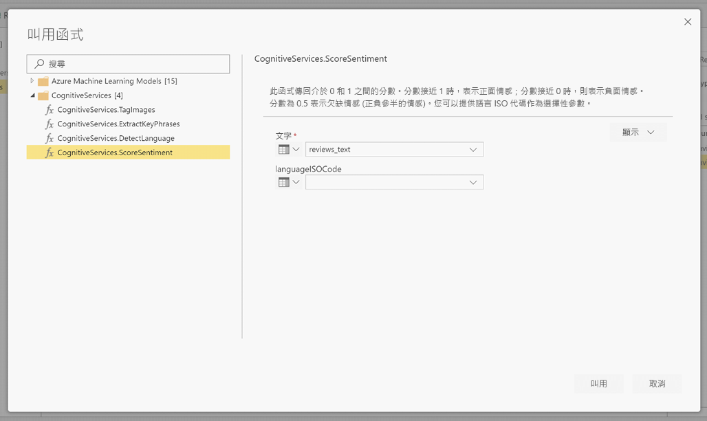
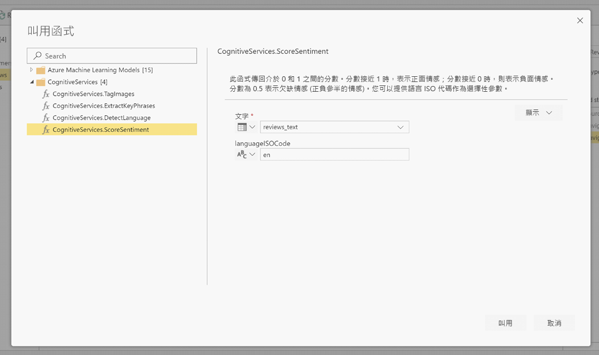

# Power BI 中的認知服務 

您可以使用 Power BI 中的認知服務，從 [Azure 認知服務](https://azure.microsoft.com/services/cognitive-services/)套用不同的演算法，在資料流程的自助資料準備中豐富您的資料。

目前支援的服務包括[情感分析](https://docs.microsoft.com/azure/cognitive-services/text-analytics/how-tos/text-analytics-how-to-sentiment-analysis)、[關鍵片語擷取](https://docs.microsoft.com/azure/cognitive-services/text-analytics/how-tos/text-analytics-how-to-keyword-extraction)、[語言偵測](https://docs.microsoft.com/azure/cognitive-services/text-analytics/how-tos/text-analytics-how-to-language-detection)和[影像標記](https://docs.microsoft.com/azure/cognitive-services/computer-vision/concept-tagging-images)。 轉換會在 Power BI 服務中執行，且不需要訂閱 Azure 認知服務。 此功能需要 Power BI Premium。

## **啟用 AI 功能**

進階容量節點 EM2、A2 或 P1 和更新版本支援認知服務。 容量的個別 AI 工作負載用來執行認知服務。 公開預覽期間 (2019 年 6 月前) 預設會停用此工作負載。 在 Power BI 中使用認知服務之前，必須在管理入口網站的容量設定中啟用 AI 工作負載。 您可以在工作負載區段中開啟 AI 工作負載，並定義您希望此工作負載使用的最大記憶體數量。 建議的記憶體限制為 20%。 超出此限制會讓查詢變慢。

## **在 Power BI 中開始使用認知服務**

認知服務轉換是[資料流程適用的自助資料準備](https://powerbi.microsoft.com/blog/introducing-power-bi-data-prep-wtih-dataflows/)的一部分。 若要使用認知服務豐富您的資料，請從編輯資料流程開始。

選取 Power Query 編輯器上方功能區中的 [AI 見解]  按鈕。

在快顯視窗中，選取您想要使用的函式以及您想要轉換的資料。 在此範例中，我要評分含有檢閱文字的資料行情感。

**Cultureinfo** 是選擇性的輸入，可指定文字的語言。 此欄位應為 ISO 代碼。 您可以使用資料行作為 Cultureinfo 的輸入，或靜態欄位。 在此範例中，整個資料行的語言指定為英文 (en)。 如果您將此欄位留空，Power BI 會先自動偵測語言，然後再套用函式。 接著，選取 [叫用]  。

叫用函式之後，結果會以新的資料行加入至資料表中。 轉換也會加入為查詢中套用的步驟。

如果此函式傳回多個輸出欄位，叫用函式會以多個輸出欄位的記錄加入新的資料行。

使用展開選項，將一個或兩個值當作資料行，加入至您的資料中。

## **可用的函式**

本節描述 Power BI 的認知服務中可用的函式。

### **偵測語言**

語言偵測函式會評估文字輸入，並針對每個欄位，傳回語言名稱和 ISO 識別碼。 此函式用於收集未知語言之任意文字的資料行。 此函式預期以文字格式的資料作為輸入。

文字分析最多可辨識 120 種語言。 如需詳細資訊，請參閱[支援的語言](https://docs.microsoft.com/azure/cognitive-services/text-analytics/text-analytics-supported-languages)。

### **擷取關鍵片語**

**關鍵片語擷取**函式會評估非結構化的文字，並針對每個文字欄位，傳回關鍵片語的清單。 此函式需要文字欄位作為輸入，並接受選擇性的輸入作為 **Cultureinfo** (請參閱此文章稍早的**開始使用**一節)。

關鍵片語擷取在您為其提供更大的文字區塊來處理時，其效果最佳。 這與情感分析相反，後者在較小的文字區塊效果更佳。 若要從這兩項作業獲得最佳結果，請考慮據此重新建構輸入。

### **情感評分**

**情感評分**函式會評估文字輸入，並為每個文件傳回情感分數，範圍從 0 (負面) 到 1 (正面)。 此函式用於偵測在社交媒體、客戶評論和討論區論壇方面的正面和負面情感。

文字分析會使用機器學習服務的分類演算法來產生 0 到 1 之間的情感分數。 分數接近 1 時，表示正面情感，分數接近 0 時，則表示負面情感。 此模型是使用具有情感關聯的大量文字內文預先定型的。 目前無法提供您自己的定型資料。 此模型會在文字分析期間使用技術的組合，包括文字處理、part-of-speech 分析、文字放置，以及文字關聯。 如需有關演算法的詳細資訊，請參閱[文字分析簡介](/archive/blogs/machinelearning/machine-learning-and-text-analytics)。

情感分析是針對整個輸入欄位進行的，而不是擷取文字中特定實體的情感。 在實務上，當文件包含一個或兩個句子，而不是大型文字區塊時，精確度評分有提高的趨勢。 在客觀性評估階段，此模型會判斷整體的輸入欄位是客觀的還是包含情感的。 大部分客觀的輸入欄位不會進展到情感偵測階段，進而導致分數為 .50，而不會進行進一步的處理。 對於在管線中繼續的輸入欄位，下一個階段會產生高於或低於 .50 的分數，端視輸入欄位中偵測到的情感程度而定。

目前，情感分析支援英文、德文、西班牙文和法文。 其他語言目前為預覽版。 如需詳細資訊，請參閱[支援的語言](https://docs.microsoft.com/azure/cognitive-services/text-analytics/text-analytics-supported-languages)。

### **標記映像**

**標記映像**函式會根據超過 2,000 個可辨識的物體、生物、景象及動作，傳回標記。 當標記模稜兩可或不是常識時，輸出會提供「提示」，以釐清標記在已知設定前後關聯中的意涵。 標記不是按照分類組織的，而且不存在任何繼承階層。 一系列的內容標記會形成影像「描述」的基礎，以完整句子的格式，顯示為人類可讀取的語言。

上傳影像或指定影像 URL 之後，電腦視覺演算法會根據物體、生物和影像中識別的動作，輸出標記。 標記不限於主體 (例如在前景的人)，但也包含環境 (室內或戶外)、傢俱、工具、植物、動物、配件、小工具等等。

此函式需要影像 URL 或 abase 64 欄位作為輸入。 目前，影像標記支援英文、西班牙文、日文、葡萄牙文及簡體中文。 如需詳細資訊，請參閱[支援的語言](https://docs.microsoft.com/rest/api/cognitiveservices/computervision/tagimage/tagimage#uri-parameters)。

## 後續步驟

文章提供搭配 Power BI 服務使用認知服務的概觀。 下列文章可能也很有趣而且實用。 

* [教學課程：在 Power BI 中叫用 Machine Learning Studio (傳統) 模型](../connect-data/service-tutorial-invoke-machine-learning-model.md)
* [Power BI 中的 Azure Machine Learning 整合](service-machine-learning-integration.md)
* [教學課程：在 Power BI 中使用認知服務](../connect-data/service-tutorial-use-cognitive-services.md)

如需有關資料流程的詳細資訊，您可以閱讀下列文章：
* [在 Power BI 中建立及使用資料流程](service-dataflows-create-use.md)
* [在 Power BI Premium 上使用計算實體](service-dataflows-computed-entities-premium.md)
* [搭配內部部署資料來源使用資料流程](service-dataflows-on-premises-gateways.md)
* [Power BI 資料流程的開發人員資源](service-dataflows-developer-resources.md)
* [資料流程與 Azure Data Lake 的整合 (預覽)](service-dataflows-azure-data-lake-integration.md)