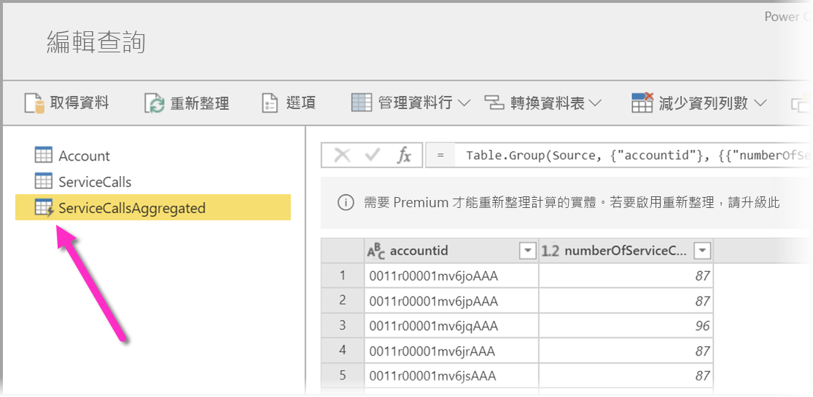
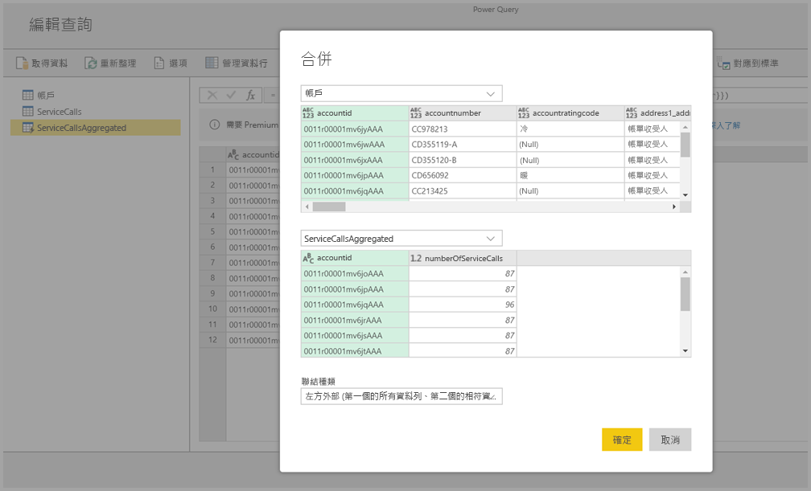

# 使用 Power BI Premium 上的計算實體

您可以在搭配 Power BI Premium 訂用帳戶使用**資料流程**時，執行**儲存體內部計算**。 這讓您能夠在現有的資料流程上執行計算，並傳回可讓您專注於報表建立與分析的結果。 

若要執行**儲存體內部計算**，您必須先建立資料流程，然後將資料帶入該 Power BI 資料流程儲存體。 一旦您具有包含資料的資料流程之後，就能建立**計算實體**，這些是執行儲存體內部計算的實體。 

有兩種方式可讓您將資料流程資料連線到 Power BI：

* [使用自助製作的資料流程](service-dataflows-create-use.md)
* 使用外部資料流程

下列各節將說明如何在資料流程資料上建立計算實體。

## 如何建立計算實體 

一旦您具有含實體清單的資料流程之後，就可在那些實體上執行計算。

在 Power BI 服務的資料流程製作工具中，選取 [編輯實體]  ，然後以滑鼠右鍵按一下您想要用來作為計算實體基礎且要在其上執行計算的實體。 在操作功能表中，選擇 [參考]  。

如果是有資格作為計算實體的實體，就必須勾選 [啟用負載]  選項，如下圖所示。 以滑鼠右鍵按一下實體，以顯示此操作功能表。

![在滑鼠右鍵操作功能表中勾選 [啟用負載]](media/service-dataflows-computed-entities-premium/computed-entities-premium_01.png)

藉由選取 [啟用負載]  ，您會建立新實體，而其來源為參考實體。 此圖示會變更，並顯示**計算**圖示，如下圖所示。

您在這個新建立的實體上執行的任何轉換，都將針對已經位於 Power BI 資料流程儲存體的資料來執行。 這表示查詢將不會針對從中匯入資料的外部資料來源 (例如，從中提取資料的 SQL 資料庫) 來執行，而是針對位於資料流程儲存體的資料來執行。

### 範例使用案例
使用計算實體可執行何種轉換？ 您通常在 Power BI 或 M 編輯器中使用轉換使用者介面來指定的所有轉換，在執行儲存體內部計算時全部都會受到支援。 

請考慮下列範例：您有一個 *Account* 實體，其中包含來自您 Dynamics 365 訂用帳戶且適用於所有客戶的未經處理資料。 您也會有來自服務中心的 *ServiceCalls* 未經處理資料，其中含有來自客服電話的資料，這些資料是在該年度的每一天從不同帳戶執行的。

假設您想要使用來自 *ServiceCalls* 的資料來擴充 *Account* 實體。 

首先，您必須彙總來自 ServiceCalls 的資料，以計算去年度針對每個帳戶所完成的客服電話數目。 

接下來，您想要合併 *Account* 實體與 *ServiceCallsAggregated* 實體，以計算擴充的 **Account** 資料表。

然後您會看到結果，如下圖中的 *EnrichedAccount* 所示。

就是這麼簡單，轉換會針對位於您 Power BI Premium 訂用帳戶之資料流程中的資料來執行，而不會針對來源資料執行。

## 考量與限制

請務必注意，如果您從 Power BI Premium 容量移除工作區，則相關聯的資料流程將不會再重新整理。 

使用特別在組織的 Azure Data Lake Storage Gen2 帳戶中建立的資料流程時，連結實體和計算實體只會在實體位於相同儲存體帳戶中時才能正常運作。 如需詳細資訊，請參閱[連線 Azure Data Lake Storage Gen2 以作為資料流程儲存體 (預覽)](service-dataflows-connect-azure-data-lake-storage-gen2.md)。

連結的實體不適用從 Common Data Model (CDM) 資料夾建立的資料流程。 如需詳細資訊，請參閱[將 CDM 資料夾新增為 Power BI 的資料流程 (預覽)](service-dataflows-add-cdm-folder.md)。

最佳做法是，在對內部部署與雲端資料連結而成的資料進行運算時，建立新實體以執行這類運算。 相較於使用現有的實體進行運算，例如也會查詢來自兩種來源的資料及執行 Lake 內轉換的實體，這種做法能提供更佳的體驗。

## 後續步驟

此文章說明了 Power BI 服務中可用的計算實體和資料流程。 以下是一些可能很實用的其他文章。

* [使用資料流程的自助資料準備](service-dataflows-overview.md)
* [建立 Power BI 中的資料流程](service-dataflows-create-use.md)
* [搭配內部部署資料來源使用資料流程](service-dataflows-on-premises-gateways.md)
* [Power BI 資料流程的開發人員資源](service-dataflows-developer-resources.md)
* [設定工作區資料流程設定 (預覽)](service-dataflows-configure-workspace-storage-settings.md)
* [新增 CDM 資料夾成為 Power BI 資料流程 (預覽)](service-dataflows-add-cdm-folder.md)
* [連接 Azure Data Lake Storage Gen2 來儲存資料流程 (預覽)](service-dataflows-connect-azure-data-lake-storage-gen2.md)

如需 Power Query 和排程重新整理的詳細資訊，您可以閱讀下列文章：
* [Power BI Desktop 中的查詢概觀](desktop-query-overview.md)
* [設定排定的重新整理](../connect-data/refresh-scheduled-refresh.md)

如需 Common Data Service 的詳細資訊，您可以閱讀它的概觀文章：
* [Common Data Service - 概觀](https://docs.microsoft.com/powerapps/common-data-model/overview)
