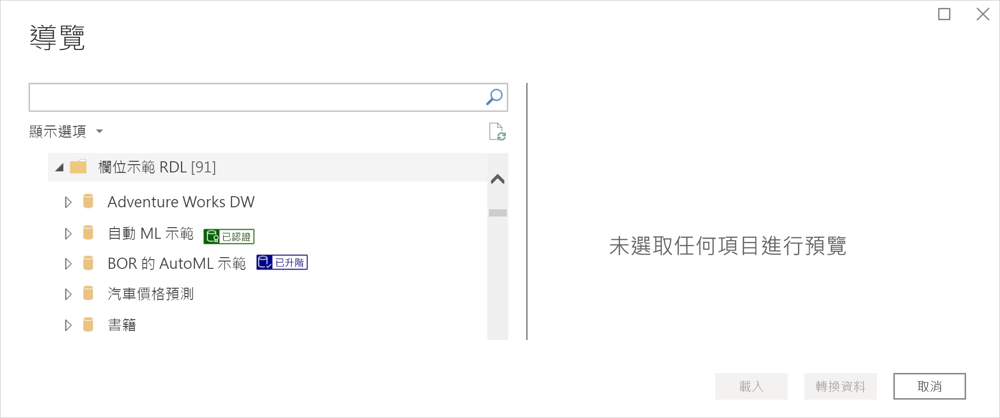
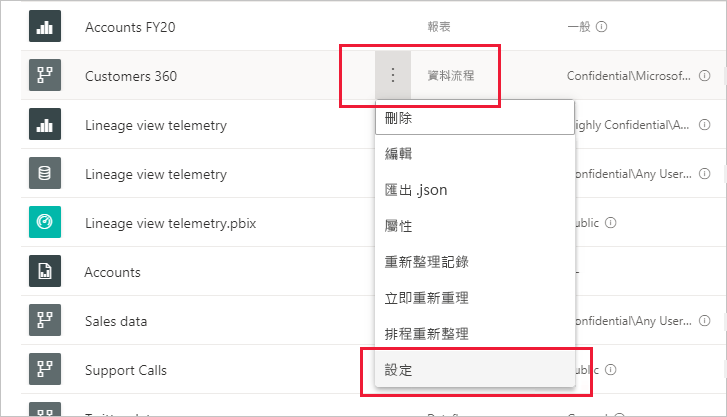

# 推廣或認證資料流程 (預覽)

Power BI 提供兩種方式來為有價值、高品質的資料流程增加曝光率：**推廣**與**認證**。

* **升級**：推廣可讓使用者醒目提示其認為有價值且值得供其他人使用的資料流程。 如此一來，便能鼓勵人員在組織內合作將資料流程進行散佈。 任何資料流程擁有者，或任何資料流程所在工作區上具有寫入權限的成員，只要認為該資料流程值得共用，就可以推廣該資料流程。

* **認證**：認證表示資料流程已通過授權檢閱者的檢查，且其確實可供整個組織中使用、可靠且具權威性的資料來源。 由 Power BI 租用戶系統管理員所定義的受選檢閱者群組，可決定要認證的資料流程。 若使用者認為某項資料流程應經過認證，卻沒有認證權限，則該位使用者可洽詢其租用戶系統管理員。

  只有[透過 Power BI 租用戶系統管理員啟用](../admin/service-admin-setup-certification.md)資料流程認證時，才可以使用此功能。

推廣或認證資料流程稱為「背書」  。 Power BI 報表建立者通常會有許多不同的資料流程可供選擇，而背書則有助於引導其取用可靠、可信且具權威性的資料流程。

已背書資料流程會在 Power BI 的許多地方清楚標示，讓報表建立者在尋找可靠的資料時，可以輕鬆地找到這些資料流程，而系統管理員和報表建立者則可以追蹤這些資料流程在整個組織中的使用狀況。

下圖顯示如何在 Power Query 中輕鬆辨識具有推廣和認證的資料流程。

本文描述
* 推廣資料流程 (資料流程所在工作區上的資料流程擁有者，或具有成員權限的任何使用者)
* 認證資料流程 (由租用戶系統管理員決定的授權的資料流程認證者)

如需設定資料流程認證 (租用戶系統管理員) 的資訊，請參閱[設定資料集與資料流程認證](../admin/service-admin-setup-certification.md) (英文)

## 推廣資料流程

若要推廣資料流程，您在要推廣資料流程所在工作區中必須具有寫入權限。

1. 請前往工作區中的資料流程清單。
 
1. 在您要推廣的資料流程上選取**更多選項** (...)，然後選取 [設定]  。

    

1. 展開 [背書] 區段，然後選取 [推廣]  。

    ![選取 [已升級] 和 [套用]](media/service-dataflows-promote-certify/power-bi-dataflow-promoted-endorsement.png)

1. 選取 [ **套用**]。

## 認證資料流程

本區段適用於已由租用戶系統管理員授權認證資料流程的使用者。 認證資料流程是一項重大的責任， 本區段會說明需要執行的認證流程。

1. 在要認證資料流程所在的工作區上，取得寫入權限。 此權限可以是來自於工作區中的資料流程擁有者，或具有系統管理員權限的任何人員。 

1. 仔細檢查該資料流程，並判斷其是否值得認證。

1. 如果決定要認證該資料流程，請前往其所在的工作區。
 
1. 找到所要的資料流程，按一下**更多選項** (...)，然後選取 [設定]  。

    

1. 展開 [背書] 區段，然後按一下 [認證]  。 

    

2. 按一下 [套用]  。

## 後續步驟

* [設定資料集與資料流程認證](../admin/service-admin-setup-certification.md) (英文)
* 有問題嗎？ [嘗試在 Power BI 社群提問](https://community.powerbi.com/)