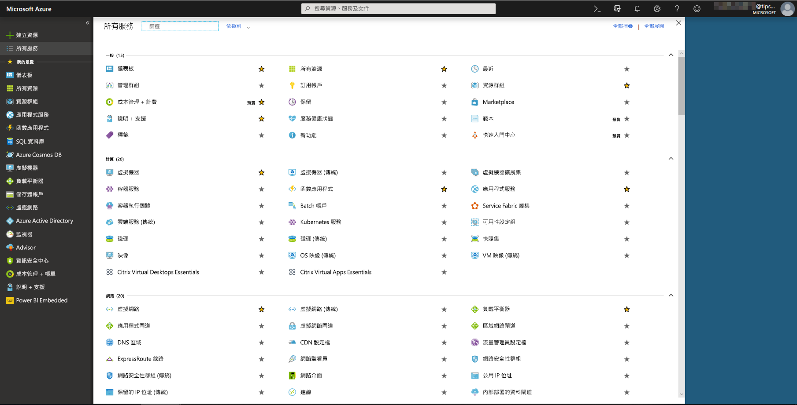
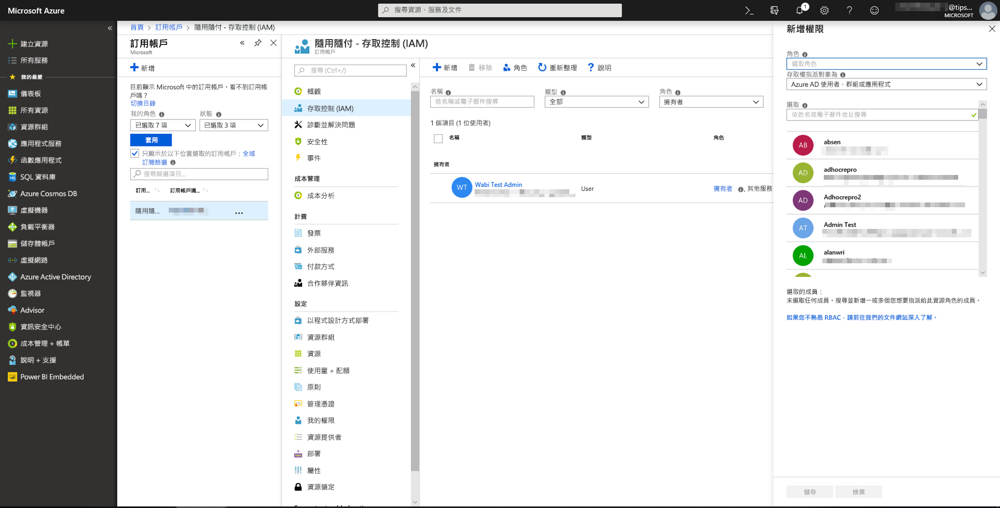
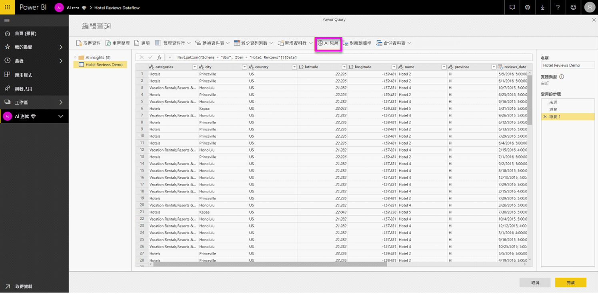
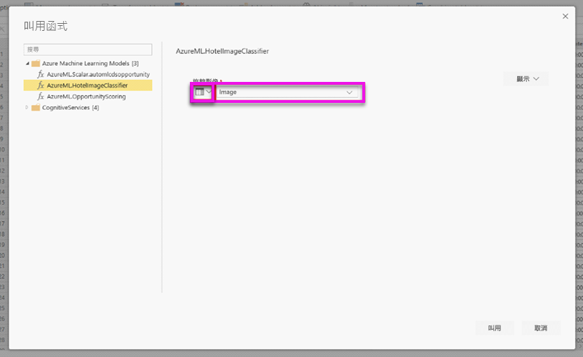

# Power BI 中的 Azure Machine Learning 整合

許多組織使用 **Machine Learning** 模型來取得關於其業務的更好的見解與預測。 在您的報告與儀表板和其他分析中，能夠從這些模型視覺化及叫用見解的能力有助於傳播這些見解給最需要它的企業使用者。  Power BI 現在可讓您輕鬆使用直覺的點按手勢整合來自 Azure Machine Learning 上所裝載模型的見解。

若要使用此功能，資料科學家可以使用 Azure 入口網站將對 Azure ML 模型的存取權授與 BI 分析師。  接著，在每個工作階段開頭，Power Query 會探索使用者有權存取的所有 Azure ML 模型並將它們公開為動態 Power Query 函式。  使用者接著可以透過從 Power Query 編輯器中的功能區存取函式，或透過直接叫用 M 函式，來叫用那些函式。 Power BI 也會在針對一組資料列叫用 Azure ML 模型時自動分存取要求分批，以獲得更好的效能。

目前只有 Power BI 資料流程與 Power BI 服務中的線上 Power Query 支援此功能。

若要深入了解資料流程，請參閱 [Power BI 中的自助資料準備](service-dataflows-overview.md)。

若要深入了解 Azure Machine Learning，請參閱：

- 概觀：[什麼是 Azure Machine Learning 服務？](https://docs.microsoft.com/azure/machine-learning/service/overview-what-is-azure-ml)
- Azure Machine Learning 的快速入門與教學課程：[Azure Machine Learning 文件](https://docs.microsoft.com/azure/machine-learning/)

> [!NOTE]
> 需要 Power BI Premium 訂閱，才能使用 Azure Machine Learning 整合。

## 將對 Azure ML 模型的存取權授與 Power BI 使用者

若要從 Power BI 存取 Azure ML 模型，使用者必須有對 Azure 訂用帳戶的**讀取**存取權。  此外：

- 針對 Machine Learning Studio (傳統) 模型，需要對 Machine Learning Studio (傳統) Web 服務的**讀取**存取權
- 針對 Machine Learning 模型，需要對 Machine Learning 工作區的**讀取**存取權

此文章中的步驟說明如何將對 Azure ML 上裝載之模型的存取權授與 Power BI 使用者，以便他們能以 Power Query 函式形式存取此模型。  如需進一步的詳細資料，請參閱[使用 RBAC 與 Azure 入口網站管理存取權](https://docs.microsoft.com/azure/role-based-access-control/role-assignments-portal)。

1. 登入 [Azure 入口網站](https://portal.azure.com)。

2. 移至 [訂用帳戶] 頁面。 您可以透過 Azure 入口網站導覽窗格功能表中的 [所有服務] 清單找到 [訂用帳戶] 頁面。

    

3. 選取您的訂用帳戶。

    

4. 選取 [存取控制 (IAM)]，然後選取 [新增] 按鈕。

    

5. 選取 [讀者] 做為 [角色]。 選取您希望為其授與對 Azure ML 模型之存取權的 Power BI 使用者。

    ![選取 [讀者] 做為 [角色]](media/service-machine-learning-integration/machine-learning-integration_04.png)

6. 選取 [儲存]。

7. 重複步驟三到六以將**讀者**存取權授與特定 Machine Learning Studio (傳統) Web 服務或裝載模型的 Machine Learning 工作區使用者。

## 針對 Machine Learning 模型的結構描述探索

資料科學家主要使用 Python 開發甚至是部署其 Machine Learning 的機器學習模型。  不同於 Machine Learning Studio (傳統) 是協助自動化為模型建立結構描述檔案的工作，在 Machine Learning 的案例中，資料科學家必須明確使用 Python 產生結構描述檔案。

此結構描述檔案必須包含在 Machine Learning 模型的部署 Web 服務中。 若要自動產生 Web 服務的結構描述，您必須為部署模型在項目指令碼中提供輸入/輸出的範例。 請參閱[使用 Azure Machine Learning 部署模型中的選擇性自動產生 Swagger 架構](https://docs.microsoft.com/azure/machine-learning/how-to-deploy-advanced-entry-script#power-bi-compatible-endpoint)服務文件上的子節。 連結包含產生結構描述陳述式的範例項目指令碼。 

具體而言，項目指令碼中的 *\@input_schema* 與 *\@output_schema* 函式會參考 *input_sample* 與 *output_sample* 中的輸入和輸出範例格式，並在部署期間使用這些範例來產生 Web 服務的 OpenAPI (Swagger) 規格。

這些透過更新項目指令碼來產生結構描述的指示也必須套用到使用 Azure Machine Learning SDK 時，透過自動化機器學習服務實驗建立的模型。

## 在 Power BI 中叫用 Azure ML 模型

您可以直接從您資料流程中的 Power Query 編輯器叫用任何您已獲授與存取權的 Azure ML 模型。 若要存取 Azure ML 模型，請針對您要從您的 Azure ML 模型豐富見解的實體選取 [編輯] 按鈕，如下列影像所示。

選取 [編輯] 按鈕以針對您資料流程中的實體開啟 Power Query 編輯器。

選取功能區中的 [AI 見解] 按鈕，然後從導覽窗格功能表選取 [Azure Machine Learning 模型] 資料夾。 您擁有存取權的所有 Azure ML 模型會在這裡列為 Power Query 函式。 此外，Azure ML 模型的輸入參數會自動對應為對應之 Power Query 函式的參數。

若要叫用 Azure ML 模型，您可以從下拉式清單中指定任何所選實體的資料行作為輸入。 您也可以將資料行圖示切換至 [輸入] 對話方塊的左側，以指定要當作輸入使用的常數值。

選取 [叫用] 來檢視 Azure ML 模型的輸出作為實體資料表中新資料行的預覽。 您也將看到模型叫用作為查詢套用的步驟。

若模型傳回多個輸出參數，它們會分組為輸出資料行中的記錄。 您可以展開資料行，在不同的資料行中產生個別的輸出參數。

一旦您儲存資料流程之後，當您針對實體資料表中任何新的或更新的資料列重新整理資料流程時，將會自動叫用模型。

## 後續步驟

此文章提供將 Machine Learning 整合到 Power BI 服務的概觀。 下列文章可能也很有趣且實用。 

* [教學課程：在 Power BI 中叫用 Machine Learning Studio (傳統) 模型](../connect-data/service-tutorial-invoke-machine-learning-model.md)
* [教學課程：在 Power BI 中使用認知服務](../connect-data/service-tutorial-use-cognitive-services.md)
* [Power BI 中的認知服務](service-cognitive-services.md)

如需有關資料流程的詳細資訊，您可以閱讀下列文章：
* [在 Power BI 中建立及使用資料流程](service-dataflows-create-use.md)
* [在 Power BI Premium 上使用計算實體](service-dataflows-computed-entities-premium.md)
* [搭配內部部署資料來源使用資料流程](service-dataflows-on-premises-gateways.md)
* [Power BI 資料流程的開發人員資源](service-dataflows-developer-resources.md)
* [資料流程與 Azure Data Lake 的整合 (預覽)](service-dataflows-azure-data-lake-integration.md)
