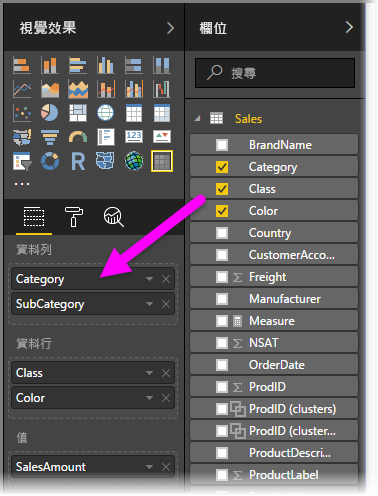
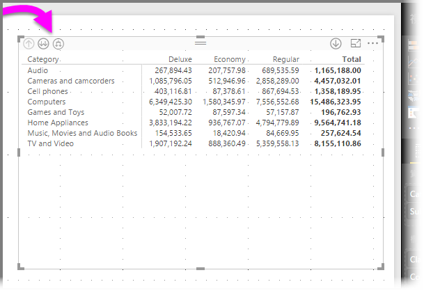
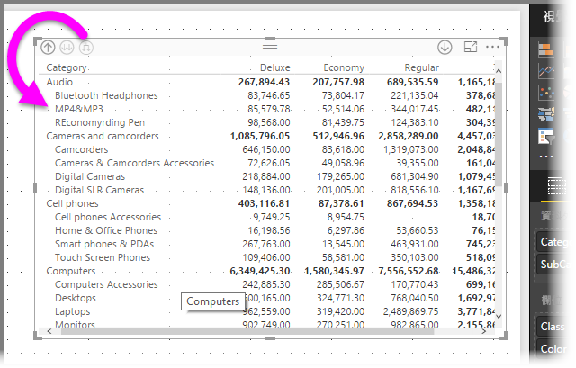
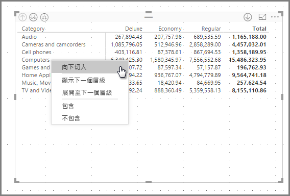
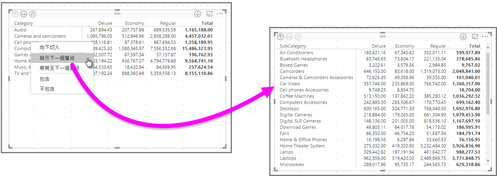
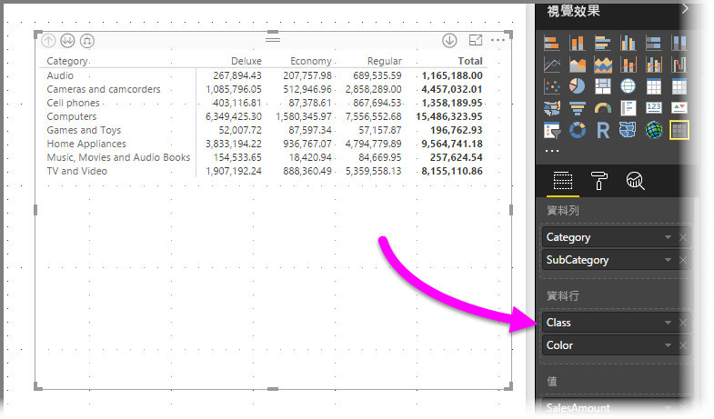
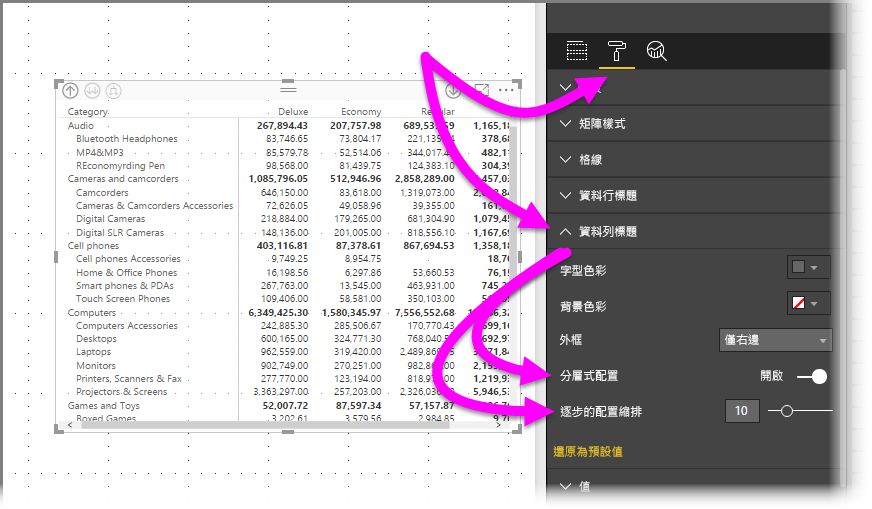
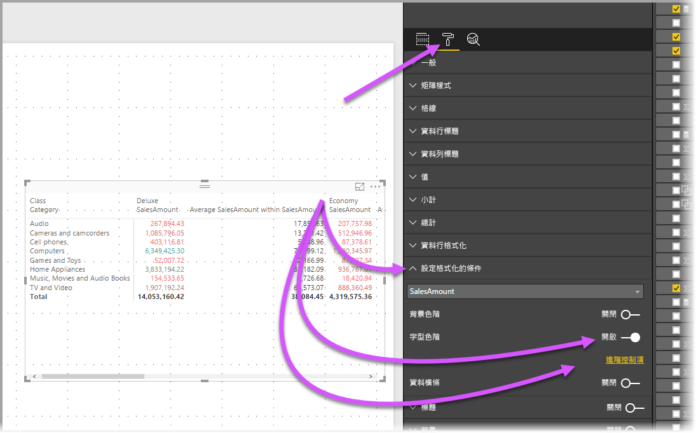
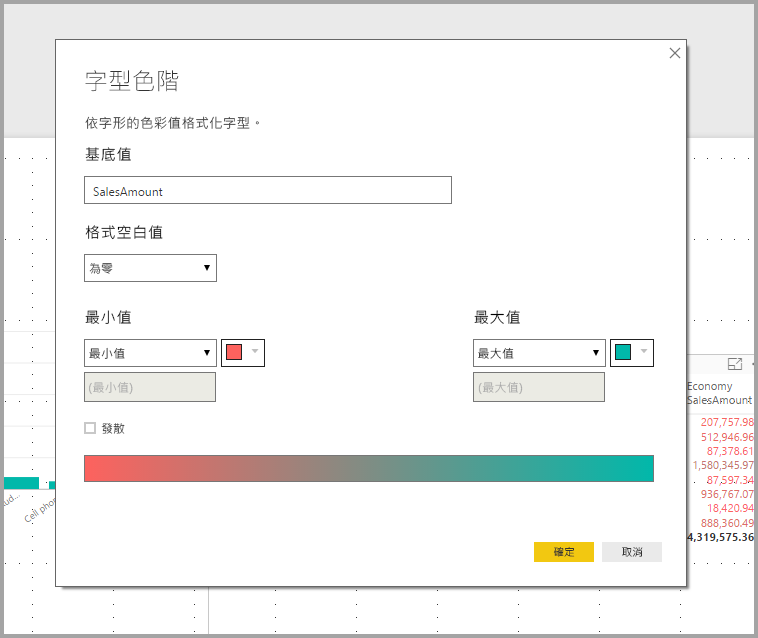

# 在 Power BI 中使用矩陣視覺效果
[矩陣] 視覺效果功能可用來在 **Power BI Desktop** 與 **Power BI 服務**報表中建立矩陣 (有時也稱為「資料表」)，且矩陣內的元素更能與其他視覺效果交叉亮顯。 此外，您也可以選取資料列、資料行，甚至是個別的資料格，然後交叉亮顯。 個別資料格或多個資料格經選取後，也可以複製並其他應用程式中貼上。 最後，為了更妥善運用配置空間，矩陣也支援分層式配置。

矩陣有許多相關的功能，我們將在本文的下列各節中逐一介紹。

## 報表主題
矩陣和資料表會反映所套用的**報表主題**樣式 (包括色彩)。 如果您預期中矩陣色彩與此不符，則您也可以在「報表主題」設定中進行變更。 如需更多有關主題的詳細資訊，請參閱[**在 Power BI Desktop 中使用報表主題**](../desktop-report-themes.md)。

## 了解 Power BI 如何計算總和

在開始了解如何使用**矩陣**前，務必先了解 Power BI 是如何計算資料表和矩陣中的總和與小計值的。 為了算出資料列的總和與小計，系統會根據基礎資料的所有資料列來評估量值，而不僅僅是從可見或已顯示資料列中，將所有值加總起來而已。 這表示在總和資料列中，所得到的值可能會與您預期的不同。 

請看下方的**矩陣**。 

在此範例中，**矩陣**最右邊的各個資料列都會顯示由各銷售人員和日期組合而成的 *Amount* (數量)。 不過，因為由於銷售人員能在多個日期上顯示，數字可能會出現一次以上。 因此，基礎資料的正確總和並不等於可見值的單純加總。 當加總的值屬於一對多關係中的「其中一端」時，便常常會見到這種模式。

查看總和與小計時，請記住這些值是來自基礎資料，而不是來自可見值。 

<!-- use Nov blog post video

## Expanding and collapsing row headers
There are two ways you can expand row headers. The first is through the right-click menu. You’ll see options to expand the specific row header you clicked on, the entire level or everything down to the very last level of the hierarchy. You have similar options for collapsing row headers as well.

You can also add +/- buttons to the row headers through the formatting pane under the row headers card. By default, the icons will match the formatting of the row header, but you can customize the icons’ color and size separately if you want. 
Once the icons are turned on, they work similarly to the icons from PivotTables in Excel.

The expansion state of the matrix will save with your report. It can be pinned to dashboards as well, but consumers will need to open up the report to change the state. Conditional formatting will only apply to the inner most visible level of the hierarchy. Note that this expand/collapse experience is not currently supported when connecting to AS servers older than 2016 or MD servers.

Watch the following video to learn more about expand/collapse in the matrix:

-->
## 透過矩陣進行向下切入
透過 [矩陣]，您可以執行各式各樣的向下切入活動；這些活動都很有趣，而且之前未必能這麼做。 這包括使用資料列、資料行，甚至是個別區段和資料格向下切入的功能。 讓我們來看看上述每項的運作方式。

### 在資料列標頭處向下切入
只要在 [視覺效果] 窗格中將多個欄位新增至 [欄位] 的 [資料列] 區段裡，便能在矩陣的資料列上啟用向下切入功能。 此功能類似於建立階層，之後您就可以在整個階層內向下切入 (然後備份)，並分析每個層級的資料。

在下圖中，[資料列] 區段中包含 [類別] 和 [子類別]，形成了可供鑽研的群組 (或稱為階層)。

每當視覺效果的 [資料列] 區段中有群組形成時，左上角就會出現「鑽研」和「展開」的圖示。

類似於其他視覺效果中的切入和展開行為，選取這些按鈕可讓我們在整個階層內向下切入 (或備份)。 在此情況下，我們可以從 [類別] 向下切入至 [子類別]，如下圖所示，其中已選取向下切入一層圖示 (乾草叉)。

除了使用這些圖示，您還可以用滑鼠右鍵按一下任何資料列標題，然後從出現的功能表進行選取以向下切入。

請注意，出現的功能表中還有幾個選項會產生不同的結果：

選取 [向下切入] 會展開「該」資料列層級的矩陣，並「排除」除了按下右鍵的資料列標題以外的所有其他資料列標題。 在下圖中，已用滑鼠右鍵按一下 [Computers] 並選取 [向下切入]。 請注意，其他最上層的資料列不會再出現於矩陣中。 這種向下切入功能十分有用，在 [交叉亮顯] 區段中特別酷炫。

您可以按一下 [向上切入]圖示，回到之前的最上層檢視。 如果接著從右鍵功能表選取 [顯示下一個層級]，則會取得一份按字母排列的清單，列出下一個層級的所有項目 (在本例中為 [子類別] 欄位)，但不包含較高層級的階層分類。

當您按一下左上角的**向上切入**圖示讓矩陣顯示所有最上層類別，然後按一下滑鼠右鍵並選取 [展開至下一個層級]，即會顯示下列視覺效果。

您也可以使用 [包含] 和 [排除] 功能表項目，以保留 (或分別移除) 矩陣中按下右鍵的資料列 (及任何子類別)。

### 資料行標頭的向下切入
類似於資料列的向下切入功能，您也可以在 [資料行] 上向下切入。 在下圖中，您會在 [資料行] 欄位中看到兩個欄位，這會建立類似於本文稍早針對資料列所使用的階層。 在 [資料行] 欄位中，包含 [類別] 和 [色彩]。

只要在 [矩陣] 中用滑鼠右鍵按一下資料行，就能看到向下切入的選項。 在下圖中，我們以滑鼠右鍵按一下 [Deluxe]，然後選取 [向下切入]。

當您選取 [向下切入] 時，隨即顯示 [Deluxe] 的資料行階層的下一個層級，在此情況下是 [Color]。

其餘右鍵功能表項目在資料行上的運作方式與資料列相同 (請參閱上一節：**資料列標頭的向下切入**)。 您可以 [顯示下一個層級]、[展開至下一個層級]、[包含] 或 [排除] 您的資料行，就像是處理資料列一樣。

> [!NOTE]
> 矩陣左上角的向下切入圖示和向上切入圖示只適用於資料列。 若要在資料行上向下切入，您必須使用右鍵功能表。
> 
> 

## 矩陣視覺效果的分層式配置
[矩陣] 會將階層中的子類別自動縮排在各個父系之下，此功能稱為**分層式配置**。

在矩陣的「原始」版本中，子類別會顯示在完全不同的資料行中，並在視覺效果中佔用更多的空間。 下圖顯示的即是原始 [矩陣] 中的資料表；請注意，子類別位於不同的資料行。

下圖所顯示的即是已啟用**分層式配置**的 [矩陣] 視覺效果。 請注意，[Computers] 類別已將其子類別 ([Computers Accessories]、[Desktops]、[Laptops]、[Monitors] 等) 稍微縮排，以提供更精簡的視覺效果。

您可以輕鬆地調整分層式配置設定。 先選取 [矩陣]，然後在 [視覺效果] 窗格的 [格式] 區段 (油漆滾筒圖示) 中，展開 [資料列標題] 區段。 您有兩個選項：[分層式配置] 切換選項 (將它開啟或關閉) 和 [逐步的配置縮排] (以像素為單位指定縮排數量)。

如果您關閉 [分層式配置]，子類別會顯示在另一個資料行中，而不是縮排在父系類別之下。

## 矩陣視覺效果的小計
您可以在矩陣中開啟或關閉資料列和資料行的小計。 如下圖所示，資料列小計已設定為 [開啟]。

在 [視覺效果] 窗格的 [格式] 區段中，展開 [小計] 卡片，然後將 [資料列小計] 滑桿移至 [關閉]。 當您這樣做時，不會顯示小計。

相同程序適用於資料行小計。

## 矩陣的交叉亮顯
使用 [矩陣] 時，可以選取矩陣中的任何元素作為交叉亮顯的基礎。 在 [矩陣] 中選取一個資料行，系統即會將該資料行亮顯，就像是報表頁面上的任何其他視覺效果一樣。 這類的交叉亮顯功能，在選取各類視覺效果和資料點時尤為常見，因此 [矩陣] 也提供相同的功能。

此外，交叉醒目提示也可以使用 Ctrl + 按一下滑鼠左鍵。 例如，在下圖中，已從 [矩陣] 視覺效果選取子類別集合。 請注意，視覺效果中未選取的項目是如何呈現灰色的，以及頁面中的其他視覺效果，又是如何反映 [矩陣] 中所做出的選擇的。

## 複製 Power BI 中的值，以用於其他應用程式

您的矩陣或資料表可能包含您希望在其他應用程式中使用的內容，例如 Dynamics CRM、Excel，甚至其他 Power BI 報表。 在 Power BI 上按一下滑鼠右鍵，可以將單一資料格或資料格選取範圍複製到剪貼簿，並貼到另一個應用程式。

* 若要複製單一資料格的值，請選取資料格、按一下滑鼠右鍵，然後選擇 [複製值]。 使用剪貼簿上未格式化的資料格的值，您現在可以將它貼至另一個應用程式。

    

* 若要複製多個資料格，請選取資料格範圍，或使用 CTRL 來選取一或多個資料格。 該複本將包含資料行和資料列標頭。

    

## 矩陣視覺效果的網底和字型色彩
在 [矩陣] 中，**條件式格式設定** (色彩和網底) 不但可以套用至資料格背景，甚至也能套用至文字和值本身。

若要套用條件式格式設定，在選取矩陣時可以執行下列任一動作：

* 在 [欄位] 窗格中，以滑鼠右鍵按一下 [欄位]，然後從功能表選取 [設定格式化的條件]。
  
  
* 或者，在 [格式] 窗格中，展開 [設定格式化的條件] 卡片，然後將 [背景色階] 或 [字型色階] 的滑桿移至 [開啟]。 開啟其中任一個選項會顯示 [進階控制項] 連結，可讓您自訂色彩格式設定的色彩和值。
  
  

任一方法都會達到相同結果。 選取 [進階控制項] 會顯示下列對話方塊，讓您進行調整：

## 後續步驟

[Power BI 中的散佈圖與泡泡圖](power-bi-visualization-scatter.md)

[Power BI 中的視覺效果類型](power-bi-visualization-types-for-reports-and-q-and-a.md)