# 在 Power BI 中使用矩陣視覺效果
**矩陣**視覺化類似**資料表**。  資料表支援 2 個維度是一般資料，表示重複的值會顯示，並不會彙總。 矩陣可讓您更輕鬆地跨多個維度的有意義地顯示資料--它支援分層式的配置。 矩陣會自動彙總的資料，並啟用向下的 向下鑽研。 

您可以建立在矩陣視覺效果**Power BI Desktop**並**Power BI 服務**報表和交叉醒目提示矩陣與該報表頁面上其他視覺效果內的項目。 例如，您可以選取資料列、 資料行，以及甚至是個別儲存格和交叉醒目提示。 此外，個別儲存格和多個資料格的選取項目可以複製及貼到其他應用程式。 

矩陣有許多相關的功能，我們將在本文的下列各節中逐一介紹。

## 了解 Power BI 如何計算總和

在開始了解如何使用**矩陣**視覺效果之前，務必先了解 Power BI 如何計算資料表和矩陣中的總和與小計值。 針對總和與小計資料列，量值會根據基礎資料的所有資料列進行評估，而不是  僅僅加總可見或顯示資料列中的值。 這表示在總和資料列中，所得到的值可能會與您預期的不同。 

看看下列的矩陣視覺效果。 

在此範例中，會顯示每個資料列，在矩陣視覺效果最遠到右*數量*每位銷售人員/日期組合。 不過，因為由於銷售人員能在多個日期上顯示，數字可能會出現一次以上。 因此，基礎資料的正確總和並不等於可見值的單純加總。 當加總的值屬於一對多關係中的「單一」端時，這是的常見模式。

查看總和與小計時，請記住這些值是來自基礎資料，而不是來自可見值。 

<!-- use Nov blog post video

## Expanding and collapsing row headers
There are two ways you can expand row headers. The first is through the right-click menu. You’ll see options to expand the specific row header you clicked on, the entire level or everything down to the very last level of the hierarchy. You have similar options for collapsing row headers as well.

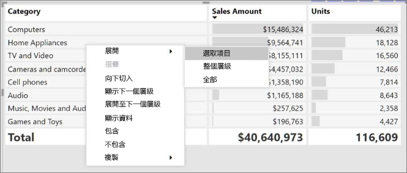

You can also add +/- buttons to the row headers through the formatting pane under the row headers card. By default, the icons will match the formatting of the row header, but you can customize the icons’ color and size separately if you want. 
Once the icons are turned on, they work similarly to the icons from PivotTables in Excel.

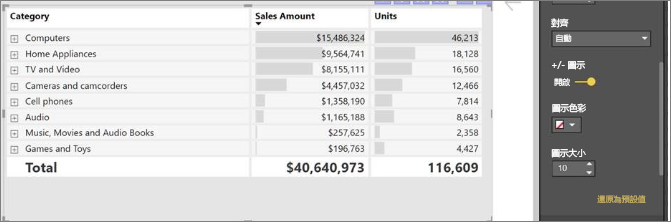

The expansion state of the matrix will save with your report. It can be pinned to dashboards as well, but consumers will need to open up the report to change the state. Conditional formatting will only apply to the inner most visible level of the hierarchy. Note that this expand/collapse experience is not currently supported when connecting to AS servers older than 2016 or MD servers.

Watch the following video to learn more about expand/collapse in the matrix:

-->
## 向下切入使用矩陣視覺效果
使用矩陣視覺效果，您可以執行各式各樣有趣但之前未曾提供的活動向下鑽研。 這包括使用資料列、資料行，甚至是個別區段和資料格向下切入的功能。 讓我們來看看上述每項的運作方式。

### 資料列標頭的向下切入
在 [視覺效果]  窗格中，當您將多個欄位新增至 [欄位]  的 [資料列]  區段時，您可以在矩陣視覺效果的資料列上啟用向下切入功能。 此功能類似於建立階層，之後您就可以在整個階層內向下切入 (然後備份)，並分析每個層級的資料。

在下圖中，**資料列**一節包含*銷售階段*並*商機大小*，我們可鑽研的資料列中建立群組 （或階層）。

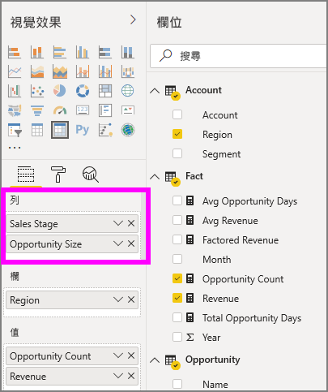

當視覺效果在 [資料列]  區段中建立群組時，視覺效果本身會在視覺效果左上角顯示「鑽研」  和「展開」  圖示。

類似於其他視覺效果中的切入和展開行為，選取這些按鈕可讓我們在整個階層內向下切入 (或備份)。 在此情況下，我們可以從鑽研*銷售階段*要*商機大小*下, 圖中，其中已選取向下的鑽研一層圖示 （乾草叉） 中所示。

除了使用這些圖示，您可以選取任何資料列標題，然後從出現的功能表中選擇向下鑽研。

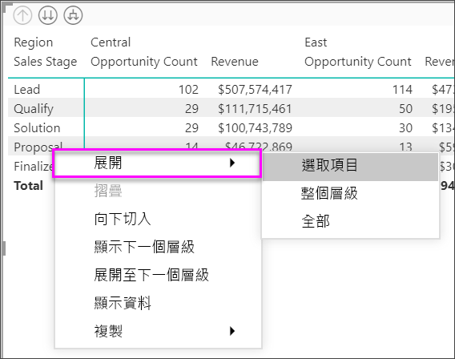

請注意，出現的功能表中還有幾個選項會產生不同的結果：

選取**向下切入**展開的矩陣*可*資料列層級，*排除*所有其他資料列標題除非所選取資料列行首。 在下圖中，**提案** > **向下切入**已選取。 請注意，其他最上層的資料列不會再出現於矩陣中。 這種向下切入的方式是很有用的功能，並且是 [交叉醒目提示]  區段中特別酷炫的功能。

選取 **向上切入**圖示，若要回到上一個最上層檢視。 如果您接著選取**提案** > **顯示下一個層級**，取得遞增列出所有的下一個層級項目 (在此情況下，*商機大小*欄位)，但不包含較高層級的階層分類。

選取 **向上切入**圖示讓矩陣顯示所有最上層類別，然後選取左上角**提案** > **展開至下一個層級**至請參閱階層架構層的這兩個層級的所有值*銷售階段*並*商機大小*。

您也可以使用**展開**來控制顯示進一步的功能表項目。  例如，選取**提案** > **展開** > **選取**。 Power BI 會顯示一個總計資料列，每個*銷售階段*和 全部*商機大小*選項*提案*。

### 資料行標頭的向下切入
類似於在資料列向下切入的能力，您可以也在向下切入**資料行**。 在下圖中，有兩個欄位**資料行**欄位格式，建立類似我們稍早在本文中的資料列所使用的階層。 在 **資料行**欄位中，我們有*區域*並*區段*。 當第二個欄位已加入至**資料行**，新的下拉式功能表上顯示視覺效果上，它目前會顯示**資料列**。

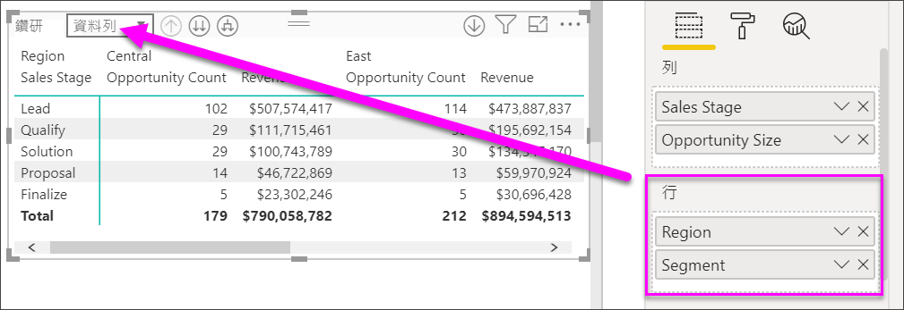

若要向下鑽研資料行上，選取**資料行**從*鑽研*位於矩陣的左上角的功能表。 選取 *東部*區域，然後選擇**向下切入**。

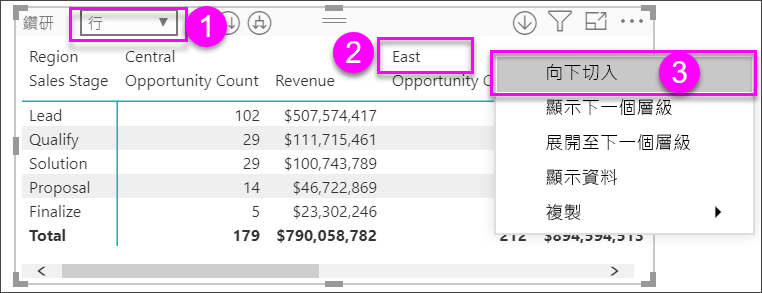

當您選取**向下切入**，資料行階層上的一層樓*地區 > 東部*顯示，在此情況下*商機計數*。 其他區域會顯示，但會呈現灰色。

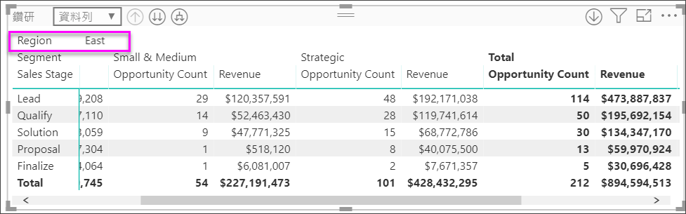

其餘的功能表項目資料行上運作的資料列的方式相同 (請參閱上一節**向下切入資料列標頭**)。 您可以**顯示下一個層級**並**展開至下一個層級**就像您可以使用資料列的資料行。

> [!NOTE]
> 矩陣視覺效果左上角的向下切入圖示和向上切入圖示只適用於資料列。 若要在資料行上向下切入，您必須使用右鍵功能表。
> 
> 

## 矩陣視覺效果的分層式配置
[矩陣]  視覺效果會將階層中的子類別自動縮排在每個父系之下，此功能稱為**分層式配置**。

在矩陣視覺效果的「原始」  版本中，子類別會顯示在完全不同的資料行中，並在視覺效果中佔用更多的空間。 下圖顯示原始 [矩陣]  視覺效果中的資料表；請注意，其子類別在不同的資料行中。

在下圖中，您會看到 [矩陣]  視覺效果，並已啟用**分層式配置**。 請注意，[Computers]  類別已將其子類別 ([Computers Accessories]、[Desktops]、[Laptops]、[Monitors] 等) 稍微縮排，以提供更精簡的視覺效果。

您可以輕鬆地調整分層式配置設定。 選取 [矩陣]  視覺效果時，在 [視覺效果]  窗格的 [格式]  區段 (油漆滾筒圖示) 中，展開 [資料列標題]  區段。 您有兩個選項：[分層式配置]  切換選項 (將它開啟或關閉) 和 [逐步的配置縮排]  (以像素為單位指定縮排數量)。

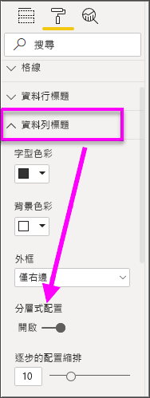

如果您關閉 [分層式配置]  ，子類別會顯示在另一個資料行中，而不是縮排在父系類別之下。

## 矩陣視覺效果的小計
您可以在矩陣視覺效果中，開啟或關閉資料列和資料行的小計。 如下圖所示，資料列小計已設定為 [開啟]  。

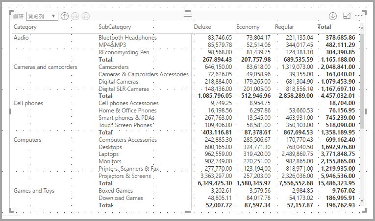

在 [視覺效果]  窗格的 [格式]  區段中，展開 [小計]  卡片，然後將 [資料列小計]  滑桿移至 [關閉]  。 當您這樣做時，不會顯示小計。

相同程序適用於資料行小計。

## 矩陣視覺效果的交叉醒目提示
使用 [矩陣]  視覺效果，您可以選取矩陣中的任何元素作為交叉醒目提示的基礎。 在 [矩陣]  中選取一個資料行，即會醒目提示該資料行，就像是報表頁面上的任何其他視覺效果一樣。 這類的交叉亮顯功能，在選取各類視覺效果和資料點時尤為常見，因此 [矩陣]  也提供相同的功能。

此外，交叉醒目提示也可以使用 Ctrl + 按一下滑鼠左鍵。 例如，在下圖中，已從 [矩陣]  視覺效果選取子類別集合。 請注意，視覺效果中未選取的項目是如何呈現灰色的，以及頁面中的其他視覺效果，又是如何反映 [矩陣]  中所做出的選擇的。

## 複製 Power BI 中的值，以用於其他應用程式

您的矩陣或資料表可能包含您希望在其他應用程式中使用的內容，例如 Dynamics CRM、Excel，甚至其他 Power BI 報表。 在 Power BI 上按一下滑鼠右鍵，可以將單一資料格或資料格選取範圍複製到剪貼簿，並貼到另一個應用程式。

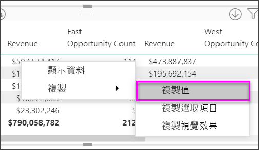

* 若要複製單一資料格的值，請選取資料格、按一下滑鼠右鍵，然後選擇 [複製值]  。 使用剪貼簿上未格式化的資料格的值，您現在可以將它貼至另一個應用程式。

    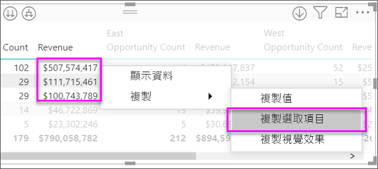

* 若要複製多個資料格，請選取資料格範圍，或使用 CTRL 來選取一或多個資料格。 該複本將包含資料行和資料列標頭。

    

## 矩陣視覺效果的網底和字型色彩
您可以使用矩陣視覺效果，套用**條件式格式設定**（色彩和網底和資料橫條） 若要在矩陣中，而且您的資料格背景可以套用至文字和值本身的條件式格式設定。

若要套用條件式格式設定，選取 視覺化 和 開啟矩陣**格式**窗格。 依序展開**條件式格式化**卡以及**背景色彩**，**字型色彩**，或**資料橫條**，開啟滑桿以**上**。 開啟其中一個選項會顯示連結，以便*進階控制項*，可讓您自訂的色彩和色彩格式設定的值。
  
  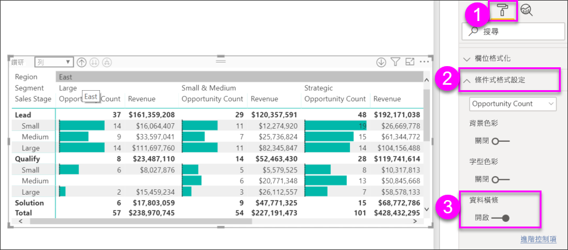

選取 *進階控制項*顯示一個對話方塊，讓您進行調整。 此範例中顯示的對話方塊**資料橫條**。

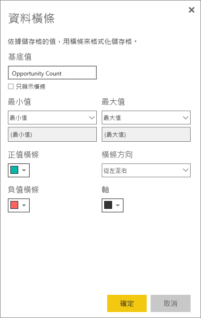

## 後續步驟

[Power BI 中的散佈圖與泡泡圖](power-bi-visualization-scatter.md)

[Power BI 中的視覺效果類型](power-bi-visualization-types-for-reports-and-q-and-a.md)