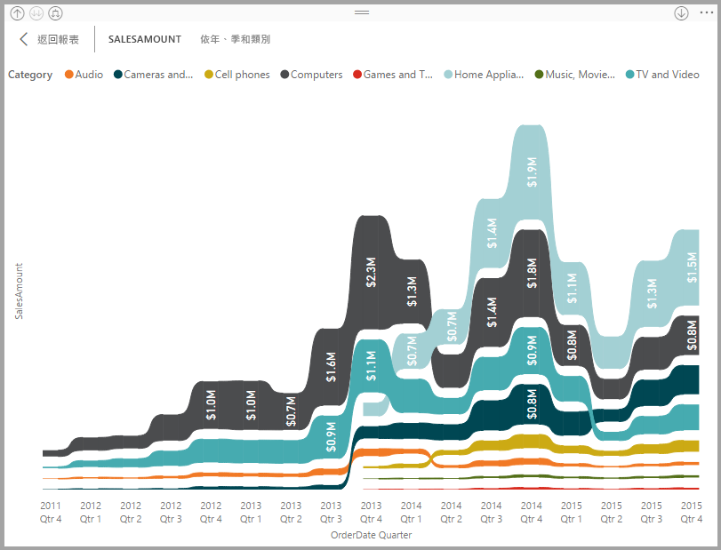
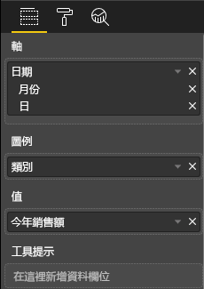
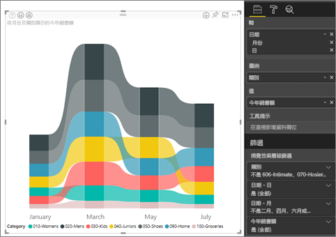
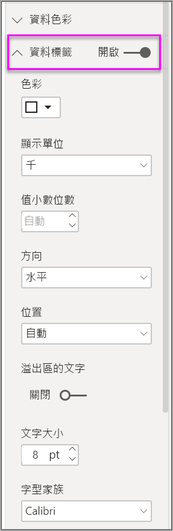

# 在 Power BI 中使用功能區圖表
您可以使用功能區圖表來視覺化資料，並快速找出哪個資料類別具有最高的等級 (最大值)。 功能區圖表適合顯示等級變更，最高等級 (值) 一律顯示於每個時段的最上方。 

## 建立功能區圖表
如果要跟著做，請開啟[零售分析範例報表](../sample-retail-analysis.md)。 

1. 若要建立功能區圖表，請從 [視覺效果]  畫面選取 [功能區圖表]  。

    

    功能區圖表會透過使用功能區，連接視覺化時間連續體的資料類別，可讓您看到在整個圖表 X 軸 (通常為時間軸) 的範圍中，某個類別的等級為何。

2. 選取 [軸]  、[圖例]  和 [值]  的欄位。  在本例中，我們已選取：[日期]  、[類別]  ，以及 [今年銷售量]  。  

    

    因為資料集只包含一年的資料，所以我們從 [軸]  移除了 [年份]  欄位。 

3. 功能區圖表會顯示每個其他月份的順位。 請注意順位隨時間變化的方式。  例如，家居服類別從第三個移至第四個，並再次移回第三個。 童裝類別在 7 月會從第三個移至第五個。 

    

## 格式化功能區圖表
當您建立功能區圖表時，您可以在 [視覺效果]  窗格的 [格式]  區段中，使用格式設定的選項。 功能區圖表的格式設定選項類似於堆疊直條圖的選項，但有功能區特有的額外格式設定選項。

![[視覺效果] 窗格上的功能區範本](media/desktop-ribbon-charts/power-bi-format-ribbon.png)

功能區圖表的這些格式設定選項可讓您進行調整。

* **間距**可讓您調整多少空白字元出現在功能區之間。 數字是資料行最大高度的百分比。
* **符合數列色彩**可讓您讓功能區色彩符合數列色彩。 當設定為 [關閉]  時，功能區是灰色。
* **透明度**指定功能區的透明程度，預設值為 30。
* **框線**可讓您在功能區的上方和底部放置深色框線。 根據預設，框線會關閉。

由於功能區圖表沒有 Y 軸標籤，因此您可能想要新增資料標籤。 從 [格式化] 窗格中，選取 [資料標籤]  。 

設定資料標籤的格式化選項。  在此範例中，我們已將文字色彩設定為白色、將小數位數設為零，並將顯示單位設為千。 

![[視覺效果] 窗格上的功能區範本](media/desktop-ribbon-charts/power-bi-data-labels.png)

## 後續步驟

[Power BI 中的散佈圖與泡泡圖](power-bi-visualization-scatter.md)

[Power BI 中的視覺效果類型](power-bi-visualization-types-for-reports-and-q-and-a.md)