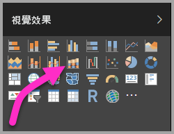

# 在 Power BI 中使用功能區圖表
您可以使用功能區圖表來視覺化資料，並快速找出哪個資料類別具有最高的等級 (最大值)。 功能區圖表適合顯示等級變更，最高等級 (值) 一律顯示於每個時段的最上方。 

## 建立功能區圖表
若要建立功能區圖表，請從 [視覺效果] 畫面選取 [功能區圖表]。

功能區圖表會透過使用功能區，連接視覺化時間連續體的資料類別，可讓您看到在整個圖表 X 軸 (通常為時間軸) 的範圍中，某個類別的等級為何。

## 格式化功能區圖表
當您建立功能區圖表時，您可以在 [視覺效果] 窗格的 [格式] 區段中，使用格式設定的選項。 功能區圖表的格式設定選項類似於堆疊直條圖的選項，但有功能區特有的額外格式設定選項。

![[視覺效果] 窗格上的功能區範本](media/desktop-ribbon-charts/ribbon-charts_03.png)

功能區圖表的這些格式設定選項可讓您進行調整。

* **間距**可讓您調整多少空白字元出現在功能區之間。 數字是資料行最大高度的百分比。
* **符合數列色彩**可讓您讓功能區色彩符合數列色彩。 當設定為 [關閉] 時，功能區是灰色。
* **透明度**指定功能區的透明程度，預設值為 30。
* **框線**可讓您在功能區的上方和底部放置深色框線。 根據預設，框線會關閉。

## 後續步驟

[Power BI 中的散佈圖與泡泡圖](power-bi-visualization-scatter.md)

[Power BI 中的視覺效果類型](power-bi-visualization-types-for-reports-and-q-and-a.md)