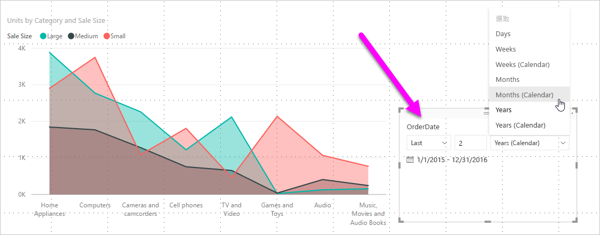

# 在 Power BI 中建立相對日期交叉分析篩選器與篩選條件

[!INCLUDE[consumer-appliesto-nyyn](../includes/consumer-appliesto-nyyn.md)]

利用**相對日期交叉分析篩選器**或**相對日期篩選條件**，可以將時間篩選條件套用到資料模型中的任何日期資料行。 舉例來說，您可以使用**相對日期交叉分析篩選器**，只顯示過去 30 天 (或月、日曆月份等) 內產生的銷售資料。 當您重新整理資料時，相對時段會自動套用適當的相對日期限制式。

若要與 Power BI 同事共用報表，必須兩人都擁有個人的 Power BI Pro 授權，或將報表儲存在 Premium 容量中。

## 建立相對日期範圍交叉分析篩選器

您可以使用相對日期交叉分析篩選器，就如同使用其他交叉分析篩選器一般。 建立報表的 [交叉分析篩選器]  視覺效果，然後針對 [欄位]  值選取日期值。 下圖中已選取 [OrderDate]  欄位。

![箭號指向交叉分析篩選器視覺圖示和欄位的 [視覺效果] 窗格螢幕擷取畫面。](media/desktop-slicer-filter-date-range/relative-date-range-slicer-filter-02.png)

選取畫布中的交叉分析篩選器，然後選取交叉分析篩選器視覺效果右上角的插入號。 若視覺效果具有日期資料，則功能表會顯示 [相對]  的選項。

![在插入號周圍叫出有箭號指向 [相對] 的交叉分析篩選器視覺效果螢幕擷取畫面。](media/desktop-slicer-filter-date-range/relative-date-range-slicer-filter-03.png)

針對相對日期交叉分析篩選器，請選取 [相對]  。

接著您便可以選取設定。

針對「相對日期交叉分析篩選器」  的第一項設定，您有下列選擇：

* 最後一個

* 下一步

* 此

「相對日期交叉分析篩選器」  的第二項 (中間) 設定可讓您輸入數字，定義相對的日期範圍。

第三個設定可讓您選取日期度量。 您有下列選項：

* 天

* 週

* 週 (日曆)

* 月

* 月 (日曆)

* 年

* 年 (日曆)

若從該清單選取 [月]  並在中間設定中輸入 *2*，其結果會如下：

* 如果今天是 7 月 20 日

* 交叉分析篩選器限制視覺效果所包含資料會顯示前兩個月的資料

* 從 5 月 21 日開始到 7 月 20 日 (今天的日期)

相對來說，若您選取 [月 (日曆)]  ，則受限制視覺效果會顯示 5 月 1 日至 6 月 30 日的資料 (過去兩個完整的日曆月份)。

## 建立相對日期範圍篩選條件

您也可以為報表頁面或整個報表建立相對日期範圍篩選。 若要這樣做，請將日期欄位拖曳至 [欄位]  窗格中的 [頁面層級篩選]  井或 [報表層級篩選]  井：

![拖曳 [OrderDate] 欄位到 [頁面層級篩選] 井的螢幕擷取畫面。](media/desktop-slicer-filter-date-range/relative-date-range-slicer-filter-06.png)

到達目的地後，您就可以變更相對日期範圍。 類似自訂**相對日期交叉分析篩選器**的方法。 從 [篩選類型]  下拉式功能表選取 [相對日期篩選]  。

![顯示 [相對日期篩選] 之 [篩選器類型] 下拉式清單和滑鼠指標的螢幕擷取畫面。](media/desktop-slicer-filter-date-range/relative-date-range-slicer-filter-07.png)

選取 [相對日期篩選]  後，如同交叉分析篩選器，您會看見三個要變更的區段，包括中間的數字方塊，。

![顯示值選項時，箭號指向 [顯示項目] 的 [報表層級篩選] 螢幕擷取畫面。](media/desktop-slicer-filter-date-range/relative-date-range-slicer-filter-08.png)

## 限制與考量

**相對日期範圍交叉分析篩選器**及篩選條件目前適用下列限制與考量。

* **Power BI** 中的資料模型不包含時區資訊。 模型可以儲存時間，但無法指出所在時區。

* 交叉分析篩選器和篩選條件一律以 UTC 時區為基礎。 若在報表中設定篩選條件，並將其傳送給不同時區的同事，則兩人會看到相同的資料。 除非您在 UTC 時區中，否則您和同事必須考量會經歷的時間位移。

* 您可以使用 [查詢編輯器]  將擷取的當地時區資料轉換為 UTC。

## 後續步驟

- [在 Power BI 中使用相對日期交叉分析篩選器和篩選條件](desktop-slicer-filter-date-range.md)
- [Power BI 中的交叉分析篩選器](power-bi-visualization-slicers.md)
