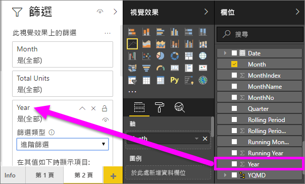

# 在 Power BI 中的折線圖
折線圖是一系列是以點表示，並以直線來連接資料點。 一個折線圖，其中可能有一或多行。 折線圖有 X 和 Y 軸。 

## 建立折線圖
這些指示使用銷售和行銷範例應用程式，以建立依類別顯示今年銷售量的折線圖。 若要跟著做，請從 appsource.com 取得範例應用程式。

1. 從空白報表頁面開始。 如果您使用 Power BI 服務，請務必在[編輯檢視](../service-interact-with-a-report-in-editing-view.md)中開啟報告。

2. 從 [欄位] 窗格中，選取**SalesFact** \> **總單位**，然後選取**日期** > **月**。  Power BI 報表畫布上建立直條圖。

    ![從 [欄位] 窗格中選取](media/power-bi-line-charts/power-bi-step1.png)

4. 從 [視覺效果] 窗格中選取的線條圖表範本轉換成折線圖。 

    
   

4. 篩選您的折線圖，以顯示 2012年 2014 年的資料。 如果您的篩選 窗格已摺疊，則請展開。 從 [欄位] 窗格中，選取**日期** \> **年**並將它拖曳至 [篩選] 窗格。 捨棄標題底下**此視覺效果的篩選**。 
     
    

    變更**進階篩選器**要**基本篩選**，然後選取**2012年**， **2013年**並**2014年**。

    

6. 選擇性地[調整圖表文字的大小和色彩](power-bi-visualization-customize-title-background-and-legend.md)。 

    

## 新增其他行至圖表
折線圖可以有許多不同的行。 而且，在某些情況下，在 行值可能分歧，不會顯示適合共同運作。 讓我們看看新增其他行，我們目前的圖表，並了解如何格式化圖表線條所表示之值時非常不同。 

### 新增其他行
而不會查看所有區域的總單位，為圖表上的單一程式行，讓我們來分割依區域的總單位。 新增其他行，藉由拖曳**異地** > **區域**到 [圖例] 部分。

   

### 使用兩個 Y 軸
如果您想要查看總銷售與相同圖表上的總單位？ 銷售數字會因此遠高於單位數字，讓折線圖無法使用。 事實上，紅線的總單位會顯示為零。

   

若要在一個圖表上顯示高發散的值，請使用組合圖。 您可以全面了解組合圖，請閱讀[在 Power BI 中的組合圖](power-bi-visualization-combo-chart.md)。 在下列範例中，我們可以銷售和總單位一起顯示在一個圖表上加第二個 Y 軸。 

   

## 考量與疑難排解
* 一個折線圖，不能有雙重的 Y 軸。  您必須改為使用組合圖。
* 在上述範例中，圖表已格式化成放大字型大小、 變更字型色彩、 加入 軸標題、 置中的圖表標題和圖例、 開始在零，而其他兩個座標軸。 [格式化] 窗格 （油漆滾筒圖示） 有看似永無止盡的一份您想要的方式讓您的圖表外觀的選項。 若要了解的最佳方式是開啟 [格式化] 窗格和瀏覽。

## 後續步驟

[Power BI 中的視覺效果類型](power-bi-visualization-types-for-reports-and-q-and-a.md)

