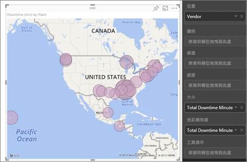
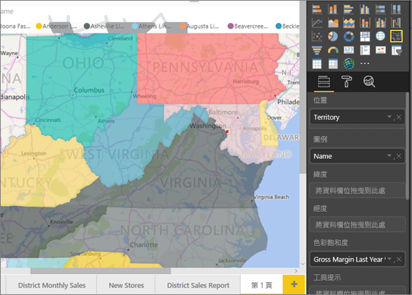
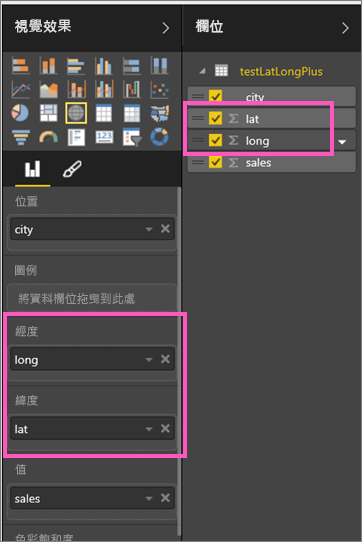

# Power BI 地圖視覺效果的秘訣和訣竅
Power BI 與 Bing 地圖服務整合以提供預設地圖座標 (這個程序稱為地理編碼)，以便您建立地圖。 這兩者使用演算法來識別正確位置，但有時會猜測最接近的位置。 如果 Power BI 嘗試但無法自行建立地圖視覺效果，則會請求 Bing 地圖服務的協助。 

您或您的系統管理員可能需要更新防火牆，以允許存取 Bing 用以進行地理編碼的 URL。  這些 URL 是：
* https://dev.virtualearth.net/REST/V1/Locations
* https://platform.bing.com/geo/spatial/v1/public/Geodata
* https://www.bing.com/api/maps/mapcontrol

若要提高正確地理編碼的可能性，請使用下列祕訣。 第一組祕訣是讓您在可以存取資料集本身時使用。 第二組祕訣則是您在無法存取資料集時，可以在 Power BI 中執行的作業。 

## 傳送至 Bing 地圖服務的項目
Power BI 服務和 Power BI Desktop 會將 Bing 建立地圖視覺效果所需的地理資料傳送至 Bing。 這可能包含 [位置]  、[緯度]  和 [經度]  視覺效果欄位區中的資料。 傳送的確切資料依地圖類型而異。 若要深入了解，請參閱 [Bing 地圖服務隱私權](https://go.microsoft.com/fwlink/?LinkID=248686)。

* 以地圖來說 (泡泡圖、散佈圖、點繪圖)，如果提供緯度和經度，則不會將資料傳送至 Bing。 否則，[位置]  貯體中的任何資料都會傳送至 Bing。     

* 區域分布圖需要 [位置]  貯體中的欄位，即使提供緯度和經度亦然。 [位置]  、[緯度]  或 [經度]  貯體中的資料都會傳送至 Bing。
  
    在下列範例中，[廠商]  欄位用於地理編碼，因此會將 [廠商] 資料行中的值傳送至 Bing。 [大小]  和 [色彩飽和度]  貯體中的資料不會傳送至 Bing。
  
    
  
    在下列範例中，[地區]  欄位用於地理編碼，因此會將 [地區] 資料行中的值傳送至 Bing。 [圖例]  和 [色彩飽和度]  貯體中的資料不會傳送至 Bing。
  
    

## 在資料集中︰改善基礎資料集的秘訣
如果您可以存取用來建立地圖視覺效果的資料集，您可以執行下列一些動作來提高正確地理編碼的可能性。

**1.在 Power BI Desktop 中分類地理位置欄位**

在 Power BI Desktop 中，您可以設定資料欄位的 [資料類別]  ，以確保欄位的地理編碼正確。 在 [資料] 檢視中，選取所需的資料行。 從功能區中選取 [建立模型]  索引標籤，然後將 [資料類別]  設定為**地址**、**城市**、**洲**、**國家/地區**、**郡**、**郵遞區號**、**縣**或**市**。 這些資料類別可以協助 Bing 將該日期正確編碼。 若要深入了解，請參閱 [Power BI Desktop 中的資料分類](../desktop-data-categorization.md)。 若您即時連線到 SQL Server Analysis Services，您必須使用 [SQL Server Data Tools (SSDT)](https://docs.microsoft.com/sql/ssdt/download-sql-server-data-tools-ssdt) 於 Power BI 外部設定資料分類。

**2.使用多個位置資料行。**     
 有時候，即使設定了地圖的資料分類，也不夠讓 Bing 正確猜出您的意圖。 某些指定由於位置存在於多個國家或地區而模稜兩可。 例如，英國、賓夕法尼亞州和紐約州都有「南安普敦」。

Power BI 會使用 Bing 的[非結構化 URL 範本服務](https://msdn.microsoft.com/library/ff701714.aspx)，以根據任何國家/地區的地址值集合來取得緯度和經度座標。 如果您的資料未包含足夠的位置資料，請新增這些資料行並適當地分類。

 例如：如果您只有 [鄉/鎮/市/區] 資料行，Bing 可能很難進行地理編碼。 新增其他地理資料行，讓位置更明確。  有時只需要再將一個位置資料行新增至資料集，在本例中為州/省。 此外，別忘了將它正確分類，如上面第一項所述。

請確定每個欄位只有一個位置分類。 例如：您的 [鄉/鎮/市/區] 位置欄位內容應該要是**南安普敦**，而非**南安普敦，紐約**。  地址位置欄位的內容應該要是 **1 Microsoft Way**，而非 **1 Microsoft Way，雷德蒙德，WA**。

**3.使用特定經度和緯度**

將緯度和經度值加入您的資料集。 這會移除任何模稜兩可的情況，並更快速地傳回結果。 緯度和經度欄位必須是十進位數字  格式，在資料模型中可以設定此格式。

<iframe width="560" height="315" src="https://www.youtube.com/embed/ajTPGNpthcg" frameborder="0" allowfullscreen></iframe>

**4.針對擁有完整位置資訊的資料行使用 [地點] 分類**

雖然我們建議您在您的地圖中使用地理階層架構，但若您必須針對完整的地理資訊使用單一位置資料行，您可以將資料分類設定為 [地點]  。 例如：若您資料行中的資料是一個完整的地址，例如「1 Microsoft Way，雷德蒙德，華盛頓州 98052」，則這個通用資料分類與 Bing 搭配的效果將會最好。 

## 在 Power BI 中︰使用地圖視覺效果時取得更佳結果的秘訣
**1.使用緯度和經度欄位 (如果有的話)**

在 Power BI 中，如果您使用的資料集具有經度和緯度欄位，請使用這些欄位！  Power BI 具有特殊貯體，可協助讓地圖資料更明確。 只要將包含緯度資料的欄位拖曳到 [視覺效果] > [緯度]  區域中即可。  然後對經度資料執行相同的動作。 如果您這麼做，則當您在建立視覺效果的同時，也需要填寫 [位置]  欄位。 否則，根據預設會彙總資料；例如，緯度和經度可能會在州的層級配對，而非縣 (市) 層級。

 

## 使用地理階層，讓您可以向下切入到不同「層級」的位置
當您的資料集已有不同層級的位置資料時，您和您的同事可以使用 Power BI 來建立「地理階層」  。 若要這樣做，請將多個欄位拖曳到 [位置]  貯體中。 利用此方式一起使用的欄位即成為地理階層。 在下列範例中，我們新增了地理欄位：[國家/地區]、[州/省] 和 [縣/市]。 在 Power BI 中，您和您的同事可以使用此地理階層向上切入和向下切入。

  ![[位置] 欄位](./media/power-bi-map-tips-and-tricks/power-bi-hierarchy.png)

   

當您在切入地理階層架構時，請務必了解每個切入按鈕的運作方式為何，以及您將會傳送什麼資料給 Bing 地圖服務。 

* 最右邊的切入按鈕稱為「切入模式」  ，可讓您選取一個地圖位置，並在該特定位置一次向下切入一個層級。 例如：若您開啟 [向下切入]，然後按一下北美洲，您將會在階層中移動至下一個層級：北美洲的州/省。 針對地理編碼，Power BI 僅會將北美洲的國家/地區及各州/省的資料傳送給 Bing 地圖服務。  
* 左邊則有另外兩個切入選項。 第一個選項，  ，會於所有位置一次切入至階層中的下一個層級。 例如：若您目前正在查看國家/地區，然後使用此選項移至下一個層級，Power BI 將會顯示所有國家/地區的州/省資料。 針對地理編碼，Power BI 會將所有位置的州/省資料傳送給 Bing 地圖服務 (不包含國家/地區資料)。 當您階層中的每個層級與上一層都無關時，這個選項將會非常有用。 
* 第二個選項，  ，與 [向下切入] 類似，不同之處在於您並不需要在地圖上按一下。  其會展開階層中的下一個層級，並記住目前層級的內容。 例如：若您目前正在查看國家/地區，並選取此圖示，您將會移至階層中的下一個層級：州/省。 針對地理編碼，Power BI 會將每個州/省的資料及其對應的國家/地區資料傳送給 Bing 地圖服務，以協助其更準確的進行地理編碼。 在大多數的地圖中，您通常會使用這個選項或最右邊的 [向下切入] 選項，盡量將最多的資料傳送給 Bing，以取得準確的位置資訊。 

## 後續步驟
[Power BI 視覺效果中的向下切入](../consumer/end-user-drill.md)

[Power BI 視覺效果](power-bi-report-visualizations.md)

有其他問題嗎？ [試試 Power BI 社群](https://community.powerbi.com/)

