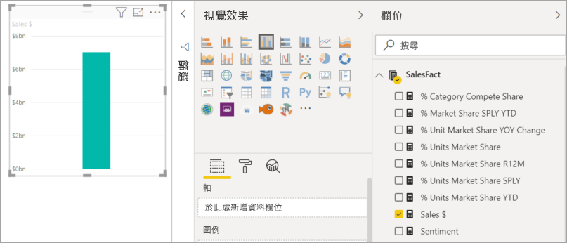
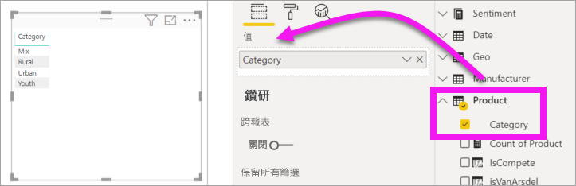
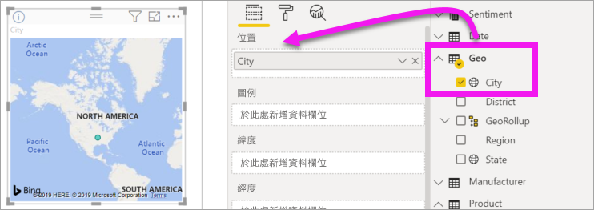
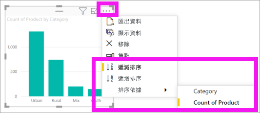

# 第 1 部分：在 Power BI 報表中新增視覺效果

[!INCLUDE [power-bi-visuals-desktop-banner](../includes/power-bi-visuals-desktop-banner.md)]

本文提供在報表中建立視覺效果的快速簡介。 它適用於 Power BI 服務和 Power BI Desktop。 如需更進階的內容，[請參閱本系列的第 2 部分](power-bi-report-add-visualizations-ii.md)。 觀看 Amanda 示範數種不同方式，以在報表畫布上建立、編輯和格式化視覺效果。 接著，自己試著使用[銷售和行銷範例](../sample-datasets.md)來建立專屬報表。

<iframe width="560" height="315" src="https://www.youtube.com/embed/IkJda4O7oGs" frameborder="0" allowfullscreen></iframe>

## 先決條件

本教學課程使用[銷售與行銷 PBIX 檔案](https://download.microsoft.com/download/9/7/6/9767913A-29DB-40CF-8944-9AC2BC940C53/Sales%20and%20Marketing%20Sample%20PBIX.pbix)。

1. 從 Power BI Desktop 功能表列的左上方區段，選取 [檔案]   > [開啟] 
   
2. 尋找您的**銷售與行銷範例 PBIX 檔案**複本

1. 在報表檢視  中開啟**銷售與行銷範例 PBIX 檔案**。

1. 選取  新增頁面。

## 將視覺效果新增至報表

1. 從 [欄位]  窗格選取欄位來建立視覺效果。

    從數值欄位開始，例如 [銷售額]   > [總銷售額]  。 Power BI 會建立具有單一直條的直條圖。

    

    或是以類別欄位開始，例如 [名稱]  或 [產品]  。 Power BI 會建立資料表，並將該欄位新增至 [值]  區。

    

    或從地理位置欄位開始，例如 [地理位置]   > [城市]  。 Power BI 與 Bing 地圖服務會建立地圖視覺效果。

    

## 變更視覺效果的類型

 建立視覺效果，然後變更其類型。 
 
 1. 選取 [產品]   > [類別]  ，然後選取 [產品]   > [產品計數]  ，將兩者新增至 [值]  區。

    ![[欄位] 窗格的螢幕擷取畫面，[值] 區也已標示。](media/power-bi-report-add-visualizations-i/power-bi-create-visual.png)

1. 選取**堆疊直條圖**圖示將視覺效果變更為直條圖。

   ![標示堆疊直條圖圖示的 [視覺效果] 窗格螢幕擷取畫面。](media/power-bi-report-add-visualizations-i/power-bi-convert.png)

1. 若要變更視覺效果的排序方式，請選取 [其他動作]  (...)。使用排序選項來變更排序的方向 (遞增或遞減)，並變更用來排序的資料行 ([排序依據]  )。

   
  
## 後續步驟

 繼續前往：

* [第 2 部分：在 Power BI 報表中加入視覺效果](power-bi-report-add-visualizations-ii.md)

* 在報表中[與視覺效果互動](../consumer/end-user-reading-view.md)。

