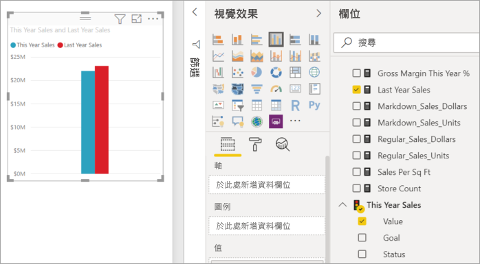
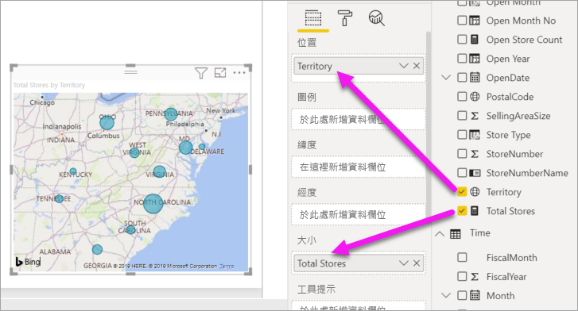

# 將視覺效果新增至 Power BI 報表 (第 2 部分)

[!INCLUDE[consumer-appliesto-nyyn](../includes/consumer-appliesto-nyyn.md)]    

[!INCLUDE [power-bi-visuals-desktop-banner](../includes/power-bi-visuals-desktop-banner.md)]

在[第 1 部分](power-bi-report-add-visualizations-i.md)，您選取了欄位名稱旁邊的核取方塊來建立基本的視覺效果。  在第 2 部分，您將學習如何使用拖放功能及充分利用 [欄位] 和 [視覺效果] 窗格來建立和修改視覺效果。

## 建立新的視覺效果
在本教學課程中，我們要深入探討零售分析資料集，並建立幾個重要的視覺效果。

## 必要條件

本教學課程使用[零售分析範例 PBIX 檔案](https://download.microsoft.com/download/9/6/D/96DDC2FF-2568-491D-AAFA-AFDD6F763AE3/Retail%20Analysis%20Sample%20PBIX.pbix)。

1. 從 Power BI Desktop 功能表列的左上方區段，選取 [檔案] > [開啟]
   
2. 尋找您的**零售分析範例 PBIX 檔案**複本

1. 在報表檢視  中開啟**零售分析範例 PBIX 檔案**。

1. 選取  新增頁面。

## 將視覺效果新增至報表

從 [欄位]  窗格選取欄位來建立視覺效果。 所建立視覺效果類型會視選取的欄位類型而定。 Power BI 會使用資料類型來決定要使用哪個視覺效果來顯示結果。 您可以從 [視覺效果] 窗格選取不同的圖示，藉以變更使用的視覺效果。 請記住，並非所有視覺效果都可以顯示您的資料。 例如，使用漏斗圖或折線圖無法正常顯示地理資料。 

### 新增可查看本年度與去年度比較銷售額的區域圖

1. 從 [銷售] 資料表中選取 [本年度銷售額] >  [值] 和 [去年度銷售額]。 Power BI 建立了直條圖。  這個圖表有點意思，因此您想要更進一步探討。 每月的銷售額又會是如何呢？  
   
   

2. 從 [時間]資料表中將 [會計月份] 拖曳到 [軸] 區域。  
   ![螢幕擷取畫面，其中顯示以 [會計月份] 作為軸的直條圖](media/power-bi-report-add-visualizations-ii/power-bi-fiscalmonth.png)

3. [將視覺效果變更](power-bi-report-change-visualization-type.md)為區域圖。  有許多視覺效果類型可從中選擇，請參閱[其中各項說明、最佳做法的祕訣和教學課程](power-bi-visualization-types-for-reports-and-q-and-a.md)來協助您決定要使用哪種類型。 從 [視覺效果] 窗格選取區域圖圖示 ![[視覺效果] 窗格中的區域圖圖示](media/power-bi-report-add-visualizations-ii/power-bi-area-chart.png)。

4. 選取 [更多選項] (...)，然後選擇 [排序依據] >  [會計月份] 來排序視覺效果。

5. 選取視覺效果、抓取一個圓形外框，然後拖曳以[調整視覺效果大小](power-bi-visualization-move-and-resize.md)。 讓它寬到消除捲軸，但提供足夠的空間以新增另一個視覺效果。
   
   
6. [儲存報表](../create-reports/service-report-save.md)。

### 加入地圖視覺效果來依位置查看銷售

1. 從 [門市]  資料表中選取 [領域]。 將 [門市總額] 拖曳到 [大小] 區域。 Power BI 能夠辨識「領域」是一個位置，並建立地圖視覺效果。  
   

2. 加入圖例。  若要依門市名稱查看資料，請將 [門市] > [連鎖店] 拖曳到 [圖例] 區域。  
   ![報表畫布，有箭號從欄位清單中的 [連鎖店] 指到 [圖例] 值區中的 [連鎖店]](media/power-bi-report-add-visualizations-ii/power-bi-chain.png)

> [!NOTE]
> 若要與 Power BI 同事共用報表，必須兩人都擁有個人的 Power BI Pro 授權，或將報表儲存在 Premium 容量中。 請參閱[共用報告](../collaborate-share/service-share-reports.md)。

## 後續步驟
* 深入了解 [Power BI 報表中的視覺效果](power-bi-report-visualizations.md)。  
* 有其他問題嗎？ [試試 Power BI 社群](https://community.powerbi.com/)

