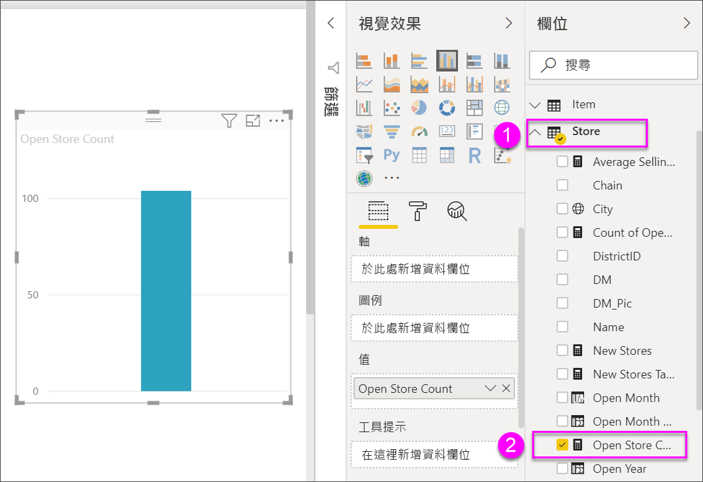
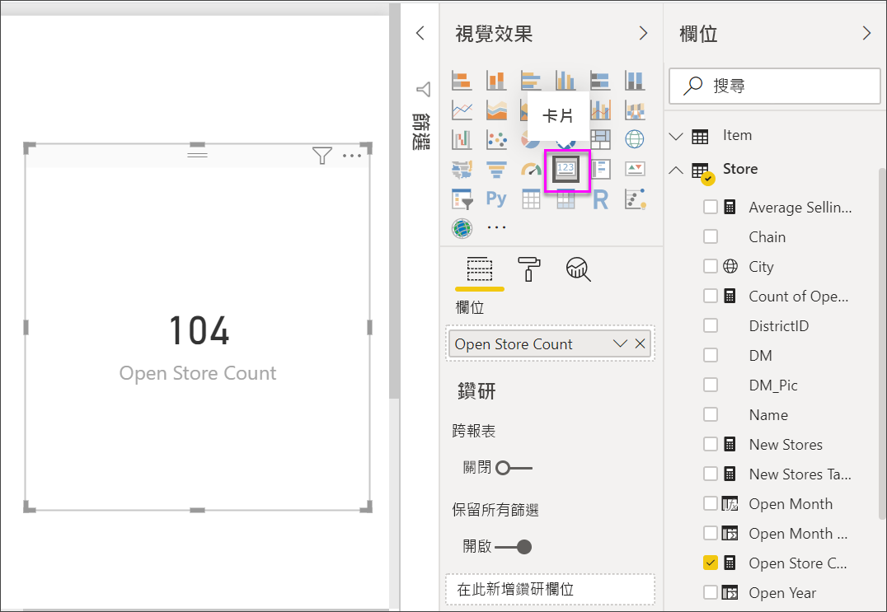
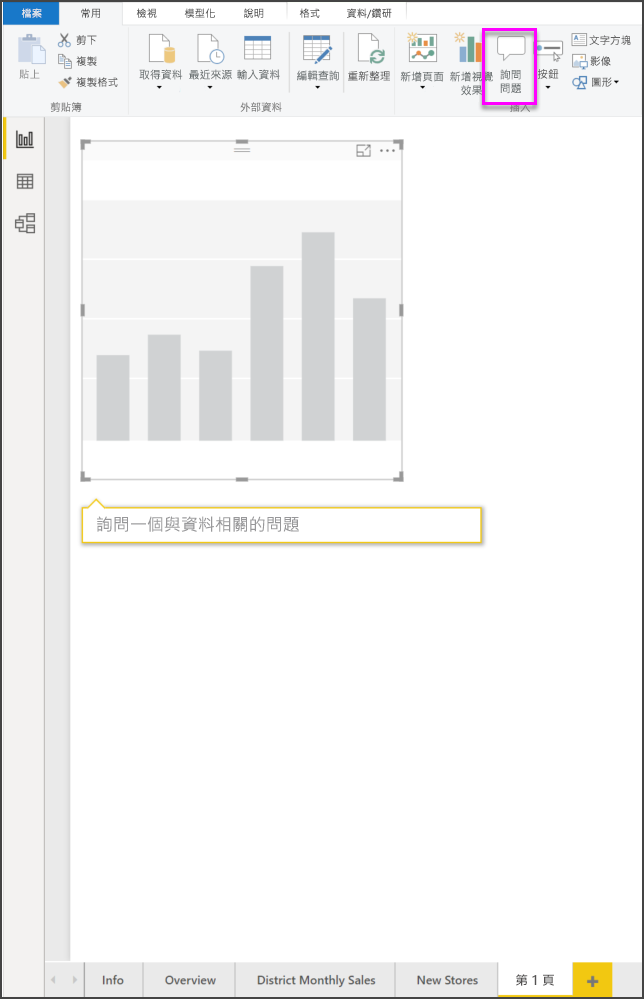
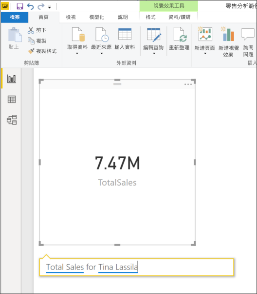
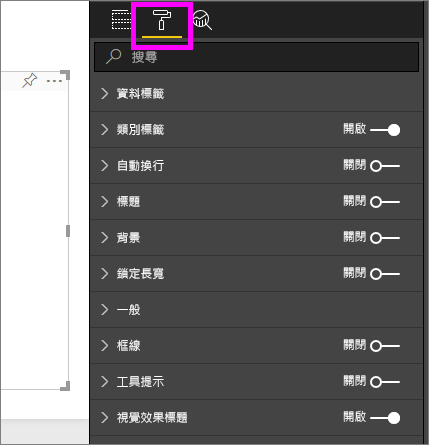
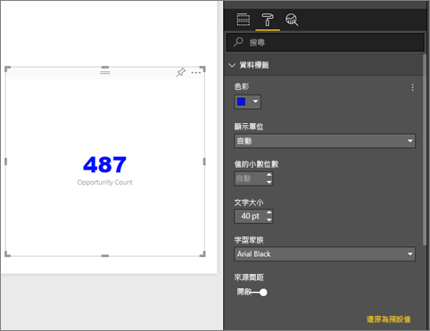
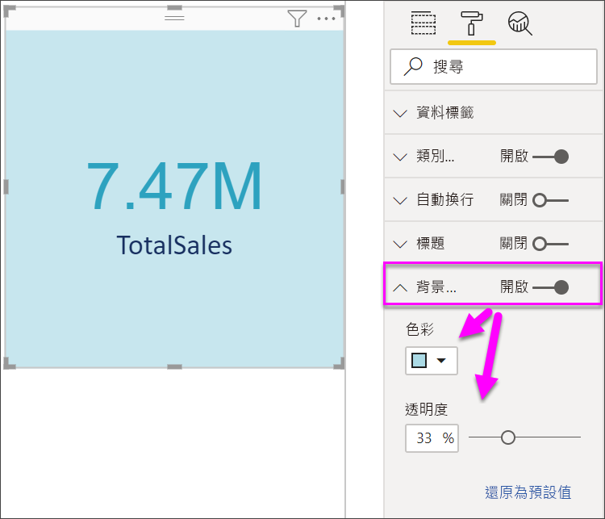

# 建立卡片視覺效果

[!INCLUDE [power-bi-visuals-desktop-banner](../includes/power-bi-visuals-desktop-banner.md)]

有時您在 Power BI 儀表板或報告中追蹤的最重要項目是一個單一數字，例如總銷售額、歷年的市佔率，或總商機。 這類型的視覺效果稱為「卡片」  。 幾乎所有的原生 Power BI 視覺效果，都可以使用報告編輯器或 [問與答] 來建立卡片。

## 必要條件

本教學課程使用[零售分析範例 PBIX 檔案](https://download.microsoft.com/download/9/6/D/96DDC2FF-2568-491D-AAFA-AFDD6F763AE3/Retail%20Analysis%20Sample%20PBIX.pbix)

1. 從功能表列的左上方區段中，選取 [檔案]  \> [開啟] 
   
2. 尋找您的**零售分析範例 PBIX 檔案**複本

1. 在報表檢視  中開啟**零售分析範例 PBIX 檔案**。

1. 選取  新增頁面。

## 選項 1：使用報告編輯器建立卡片

建立卡片的第一種方法，是使用 Power BI Desktop 中的報表編輯器。

1. 從空白報告頁面開始，選取 [門市]  \> [開張門市計數]  欄位。

    Power BI 會以一個數字建立直條圖。

   

2. 在 [視覺效果] 窗格中選取卡片圖示。

   

您現在已成功使用報表編輯器建立卡片。 以下是使用問與答問題方塊來建立卡片的第二個選項。

## 選項 2：從問與答問題方塊建立卡片
問與答問題方塊是您在建立卡片時使用的另一個選項。 您可以在 Power BI Desktop 報表檢視中取得問與答問題方塊。

1. 從空白報表頁面開始

1. 在視窗頂端，選取**詢問問題**圖示。 

    Power BI 將會為您的問題建立卡片和方塊。 

   

2. 例如，在問題方塊中鍵入「Tina 的總銷售額」。

    問題方塊可透過建議與重新陳述來協助您，而且最後會顯示總數。  

   

   

您現在已成功建立包含問與答問題方塊的卡片。 以下步驟可讓您針對特定需求將卡片格式化。

## 格式化卡片
您有變更標籤、文字、色彩等等的許多選項。 學習的最佳方法是建立卡片，然後探索 [格式化] 窗格。 以下是幾個可用的格式化選項。 

在報表中與卡片互動時，可使用 [格式化] 窗格。 

1. 從選取油漆滾筒圖示開始，開啟 [格式化] 窗格。 

    

2. 選取卡片，展開 [資料標籤]  並變更色彩、大小和字型系列。 如果您有數千個存放區，則可以使用 [顯示單位]  以千為單位顯示存放區數目，並控制小數位數。 例如，125.8K 而不是 125,832.00。

    

3.  展開 [類別目錄標籤]  並變更色彩和大小。

    

4. 展開 [背景]  並移動滑桿至 [開啟]。  現在您可以變更背景色彩和透明度。

    

5. 繼續探索格式化選項，直到您的卡片完全符合您的喜好。 

## 考量與疑難排解
如果完全看不到問題方塊，請連絡系統或租用戶系統管理員。    

## 後續步驟
[Power BI 中的組合圖](power-bi-visualization-combo-chart.md)

[Power BI 中的視覺效果類型](power-bi-visualization-types-for-reports-and-q-and-a.md)
