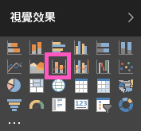

# Power BI 中的組合圖

在 Power BI 中，組合圖是結合折線圖和直條圖的單一視覺效果。 將兩種圖結合成一張圖，讓您可以更快速地比較資料。

組合圖可以有一或兩條 Y 軸。

## 使用組合圖的時機

組合圖極適合：

* 當您的折線圖和直條圖具有相同的 X 軸。

* 當您要比較具有不同值範圍的多個量值。

* 當您要在一個視覺效果中說明兩個量值間的相互關聯。

* 當您要檢查量值是否符合另一個量值所定義的目標。

* 當您要節省畫布的空間。

## 先決條件

組合圖適用於 Power BI 服務和 Power BI Desktop。 本教學課程會使用 Power BI 服務建立組合圖。 請確定您具有使用者認證來登入 Power BI。

觀看 Will 如何使用銷售和行銷範例建立組合圖。

<iframe width="560" height="315" src="https://www.youtube.com/embed/lnv66cTZ5ho?list=PL1N57mwBHtN0JFoKSR0n-tBkUJHeMP2cP" frameborder="0" allowfullscreen></iframe>  

## 建立單一軸的基本組合圖

若要跟著做，請開啟 Power BI 服務並連線到 [零售分析範例]  。 若要建立自己的組合圖，請登入 Power BI 服務並選取 [取得資料]   >  [範例]   >  [零售分析範例]   >  [連接]  。 [零售分析範例]  儀表板即會出現。

1. 從 [零售分析範例] 儀表板，選取 [所有門市]  圖格，開啟 [門市零售概觀]  報表。

1. 選取 [編輯報表]  以在 [編輯檢視] 中開啟報表。

1. 在頁面底部，選取 **+** 来新增報表頁面。

1. 建立依月份顯示本年度銷售額和毛利的直條圖。

    1. 從 [欄位] 窗格中選取 [銷售額]  \> [本年度銷售額]   >  [值]  。

    1. 將 [銷售額]  \>[本年度毛利]  拖曳到 [值]  的部分。

    1. 選取 [時間]  \> [會計月份]  ，將其加入 [軸]  部分。

        

1. 選取視覺效果右上角的省略符號，然後選取 [排序依據] > [FiscalMonth]  。 若要變更排序次序，請再次選取省略符號，並選擇 [遞增排序]  或 [遞減排序]  。

1. 將直條圖轉換成組合圖。 有兩個組合圖可用：[折線與堆疊直條圖]  和 [折線與群組直條圖]  。 選取直條圖後，從 [視覺效果]  窗格中，選取 [折線與群組直條圖]  。

    ![標示折線與群組直條圖選項的 [視覺效果] 窗格螢幕擷取畫面。](media/power-bi-visualization-combo-chart/converttocombo_new2.png)

1. 從 [欄位]  窗格中，將 [銷售額]   >  [去年度銷售額]  拖曳到 [折線圖值]  區。

    ![將去年度銷售額拖曳至其中的 [折線圖值] 區螢幕擷取畫面。](media/power-bi-visualization-combo-chart/linevaluebucket.png)

    您的組合圖看起來應該像這樣：

    

## 建立具有兩軸的組合圖

在這項工作中，我們會比較毛利率與銷售額。

1. 建立依**月份**追蹤**去年毛利率 %** 的新折線圖。 選取省略符號，依 [月份]  和 [遞增]  排序。

    

     一月的 GM% 為 35%，尖峰在 4 月為 45%，於 7 月下降並再次於 8 月達到尖峰。 我們去年和今年會看到類似的銷售模式嗎？

1. 將 [今年度銷售額]   >  [值]  和 [去年度銷售額]  新增至折線圖。 [去年毛利率 %]  的刻度遠小於 [銷售額]  的刻度。 因此，難以比較。

    

1. 若要使視覺效果更容易閱讀及解譯，請將折線圖轉換成折線與堆疊直條圖。

    

1. 將 [去年毛利率 %]  從 [資料行值]  拖曳到 [行值]  。 

    

    Power BI 會建立兩個軸，允許服務採用不同的資料集刻度。 左側測量銷售金額，而右側測量百分比。 然後，我們看到問題的答案：是，我們的確看到類似的模式。

## 將標題加入座標軸

1. 選取油漆滾筒圖示  開啟 [格式化] 窗格。

1. 選取向下箭號以展開 [Y 軸]  選項。

1. 針對 [Y 軸 (直條圖)]  ，選取下列選項：

    | 設定 | 值 |
    | ------- | ----- |
    | 位置 | 選取 [左]  。 |
    | 顯示單位 | 選取 [百萬]  。 |
    | 標題 | 將滑桿移至 [開啟]  。 |
    | 樣式 | 選取 [僅顯示標題]  。 |
    | 顯示次要 | 將滑桿移至 [開啟]  。  這會顯示用於設定組合圖中折線圖部分格式的選項。 |

1. 針對 [Y 軸 (折線圖)]  ，選取下列選項：

    | 設定 | 值 |
    | ------- | ----- |
    | 位置 | 選取 [右]  。 |
    | 標題 | 將滑桿移至 [開啟]  。 |
    | 樣式 | 選取 [僅顯示標題]  。 |

    組合圖現在會顯示雙座標軸及其標題。

    

1. (選擇性) 變更文字的字型、大小和色彩，並設定其他格式化選項，以改善圖表的顯示和可讀性。

接下來，您可能會想要：

* [將組合圖加入為儀表板圖格](../service-dashboard-tiles.md)。

* [儲存報表](../service-report-save.md)。

* [使報表讓行動不便人士易於存取](../desktop-accessibility.md)。

## 交叉反白顯示和交叉篩選

在組合圖中反白顯示直條或折線，會交叉反白顯示和交叉篩選報表頁面上的其他視覺效果。 若要變更此預設行為，請使用[視覺效果互動](../service-reports-visual-interactions.md)。

## 後續步驟

[Power BI 中的環圈圖](power-bi-visualization-doughnut-charts.md)

[Power BI 中的視覺效果類型](power-bi-visualization-types-for-reports-and-q-and-a.md)