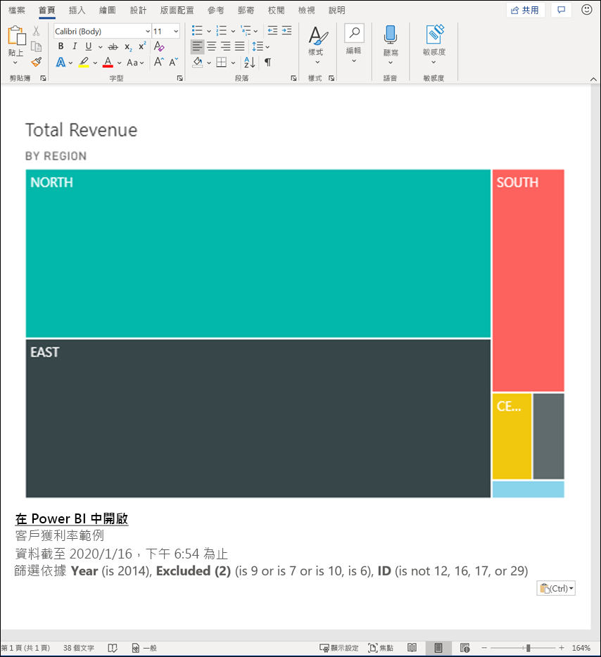
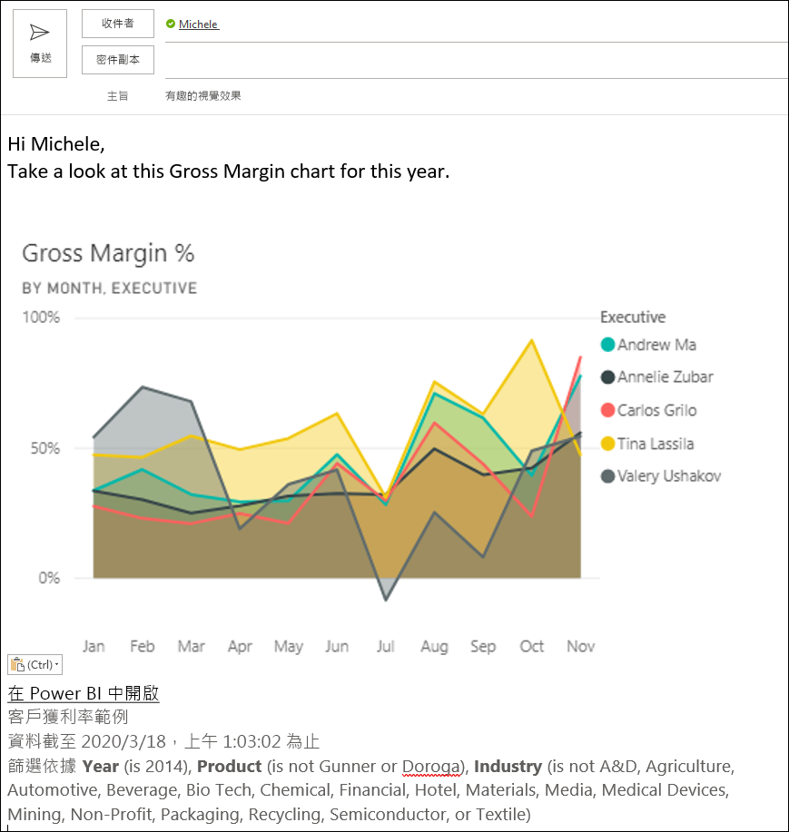
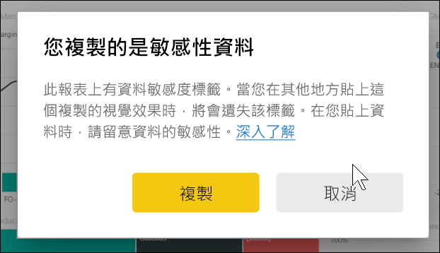
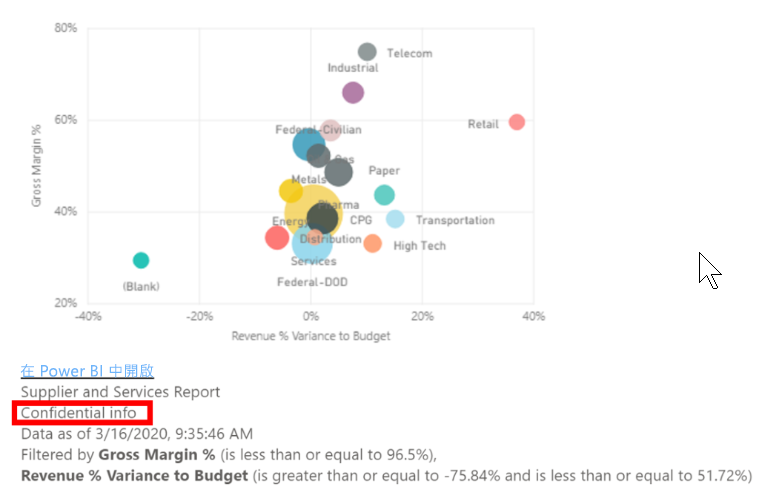
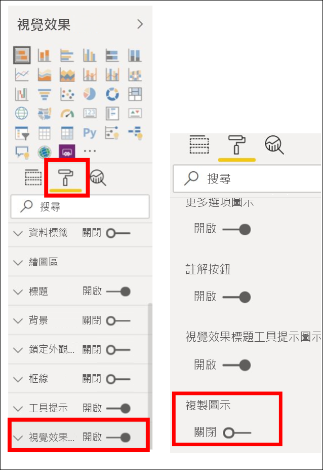
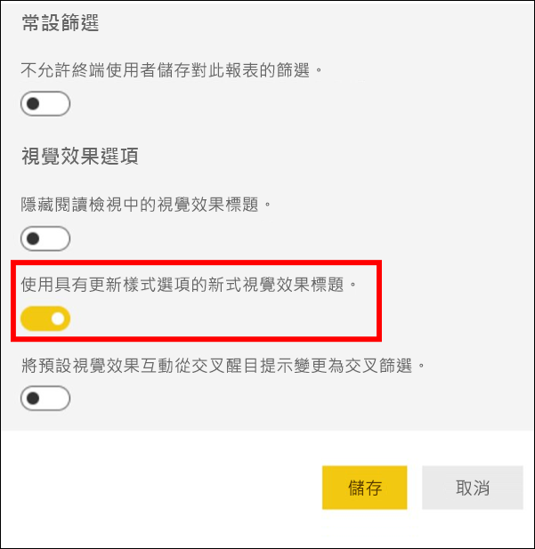
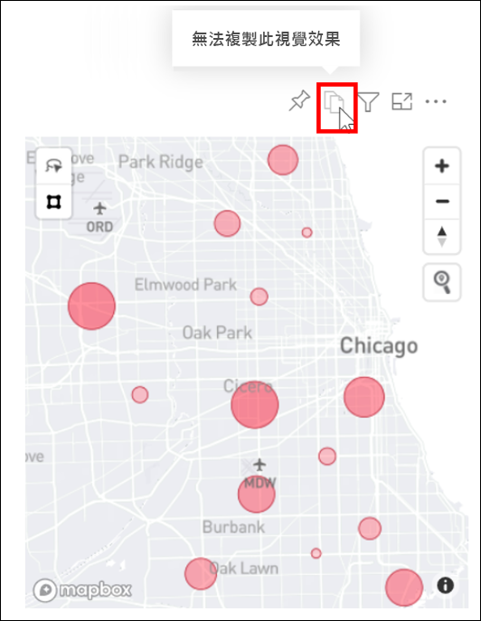

# 複製並貼上報表視覺效果

[!INCLUDE[consumer-appliesto-yyyn](../includes/consumer-appliesto-yyyn.md)]

此文章涵蓋兩種複製並貼上視覺效果的不同方式。 
* 複製一個報表頁面中的視覺效果，然後將其貼到另一個報表頁面上 (需要具備報表的編輯權限)

* 將視覺效果的圖片從 Power BI 複製到您的剪貼簿，然後將其貼到其他應用程式中

## 在同一個報表中複製並貼上
Power BI 報表中視覺效果可以從報表中的某個頁面，複製到相同報表中的同一個頁面或不同頁面。 

複製並貼上視覺效果時，需要有報告的編輯權限。 在 Power BI 服務中，這表示在[編輯檢視](../consumer/end-user-reading-view.md)中開啟報告。 

您無法將「儀表板」  上的視覺效果複製並貼到 Power BI 報表或其他儀表板中。

1. 開啟至少有一個視覺效果的報告。  

2. 選取視覺效果並使用 **Ctrl+C** 複製，並使用 **Ctrl+V** 貼上。      

   

## 將視覺效果以圖片形式複製到剪貼簿

您是否曾想要從 Power BI 報表或儀表板共用圖片？ 現在，您可以將視覺效果複製並貼到任何其他支援貼上的應用程式中。 

複製視覺效果的靜態圖片時，您會取得視覺效果複本及中繼資料。 其中包括：
* 返回 Power BI 報表或儀表板的連結
* 報表或儀表板的標題
* 圖片是否包含機密資訊的通知
* 上次更新時間戳記
* 套用至視覺效果的篩選

### 從儀表板磚複製

1. 瀏覽至您要從中複製的儀表板。

2. 從視覺效果的右上角，選取 [更多選項 (...)]  ，然後選擇 [將視覺效果複製為圖片]  。 

    ![顯示的 [將視覺效果複製為圖片] 圖示](media/power-bi-visualization-copy-paste/power-bi-copy-dashboard.png)

3. 出現 [您的視覺效果已可複製]  對話方塊時，選取 [複製至剪貼簿]  。

    ![具有 [複製至剪貼簿] 選項的對話方塊](media/power-bi-visualization-copy-paste/power-bi-copied.png)

4. 當視覺效果準備就緒時，使用 **Ctrl + V** 或按一下滑鼠右鍵 > [貼上] 來將其貼到另一個應用程式。 在下方螢幕擷取畫面中，我們已將視覺效果貼到 Microsoft Word 中。 

    

### 從報表視覺效果複製 

1. 瀏覽至您要從中複製的報表。

2. 從視覺效果的右上角，選取 [將視覺效果複製為圖片]  的圖示。 

    ![顯示的 [將視覺效果複製為圖片] 圖示](media/power-bi-visualization-copy-paste/power-bi-copy-icon.png)

3. 出現 [您的視覺效果已可複製]  對話方塊時，選取 [複製至剪貼簿]  。

    ![具有 [複製至剪貼簿] 選項的對話方塊](media/power-bi-visualization-copy-paste/power-bi-copied.png)

4. 當視覺效果準備就緒時，使用 **Ctrl + V** 或按一下滑鼠右鍵 > [貼上] 來將其貼到另一個應用程式。 在下方螢幕擷取畫面中，我們已將視覺效果貼到電子郵件中。

    

5. 如果報表已套用資料敏感度標籤，當您選取複製圖示時，就會收到警告。  

    

    然後，在所貼上視覺效果底下的中繼資料中會新增一個敏感度標籤。 

    

### 管理將視覺效果複製為圖片的使用
如果您是內容的擁有者或租用戶的管理員，便可以控制是否可從報表或儀表板將視覺效果複製為圖片。

#### 針對特定視覺效果停用將視覺效果複製為圖片的功能
如果您不想要讓使用者能夠複製特定的視覺效果，可以從該視覺效果移除複製圖示。
1. 選取油漆滾筒圖示來開啟 [格式化] 窗格。 

1. 開啟 [視覺效果格式設定]  卡片。
1. 向下捲動至 [視覺效果標題]  、展開卡片，然後關閉 [複製圖示]  。

    

1. 如果找不到 [視覺效果標題]  設定，請開啟 [報表設定]  底下的新式視覺效果標題選項。 

    

1. 儲存變更。 視需要重新共用和重新發佈。

#### 針對使用者群組停用將視覺效果複製為圖片的功能

如果您是內容的擁有者或租用戶的管理員，便可以控制可複製視覺效果的人員。 此設定會針對使用者在 Power BI 租用戶中存取的所有內容停用 [將視覺效果複製為圖片]  。
  
1. 瀏覽至 [管理入口網站]。

1. 在 [租用戶設定]  底下，選取 [匯出及共用設定]  。 

    ![啟用 [複製並貼上視覺效果] 功能](media/power-bi-visualization-copy-paste/power-bi-enable.png)

1. 針對選取的使用者群組停用 [複製並貼上視覺效果]  。 

1. 儲存變更，指定的群組在整個 Power BI 便都無法使用 [將視覺效果複製為圖片]  。 
  

## 考量與疑難排解

   

問：為什麼視覺效果上的 [複製] 圖示是停用的？    
答：我們目前支援原生的 Power BI 視覺效果和已認證的視覺效果。 針對特定視覺效果提供有限的支援，包括： 
- ESRI 及其他地圖視覺效果 
- Python 視覺效果 
- R 視覺效果 
- PowerApps 
- 非認證的自訂視覺效果。若要讓您的自訂視覺效果受到支援，請深入了解[如何認證自訂視覺效果](../developer/visuals/power-bi-custom-visuals-certified.md)。 

問：為什麼我的視覺效果未正確貼上？    
答：將視覺效果複製為圖片有一些限制，包括： 
- 針對自訂視覺效果 
    - 已套用主題和色彩的視覺效果 
    - 貼上時的磚縮放 
    - 具有動畫的自訂視覺效果 
- 複製限制 
    - 無法複製剛釘選的儀表板磚 
    - 無法將使用者重新導向到具有 Odata 篩選條件和黏性狀態 (例如個人書籤) 的內容 
- 應用程式若是對於從剪貼簿貼上 HTML 格式內容僅提供有限支援，可能無法呈現從視覺效果複製的所有內容 

## 後續步驟
深入了解 [Power BI 報表中的視覺效果](power-bi-report-visualizations.md)

有其他問題嗎？ [試試 Power BI 社群](https://community.powerbi.com/)

