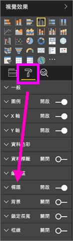
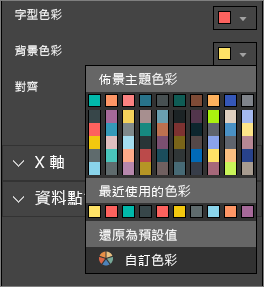
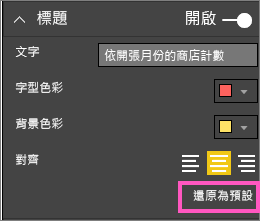
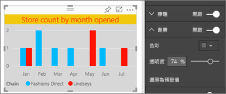
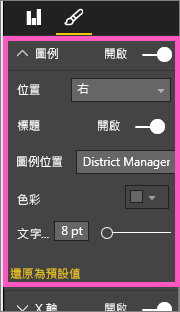
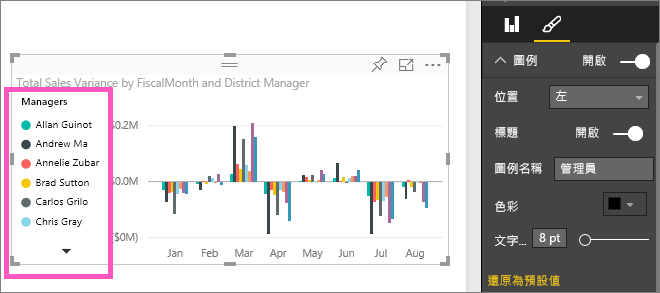

# 自訂視覺效果標題、圖例及背景
在本教學課程中，您將學到一些不同的方法，可以用來自訂視覺效果。   有許多選項可以自訂視覺效果，了解它們的最佳方式是探索 [格式化] 窗格 (選取滾筒刷圖示)。  為了讓您快速入門，本文向您示範如何自訂視覺效果標題、圖例和背景。  

並非所有視覺效果都可自訂，請[參閱完整清單](#list)。  

看 Amanda 在報表中自訂視覺效果 (向前快轉到影片的 4:50 處)。 然後遵循以下影片的指示，用您自己的資料試試看。

<iframe width="560" height="315" src="https://www.youtube.com/embed/IkJda4O7oGs" frameborder="0" allowfullscreen></iframe>

### 先決條件
- Power BI 服務或 Power BI Desktop
- 零售分析範例

## 自訂報表中的視覺效果標題
若要跟著做，請登入 Power BI 服務 (app.powerbi.com)，然後在[編輯檢視](../service-interact-with-a-report-in-editing-view.md)中[開啟零售分析範例](../sample-datasets.md)報表。

> [!NOTE]
> 當您將視覺效果釘選至儀表板時，它會變成儀表板圖格。  圖格本身也可以使用新的[標題和副標題、超連結來自訂，也能調整大小](../service-dashboard-edit-tile.md)。
> 
> 

1. 瀏覽至報表的 [新門市] 頁面，並選取 [依開張月份的開張門市計數] 直條圖。
2. 在 [視覺效果] 窗格中，選取滾筒刷圖示以顯示格式化選項。  選取 [標題] 以展開該區段。  

   
3. 選取 \[開啟] \(或 [關閉]) 滑桿，以開啟及關閉  **標題** 。 現在請將其保持 [開啟] 。  

   
4. 變更 **標題文字** ，方法是在文字欄位中輸入 **依開張月份的門市計數** 。  
5. 將 **字型色彩** 變更為橙色，並將 **背景色彩** 變更為黃色。

   * 選取下拉式清單，並從 [佈景主題色彩] 、[最近使用的色彩] ，或 [自訂色彩] 選擇色彩。
   * 選取此下拉式清單，以關閉 [色彩] 視窗。  
     

   您隨時可以回復預設色彩，方法是在 [色彩] 視窗中選取 [還原為預設值]  。
6. 將文字大小放大到 12。
7. 我們要對圖表標題所做的最後一項自訂，是要讓視覺效果對齊中央。 標題位置預設為靠左對齊。  
   

    此時教學課程中，直條圖**標題**看起來應該類似這樣：  
    

    若要還原到目前為止我們所做過的所有標題自訂，請選取 [標題] 自訂窗格底部的 [還原為預設值]  。  
    

## 自訂視覺效果的背景
選取相同的直條圖之後，展開 [背景] 選項。

1. 選取 \[開啟] \(或 [關閉]) 滑桿，以開啟或關閉背景。 現在請將其保持 [開啟] 。
2. 將背景色彩變更為 74% 灰色。

   * 選取下拉式清單，並從 [佈景主題色彩]、[最近使用的色彩]或 [自訂色彩] 選擇灰色。
   * 將透明度變更為 74%。   
     

   若要還原目前為止我們所做過的所有標題背景自訂，請選取 [背景] 自訂窗格底部的 [還原為預設值]  。

## 自訂視覺效果的圖例
1. 開啟 [概觀]  報表頁面，然後選取「依會計月份與區域經理的總銷售額差異」圖表。
2. 在 [視覺效果] 索引標籤中，選取畫刷圖示以開啟 [格式化] 窗格。  
3. 展開 [圖例]  選項。

      
4. 選取 \[開啟] \(或 [關閉]) 滑桿，以開啟或關閉圖例。 現在請將其保持 [開啟] 。
5. 將圖例移到視覺效果的左側。    
6. 加入圖例標題，方法是將 [標題]  切換為 [開啟]  ，然後在 [圖例名稱]  欄位中輸入 **經理**。
   

   若要還原到目前為止我們所做過的所有圖例自訂，請選取 [圖例] 自訂窗格底部的 [還原為預設值]  。

## 可以自訂的視覺效果類型

| 視覺效果 | 標題 | 背景 | 圖例 |
|:--- |:--- |:--- |:--- |
| 區域 |是 |是 |是 |
| 列 |是 |是 |是 |
| 卡片 |是 |是 |N/A |
| 多列卡片 |是 |是 |N/A |
| 直條圖 |是 |是 |是 |
| 組合圖 |是 |是 |是 |
| 環圈圖 |是 |是 |是 |
| 區域分布圖 |是 |是 |是 |
| 漏斗圖 |是 |是 |N/A |
| 量測計 |是 |是 |N/A |
| KPI |是 |是 |N/A |
| 折線圖 |是 |是 |是 |
| 地圖 |是 |是 |是 |
| 矩陣圖 |是 |是 |N/A |
| 圓形圖 |是 |是 |是 |
| 散佈圖 |是 |是 |是 |
| 交叉分析篩選器 |是 |是 |N/A |
| 資料表 |是 |是 |N/A |
| 文字方塊 |不可以 |是 |N/A |
| 矩形式樹狀結構圖 |是 |是 |是 |
| 瀑布圖 |是 |是 |可以 |

## 後續步驟
[自訂 X 軸和 Y 軸](power-bi-visualization-customize-x-axis-and-y-axis.md)  
[自訂色彩和軸屬性](service-getting-started-with-color-formatting-and-axis-properties.md)  
[Power BI - 基本概念](../consumer/end-user-basic-concepts.md)  
有其他問題嗎？ [試試 Power BI 社群](http://community.powerbi.com/)

