# 自訂 X 軸和 Y 軸屬性

[!INCLUDE [power-bi-visuals-desktop-banner](../includes/power-bi-visuals-desktop-banner.md)]

本教學課程中，您將學到許多不同的方法，可以用來自訂視覺效果的 X 軸和 Y 軸。 並非所有視覺效果都擁有座標軸。 例如，圓餅圖就沒有座標軸。 而且自訂選項會隨視覺效果而不同。 選項太多而無法在單一文章中介紹，因此我們將探討一些最常用的自訂項目，並使用 Power BI 報表畫布中的視覺 [格式]  窗格以輕鬆解說。  

觀看 Amanda 自訂 X 軸和 Y 軸。 她也會以不同的方式，示範使用向下切入和向上切入時控制串連。

> [!NOTE]
> 這部影片使用舊版的 Power BI。

<iframe width="560" height="315" src="https://www.youtube.com/embed/9DeAKM4SNJM" frameborder="0" allowfullscreen></iframe>

## 必要條件

- Power BI Desktop

- [零售分析範例](https://download.microsoft.com/download/9/6/D/96DDC2FF-2568-491D-AAFA-AFDD6F763AE3/Retail%20Analysis%20Sample%20PBIX.pbix)

## 新增新的視覺效果

您必須先建立視覺效果，才能自訂視覺效果。

1. 在 Power BI Desktop 中，開啟零售分析範例。  

2. 選取底部的黃色加號圖示以新增頁面。 

    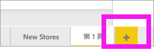

1. 從 [視覺效果]  窗格中選取堆疊直條圖圖示 。 這會將空白範本加入報表畫布中。

    ![[視覺效果] 窗格和空白堆疊直條圖的螢幕擷取畫面](media/power-bi-visualization-customize-x-axis-and-y-axis/power-bi-column-chart.png)

1. 若要設定 X 軸的值，請從 [欄位]  窗格中選取 [時間]   >  [FiscalMonth]  。

1. 若要設定 Y 軸的值，請從 [欄位]  窗格中選取 [銷售額]   >  [去年度銷售額]  和 [銷售額]   >  [今年度銷售額]   >  [值]  。

    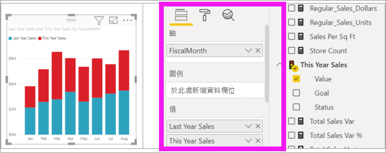

    現在您可以自訂您的 X 軸。 Power BI 提供您幾乎無限制的選項來格式化視覺效果。 

## 自訂 X 軸
X 軸有許多可自訂的功能。 您可以新增及修改資料標籤和 X 軸標題。 針對類別，您可以修改橫條、直條、折線、面積的寬度、大小和填補。 針對值，您可以修改顯示單位、小數位數、格線。 下列範例示範自訂直條圖。 讓我們新增一些自訂項目，讓您熟悉這些選項，然後您就可以自行探索其餘自訂。

### 自訂 X 軸標籤
X 軸標籤會顯示在圖表中的直條下方。 現在，它們是淺灰色、小字，而且很難閱讀。 讓我們改變它。

1. 在 [視覺效果]  窗格中，選取 [格式]  (滾筒刷圖示  ) 以顯示自訂選項。

2. 展開 X 軸選項。

   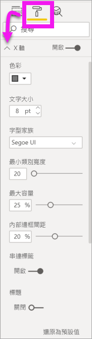

3. 將 [X 軸]  滑桿移至 [開啟]  。

    ![[開啟] 滑桿的螢幕擷取畫面。](media/power-bi-visualization-customize-x-axis-and-y-axis/power-bi-slider-on.png)

    基於某些原因，您可能會想要將 X 軸設定為 [關閉]  ，例如，如果視覺效果在沒有標籤的情況下是一目了然的，或如果您的報表頁面擁擠，需要空間來顯示更多資料。

4. 設定文字色彩、大小和字型的格式：

    - **色彩**：選取 [黑色]

    - **文字大小**：輸入 *14*

    - **字型家族**：選取 [Arial Black] 

    - **內部邊框間距**：輸入 40% 

        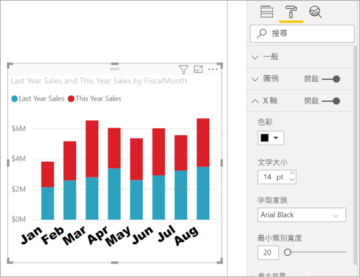
    
5. 也許您不喜歡 X 軸文字傾斜顯示的樣子。 您可以有幾種做法。 
    - 將文字大小變更為小於 14 的值。
    - 將視覺效果變大一些。 
    - 增加 [最小類別寬度]  以顯示較少的直條，並加入捲軸。 
    
    在這裡，我們選擇第二個做法，抓取其中一個調整大小列將視覺效果加寬。 它現在可以容納 14 點文字了，不需要傾斜顯示文字或使用捲軸。 

   

### 自訂 X 軸標題
當 X 軸標題為 [開啟]  時，X 軸標題會顯示在 X 軸標籤下方。 

1. 一開始先將 X 軸標題設為 [開啟]  。  

    

    您會注意到的第一件事，就是您的視覺效果現在有了預設的 X 軸標題。  在本例中是 **FiscalMonth**。

   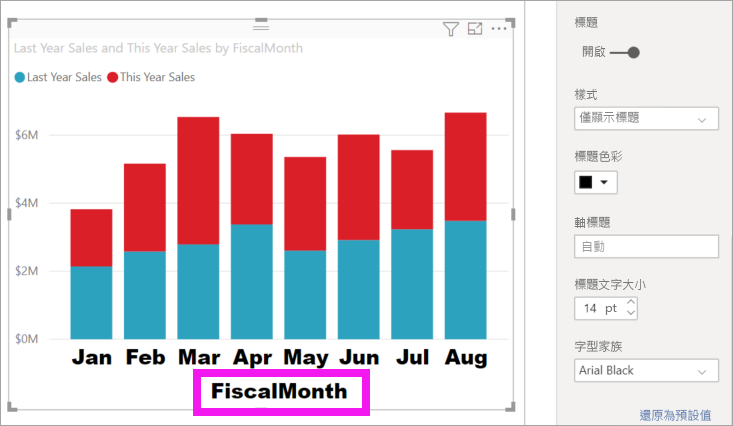

1. 設定標題文字色彩、大小和字型的格式：

    - **標題色彩**：選取 [橙色]

    - **軸標題**：輸入「會計月份」 

    - **標題文字大小**：輸入 18 

    完成自訂之後，堆疊直條圖看起來像這樣：

    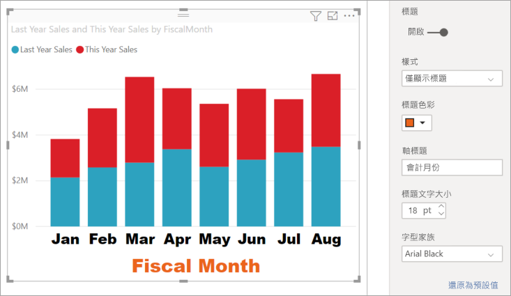

1. 儲存您所做的變更，然後移至下個區段。 如果需要還原所有變更，請選取 [X 軸]  自訂窗格底部的 [還原為預設值]  。 接下來，您將自訂您的 Y 軸。

## 自訂 Y 軸
Y 軸有許多可自訂的功能。 您可以新增及修改資料標籤、Y 軸標題、格線。 針對值，您可以修改顯示單位、小數位數、起始點、結束點。 針對類別，您可以修改橫條、直條、折線、面積的寬度、大小和填補。 

下列範例繼續自訂剛才的直條圖。 讓我們進行一些變更，讓您熟悉這些選項，然後您就可以自行探索其餘自訂。

### 自訂 Y 軸標籤
Y 軸標籤預設會顯示在左邊。 現在，它們是淺灰色、小字，而且很難閱讀。 讓我們改變它。

1. 展開 Y 軸選項。

   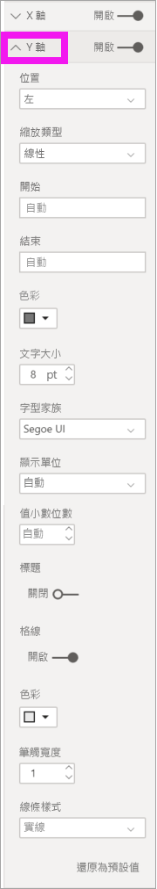

1. 將 [Y 軸]  滑桿移至 [開啟]  。  

    ![[開啟] 滑桿的螢幕擷取畫面。](media/power-bi-visualization-customize-x-axis-and-y-axis/power-bi-y-axis-on.png)

    您可能會為了保留空間給更多資料而關閉 Y 軸。

1. 設定文字色彩、大小和字型的格式：

    - **色彩**：選取 [黑色]

    - **文字大小**：輸入 10 

    - [顯示單位]  ：選取 [百萬] 

    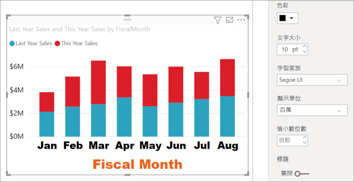

### 自訂 Y 軸標題
當 Y 軸標題為 [開啟]  時，Y 軸標題會顯示在 Y 軸標籤旁邊。 對於此視覺效果，具有 Y 軸標題並不會改善視覺效果，因此將 [標題]  保持為 [關閉]  。 我們會在本教學課程稍後，將 Y 軸標題新增至雙軸視覺效果。 

### 自訂格線
變更色彩並增加筆觸，讓格線更明顯：

- **色彩**：選取 [橙色]

- **筆觸**：輸入 *2*

在進行所有自訂之後，直條圖看起來應該類似這樣：

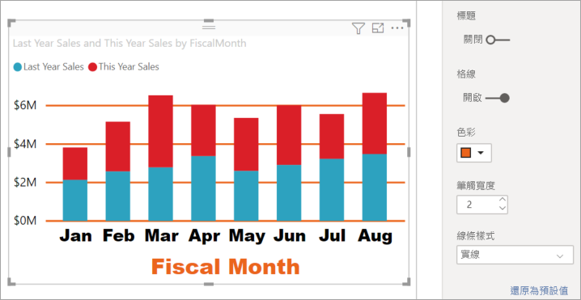

## 使用雙重 Y 軸自訂視覺效果

有些視覺效果使用兩個 Y 軸會更好。 組合圖就是極佳範例。 在格式化雙重 Y 軸之前，我們會建立組合圖來比較銷售額和毛利的趨勢。  

### 建立具有兩個 Y 軸的圖表

1. 選取一個直條圖，將其變更為 [折線與堆疊直條圖]  。 這種類型的視覺效果支援單一折線圖值和多個可堆疊的資料行值。 

    ![標示折線與堆疊直條圖圖示的 [視覺效果] 窗格螢幕擷取畫面。](media/power-bi-visualization-customize-x-axis-and-y-axis/power-bi-combo.png)
   

2. 從 [欄位] 窗格中，將 [銷售額]   >  [去年度毛利 %]  拖曳到 [折線圖值]  貯體。

    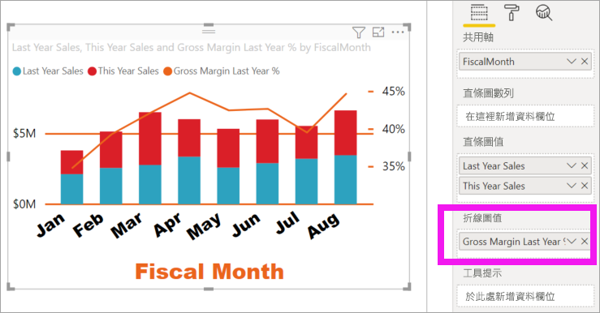

    
3. 重新格式化視覺效果以移除傾斜的 X 軸標籤。 

   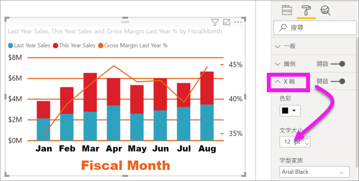

   Power BI 會建立兩個 Y 軸，讓值可以採用不同的刻度。 左側的軸測量銷售金額，右側的軸測量毛利率百分比。

### 設定第二個 Y 軸的格式
因為我們一開始使用只有一個格式化 Y 軸的視覺效果，Power BI 使用相同的設定來建立第二個 Y 軸。 但我們可以變更此設定。 

1. 在 [視覺效果]  窗格中，選取滾筒刷圖示以顯示格式選項。

1. 展開 Y 軸選項。

1. 向下捲動，直到您找到 [顯示次要]  選項。 確認它是 [開啟]  。 我們的第二個 Y 軸代表折線圖。

   ![[顯示次要] 選項的螢幕擷取畫面。](media/power-bi-visualization-customize-x-axis-and-y-axis/power-bi-show-secondary.png)

1. (選擇性) 自訂兩個軸的字型色彩、大小、顯示單位。 如果您切換欄軸或行軸的 [位置]  ，這兩個軸就會換邊。

### 將標題加入兩軸

因為這個視覺效果如此複雜，加入軸標題比較好。  標題可幫助您的同事了解視覺效果的內容。

1. 將 **Y 軸 (欄)** 及 **Y 軸 (行)** 的 [標題]  切換為 [開啟]  。

1. 將兩者的 [樣式]  都設定為 [僅顯示標題]  。

   ![[標題] 和 [樣式] 選項的螢幕擷取畫面。](media/power-bi-visualization-customize-x-axis-and-y-axis/power-bi-show-title.png)

1. 組合圖現在會顯示雙座標軸及其標題。

   

1. 格式化標題。 在此範例中，我們將其中一個標題縮短，並減小兩個標題的字型大小。 
    - 字型大小：**9**
    - 縮短第一個 Y 軸 (直條圖) 的 [軸標題]  ：去年與今年的銷售額

    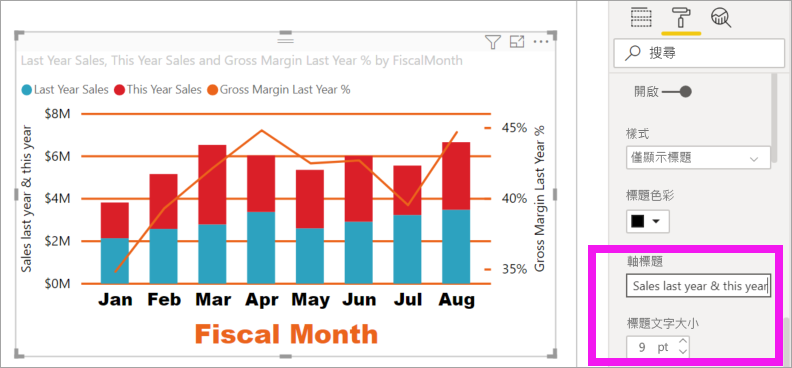

如需詳細資訊，請參閱[在 Power BI 中色彩格式設定的秘訣和訣竅](service-tips-and-tricks-for-color-formatting.md)和[自訂視覺效果的標題、圖例及背景](power-bi-visualization-customize-title-background-and-legend.md)。 並尋找即將推出之格式標題的新更新。 

## 後續步驟

- [Power BI 報表的視覺效果](power-bi-report-visualizations.md)

有其他問題嗎？ [試試 Power BI 社群](https://community.powerbi.com/)
