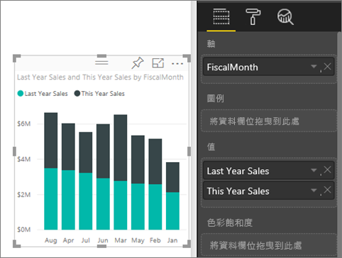
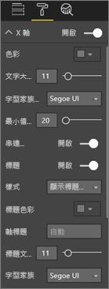
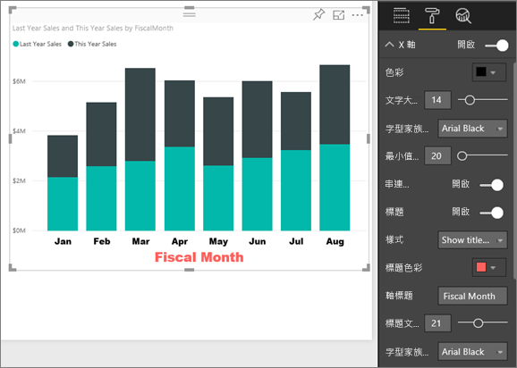
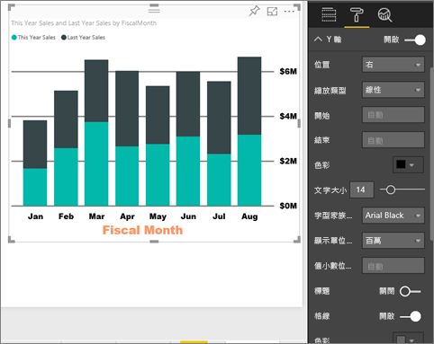

# 自訂 X 軸和 Y 軸屬性

本教學課程中，您將學到許多不同的方法，可以用來自訂視覺效果的 X 軸和 Y 軸。 並非所有視覺效果都擁有座標軸。 例如，圓餅圖就沒有座標軸。 而且自訂選項會隨視覺效果而不同。 選項太多而無法在單一文章中介紹，因此將探討一些最常用的軸自訂項目，並使用 Power BI 報表畫布中的視覺 [格式]  窗格以輕鬆解說。  

> [!NOTE]
> 此頁面適用於 Power BI 服務和 Power BI Desktop。 Power BI Desktop 也會提供選取 [格式]  (滾筒刷圖示 ) 時可用的自訂項目。

觀看 Amanda 自訂 X 軸和 Y 軸。 她將以不同的方式，示範使用向下切入和向上切入時控制串連。

<iframe width="560" height="315" src="https://www.youtube.com/embed/9DeAKM4SNJM" frameborder="0" allowfullscreen></iframe>

## 先決條件

- Power BI 服務

- 零售分析範例報表

## 自訂報表中的視覺效果 X 軸和 Y 軸

若要跟著做，請登入 [Power BI 服務](https://app.powerbi.com)，然後在[編輯報表](../service-interact-with-a-report-in-editing-view.md)檢視中開啟[零售分析範例](../sample-datasets.md)報表。

### 建立堆疊直條圖表視覺效果

您必須先建立視覺效果，才能自訂視覺效果。

1. 在 Power BI 服務中，展開 [我的工作區]  。

1. 向下捲動並從 [資料集]  的清單選取 [零售分析範例]  。

1. 從 [視覺效果]  窗格中選取堆疊直條圖圖示 。

    ![[視覺效果] 窗格和空白堆疊直條圖的螢幕擷取畫面](media/power-bi-visualization-customize-x-axis-and-y-axis/power-bi-stacked-column-chart.png)

1. 若要設定 X 軸的值，請從 [欄位]  窗格，選取 [時間]   > [FiscalMonth]  。

1. 若要設定 Y 軸的值，請從 [欄位]  窗格，選取 [銷售額]   > [去年度銷售額]  和 [銷售額]   > [今年度銷售額]   > [值]  。

    

### 自訂 X 軸

現在您可以自訂您的 X 軸。

1. 在 [視覺效果]  窗格中，選取 [格式]  (滾筒刷圖示 ) 以顯示自訂選項。

1. 展開 X 軸選項。

   

1. 將 [X 軸]  滑桿移至 [開啟]  。

    ![[開啟] 滑桿的螢幕擷取畫面。](media/power-bi-visualization-customize-x-axis-and-y-axis/onoffslider.png)

    您可能會為了保留空間給更多資料而關閉 X 軸。

1. 設定文字色彩、大小和字型的格式：

    - **色彩**：選取 [黑色]

    - **文字大小**：輸入 *14*

    - **字型家族**：選取 [Arial Black] 

1. 將 [標題]  選項移到 [開啟]  顯示 X 軸的名稱。 在本例中是 **FiscalMonth**。

1. 設定標題文字色彩、大小和字型的格式：

    - **標題色彩**：選取 [橙色]

    - **軸標題**：輸入 [會計月份] 

    - **標題文字大小**：輸入 *21*

完成自訂之後，堆疊直條圖看起來像這樣：

儲存您所做的變更，然後移至下個區段。

如果需要還原所有變更，請選取 [X 軸]  自訂窗格底部的 [還原為預設值]  。

### 自訂 Y 軸

接下來，您將自訂您的 Y 軸。

1. 展開 Y 軸選項。

   

1. 將 [Y 軸]  滑桿移至 [開啟]  。  

    ![[開啟] 滑桿的螢幕擷取畫面。](media/power-bi-visualization-customize-x-axis-and-y-axis/onoffslider.png)

    您可能會為了保留空間給更多資料而關閉 Y 軸。

1. 將 Y 軸 [位置]  設為 [右]  。

1. 設定文字色彩、大小和字型的格式：

    - **色彩**：選取 [黑色]

    - **文字大小**：輸入 *14*

    - **字型家族**：選取 [Arial Black] 

1. 將 [顯示單位]  設定為 [百萬]  ，並將 [值小數位數]  設定為 *0*。

1. 對於此視覺效果，具有 Y 軸標題並不會改善視覺效果，因此將 [標題]  保持為 [關閉]  。  

1. 變更色彩並增加筆觸，讓格線更明顯：

    - **色彩**：選取 [暗灰色]

    - **筆觸**：輸入 *2*

在進行所有自訂之後，直條圖看起來應該類似這樣：

## 使用雙重 Y 軸自訂視覺效果

首先您要建立組合圖，探討門市計數對銷售的影響。 這和[組合圖教學課程](power-bi-visualization-combo-chart.md)中所建立的是相同的圖表。 然後您將設定雙重 Y 軸格式。

### 建立具有兩個 Y 軸的圖表

1. 建立依 [時間] > [FiscalMonth]  追蹤 [銷售額] > [去年毛利率 %]  的新折線圖。

    

    > [!NOTE]
    > 如需依月份排序的說明，請參閱[使用其他準則排序](../consumer/end-user-change-sort.md#other)。

    一月時，毛利百分比為 35%，四月達到尖峰 45%，七月下滑，然後八月再度達到尖峰。 我們去年和今年會看到類似的銷售模式嗎？

1. 將 [今年度銷售額 > 值]  和 [去年度銷售額]  新增至折線圖。

    

    [去年毛利率 %]  的刻度 (沿著 **0M%** 格線的藍線) 遠小於 [銷售額]  的刻度，因此難以比較。 此外，Y 軸標籤百分比看起來很荒謬。

1. 若要使視覺效果更容易閱讀及解譯，請將折線圖轉換成折線與堆疊直條圖。

   ![標示折線與堆疊直條圖圖示的 [視覺效果] 窗格螢幕擷取畫面。](media/power-bi-visualization-customize-x-axis-and-y-axis/converttocombo_new.png)

1. 將 [去年毛利率 %]  從 [資料行值]  拖曳到 [行值]  。

    

    現在您在第一個區段建立了堆疊直條圖，並且在其上有重疊的折線圖。 選擇性地利用先前學到的內容來設定軸字型色彩和大小的格式。

   

   Power BI 會建立兩個 Y 軸，允許資料集採用不同的刻度。 左側的軸測量金額，右側的軸測量百分比。

### 設定次要 Y 軸的格式

1. 在 [視覺效果]  窗格中，選取滾筒刷圖示以顯示格式選項。

1. 展開 Y 軸選項。

1. 向下捲動，直到您找到 [顯示次要]  選項。 確認它是 [開啟]  。

   ![[顯示次要] 選項的螢幕擷取畫面。](media/power-bi-visualization-customize-x-axis-and-y-axis/combo3.png)

1. (選擇性) 自訂兩個軸。 如果您切換欄軸或行軸的 [位置]  ，這兩個軸就會換邊。

### 將標題加入兩軸

因為這個視覺效果如此複雜，最好先新增軸標題。  標題可幫助您的同事了解視覺效果的內容。

1. 將 **Y 軸 (欄)** 及 **Y 軸 (行)** 的 [標題]  切換為 [開啟]  。

1. 將兩者的 [樣式]  都設定為 [僅顯示標題]  。

   ![[標題] 和 [樣式] 選項的螢幕擷取畫面。](media/power-bi-visualization-customize-x-axis-and-y-axis/yaxissettings.png)

1. 組合圖現在會顯示雙座標軸及其標題。

   

如需詳細資訊，請參閱[在 Power BI 中色彩格式設定的秘訣和訣竅](service-tips-and-tricks-for-color-formatting.md)。

## 考量與疑難排解

如果報表擁有者將 X 軸分類為資料類型，[類型]  選項就會顯示，以供您在連續或類別目錄之間選取。

## 後續步驟

- [Power BI 報表的視覺效果](power-bi-report-visualizations.md)

- [自訂視覺效果標題、圖例及背景](power-bi-visualization-customize-title-background-and-legend.md)

- [開始使用色彩格式和軸屬性](service-getting-started-with-color-formatting-and-axis-properties.md)

- [Power BI 服務取用者的基本概念](../consumer/end-user-basic-concepts.md)

有其他問題嗎？ [試試 Power BI 社群](http://community.powerbi.com/)
