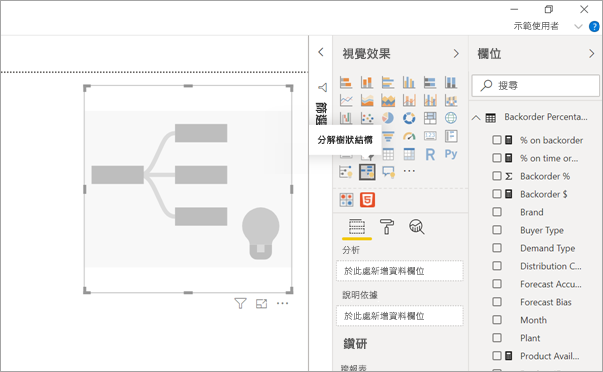
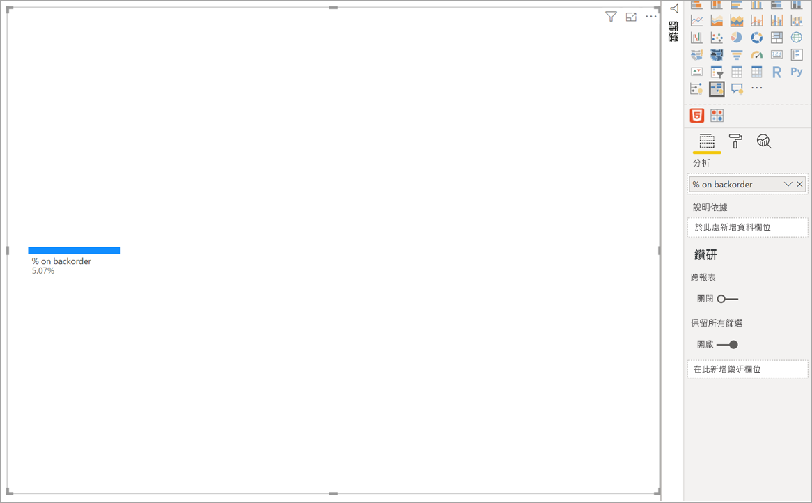
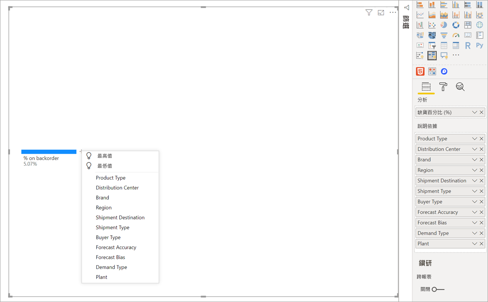
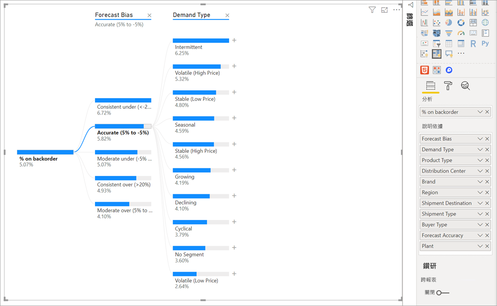
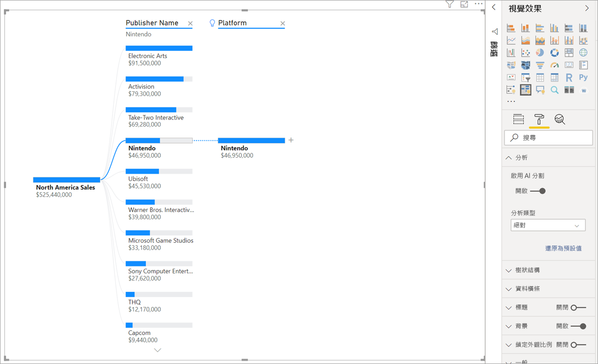
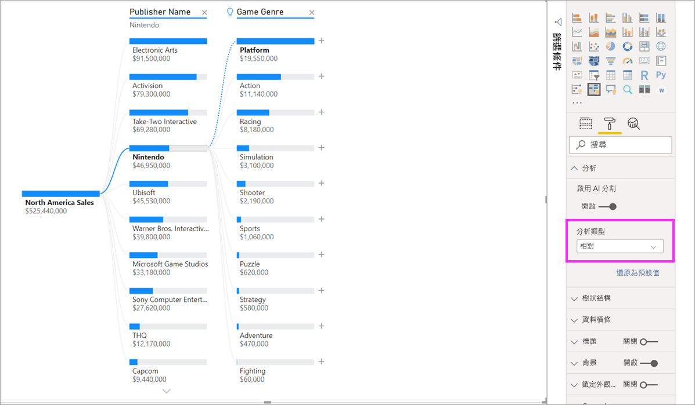
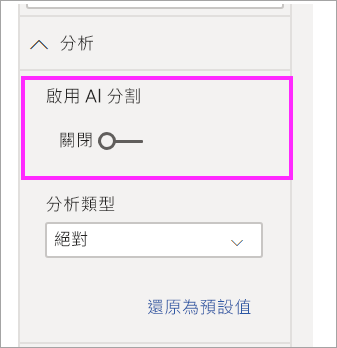

# 在 Power BI 中建立和檢視分解樹狀結構視覺效果 (預覽)
[!INCLUDE [power-bi-visuals-desktop-banner](../includes/power-bi-visuals-desktop-banner.md)]

Power BI 中的分解樹狀結構視覺效果可讓您將多個維度上的資料視覺化。 它會自動彙總資料，並且能夠以任何順序向下切入到您的維度。 這也是一種人工智慧 (AI) 視覺效果，因此，您可以要求它根據特定準則來尋找下一個要向下切入到其中的維度。 這讓它成為特定探索和進行根本原因分析的重要工具。

此教學課程使用兩個範例：

- 一個供應鏈案例，可分析公司延期交貨 (缺貨) 的產品百分比。  
- 一個銷售案例，可依多種因素來細分視訊遊戲銷售量，例如遊戲類型和發行者。

## 開始使用
從 [視覺效果] 窗格中選取分解樹狀結構圖示。

視覺效果需要兩種類型的輸入。

**分析**：您想要分析的計量。 這必須是量值或彙總。  
**說明依據**：您想要向下切入到其中的一或多個維度。

一旦您將量值成功拖曳到欄位之後，視覺效果就會更新以展示彙總的量值。 在下列範例中，我們會將延期交貨產品的平均百分比 (5.07%) 視覺化 

下一個步驟是引入您想要向下切入到其中的一或多個維度。 將這些欄位新增至 [說明依據]  貯體。 請注意，加號會出現在根節點旁邊。 選取 [+] 可讓您選擇想要向下切入到其中的欄位 (您可以依任何順序向下切入到欄位)。

選取 [預測偏差]  會導致樹狀結構展開，並依據資料行中的值來細分量值。 您可以藉由選擇另一個要向下切入到其中的節點來重複執行此程序。

選取最後一個層級的節點，即會交叉篩選資料。 選取較早層級的節點，即會變更路徑。

與其他視覺效果互動，即會交叉篩選分解樹狀結構。 因此，層級中的節點順序可能會變更。
在下列範例中，我們依 Ubisoft 交叉篩選了樹狀結構。 路徑更新和 Xbox 銷售量會從第一位移到第二位 (被 PlayStation 超越)。 

如果我們接著依 Nintendo 交叉篩選樹狀結構，則 Xbox 銷售量會空白，因為沒有針對 Xbox 開發的 Nintendo 遊戲。 Xbox 連同其後續路徑均會從檢視中篩選掉。

儘管路徑消失，現有層級 (在此案例中為遊戲類型) 仍會釘選於樹狀結構上。 因此，選取 Nintendo 節點，即會將樹狀結構自動展開到遊戲類型。

## AI 分割

您可以使用「AI 分割」，來找出您接著應該在資料中查看的位置。 這些分割會出現在清單頂端，並以燈泡標示。 分割可協助您自動找出資料中的最高和最低值。

根據您的喜好設定而定，分析可以兩種方式進行。 以下為預設行為：

**最高值**：考慮所有可用欄位，並決定要向內切入到其中以取得要分析之量值的最高值。  
**最低值**：考慮所有可用欄位，並決定要向內切入到其中以取得要分析之量值的最低值。  

在延期交貨範例中選取 [最高值]  ，會產生下列結果：

燈泡會出現在 [產品類型]  旁邊，表示這是「AI 分割」。 樹狀結構也提供一條建議**患者監視**節點的虛線，因為這會產生延期交貨的最高值 (9.2%)。 

將滑鼠停留在燈泡上方，即可查看工具提示。 在此範例中，工具提示為「當產品類型為患者監視時，延期交貨的百分比最高」。

您可以設定視覺效果來尋找**相對**的 AI 分割，而不是**絕對**的 AI 分割。 

相對模式會尋找特別突出的高值 (相較於資料行中的其餘資料)。 為了說明這一點，讓我們來看一個範例：

在上述螢幕擷取畫面中，我們正在查看視訊遊戲的北美洲銷售量。 我們先依**發行者名稱**分割樹狀結構，然後向下切入到 Nintendo。 選取 [最高值]  即會展開**平台為 Nintendo**。 因為 Nintendo (發行者) 僅針對 Nintendo 主控台進行開發，所以僅存在一個值，因此，該值毫無疑問是最高值。

儘管如此，比較有趣的分割是查看哪一個高值相對於相同資料行中的其他值而言特別突出。 如果我們將分析類型從 [絕對]  變更為 [相對]  ，則會針對 Nintendo 取得下列結果：

這次，建議的值是**遊戲類型中的平台**。  平台不會產生比 Nintendo 還高的絕對值 ($19,950,000 與 $46,950,000)。 不過，這是一個特別突出的值。

更精確地說，由於有 10 個遊戲類型值，因此，如果要平均分割這些值，平台的預期值是 $460 萬。 因為平台有個接近 $2000 萬的值，所以這是一個有趣的結果，因為它比預期結果高出四倍。

計算如下所示：

平台的北美洲銷售量/Abs(Avg(平台類型的北美洲銷售量))  
與  
Nintendo 的北美洲銷售量/Abs(Avg(平台的北美洲銷售量))  

這會轉譯為：

19,550,000 / (19,550,000 + 11,140,000 + ... + 470,000 + 60,000 /10) = 4.25x  
與  
46,950,000/ (46,950,000/1) = 1x  

如果您不想在樹狀結構中使用任何 AI 分割，也可以選擇在 [分析格式]  選項底下關閉它們：  

## 與 AI 分割進行樹狀結構互動

您可以有多個後續 AI 層級。 您也可以混用各種類型的 AI 層級 (從最高值移至最低值，並返回到最高值)：

如果您在樹狀結構中選取不同節點，則 AI 分割會從頭開始重新計算。 在下列範例中，我們已變更在 [預測偏差]  層級中選取的節點。 後續層級會變更，以產生正確的最高和最低值 

當您透過其他視覺效果交叉篩選分解樹狀結構時，也會重新計算 AI 層級。 在下列範例中，我們可以看到工廠 #0477 延期交貨的百分比最高。

但是，如果我們在橫條圖中選取 [四月]  ，則最高值會變更為**產品類型是先進的外科**。 在此案例中，不僅已將節點重新排序，還選擇了完全不同的資料行。 

如果我們希望 AI 層級的行為類似非 AI 層級，請選取燈泡以將行為還原為預設值。 

雖然多個 AI 層級可以鏈結在一起，但非 AI 層級無法接在 AI 層級後面。 如果我們在 AI 分割之後進行手動分割，則 AI 層級的燈泡會消失，而該層級會轉換為一般層級。 

## 鎖定

內容建立者可以鎖定報告取用者的層級。 當層級遭到鎖定時，就無法移除或變更。 取用者可以探索已鎖定層級內的不同路徑，但無法變更層級本身。 身為建立者，您可以將滑鼠停留在現有層級上方，以查看鎖定圖示。 您可以視需要鎖定多個層級，但不能將已鎖定層級之前的層級解除鎖定。

在下列範例中，前兩個層級已遭鎖定。 這表示報告取用者可以變更層級 3 和 4，甚至在之後加入新層級。 不過，無法變更前兩個層級：

## 已知的限制

樹狀結構的層級數目上限為 50。 在樹狀結構中一次可以視覺化的資料點數目上限為 5000。 我們會截斷層級以顯示前 n 個。 目前每個層級的前 n 個設定為 10 個。 

下列案例中不支援分解樹狀結構：  
-   內部部署 Analysis Services

下列案例中不支援 AI 分割：  
-   Azure Analysis Services
-   直接查詢
-   Power BI 報表伺服器
-   發佈至網路
-   複雜量值及來自「分析」中擴充功能結構描述的量值

其他預覽限制：
- Power BI 行動版  
- 釘選至儀表板
- 顯示資料功能
- 問與答中的支援

## 後續步驟

[Power BI 環圈圖](power-bi-visualization-doughnut-charts.md)

[Power BI 視覺效果](power-bi-report-visualizations.md)

