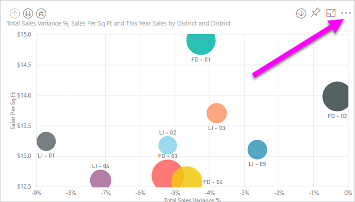
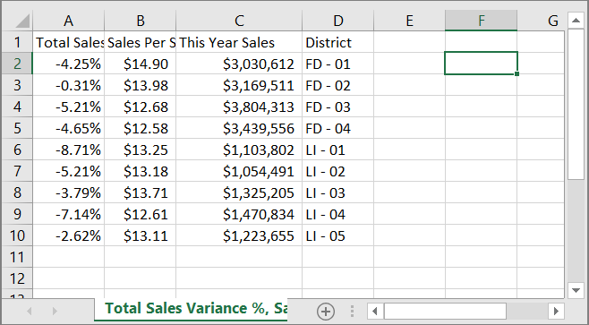
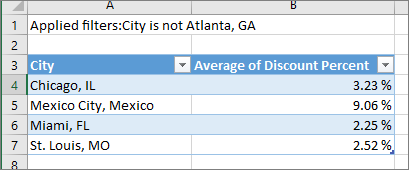
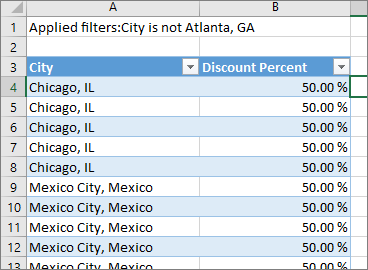
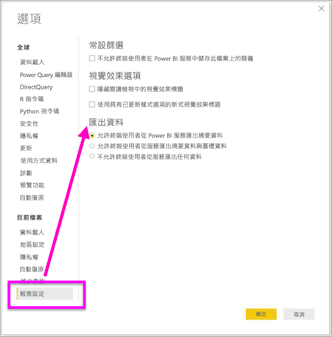

# 從視覺效果匯出資料

如果想要查看 Power BI 用來建立視覺效果的資料，[您可以在 Power BI 中顯示該資料](service-reports-show-data.md)。 您也可以將該資料匯出至 Excel，作為 *.xlsx* 或 *.csv* 檔案。 匯出資料的選項需要專業或進階授權，以及資料集和報表的編輯權限。 <!--If you have access to the dashboard or report but the data is classified as *highly confidential*, Power BI will not allow you to export the data.-->

觀看 Will 從其報表的其中一個視覺效果中匯出資料、將資料儲存為 *.xlsx* 檔案，並在 Excel 中開啟它。 然後遵循影片下方的逐步指示親自試試看。

<iframe width="560" height="315" src="https://www.youtube.com/embed/KjheMTGjDXw" frameborder="0" allowfullscreen></iframe>

## 從 Power BI 儀表板匯出資料

1. 選取視覺效果右上角的省略符號。

    

1. 選擇 [匯出資料]  圖示。

    ![標示 [匯出資料] 選項的省略符號下拉式清單螢幕擷取畫面。](media/power-bi-visualization-export-data/pbi_export_dash.png)

1. Power BI 會將資料匯出至 *.csv* 檔案。 如果您已篩選視覺效果，則應用程式會篩選下載的資料。

1. 您的瀏覽器會提示您儲存檔案。  儲存之後，請在 Excel 中開啟 *.csv* 檔案。

    

## 從報表匯出資料

若要跟著做，請在 [編輯] 檢視中開啟[採購分析範例報表](../sample-procurement.md)。 新增空白的報表頁面。 然後遵循下列步驟來新增彙總及視覺效果層級篩選。

1. 建立新的 [堆疊直條圖]  。

1. 從 [欄位]  窗格，選取 [位置] > [城市]  和 [發票] > [折扣百分比]  。  您可能必須將 [折扣百分比]  移到 [值]  區。

    ![利用所標示 [城市] 和 [折扣百分比計數] 建置的視覺效果螢幕擷取畫面。](media/power-bi-visualization-export-data/power-bi-export-data3.png)

1. 將 [折扣百分比]  的彙總從 [計數]  變更為 [平均]  。 在 [值]  區中，選取 [折扣百分比]  右邊的箭號 (可能是 [折扣百分比計數]  )，然後選擇 [平均]  。

    ![已標示 [平均] 選項的彙總清單螢幕擷取畫面。](media/power-bi-visualization-export-data/power-bi-export-data6.png)

1. 將篩選條件新增至 [城市]  、選取所有城市，然後移除 [亞特蘭大]  。

    ![已標示所清除 [喬治亞州亞特蘭大] 核取方塊的城市篩選條件螢幕擷取畫面。](media/power-bi-visualization-export-data/power-bi-export-data4.png)

   現在我們已經準備好試用這兩個選項來匯出資料。

1. 選取視覺效果右上角的省略符號。 選取 [匯出資料]  。

    ![右上角已標示省略符號按鈕和 [匯出資料] 選項的螢幕擷取畫面。](media/power-bi-visualization-export-data/power-bi-export-data2.png)

    在 Power BI Online 中，如果您的視覺效果有彙總 (其中一個範例就是如果您將 [計數]  變更為 [平均]  、[總和]  或 [最小]  )，則會有兩個選項：

    - **摘要資料**

    - **基礎資料**

    在 Power BI Desktop 中，您只會有**摘要的資料**選項。 如需了解彙總的協助，請參閱 [Power BI 中的彙總](../service-aggregates.md)。

1. 從 [匯出資料]  中，選取 [摘要資料]  、選擇 *.xlsx* 或 *.csv*，然後選取 [匯出]  . Power BI 會匯出資料。

    ![已標示 [摘要資料]、 xlsx 和 [匯出] 選項的 [匯出資料] 螢幕擷取畫面。](media/power-bi-visualization-export-data/power-bi-export-data5.png)

    如果您已將篩選條件套用至視覺效果，匯出的資料會匯出為已篩選。 當您選取 [匯出]  時，瀏覽器會提示您儲存檔案。 儲存之後，請在 Excel 中開啟檔案。
    
    所有階層使用的資料都會進行匯出，而非只有視覺效果目前鑽研層級所使用的資料。 例如，若視覺效果尚未從最上層向下切入，則匯出的資料會包含階層中所有的資料，而非只有用來建立目前鑽研層級視覺效果的資料。

    **摘要資料**：如果您想要匯出在該視覺效果中所看到內容的資料，請選取此選項。  這種類型的匯出只會顯示您選擇建立視覺效果的資料 (資料行和量值)。  如果視覺效果具有彙總，則您會匯出彙總的資料。 例如，如果您有顯示四個橫條的橫條圖，就會取得四列的資料。 摘要資料會以 *.xlsx* 和 *.csv* 提供。

    在此範例中，我們的 Excel 匯出會顯示每個城市的總計。 因為我們篩選掉了亞特蘭大，所以它不包含在結果中。 試算表的第一列會顯示 Power BI 擷取資料時所使用的篩選條件。

    

1. 現在嘗試選取 [基礎資料]  、 *.xlsx*，然後選取 [匯出]  。 Power BI 會匯出資料。 

    > [!NOTE]
    > 根據報表設定，您不一定具有匯出基礎資料的選項。

    如果您已將篩選條件套用至視覺效果，匯出的資料會匯出為已篩選。 當您選取 [匯出]  時，瀏覽器會提示您儲存檔案。 儲存之後，請在 Excel 中開啟檔案。
    
    所有階層使用的資料都會進行匯出，而非只有視覺效果目前鑽研層級所使用的資料。 例如，若視覺效果尚未從最上層向下切入，則匯出的資料會包含階層中所有的資料，而非只有用來建立目前鑽研層級視覺效果的資料。

    >[!WARNING]
    >匯出基礎資料可讓使用者查看所有詳細資料 -- 資料中的每個資料行。 Power BI 服務系統管理員可以替組織關閉這項功能。 如果您是資料集擁有者，您可以將專屬資料行設定為 [隱藏]  ，它們就不會顯示在 Desktop 或 Power BI 服務的 [欄位]  清單中。

    **基礎資料**：如果您想要查看視覺效果中的資料「和」模型中的其他資料，請選取此選項 (如需詳細資料，請參閱下列圖表)。 如果您的視覺效果具有彙總，選取 [基礎資料]  會移除彙總。 當您選取 [匯出]  時，Power BI 會將資料匯出到 *.xlsx* 檔案，且您的瀏覽器會提示您儲存檔案。 儲存之後，請在 Excel 中開啟檔案。

    在此範例中，Excel 匯出會為資料集裡的每個城市資料列顯示一個資料列，以及該單一項目的折扣百分比。 Power BI 會將資料壓平合併。 它不會將其彙總。 試算表的第一列會顯示 Power BI 擷取資料時所使用的篩選條件。  

    

## 匯出基礎資料詳細資料

選取 [基礎資料]  時可看到的內容會不同。 了解這些詳細資料可能需要您系統管理員或 IT 部門的協助。 在 Power BI Desktop 或服務的報表檢視中，「量值」  會顯示在 [欄位]  清單中，並具有計算機圖示。 Power BI Desktop 會建立量值。 Power BI 服務則不會。

| 視覺效果包含 | 匯出時將看到的內容  |
|---------------- | ---------------------------|
| 彙總 | 「第一個」  彙總以及該彙總之整個資料表中的非隱藏資料 |
| 彙總 | 相關資料 - 如果視覺效果使用之其他資料表中的資料與包含彙總的資料表 *有關* (只要該關聯性是 \*:1 或 1:1) |
| 量值 | 視覺效果中的所有量值，「和」  包含視覺效果中所使用量值之任何資料表的所有量值 |
| 量值 | 來自資料表 (其中包含該量值) 的所有非隱藏資料 (只要該關聯性是 \*:1 或 1:1) |
| 量值 | 所有資料表中與透過 \*:1 或 1:1 鏈結包含量值的資料表相關的所有資料 |
| 僅限量值 | 所有相關資料表中的所有非隱藏資料行 (用來展開量值) |
| 僅限量值 | 針對模型量值的任何重複資料列的摘要資料 |

### 設定匯出選項

Power BI 報表設計者會控制可供取用者使用的資料匯出選項類型。 這些選項包括：

- 允許終端使用者從 Power BI 服務或 Power BI 報表伺服器匯出摘要資料

- 允許終端使用者從服務或報表伺服器匯出摘要資料與基礎資料

- 不允許終端使用者從服務或報表伺服器匯出任何資料

    > [!IMPORTANT]
    > 我們建議報表設計師重新瀏覽舊報表，並視需要手動重設匯出選項。

若要設定下列選項：

1. 在 Power BI Desktop 開始。

1. 從左上角，選取 [檔案]   > [選項和設定]   > [選項]  。

1. 在 [目前檔案]  底下，選取 [報表設定]  。

    

1. 從 [匯出資料]  區段中選取項目。

您也可以從 Power BI 服務中更新這項設定。

請務必注意，如果 Power BI 管理入口網站設定與用於匯出資料的報表設定發生衝突，管理設定將會覆寫匯出資料設定。

## 限制與考量
這些限制和考量適用於 Power BI Desktop 和 Power BI 服務，包括 Power BI Pro 和 Premium。

- 若要從視覺效果匯出資料，您需要具有[基礎資料集的建置權限](https://docs.microsoft.com/power-bi/service-datasets-build-permissions)。

-  **Power BI Desktop** 和 **Power BI 服務**可以從 [匯入模式報表]  匯出至 *.csv* 的資料列數上限為 30,000。

- 應用程式可以從 [匯入模式報表]  匯出至 *.xlsx* 檔案的資料列數上限為 150,000。

- 若為下列情況，使用「基礎資料」  匯出將無法運作：

  - 版本早於 2016 年。

  - 模型中的資料表沒有唯一索引鍵。
    
  -  管理員或報表設計者已停用這項功能。

- 如果您針對 Power BI 正要匯出的視覺效果啟用 [顯示沒有資料的項目]  選項，則使用「基礎資料」  匯出將無法運作。

- 使用 DirectQuery 時，Power BI 可匯出的最大資料量為 16 MB 未壓縮資料。 非預期的結果可能是您匯出的資料列數小於資料列數上限。 可能原因如下：

    - 有許多資料行。

    - 有難以壓縮的資料。

    - 其他因素可能是增加檔案大小，以及減少 Power BI 可以匯出的資料列數。

- 如果視覺效果使用多個資料表中的資料，而且資料模型中的這些資料表沒有任何關聯性，則 Power BI 只會匯出第一個資料表的資料。

- 目前不支援自訂視覺效果和 R 視覺效果。

- 在 Power BI 中，您可以按兩下欄位和輸入新名稱來重新命名欄位 (資料行)。 Power BI 會將新名稱稱之為「別名」  。 Power BI 報表可具有重複的欄位名稱，但 Excel 不允許重複。 因此，當 Power BI 將資料匯出至 Excel 時，欄位別名會還原成原始的欄位 (資料行) 名稱。  

- 如果 *.csv* 檔案中有 Unicode 字元，Excel 中的文字可能無法正常顯示。 Unicode 的範例包括貨幣符號和外文。 您可以在 [記事本] 中開啟檔案，Unicode 即會正確顯示。 如果您想要在 Excel 中開啟檔案，因應措施是匯入 *.csv*。 若要將檔案匯入至 Exce：

  1. 開啟 Excel。

  1. 移至 [資料]  索引標籤。
  
  1. 選取 [取得外部資料]   >  [從文字]  。
  
  1. 移至儲存檔案的本機資料夾，然後選取 *.csv*。

- Power BI 系統管理員可以停用匯出資料。

有其他問題嗎？ [嘗試在 Power BI 社群提問](https://community.powerbi.com/)
